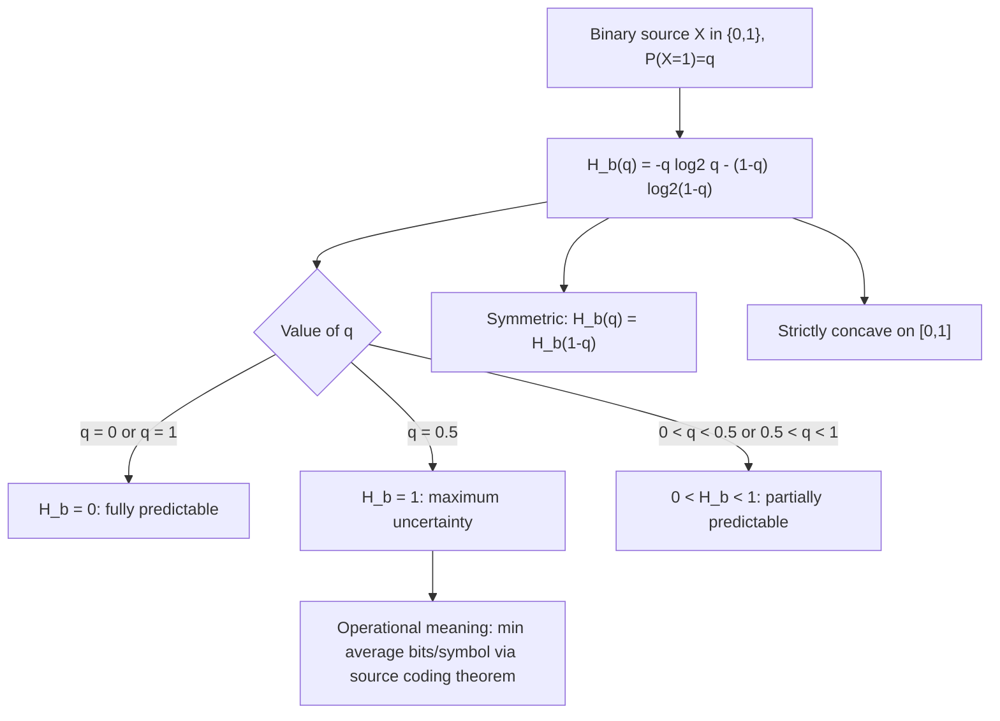

## Entropy of a Binary Source

### Overview

The binary source — a random variable with exactly two possible outcomes — is the simplest non-trivial case in information theory, yet it is foundational: the binary entropy function it produces appears throughout channel capacity formulas, source coding bounds, and error-correction analysis. Studying this special case in depth builds concrete intuition for how entropy behaves before generalizing to larger alphabets and more complex sources.

### Setup: The Binary Source

A **binary source** is a random variable $X \in \{0, 1\}$ (equivalently thought of as a Bernoulli random variable) with:

$$P(X = 1) = q, \qquad P(X = 0) = 1 - q, \qquad q \in [0, 1]$$

Applying the general entropy definition to this two-outcome case gives the **binary entropy function**, already introduced but developed in full detail here:

$$H_b(q) = -q \log_2 q - (1-q) \log_2 (1-q)$$

By the standard convention $0 \log_2 0 = 0$, this function is well-defined (and continuous) at the endpoints $q=0$ and $q=1$, where one of the two terms would otherwise involve $\log_2 0$.

### Computing Values Across the Range

**Example**

At $q = 0.5$ (fair binary source):

$$H_b(0.5) = -0.5\log_2 0.5 - 0.5\log_2 0.5 = -0.5(-1) - 0.5(-1) = 1 \text{ bit}$$

This is the global maximum of $H_b(q)$, confirming the general boundedness result $H(X) \leq \log_2 n$ for $n=2$: $\log_2 2 = 1$.

**Example**

At $q = 0.1$ (source strongly biased toward 0):

$$H_b(0.1) = -0.1\log_2(0.1) - 0.9\log_2(0.9) \approx -0.1(-3.322) - 0.9(-0.152) \approx 0.332 + 0.137 \approx 0.469 \text{ bits}$$

**Example**

At $q = 0.01$ (source very strongly biased toward 0):

$$H_b(0.01) = -0.01\log_2(0.01) - 0.99\log_2(0.99) \approx 0.0664 + 0.0144 \approx 0.0808 \text{ bits}$$

**Example**

At $q = 0$ or $q = 1$ (deterministic source):

$$H_b(0) = H_b(1) = 0 \text{ bits}$$

This progression illustrates the general shape: entropy is zero at the endpoints, rises smoothly, and peaks at the midpoint.

### Key Structural Properties of $H_b(q)$

**Symmetry**: $H_b(q) = H_b(1-q)$ for all $q \in [0,1]$. This follows directly from the formula, since swapping $q \leftrightarrow (1-q)$ simply swaps the two terms in the sum without changing their total. Intuitively, a source with $P(X=1) = 0.1$ carries exactly the same uncertainty as one with $P(X=1) = 0.9$ — only the *label* of which outcome is likely differs, not the *degree* of predictability.

**Concavity**: $H_b(q)$ is strictly concave on $[0,1]$, consistent with the general concavity property of entropy as a function of the underlying distribution. This can be confirmed by computing the second derivative:

$$\frac{d^2 H_b}{dq^2} = -\frac{1}{\ln 2}\left(\frac{1}{q} + \frac{1}{1-q}\right) < 0 \quad \text{for } q \in (0,1)$$

which is strictly negative everywhere on the open interval, confirming strict concavity.

**Maximum at $q = 1/2$**: Taking the first derivative and setting it to zero:

$$\frac{dH_b}{dq} = \log_2\left(\frac{1-q}{q}\right) = 0 \quad \Rightarrow \quad \frac{1-q}{q} = 1 \quad \Rightarrow \quad q = \frac{1}{2}$$

Combined with strict concavity, this confirms $q = 1/2$ is the unique global maximum, with $H_b(1/2) = 1$ bit.

**Monotonicity on each half**: $H_b(q)$ is strictly increasing on $[0, 1/2]$ and strictly decreasing on $[1/2, 1]$, a direct consequence of the derivative formula above changing sign at $q=1/2$.

### Interpretation in Terms of Coding

The binary entropy $H_b(q)$ has direct operational meaning: it is the theoretical minimum average number of bits needed to encode outcomes from a biased binary source, in the limit of encoding long sequences (via Shannon's source coding theorem, covered separately). A source with $q = 0.5$ genuinely requires close to 1 bit per symbol on average — no compression is possible, since each outcome is maximally unpredictable. A source with $q = 0.01$, by contrast, can in principle be compressed to close to $0.0808$ bits per symbol on average, since outcomes are highly predictable (almost always 0) and the rare "surprising" 1s can be flagged efficiently while long runs of predictable 0s are compressed away.

**Example**

This directly explains why simple techniques like run-length encoding are effective on highly skewed binary data (e.g., a mostly-white fax scan, or a mostly-zero sparse bitmap): the low entropy of the source ($H_b(q)$ close to 0 for $q$ close to 0 or 1) signals that substantial compression is achievable in principle, and near-entropy-achieving codes can approach that limit in practice.

### Relation to the Binary Symmetric Channel

[Inference] The same function $H_b(\cdot)$ reappears, with a different variable playing the role of $q$, in the capacity formula for the **binary symmetric channel (BSC)** with crossover probability $\epsilon$: $C = 1 - H_b(\epsilon)$. This is a distinct application of the same mathematical function — here $H_b$ is not describing the source's own distribution, but rather the uncertainty introduced by channel noise — and the appearance of the identical formula in two conceptually different roles (source entropy vs. channel capacity) reflects the surprising extent to which $H_b(q)$ recurs as a basic building block throughout binary-alphabet information theory.

### The Binary Entropy Function: Full Shape

<svg xmlns="http://www.w3.org/2000/svg" viewBox="0 0 700 380">
  <text x="350" y="26" text-anchor="middle" font-size="18" font-weight="bold" fill="#1a1a1a">Entropy of a Binary Source, H_b(q) (svg_diagram)</text>

  <line x1="80" y1="320" x2="620" y2="320" stroke="#333" stroke-width="2" />
  <line x1="80" y1="320" x2="80" y2="55" stroke="#333" stroke-width="2" />
  <text x="350" y="350" text-anchor="middle" font-size="13" fill="#333">q = P(X=1)</text>
  <text x="45" y="190" text-anchor="middle" font-size="13" fill="#333" transform="rotate(-90 45 190)">H_b(q) bits</text>

  <text x="80" y="335" text-anchor="middle" font-size="11">0</text>
  <text x="215" y="335" text-anchor="middle" font-size="11">0.1</text>
  <text x="350" y="335" text-anchor="middle" font-size="11">0.5</text>
  <text x="620" y="335" text-anchor="middle" font-size="11">1</text>
  <line x1="80" y1="65" x2="620" y2="65" stroke="#ccc" stroke-dasharray="2,2" />
  <text x="65" y="69" text-anchor="end" font-size="11">1</text>

  <path d="M 80 320            Q 140 150, 215 108            Q 280 75, 350 62            Q 420 75, 485 108            Q 560 150, 620 320" fill="none" stroke="#4C78A8" stroke-width="2.5" />

  <circle cx="350" cy="62" r="4" fill="#E45756" />
  <text x="350" y="45" text-anchor="middle" font-size="11" fill="#E45756">Max: H_b(0.5) = 1</text>

  <circle cx="215" cy="108" r="4" fill="#F2B701" />
  <text x="215" y="95" text-anchor="middle" font-size="10" fill="#F2B701">H_b(0.1)≈0.469</text>

  <circle cx="80" cy="320" r="4" fill="#54A24B" />
  <circle cx="620" cy="320" r="4" fill="#54A24B" />
  <text x="80" y="300" text-anchor="middle" font-size="10" fill="#555">q=0: 0 bits</text>
  <text x="620" y="300" text-anchor="middle" font-size="10" fill="#555">q=1: 0 bits</text>

  <path d="M 130 100 L 250 100" stroke="#888" stroke-dasharray="3,3" />
  <text x="190" y="90" text-anchor="middle" font-size="10" fill="#888">symmetric about q=0.5</text>
</svg>

### Binary Source Entropy Summary

### Key Points

- The **binary entropy function** $H_b(q) = -q\log_2 q - (1-q)\log_2(1-q)$ fully characterizes the entropy of any two-outcome random variable.
- $H_b(q)$ ranges over $[0, 1]$: it equals **0** at the deterministic endpoints $q=0$ and $q=1$, and reaches its **maximum of 1 bit** at $q = 1/2$.
- $H_b(q)$ is **symmetric** ($H_b(q) = H_b(1-q)$) and **strictly concave** on $(0,1)$, both provable directly from the formula.
- Low $H_b(q)$ (skewed source) signals high compressibility; high $H_b(q)$ (near-fair source) signals near-incompressibility, consistent with the source coding theorem's operational interpretation of entropy.
- The identical function $H_b(\cdot)$ reappears in the **binary symmetric channel capacity formula**, $C = 1 - H_b(\epsilon)$, applying the same mathematical object to a conceptually different (channel-noise) role.

**Related Topics**

- Shannon entropy properties: non-negativity and boundedness
- Binary symmetric channel and channel capacity
- Shannon's source coding theorem
- Run-length encoding and other entropy-approaching compression schemes
- Joint entropy and conditional entropy for multi-symbol sources
- Huffman coding for skewed binary and multi-symbol sources
- Rényi entropy as a generalization beyond the Shannon case