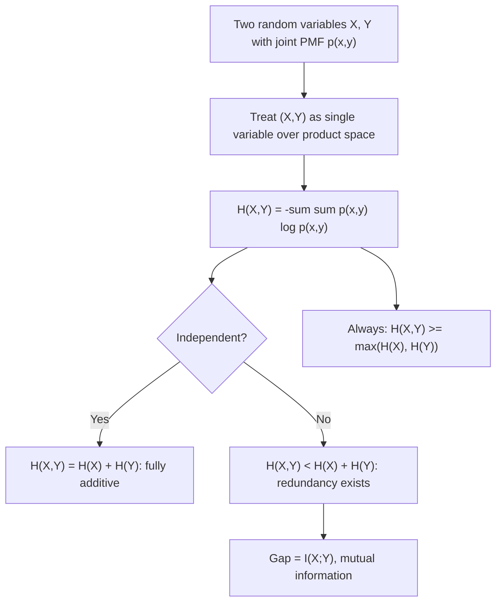

## Joint Entropy of Multiple Random Variables

### Overview

Joint entropy extends Shannon entropy from a single random variable to a pair (or collection) of random variables, measuring the total uncertainty inherent in observing them together. It is the entry point for nearly every multivariate information-theoretic quantity: conditional entropy, mutual information, and the entropy chain rule are all defined in terms of, or directly derived from, joint entropy. Understanding it precisely is essential before those quantities can be built up.

### Definition

For two discrete random variables $X$ and $Y$ with joint PMF $p(x, y)$, the **joint entropy** $H(X, Y)$ is defined as:

$$H(X, Y) = -\sum_{x \in \mathcal{X}} \sum_{y \in \mathcal{Y}} p(x, y) \log p(x, y)$$

Equivalently, using expectation notation:

$$H(X, Y) = E[-\log p(X, Y)]$$

This is exactly the same construction as ordinary entropy, but applied to the joint distribution treated as if it were the distribution of a single combined random variable $(X,Y)$ ranging over the product space $\mathcal{X} \times \mathcal{Y}$. Every property already established for entropy of a single variable — non-negativity, the upper bound tied to alphabet size — carries over directly, since joint entropy *is* just entropy of a (larger, product-space) random variable.

### Generalization to $n$ Variables

For $n$ random variables $X_1, X_2, \dots, X_n$ with joint PMF $p(x_1, \dots, x_n)$:

$$H(X_1, X_2, \dots, X_n) = -\sum_{x_1} \sum_{x_2} \cdots \sum_{x_n} p(x_1, \dots, x_n) \log p(x_1, \dots, x_n)$$

This is the quantity that appears in the definition of entropy rate for stochastic processes, $H(\mathcal{X}) = \lim_{n\to\infty} \frac{1}{n} H(X_1, \dots, X_n)$, connecting joint entropy directly back to source modeling.

### Worked Example

**Example**

Recall the noisy binary channel joint distribution:

| $p(x,y)$ | $Y=0$ | $Y=1$ |
|---|---|---|
| $X=0$ | 0.45 | 0.05 |
| $X=1$ | 0.10 | 0.40 |

$$H(X,Y) = -[0.45\log_2 0.45 + 0.05\log_2 0.05 + 0.10\log_2 0.10 + 0.40\log_2 0.40]$$

Computing each term: $-0.45\log_2 0.45 \approx 0.518$, $-0.05\log_2 0.05 \approx 0.216$, $-0.10\log_2 0.10 \approx 0.332$, $-0.40\log_2 0.40 \approx 0.529$.

$$H(X,Y) \approx 0.518 + 0.216 + 0.332 + 0.529 \approx 1.595 \text{ bits}$$

Compare this to the marginal entropies: $H(X) = H_b(0.5) = 1$ bit and $H(Y) = H_b(0.45) \approx 0.993$ bits. The joint entropy ($\approx 1.595$ bits) is less than the sum $H(X) + H(Y) \approx 1.993$ bits — this gap is not a coincidence, and is formalized precisely by mutual information, covered separately.

### Bounds on Joint Entropy

**Lower bound**: $H(X, Y) \geq \max(H(X), H(Y))$. Observing both variables together can never reduce total uncertainty below the uncertainty of either variable alone — adding a second variable to the picture can only add information, never subtract it.

**Upper bound (subadditivity)**: $H(X, Y) \leq H(X) + H(Y)$, with equality **if and only if** $X$ and $Y$ are statistically independent. This is one of the most important structural inequalities in information theory, since it formalizes the idea that dependence between variables always creates redundancy: if $Y$ is predictable from $X$ (or vice versa), the joint uncertainty is strictly less than the sum of the individual uncertainties, because some of the "surprise" in $Y$ is already accounted for by knowing $X$.

**Proof sketch of subadditivity**: This follows from the non-negativity of mutual information, $I(X;Y) = H(X) + H(Y) - H(X,Y) \geq 0$, which is itself proved via Jensen's inequality applied to the log-ratio $p(x,y) / [p(x)p(y)]$ — a proof detailed fully when mutual information is introduced. The inequality can also be seen directly: since $p(x,y) \leq p(x)$ and $p(x,y) \leq p(y)$ always hold (a joint event is never more likely than either marginal event), the joint distribution's probabilities are "more spread out" over the product space than the product of marginals would be under independence, which is the geometric intuition underlying the entropy comparison.

**Example**

For the channel example above: $H(X) + H(Y) \approx 1 + 0.993 = 1.993$ bits, while $H(X,Y) \approx 1.595$ bits. Since $1.595 < 1.993$, the inequality is strict, confirming $X$ and $Y$ are **not** independent — exactly consistent with the earlier finding that $p(X=0,Y=0) = 0.45 \neq p(X=0)p(Y=0) = 0.275$.

### The Special Case of Independence

If $X$ and $Y$ are independent, then $p(x,y) = p(x)p(y)$ for all $x, y$, and:

$$H(X,Y) = -\sum_x \sum_y p(x)p(y) \log[p(x)p(y)] = -\sum_x \sum_y p(x)p(y)[\log p(x) + \log p(y)]$$

Splitting the sum and using $\sum_y p(y) = 1$ and $\sum_x p(x) = 1$:

$$H(X,Y) = -\sum_x p(x)\log p(x)\sum_y p(y) - \sum_y p(y)\log p(y)\sum_x p(x) = H(X) + H(Y)$$

This confirms: **for independent random variables, joint entropy is exactly additive** — the uncertainty of the pair is precisely the sum of the individual uncertainties, with no redundancy to subtract.

**Example**

Two independent fair coin flips, $X, Y \in \{0,1\}$ each with $p=0.5$: $H(X) = H(Y) = 1$ bit, and since they're independent, $H(X,Y) = 1 + 1 = 2$ bits — matching directly with the fact that the joint outcome is uniform over 4 equally likely combinations, giving $H(X,Y) = \log_2 4 = 2$ bits by the maximum-entropy formula.

### Joint Entropy vs. Sum of Marginal Entropies

| Relationship | Condition |
|---|---|
| $H(X,Y) = H(X) + H(Y)$ | $X, Y$ independent |
| $H(X,Y) < H(X) + H(Y)$ | $X, Y$ dependent (any degree of correlation/structure) |
| $H(X,Y) \geq \max(H(X), H(Y))$ | Always true, regardless of dependence |

### Visualizing Joint Entropy and Its Bounds

<svg xmlns="http://www.w3.org/2000/svg" viewBox="0 0 700 340">
  <text x="350" y="26" text-anchor="middle" font-size="18" font-weight="bold" fill="#1a1a1a">Joint Entropy: Overlap Interpretation (svg_diagram)</text>

  <text x="200" y="60" text-anchor="middle" font-size="13" font-weight="bold" fill="#333">Independent: no overlap</text>
  <circle cx="150" cy="140" r="55" fill="#4C78A8" fill-opacity="0.55" />
  <circle cx="250" cy="140" r="55" fill="#E45756" fill-opacity="0.55" />
  <text x="140" y="145" text-anchor="middle" font-size="12" fill="white">H(X)</text>
  <text x="260" y="145" text-anchor="middle" font-size="12" fill="white">H(Y)</text>
  <text x="200" y="220" text-anchor="middle" font-size="11" fill="#555">H(X,Y) = H(X) + H(Y)</text>

  <text x="530" y="60" text-anchor="middle" font-size="13" font-weight="bold" fill="#333">Dependent: overlap exists</text>
  <circle cx="480" cy="140" r="55" fill="#4C78A8" fill-opacity="0.55" />
  <circle cx="560" cy="140" r="55" fill="#E45756" fill-opacity="0.55" />
  <text x="465" y="145" text-anchor="middle" font-size="12" fill="white">H(X)</text>
  <text x="575" y="145" text-anchor="middle" font-size="12" fill="white">H(Y)</text>
  <text x="520" y="145" text-anchor="middle" font-size="10" fill="white" font-weight="bold">I(X;Y)</text>
  <text x="520" y="220" text-anchor="middle" font-size="11" fill="#555">H(X,Y) = H(X) + H(Y) − I(X;Y)</text>

  <text x="350" y="270" text-anchor="middle" font-size="12" fill="#333">The overlapping region represents shared/redundant information</text>
  <text x="350" y="292" text-anchor="middle" font-size="12" fill="#333">— formally quantified later as mutual information I(X;Y)</text>
</svg>

### Structure of Joint Entropy

### Key Points

- **Joint entropy** $H(X,Y) = -\sum_{x,y} p(x,y)\log p(x,y)$ measures the total uncertainty of observing $X$ and $Y$ together, treating the pair as a single random variable over the product space.
- Joint entropy is always at least as large as either marginal entropy: $H(X,Y) \geq \max(H(X), H(Y))$.
- **Subadditivity**: $H(X,Y) \leq H(X) + H(Y)$, with **equality if and only if $X$ and $Y$ are independent** — the gap between the two sides is exactly the mutual information $I(X;Y)$.
- For independent variables, joint entropy is **exactly additive**: no redundancy exists to reduce the total below the sum of individual uncertainties.
- Joint entropy generalizes naturally to any number of variables, $H(X_1, \dots, X_n)$, and is the quantity underlying the definition of entropy rate for stochastic processes.

**Related Topics**

- Conditional entropy $H(Y \mid X)$
- The entropy chain rule: $H(X,Y) = H(X) + H(Y|X)$
- Mutual information $I(X;Y)$
- Kullback-Leibler divergence and its relation to mutual information
- Entropy rate of stochastic processes
- Multivariate mutual information and interaction information
- The data processing inequality