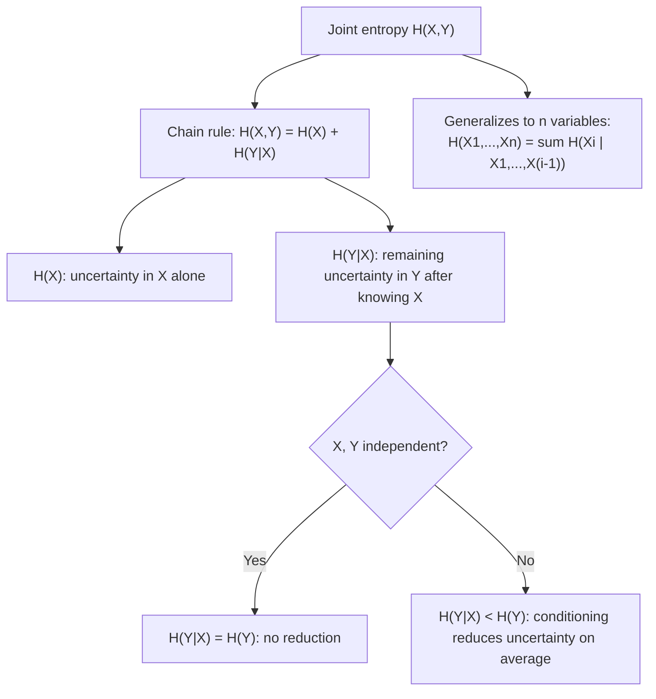

## Conditional Entropy and the Chain Rule

### Overview

Conditional entropy measures the remaining uncertainty in one random variable given that another has already been observed. It is the direct information-theoretic counterpart to conditional probability, and it is the quantity that makes the entropy chain rule possible — the identity that lets joint entropy be decomposed into a sequence of simpler, sequential conditional terms. Conditional entropy is also the piece that, combined with joint and marginal entropy, defines mutual information.

### Definition: Conditional Entropy of $Y$ Given a Specific Value of $X$

For a specific value $x$ with $p(x) > 0$, the entropy of $Y$ given $X = x$ is defined exactly like ordinary entropy, but using the conditional distribution $p(y \mid x)$ in place of the marginal:

$$H(Y \mid X = x) = -\sum_{y \in \mathcal{Y}} p(y \mid x) \log p(y \mid x)$$

This is a single number for each fixed value of $x$ — it measures how uncertain $Y$ remains once it is known that $X$ took specifically the value $x$.

### Definition: Conditional Entropy $H(Y \mid X)$

The full **conditional entropy** $H(Y \mid X)$ averages $H(Y \mid X=x)$ over all possible values of $x$, weighted by $p(x)$:

$$H(Y \mid X) = \sum_{x \in \mathcal{X}} p(x) \, H(Y \mid X = x) = -\sum_{x \in \mathcal{X}} \sum_{y \in \mathcal{Y}} p(x, y) \log p(y \mid x)$$

Equivalently, in expectation notation:

$$H(Y \mid X) = E_{X,Y}\left[-\log p(Y \mid X)\right]$$

Note carefully: the outer expectation is taken over the **joint** distribution $p(x,y)$, even though the log term involves only the conditional $p(y \mid x)$ — this is what correctly weights each per-$x$ conditional entropy by how often that particular $x$ actually occurs.

### Worked Example

**Example**

Using the noisy binary channel joint distribution:

| $p(x,y)$ | $Y=0$ | $Y=1$ |
|---|---|---|
| $X=0$ | 0.45 | 0.05 |
| $X=1$ | 0.10 | 0.40 |

With $p(X=0) = 0.5$, $p(X=1) = 0.5$. The conditional distributions were computed earlier: $p(Y=0\mid X=0) = 0.9$, $p(Y=1\mid X=0) = 0.1$, $p(Y=0\mid X=1) = 0.2$, $p(Y=1\mid X=1) = 0.8$.

$$H(Y \mid X=0) = -[0.9\log_2 0.9 + 0.1 \log_2 0.1] = H_b(0.1) \approx 0.469 \text{ bits}$$

$$H(Y \mid X=1) = -[0.2\log_2 0.2 + 0.8\log_2 0.8] = H_b(0.2) \approx 0.722 \text{ bits}$$

$$H(Y \mid X) = 0.5(0.469) + 0.5(0.722) \approx 0.5955 \text{ bits}$$

Compare this to $H(Y) \approx 0.993$ bits (computed earlier): knowing $X$ reduces the average uncertainty about $Y$ from about 0.993 bits down to about 0.596 bits — this reduction, $H(Y) - H(Y\mid X) \approx 0.398$ bits, is exactly the mutual information $I(X;Y)$, covered next.

### The Chain Rule of Entropy

The **chain rule** states:

$$H(X, Y) = H(X) + H(Y \mid X)$$

**Proof**: Starting from the definition of joint entropy and using $p(x,y) = p(x)p(y\mid x)$ (the probabilistic chain rule):

$$H(X,Y) = -\sum_x \sum_y p(x,y) \log p(x,y) = -\sum_x \sum_y p(x,y) \log[p(x)p(y\mid x)]$$

$$= -\sum_x \sum_y p(x,y)\log p(x) - \sum_x \sum_y p(x,y)\log p(y\mid x)$$

The first term simplifies since $\sum_y p(x,y) = p(x)$:

$$-\sum_x p(x)\log p(x) = H(X)$$

The second term is, by definition, exactly $H(Y \mid X)$. Combining:

$$H(X,Y) = H(X) + H(Y\mid X) \quad \blacksquare$$

**Verification with the worked example**: $H(X) + H(Y\mid X) \approx 1 + 0.5955 = 1.5955$ bits, matching the joint entropy $H(X,Y) \approx 1.595$ bits computed previously (the tiny discrepancy is rounding).

By symmetry, the chain rule also holds in the other order:

$$H(X,Y) = H(Y) + H(X \mid Y)$$

### Generalized Chain Rule for $n$ Variables

The chain rule extends to any number of variables by repeated application:

$$H(X_1, X_2, \dots, X_n) = \sum_{i=1}^{n} H(X_i \mid X_1, X_2, \dots, X_{i-1})$$

with the convention that the first term, $H(X_1 \mid X_1,\dots,X_0)$, is simply $H(X_1)$ (conditioning on nothing). This decomposition is exactly the identity used to compute the entropy rate of a stationary Markov chain, where the Markov property collapses each conditional term $H(X_i \mid X_1,\dots,X_{i-1})$ down to just $H(X_i \mid X_{i-1})$.

### Key Properties of Conditional Entropy

**Non-negativity**: $H(Y \mid X) \geq 0$, since it is a probability-weighted average of individual conditional entropies $H(Y\mid X=x)$, each of which is non-negative by the general non-negativity property of entropy.

**Conditioning reduces entropy (on average)**: 

$$H(Y \mid X) \leq H(Y)$$

with equality if and only if $X$ and $Y$ are independent. This is one of the most quoted results in information theory, often stated informally as "conditioning reduces entropy" — but the precise statement matters: this holds **on average** over $X$, not necessarily for every individual value of $x$. It is entirely possible for $H(Y \mid X=x)$ to *exceed* $H(Y)$ for some specific $x$, as long as it is compensated by other values of $x$ where $H(Y\mid X=x)$ is smaller, so that the average still satisfies the inequality.

[Unverified — depends on specific example] A commonly cited illustration of this subtlety involves constructed joint distributions where observing a particular value of $X$ genuinely increases uncertainty about $Y$ relative to the unconditional case, even though the overall average conditional entropy is lower; the precise numbers used in such examples vary by source, but the qualitative point — that the reduction is only guaranteed on average, not pointwise — is a standard caveat in information theory treatments.

**Chain rule for conditional entropy**: analogous to ordinary joint entropy, conditional entropy also satisfies its own chain rule when conditioning on an additional variable:

$$H(X, Y \mid Z) = H(X \mid Z) + H(Y \mid X, Z)$$

### Conditional Entropy vs. Joint Entropy vs. Marginal Entropy

| Quantity | Formula | Measures |
|---|---|---|
| $H(X)$ | $-\sum_x p(x)\log p(x)$ | Uncertainty in $X$ alone |
| $H(Y)$ | $-\sum_y p(y)\log p(y)$ | Uncertainty in $Y$ alone |
| $H(X,Y)$ | $-\sum_{x,y} p(x,y)\log p(x,y)$ | Total uncertainty in $(X,Y)$ together |
| $H(Y\mid X)$ | $-\sum_{x,y}p(x,y)\log p(y\mid x)$ | Remaining uncertainty in $Y$ after learning $X$ |

### Chain Rule Decomposition

### Visualizing Conditional Entropy as Remaining Uncertainty

<svg xmlns="http://www.w3.org/2000/svg" viewBox="0 0 700 320">
  <text x="350" y="26" text-anchor="middle" font-size="18" font-weight="bold" fill="#1a1a1a">Conditional Entropy as Remaining Uncertainty (svg_diagram)</text>

  <text x="350" y="55" text-anchor="middle" font-size="13" fill="#333">H(Y) before observing X → H(Y|X) after observing X</text>

  <rect x="100" y="80" width="220" height="50" fill="#E45756" fill-opacity="0.7" />
  <text x="210" y="110" text-anchor="middle" font-size="13" fill="white">H(Y) ≈ 0.993 bits</text>

  <path d="M 320 105 L 400 105" stroke="#333" stroke-width="2" marker-end="url(#arrow4)" />
  <text x="360" y="90" text-anchor="middle" font-size="10" fill="#555">observe X</text>

  <rect x="400" y="80" width="132" height="50" fill="#4C78A8" fill-opacity="0.7" />
  <text x="466" y="110" text-anchor="middle" font-size="12" fill="white">H(Y|X)≈0.596</text>

  <rect x="532" y="80" width="88" height="50" fill="#F2B701" fill-opacity="0.7" />
  <text x="576" y="105" text-anchor="middle" font-size="10" fill="#333">I(X;Y)</text>
  <text x="576" y="120" text-anchor="middle" font-size="9" fill="#333">≈0.398</text>

  <text x="210" y="160" text-anchor="middle" font-size="11" fill="#555">Total uncertainty in Y</text>
  <text x="466" y="160" text-anchor="middle" font-size="11" fill="#555">Remains after knowing X</text>
  <text x="576" y="160" text-anchor="middle" font-size="11" fill="#555">Resolved by X</text>

  <text x="350" y="210" text-anchor="middle" font-size="12" font-weight="bold" fill="#333">H(Y) = H(Y|X) + I(X;Y)</text>
  <text x="350" y="235" text-anchor="middle" font-size="11" fill="#555">The bar shrinks (on average) because X carries some information about Y</text>
  <text x="350" y="255" text-anchor="middle" font-size="11" fill="#555">Reduction holds on average — not guaranteed for every individual value of X</text>
</svg>

### Key Points

- **Conditional entropy** $H(Y\mid X)$ is the average remaining uncertainty in $Y$ after observing $X$, computed as a $p(x)$-weighted average of per-value conditional entropies $H(Y\mid X=x)$.
- The **chain rule of entropy**, $H(X,Y) = H(X) + H(Y\mid X)$, follows directly from the probabilistic chain rule $p(x,y)=p(x)p(y\mid x)$ and generalizes to $n$ variables as a sum of sequential conditional entropies.
- **Conditioning reduces entropy on average**: $H(Y\mid X) \leq H(Y)$, with equality iff independent — but this guarantee is about the average over $X$, not a pointwise guarantee for every specific value of $x$.
- Conditional entropy is always **non-negative**, inheriting this from the non-negativity of ordinary entropy applied to each conditional distribution.
- The gap $H(Y) - H(Y\mid X)$ is exactly the **mutual information** $I(X;Y)$, making conditional entropy the direct building block for quantifying shared information between variables.

**Related Topics**

- Mutual information $I(X;Y)$ and its properties
- The data processing inequality
- Entropy rate of Markov chains via the chain rule
- Kullback-Leibler divergence
- Cross-entropy and its relation to conditional entropy
- Channel capacity and conditional entropy in noisy channels
- Multivariate mutual information and conditional mutual information