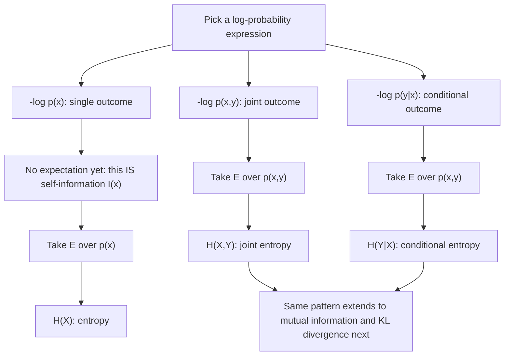

## Entropy as Expected Surprisal

### Overview

This section revisits and consolidates the connection between self-information (surprisal) and entropy, now that joint entropy, conditional entropy, and the chain rule have all been established. Rather than introducing new machinery, the goal here is to make explicit and rigorous the unifying view that **every entropy-type quantity encountered so far is an expectation of some log-probability expression** — a single conceptual lens that ties self-information, entropy, joint entropy, and conditional entropy together as one family, rather than four separate formulas to memorize independently.

### The Core Identity

Recall the self-information (surprisal) of a specific outcome $x$:

$$I(x) = -\log p(x)$$

and that entropy is defined as its expectation:

$$H(X) = E[I(X)] = E[-\log p(X)] = \sum_x p(x)\left[-\log p(x)\right]$$

This is worth restating plainly: **entropy is not a separate concept from surprisal — it *is* surprisal, averaged**. Every property of entropy (non-negativity, boundedness, concavity) is ultimately inherited from applying the expectation operator to the underlying surprisal random variable $I(X) = -\log p(X)$, combined with the properties of expectation itself (linearity, and Jensen's inequality for the boundedness result).

### Extending the Lens to Joint and Conditional Entropy

The same "expectation of a log-probability expression" pattern extends cleanly to every other entropy quantity introduced so far.

**Joint entropy** is the expected surprisal of the *joint* outcome $(X,Y)$, treating $(X,Y)$ as a single combined random variable:

$$H(X,Y) = E\left[-\log p(X,Y)\right]$$

**Conditional entropy** is the expected surprisal of $Y$ under the *conditional* distribution $p(y\mid x)$, with the expectation taken over the full joint distribution of $(X,Y)$:

$$H(Y\mid X) = E_{X,Y}\left[-\log p(Y\mid X)\right]$$

This single unifying pattern — "define a log-probability random variable, then take its expectation" — is the organizing principle that connects every quantity encountered so far in this material, and it will continue to organize every quantity introduced from this point forward, including mutual information ($E[\log \frac{p(X,Y)}{p(X)p(Y)}]$) and Kullback-Leibler divergence ($E_p[\log \frac{p(X)}{q(X)}]$), both covered next.

### Why This Framing Matters

Viewing entropy as expected surprisal rather than as a standalone formula has concrete practical value:

- **Deriving new identities becomes mechanical.** The chain rule $H(X,Y) = H(X) + H(Y\mid X)$ falls out immediately from applying linearity of expectation to the algebraic identity $-\log p(x,y) = -\log p(x) - \log p(y\mid x)$ (itself just the log of the probabilistic chain rule $p(x,y) = p(x)p(y\mid x)$), rather than needing to be independently memorized as a separate fact.
- **Inequalities transfer automatically.** Since entropy is an expectation, any general inequality about expectations — most importantly Jensen's inequality applied to the concave function $\log$ — becomes available as a tool, which is exactly how the entropy upper bound $H(X) \leq \log n$ and the non-negativity of mutual information are both proved.
- **New quantities are easy to construct correctly.** Once the pattern is internalized, defining a new information-theoretic quantity is largely a matter of choosing the right log-probability ratio to average — this is precisely how mutual information and KL divergence are motivated and defined, as covered next.

### Worked Illustration: Re-Deriving the Chain Rule via the Surprisal Lens

Starting from the probabilistic chain rule, $p(x,y) = p(x)\,p(y\mid x)$, take $-\log$ of both sides:

$$-\log p(x,y) = -\log p(x) - \log p(y\mid x)$$

This says: the surprisal of observing the joint outcome $(x,y)$ equals the surprisal of observing $x$ alone, plus the additional surprisal of observing $y$ given that $x$ has already occurred. Now take the expectation of both sides over the joint distribution $p(x,y)$:

$$E[-\log p(X,Y)] = E[-\log p(X)] + E[-\log p(Y\mid X)]$$

$$H(X,Y) = H(X) + H(Y\mid X)$$

using linearity of expectation (which requires no independence assumption whatsoever between $X$ and $Y$) to split the sum on the right-hand side. This derivation is identical in substance to the one given previously, but framed explicitly through the surprisal-expectation lens rather than through direct summation manipulation — the same result, reached via the unifying conceptual route.

### Surprisal Decomposition at the Level of a Single Outcome

It is worth distinguishing the **pointwise** identity from the **averaged** identity, since both are useful in different contexts:

**Pointwise (holds for every specific outcome $(x,y)$)**:

$$-\log p(x,y) = -\log p(x) + \left[-\log p(y\mid x)\right] = I(x) + I(y\mid x)$$

**Averaged (the chain rule of entropy)**:

$$H(X,Y) = H(X) + H(Y\mid X)$$

The pointwise version decomposes the surprisal of one particular joint outcome into two additive pieces; the averaged version decomposes the *entropy* — the expectation of that surprisal — into the corresponding two additive pieces. This mirrors exactly the earlier distinction drawn between self-information (a single-outcome quantity) and entropy (its expectation): the chain rule is simply this same distinction applied one level up, to joint and conditional entropy.

### The Unifying Pattern, Summarized

| Quantity | Log-probability expression averaged | What it measures |
|---|---|---|
| Self-information $I(x)$ | $-\log p(x)$ (no expectation — a single value) | Surprisal of one specific outcome |
| Entropy $H(X)$ | $E[-\log p(X)]$ | Average surprisal of $X$ |
| Joint entropy $H(X,Y)$ | $E[-\log p(X,Y)]$ | Average surprisal of the joint outcome |
| Conditional entropy $H(Y\mid X)$ | $E[-\log p(Y\mid X)]$ | Average surprisal of $Y$ given $X$ |

### The Unifying Lens Visualized

### Visualizing Entropy as an Averaging Operation

<svg xmlns="http://www.w3.org/2000/svg" viewBox="0 0 700 340">
  <text x="350" y="26" text-anchor="middle" font-size="18" font-weight="bold" fill="#1a1a1a">Entropy = Expectation of Surprisal (svg_diagram)</text>

  <text x="150" y="60" text-anchor="middle" font-size="13" font-weight="bold" fill="#333">Individual outcomes</text>
  <rect x="50" y="80" width="80" height="40" fill="#4C78A8" fill-opacity="0.4" />
  <text x="90" y="105" text-anchor="middle" font-size="10">I(x1)=0.5</text>
  <rect x="140" y="80" width="80" height="40" fill="#4C78A8" fill-opacity="0.6" />
  <text x="180" y="105" text-anchor="middle" font-size="10">I(x2)=1.2</text>
  <rect x="230" y="80" width="80" height="40" fill="#4C78A8" fill-opacity="0.9" />
  <text x="270" y="105" text-anchor="middle" font-size="10">I(x3)=3.0</text>

  <path d="M 200 140 L 350 200" stroke="#333" stroke-width="2" marker-end="url(#arrow5)" />
  <text x="290" y="165" text-anchor="middle" font-size="11" fill="#555">weight by p(x), sum</text>

  <rect x="300" y="210" width="200" height="60" rx="6" fill="#E45756" fill-opacity="0.75" />
  <text x="400" y="245" text-anchor="middle" font-size="14" fill="white">H(X) = E[I(X)]</text>

  <text x="400" y="300" text-anchor="middle" font-size="12" fill="#555">Entropy is the probability-weighted average</text>
  <text x="400" y="320" text-anchor="middle" font-size="12" fill="#555">of the individual self-information values</text>
</svg>

### Key Points

- **Entropy, joint entropy, and conditional entropy are all instances of the same construction**: define a log-probability expression, then take its expectation — entropy is not a separate concept from self-information, but its average.
- The **pointwise identity** $-\log p(x,y) = -\log p(x) - \log p(y\mid x)$, taken directly from the probabilistic chain rule, becomes the **entropy chain rule** $H(X,Y) = H(X)+H(Y\mid X)$ simply by applying linearity of expectation — no new derivation machinery is needed.
- This unifying lens explains *why* inequalities like $H(X) \leq \log n$ and the non-negativity of mutual information all trace back to the same tool: **Jensen's inequality applied to $\log$**.
- The same pattern will directly motivate **mutual information** and **Kullback-Leibler divergence**, both definable as expectations of an appropriately chosen log-probability-ratio expression.
- Distinguishing the **pointwise** surprisal decomposition from the **averaged** entropy decomposition clarifies which identities hold for every individual outcome versus only in expectation.

**Related Topics**

- Mutual information as an expected log-probability ratio
- Kullback-Leibler divergence and cross-entropy
- Jensen's inequality and its role across information-theoretic proofs
- The data processing inequality
- Differential entropy as the continuous analog of expected surprisal
- Rényi entropy as a generalized expectation (using a different averaging operator)
- Typical sets and the Asymptotic Equipartition Property