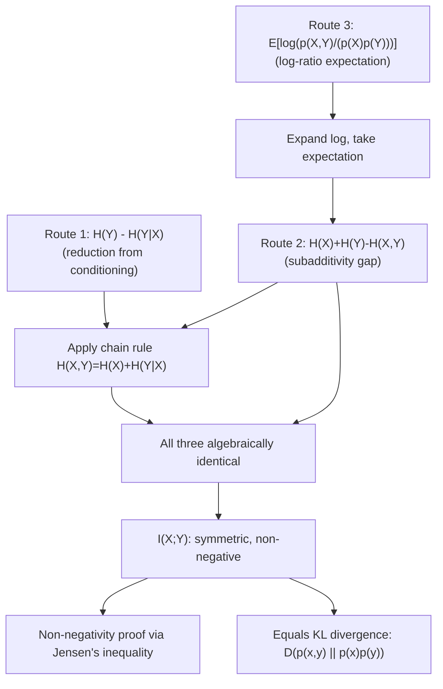

## Definition and Derivation of Mutual Information

### Overview

Mutual information quantifies exactly how much knowing one random variable reduces uncertainty about another — it is the formal answer to the question "how much do $X$ and $Y$ tell each other?" Every gap identified so far between joint entropy and the sum of marginal entropies, and every reduction identified between marginal and conditional entropy, has been silently pointing toward this single quantity. Mutual information is symmetric, non-negative, and sits at the exact center of channel capacity, making it arguably the single most important derived quantity in all of information theory.

### Three Equivalent Derivations

Mutual information can be arrived at from three different starting points, all of which converge on the identical formula — this convergence is itself evidence that the quantity is a natural, non-arbitrary construction rather than an ad hoc definition.

**Route 1 — As the reduction in entropy from conditioning**: Earlier work established $H(Y\mid X) \leq H(Y)$, with the gap between them left unnamed. Define:

$$I(X;Y) = H(Y) - H(Y\mid X)$$

This directly formalizes "how much does observing $X$ reduce the uncertainty in $Y$, on average."

**Route 2 — As the gap in joint entropy subadditivity**: Earlier work established $H(X,Y) \leq H(X) + H(Y)$, with equality iff independent, and the gap again left unnamed. Define:

$$I(X;Y) = H(X) + H(Y) - H(X,Y)$$

This directly formalizes "how much redundancy exists between $X$ and $Y$ beyond what independence would predict."

**Route 3 — As an expected log-probability ratio (via the surprisal lens)**: Following the unifying "expectation of a log-probability expression" pattern, define a quantity that compares the actual joint distribution $p(x,y)$ to what it would be under independence, $p(x)p(y)$:

$$I(X;Y) = E\left[\log \frac{p(X,Y)}{p(X)p(Y)}\right] = \sum_{x}\sum_{y} p(x,y) \log \frac{p(x,y)}{p(x)p(y)}$$

### Proving the Three Routes Are Equivalent

Starting from Route 3 and expanding the logarithm of the ratio:

$$\log\frac{p(x,y)}{p(x)p(y)} = \log p(x,y) - \log p(x) - \log p(y)$$

Taking the expectation over $p(x,y)$:

$$I(X;Y) = E[-\log p(X)] + E[-\log p(Y)] - E[-\log p(X,Y)] = H(X) + H(Y) - H(X,Y)$$

which is exactly Route 2. To connect to Route 1, apply the chain rule $H(X,Y) = H(X) + H(Y\mid X)$ to substitute:

$$I(X;Y) = H(X) + H(Y) - [H(X) + H(Y\mid X)] = H(Y) - H(Y\mid X)$$

confirming Route 1. All three formulas are algebraically identical rearrangements of one another, not three separate coincidental facts.

### The Formal Definition

$$I(X;Y) = \sum_{x \in \mathcal{X}}\sum_{y \in \mathcal{Y}} p(x,y) \log \frac{p(x,y)}{p(x)p(y)} = H(X) - H(X\mid Y) = H(Y) - H(Y\mid X) = H(X)+H(Y)-H(X,Y)$$

The notation $I(X;Y)$ uses a semicolon (not a comma) deliberately, to visually distinguish mutual information — a relationship between two variables — from joint entropy notation $H(X,Y)$, which treats the pair as one combined object.

### Symmetry

A property immediately visible from Route 2's formula ($H(X)+H(Y)-H(X,Y)$, manifestly symmetric in $X$ and $Y$) but *not* obvious from Route 1's formula ($H(Y)-H(Y\mid X)$) is that:

$$I(X;Y) = I(Y;X)$$

This is a genuinely important and non-trivial fact: the amount that $X$ tells you about $Y$ is *exactly* the amount that $Y$ tells you about $X$, even though $H(Y\mid X)$ and $H(X\mid Y)$ are generally different numbers computed via different conditional distributions. Mutual information is symmetric despite conditional entropy being, in general, asymmetric.

### Worked Example

**Example**

Continuing the noisy binary channel: $H(Y) \approx 0.993$ bits, $H(Y\mid X) \approx 0.5955$ bits (both computed previously).

$$I(X;Y) = H(Y) - H(Y\mid X) \approx 0.993 - 0.5955 \approx 0.398 \text{ bits}$$

**Verification via Route 2**: $H(X)+H(Y)-H(X,Y) \approx 1 + 0.993 - 1.595 \approx 0.398$ bits — matching, as required by the algebraic equivalence proved above.

**Interpretation**: observing the channel output $Y$ conveys, on average, about 0.398 bits of information about the transmitted bit $X$ — substantially less than the full 1 bit of $H(X)$, reflecting the channel's noise (the 0.05 and 0.10 probability mass on the "error" cells of the joint table).

### Non-Negativity of Mutual Information

**Claim**: $I(X;Y) \geq 0$, with equality if and only if $X$ and $Y$ are independent.

**Proof (via Jensen's inequality)**: Starting from Route 3's formula and negating it:

$$-I(X;Y) = \sum_{x,y} p(x,y) \log \frac{p(x)p(y)}{p(x,y)} = E\left[\log \frac{p(X)p(Y)}{p(X,Y)}\right]$$

Since $\log$ is concave, Jensen's inequality gives $E[\log Z] \leq \log E[Z]$ for a positive random variable $Z = \frac{p(X)p(Y)}{p(X,Y)}$:

$$-I(X;Y) \leq \log E\left[\frac{p(X)p(Y)}{p(X,Y)}\right] = \log \sum_{x,y} p(x,y)\cdot\frac{p(x)p(y)}{p(x,y)} = \log \sum_{x,y} p(x)p(y) = \log 1 = 0$$

Therefore $-I(X;Y) \leq 0$, i.e., $I(X;Y) \geq 0$. Equality in Jensen's inequality holds iff $Z$ is constant, which occurs iff $\frac{p(x)p(y)}{p(x,y)} = 1$ for all $(x,y)$ with $p(x,y) > 0$ — precisely the condition for independence. $\blacksquare$

This proof is the origin of the earlier-cited subadditivity result $H(X,Y) \leq H(X)+H(Y)$: that inequality is simply $I(X;Y) \geq 0$ rearranged via Route 2's formula.

### Relation to Kullback-Leibler Divergence

Route 3's formula, $I(X;Y) = \sum_{x,y}p(x,y)\log\frac{p(x,y)}{p(x)p(y)}$, has exactly the structural form of a **Kullback-Leibler divergence** (covered in full separately) between the joint distribution $p(x,y)$ and the product-of-marginals distribution $p(x)p(y)$:

$$I(X;Y) = D\big(p(x,y) \,\|\, p(x)p(y)\big)$$

This identification is powerful: mutual information can be understood as **precisely measuring how far the actual joint distribution is from the hypothetical distribution that would hold under independence**. The non-negativity proof given above is, in fact, a special case of the general non-negativity result for KL divergence (Gibbs' inequality), applied to this specific pair of distributions.

### The Venn Diagram Intuition, Made Precise

$$H(X,Y) = H(X) + H(Y) - I(X;Y)$$

$$H(X\mid Y) = H(X) - I(X;Y), \qquad H(Y\mid X) = H(Y) - I(X;Y)$$

These identities justify the informal "overlapping circles" picture used earlier: $H(X)$ and $H(Y)$ are the two circles, their union is $H(X,Y)$, their intersection is $I(X;Y)$, and each circle's exclusive region is the corresponding conditional entropy.

<svg xmlns="http://www.w3.org/2000/svg" viewBox="0 0 700 360">
  <text x="350" y="26" text-anchor="middle" font-size="18" font-weight="bold" fill="#1a1a1a">Mutual Information: Precise Venn Decomposition (svg_diagram)</text>

  <circle cx="270" cy="180" r="110" fill="#4C78A8" fill-opacity="0.45" />
  <circle cx="430" cy="180" r="110" fill="#E45756" fill-opacity="0.45" />

  <text x="190" y="130" text-anchor="middle" font-size="13" fill="#1a1a1a" font-weight="bold">H(X|Y)</text>
  <text x="510" y="130" text-anchor="middle" font-size="13" fill="#1a1a1a" font-weight="bold">H(Y|X)</text>
  <text x="350" y="185" text-anchor="middle" font-size="14" fill="#1a1a1a" font-weight="bold">I(X;Y)</text>

  <text x="270" y="70" text-anchor="middle" font-size="12" fill="#4C78A8">H(X)</text>
  <text x="430" y="70" text-anchor="middle" font-size="12" fill="#E45756">H(Y)</text>

  <text x="350" y="320" text-anchor="middle" font-size="12" fill="#333">Total shaded area = H(X,Y)</text>
  <text x="350" y="342" text-anchor="middle" font-size="12" fill="#555">H(X,Y) = H(X|Y) + I(X;Y) + H(Y|X)</text>
</svg>

### Three Equivalent Derivation Routes

### Key Points

- **Mutual information** $I(X;Y)$ can be derived from three equivalent routes — reduction in conditional entropy, subadditivity gap in joint entropy, and expected log-probability ratio — all algebraically identical.
- The formal definition is $I(X;Y) = \sum_{x,y}p(x,y)\log\frac{p(x,y)}{p(x)p(y)} = H(X)-H(X\mid Y) = H(Y)-H(Y\mid X) = H(X)+H(Y)-H(X,Y)$.
- Mutual information is **symmetric**, $I(X;Y)=I(Y;X)$, even though the underlying conditional entropies $H(X\mid Y)$ and $H(Y\mid X)$ are generally not equal to each other.
- Mutual information is **non-negative**, $I(X;Y)\geq 0$, proved via Jensen's inequality applied to the concavity of $\log$, with equality if and only if $X$ and $Y$ are independent.
- Mutual information is exactly the **Kullback-Leibler divergence** between the joint distribution and the product of marginals, $I(X;Y) = D(p(x,y)\,\|\,p(x)p(y))$ — situating it as a special case of a more general divergence measure.

**Related Topics**

- Kullback-Leibler divergence in full generality
- Channel capacity as the maximum of mutual information over input distributions
- The data processing inequality and its proof via mutual information
- Conditional mutual information $I(X;Y\mid Z)$
- Cross-entropy and its relation to KL divergence
- Rate-distortion theory
- Differential mutual information for continuous random variables