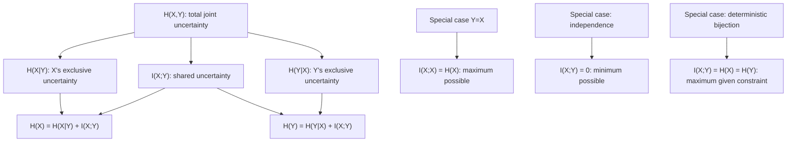

## Relationship Between Mutual Information and Entropy

### Overview

Individual identities connecting mutual information to entropy, joint entropy, and conditional entropy have already been derived piece by piece. This section consolidates them into a single coherent structural picture, extends the relationship to the multivariate case, and establishes the extreme cases and bounds that make mutual information practically useful for reasoning about channels, sources, and dependency structure as a unified whole.

### The Four Equivalent Formulas, Side by Side

$$I(X;Y) = H(X) - H(X\mid Y)$$

$$I(X;Y) = H(Y) - H(Y\mid X)$$

$$I(X;Y) = H(X) + H(Y) - H(X,Y)$$

$$I(X;Y) = H(X,Y) - H(X\mid Y) - H(Y\mid X)$$

The fourth form follows by substituting the chain rule twice — $H(X,Y) = H(X)+H(Y\mid X) = H(Y)+H(X\mid Y)$ — into the third formula and rearranging; it is included here because it makes explicit that joint entropy decomposes into exactly three non-negative pieces: the two "exclusive" conditional entropies plus the shared mutual information, matching the Venn diagram picture directly.

### Complete Entropy Decomposition Table

| Quantity | Formula in terms of others | Range |
|---|---|---|
| $H(X)$ | $I(X;Y) + H(X\mid Y)$ | $[0, \log|\mathcal{X}|]$ |
| $H(Y)$ | $I(X;Y) + H(Y\mid X)$ | $[0, \log|\mathcal{Y}|]$ |
| $H(X,Y)$ | $H(X\mid Y) + I(X;Y) + H(Y\mid X)$ | $[\max(H(X),H(Y)), H(X)+H(Y)]$ |
| $I(X;Y)$ | $H(X)+H(Y)-H(X,Y)$ | $[0, \min(H(X),H(Y))]$ |

The upper bound $I(X;Y) \leq \min(H(X),H(Y))$ follows immediately from non-negativity of conditional entropy: since $I(X;Y) = H(X) - H(X\mid Y) \leq H(X)$ (because $H(X\mid Y)\geq 0$), and symmetrically $I(X;Y) \leq H(Y)$, the tighter of the two bounds applies.

### The Special Case $X = Y$

**Claim**: $I(X;X) = H(X)$.

**Proof**: Setting $Y=X$ in $I(X;Y) = H(Y) - H(Y\mid X)$: since knowing $X$ determines $Y=X$ exactly, $H(X\mid X) = 0$ (there is no remaining uncertainty about $X$ once $X$ itself is known — a direct instance of the general non-negativity equality condition, since the "conditional distribution" collapses to a single point with probability 1). Therefore:

$$I(X;X) = H(X) - H(X\mid X) = H(X) - 0 = H(X)$$

This identity is the reason entropy is sometimes informally described as "the information a random variable carries about itself" or "self-mutual-information" — a variable's entropy is exactly the upper limit of how much information any other variable could possibly convey about it, since no other variable can be more informative about $X$ than $X$ is about itself.

### The Two Extreme Cases

**Case 1 — Independence**: $I(X;Y) = 0$ exactly when $X$ and $Y$ are independent (proved via the Jensen's-inequality equality condition established earlier). In this case, $H(X,Y) = H(X)+H(Y)$, $H(X\mid Y)=H(X)$, and $H(Y\mid X)=H(Y)$ — knowing one variable provides zero information about the other, and every entropy quantity reduces to the simplest possible additive relationship.

**Case 2 — Deterministic dependence**: If $Y$ is a deterministic, invertible function of $X$ (a bijection on the relevant support), then $I(X;Y) = H(X) = H(Y)$, the maximum possible value given the constraint $I(X;Y)\leq \min(H(X),H(Y))$. In this case $H(X\mid Y) = H(Y\mid X) = 0$: each variable is fully determined by the other, so there is no remaining uncertainty in either direction.

**Example**

If $Y = X \oplus 1 \pmod 2$ (a deterministic bit-flip of a fair coin $X$), then $H(X)=H(Y)=1$ bit, and since $Y$ is a bijective function of $X$, $I(X;Y) = 1$ bit — full mutual information, even though $Y$ is never numerically equal to $X$. This underscores that mutual information measures *statistical predictability*, not similarity of values: $Y$ can be perfectly predictable from $X$ (hence maximal mutual information) while being systematically different from $X$ in every realization.

### Mutual Information and the Chain Rule for Multiple Variables

Mutual information generalizes to three or more variables via **conditional mutual information**:

$$I(X;Y\mid Z) = H(X\mid Z) - H(X\mid Y,Z)$$

which measures the mutual information between $X$ and $Y$ that remains after already accounting for $Z$. This supports a **chain rule for mutual information**, directly analogous to the entropy chain rule:

$$I(X;Y,Z) = I(X;Y) + I(X;Z\mid Y)$$

**Interpretation**: the total information $X$ carries about the pair $(Y,Z)$ decomposes into the information $X$ carries about $Y$ alone, plus whatever *additional* information $X$ carries about $Z$ once $Y$ is already known. [Unverified — depends on specific joint distribution] Unlike ordinary mutual information, conditional mutual information $I(X;Y\mid Z)$ is always non-negative by the same Jensen's-inequality argument applied conditionally, but the *unconditional* three-variable interaction can behave counterintuitively — it is possible for $I(X;Y\mid Z)$ to exceed $I(X;Y)$ (a phenomenon sometimes discussed under the heading of "explaining away" or synergistic information), so intuitions from the two-variable case do not always transfer directly to three or more variables.

### Full Relationship Map

### Complete Picture: Bounds and Extremes

<svg viewBox="0 0 700 380" xmlns="http://www.w3.org/2000/svg">
  <text x="350" y="26" text-anchor="middle" font-size="18" font-weight="bold" fill="#1a1a1a">Mutual Information Across the Dependency Spectrum (svg_diagram)</text>

  <line x1="80" y1="200" x2="620" y2="200" stroke="#333" stroke-width="3"/>
  <circle cx="80" cy="200" r="6" fill="#4C78A8"/>
  <circle cx="620" cy="200" r="6" fill="#E45756"/>
  <circle cx="350" cy="200" r="5" fill="#F2B701"/>

  <text x="80" y="170" text-anchor="middle" font-size="13" fill="#4C78A8" font-weight="bold">I(X;Y) = 0</text>
  <text x="80" y="235" text-anchor="middle" font-size="11" fill="#555">Independent</text>
  <text x="80" y="252" text-anchor="middle" font-size="11" fill="#555">H(X,Y)=H(X)+H(Y)</text>

  <text x="620" y="170" text-anchor="middle" font-size="13" fill="#E45756" font-weight="bold">I(X;Y) = min(H(X),H(Y))</text>
  <text x="620" y="235" text-anchor="middle" font-size="11" fill="#555">Deterministic bijection</text>
  <text x="620" y="252" text-anchor="middle" font-size="11" fill="#555">(if H(X)=H(Y): I=H(X)=H(Y))</text>

  <text x="350" y="180" text-anchor="middle" font-size="11" fill="#F2B701">partial dependence</text>
  <text x="350" y="270" text-anchor="middle" font-size="11" fill="#555">0 < I(X;Y) < min(H(X),H(Y))</text>

  <text x="350" y="320" text-anchor="middle" font-size="12" fill="#333" font-weight="bold">Special case: I(X;X) = H(X)</text>
  <text x="350" y="342" text-anchor="middle" font-size="11" fill="#555">A variable's entropy is the ceiling on how informative anything can be about it</text>
</svg>

### Key Points

- All entropy-related quantities fit into one coherent decomposition: $H(X,Y) = H(X\mid Y) + I(X;Y) + H(Y\mid X)$, with each piece non-negative.
- Mutual information is bounded above by the smaller marginal entropy: $I(X;Y) \leq \min(H(X), H(Y))$, since conditional entropy can never be negative.
- **$I(X;X) = H(X)$**: a variable's own entropy is the mathematical ceiling on how much any other variable could possibly reveal about it.
- **Independence** ($I(X;Y)=0$) and **deterministic bijection** ($I(X;Y)=\min(H(X),H(Y))$, achieved when $H(X)=H(Y)$) mark the two extreme ends of the dependency spectrum.
- Mutual information measures statistical predictability, not value similarity — a variable can be perfectly predictable from another (maximal mutual information) while never sharing the same numerical value.
- **Conditional mutual information** and its **chain rule** extend these relationships to three or more variables, though multivariate interactions can behave in ways that do not directly generalize two-variable intuition.

**Related Topics**

- Conditional mutual information and the chain rule for mutual information
- Interaction information and synergy/redundancy in multivariate systems
- The data processing inequality
- Channel capacity as maximized mutual information
- Kullback-Leibler divergence in full generality
- Rate-distortion theory and the information bottleneck
- Differential mutual information for continuous variables