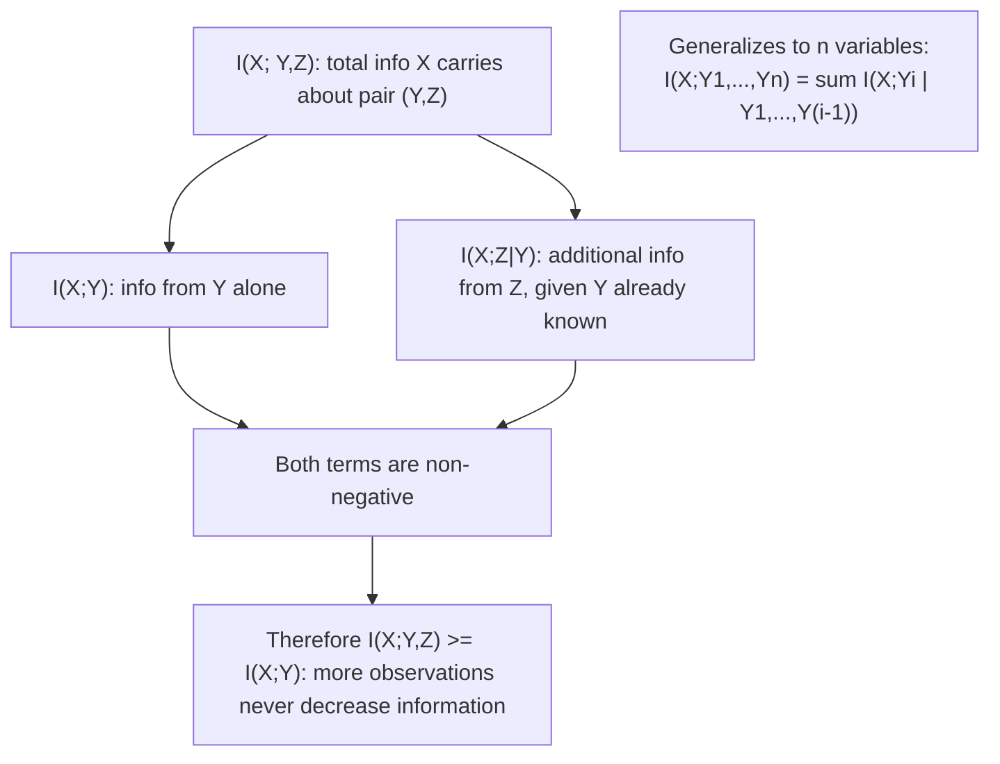

## Mutual Information: Symmetry, Non-Negativity, Chain Rule

### Overview

The three defining structural properties of mutual information — symmetry, non-negativity, and the chain rule — have each been derived or stated individually across prior sections. This section gathers them into one rigorous, self-contained reference: full proofs, precise equality conditions, and the generalized multivariate chain rule, presented together as the property set that any complete treatment of mutual information must establish before it can be used confidently in channel capacity or rate-distortion arguments.

### Property 1: Symmetry

**Statement**: $I(X;Y) = I(Y;X)$ for any two random variables $X, Y$.

**Proof**: From the log-ratio definition,

$$I(X;Y) = \sum_{x,y} p(x,y) \log \frac{p(x,y)}{p(x)p(y)}$$

The expression inside the logarithm, $\frac{p(x,y)}{p(x)p(y)}$, is manifestly symmetric under swapping the roles of $x$ and $y$ (since $p(x,y) = p(y,x)$ by definition of a joint distribution, and $p(x)p(y) = p(y)p(x)$ by commutativity of multiplication). Swapping $X \leftrightarrow Y$ throughout the sum therefore leaves the entire expression unchanged:

$$I(X;Y) = \sum_{x,y}p(x,y)\log\frac{p(x,y)}{p(x)p(y)} = \sum_{y,x}p(y,x)\log\frac{p(y,x)}{p(y)p(x)} = I(Y;X) \quad \blacksquare$$

**Why this is non-obvious from other forms**: the two "conditional entropy" forms, $I(X;Y)=H(Y)-H(Y\mid X)$ and $I(Y;X)=H(X)-H(X\mid Y)$, involve $H(Y\mid X)$ and $H(X\mid Y)$ respectively — two quantities that are, in general, numerically different from each other. Symmetry of $I$ is therefore a genuine, non-trivial algebraic fact: it says that two different-looking combinations of (generally unequal) conditional entropies and (generally unequal) marginal entropies always produce exactly the same number.

### Property 2: Non-Negativity

**Statement**: $I(X;Y) \geq 0$ for any two random variables $X, Y$, with equality if and only if $X$ and $Y$ are independent.

**Proof (restated in full, via Jensen's inequality)**: Consider the negative of the mutual information expression:

$$-I(X;Y) = \sum_{x,y}p(x,y)\log\frac{p(x)p(y)}{p(x,y)} = E_{p(x,y)}\left[\log \frac{p(X)p(Y)}{p(X,Y)}\right]$$

Since $\log$ is a strictly concave function, Jensen's inequality states $E[\log Z] \leq \log E[Z]$ for any positive random variable $Z$. Applying this with $Z = \frac{p(X)p(Y)}{p(X,Y)}$:

$$-I(X;Y) \leq \log\left(\sum_{x,y}p(x,y)\cdot\frac{p(x)p(y)}{p(x,y)}\right) = \log\left(\sum_{x,y}p(x)p(y)\right) = \log(1) = 0$$

The sum $\sum_{x,y}p(x)p(y) = \left(\sum_x p(x)\right)\left(\sum_y p(y)\right) = 1 \times 1 = 1$ since each marginal sums to 1 independently, regardless of any dependence structure between $X$ and $Y$. Therefore $-I(X;Y)\leq 0$, giving $I(X;Y)\geq 0$. $\blacksquare$

**Equality condition, derived precisely**: equality in Jensen's inequality for a strictly concave function holds if and only if the random variable $Z$ is almost surely constant. Here $Z = \frac{p(x)p(y)}{p(x,y)}$ must equal the same constant $c$ for every $(x,y)$ pair with $p(x,y)>0$. Since $Z$ is being averaged against a distribution that sums to 1, and $E[Z]=1$ was computed directly above, the constant must be $c=1$, giving $p(x,y) = p(x)p(y)$ for every such pair — exactly the definition of independence.

### Property 3: The Chain Rule for Mutual Information

**Statement**: For three random variables $X$, $Y$, $Z$:

$$I(X;Y,Z) = I(X;Y) + I(X;Z\mid Y)$$

where **conditional mutual information** is defined analogously to ordinary mutual information, but with every term conditioned on $Z$... here conditioned on $Y$:

$$I(X;Z\mid Y) = H(X\mid Y) - H(X\mid Y,Z)$$

**Proof**: Start from the conditional-entropy form of mutual information applied to $X$ and the pair $(Y,Z)$ treated as a single combined variable:

$$I(X;Y,Z) = H(X) - H(X\mid Y,Z)$$

Now insert and subtract $H(X\mid Y)$:

$$I(X;Y,Z) = H(X) - H(X\mid Y) + H(X\mid Y) - H(X\mid Y,Z)$$

The first two terms, $H(X)-H(X\mid Y)$, are exactly $I(X;Y)$ by definition. The last two terms, $H(X\mid Y)-H(X\mid Y,Z)$, are exactly $I(X;Z\mid Y)$ by the definition given above. Combining:

$$I(X;Y,Z) = I(X;Y) + I(X;Z\mid Y) \quad \blacksquare$$

**Generalized chain rule for $n$ variables**: this extends by induction to any number of variables:

$$I(X; Y_1, Y_2, \dots, Y_n) = \sum_{i=1}^{n} I(X; Y_i \mid Y_1, \dots, Y_{i-1})$$

directly paralleling the structure of the entropy chain rule, with each successive term measuring the *additional* information $Y_i$ provides about $X$ once $Y_1,\dots,Y_{i-1}$ are already known.

**Conditional mutual information is itself non-negative**: $I(X;Z\mid Y) \geq 0$, by the identical Jensen's-inequality argument applied to the conditional distributions $p(x,z\mid y)$ in place of $p(x,y)$, with equality if and only if $X$ and $Z$ are conditionally independent given $Y$. This non-negativity is what guarantees, via the chain rule, that $I(X;Y,Z) \geq I(X;Y)$ — observing an additional variable can never decrease the information already captured about $X$.

### Interpreting the Chain Rule: A Worked Numerical Sketch

**Example**

Consider $X$ a source bit, $Y$ a first noisy observation of $X$, and $Z$ a second, independent noisy observation of $X$ (e.g., two separate repeated transmissions over the same noisy channel). Then $I(X;Y,Z) = I(X;Y) + I(X;Z\mid Y)$ decomposes the total information carried by *both* observations into the information from the first observation alone, plus the *additional* information the second observation contributes once the first is already known. [Inference] Because $Z$ is conditionally informative about $X$ even after $Y$ is known (the two noisy copies are not fully redundant with each other, since each independently reduces residual uncertainty about $X$), $I(X;Z\mid Y) > 0$ in this scenario, and the total $I(X;Y,Z)$ exceeds $I(X;Y)$ alone — this is the information-theoretic justification for why repeated transmission (repetition coding) over a noisy channel improves reliability, though the precise numerical gain depends on the specific channel noise parameters.

### Summary Table of All Three Properties

| Property | Statement | Equality condition |
|---|---|---|
| Symmetry | $I(X;Y) = I(Y;X)$ | Always holds (identity, not inequality) |
| Non-negativity | $I(X;Y) \geq 0$ | $X, Y$ independent |
| Chain rule | $I(X;Y,Z) = I(X;Y) + I(X;Z\mid Y)$ | Always holds (identity, not inequality) |
| Conditional non-negativity | $I(X;Z\mid Y) \geq 0$ | $X, Z$ conditionally independent given $Y$ |

### Chain Rule Decomposition Visualized

### Proof Structure Overview

<svg xmlns="http://www.w3.org/2000/svg" viewBox="0 0 700 340">
  <text x="350" y="26" text-anchor="middle" font-size="18" font-weight="bold" fill="#1a1a1a">Three Properties: Proof Foundations (svg_diagram)</text>

  <rect x="40" y="60" width="180" height="90" rx="8" fill="#4C78A8" fill-opacity="0.8" />
  <text x="130" y="90" text-anchor="middle" font-size="13" fill="white" font-weight="bold">Symmetry</text>
  <text x="130" y="112" text-anchor="middle" font-size="11" fill="white">p(x,y)/[p(x)p(y)]</text>
  <text x="130" y="128" text-anchor="middle" font-size="11" fill="white">is symmetric in x,y</text>

  <rect x="260" y="60" width="180" height="90" rx="8" fill="#E45756" fill-opacity="0.8" />
  <text x="350" y="90" text-anchor="middle" font-size="13" fill="white" font-weight="bold">Non-negativity</text>
  <text x="350" y="112" text-anchor="middle" font-size="11" fill="white">Jensen's inequality</text>
  <text x="350" y="128" text-anchor="middle" font-size="11" fill="white">on concave log</text>

  <rect x="480" y="60" width="180" height="90" rx="8" fill="#F2B701" fill-opacity="0.8" />
  <text x="570" y="90" text-anchor="middle" font-size="13" fill="white" font-weight="bold">Chain Rule</text>
  <text x="570" y="112" text-anchor="middle" font-size="11" fill="white">Add and subtract</text>
  <text x="570" y="128" text-anchor="middle" font-size="11" fill="white">H(X|Y) term</text>

  <path d="M 130 150 L 130 220" stroke="#4C78A8" stroke-width="1.5" marker-end="url(#arrow6)" />
  <path d="M 350 150 L 350 220" stroke="#E45756" stroke-width="1.5" marker-end="url(#arrow6)" />
  <path d="M 570 150 L 570 220" stroke="#F2B701" stroke-width="1.5" marker-end="url(#arrow6)" />
  <rect x="150" y="230" width="400" height="70" rx="8" fill="#54A24B" fill-opacity="0.25" stroke="#54A24B" />
  <text x="350" y="260" text-anchor="middle" font-size="13" fill="#333" font-weight="bold">Complete property set for I(X;Y)</text>
  <text x="350" y="282" text-anchor="middle" font-size="11" fill="#555">Foundation for channel capacity and rate-distortion proofs</text>
</svg>

### Key Points

- **Symmetry** ($I(X;Y)=I(Y;X)$) follows immediately from the log-ratio form of mutual information, since the ratio $p(x,y)/[p(x)p(y)]$ is manifestly unchanged by swapping $X$ and $Y$ — even though the underlying conditional entropies $H(X\mid Y)$ and $H(Y\mid X)$ are generally different.
- **Non-negativity** ($I(X;Y)\geq 0$) is proved via Jensen's inequality applied to the concavity of $\log$, with the precise equality condition being that $\frac{p(x)p(y)}{p(x,y)}$ is constant (equal to 1) everywhere — exactly statistical independence.
- The **chain rule** $I(X;Y,Z) = I(X;Y) + I(X;Z\mid Y)$ decomposes total information about $X$ into sequential, non-negative contributions, and generalizes to any number of conditioning variables.
- Because each term in the chain rule is non-negative, **adding more observed variables can never decrease** the mutual information about $X$ — a structural guarantee with direct implications for why additional observations (e.g., repeated channel transmissions) are never counterproductive in an information-theoretic sense.
- All three properties, taken together, form the minimal complete toolkit needed before mutual information can be safely used in channel capacity, rate-distortion, and data-processing-inequality proofs.

**Related Topics**

- Channel capacity as the maximum of $I(X;Y)$ over input distributions
- The data processing inequality, proved using these same mutual information properties
- Conditional mutual information and interaction information in multivariate systems
- Kullback-Leibler divergence and Gibbs' inequality (the general form of the non-negativity proof)
- Rate-distortion theory
- The information bottleneck method
- Repetition coding and diversity combining in communication systems