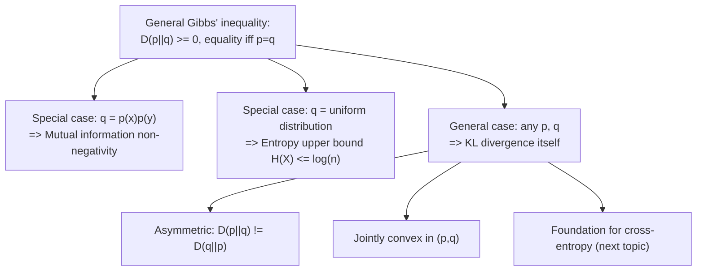

## Kullback-Leibler Divergence

### Overview

Kullback-Leibler (KL) divergence, also called relative entropy, measures how different one probability distribution is from another — specifically, how much is "lost" or how surprising it is when a distribution $q$ is used as an approximation for the true distribution $p$. It generalizes and unifies several quantities already covered: mutual information was shown to be a special case of KL divergence, and the earlier entropy upper-bound proof relied on a special case of KL divergence non-negativity. KL divergence is also the foundation for cross-entropy, a quantity central to statistical estimation and machine learning applications built on information theory.

### Definition

For two probability distributions $p(x)$ and $q(x)$ defined over the same discrete alphabet $\mathcal{X}$, the **Kullback-Leibler divergence** from $q$ to $p$ (or "of $p$ from $q$") is:

$$D(p \| q) = \sum_{x \in \mathcal{X}} p(x) \log \frac{p(x)}{q(x)}$$

Equivalently, using expectation notation, following the same "expectation of a log-probability expression" pattern used throughout:

$$D(p\|q) = E_p\left[\log \frac{p(X)}{q(X)}\right]$$

The expectation is taken with respect to $p$, the *true* or *reference* distribution — this asymmetry in which distribution the expectation uses is the source of a critical property established below. By convention, $0 \log \frac{0}{q(x)} = 0$ (matching the earlier entropy convention), and $D(p\|q)$ is defined to be $+\infty$ if there exists some $x$ with $p(x) > 0$ but $q(x) = 0$ — a case where $p$ assigns positive probability to an outcome $q$ considers impossible, which is treated as infinitely surprising/divergent.

### Interpretation

KL divergence has several complementary readings:

- **Expected excess surprisal**: if the true distribution is $p$, but self-information is computed using the (possibly wrong) distribution $q$, then $D(p\|q)$ is exactly the *expected* extra number of bits incurred, on average, from using $q$'s log-probabilities instead of $p$'s own. This is made precise in the next section via the cross-entropy decomposition.
- **A directed measure of distributional difference**: $D(p\|q)$ answers "how surprised would I be, on average, if I believed $q$ but reality follows $p$?" — not a symmetric notion of distance, but a directed measure of mismatch from the perspective of the true distribution $p$.
- **Coding-theoretic cost of a mismatched code**: [Inference] this interpretation, developed fully once source coding is introduced, casts $D(p\|q)$ as exactly the extra average codeword length incurred by designing an optimal code for the wrong distribution $q$ when the actual source follows $p$; this reading is a standard operational interpretation of KL divergence in the coding-theoretic literature, though its full justification depends on results (the source coding theorem) not yet established at this point in the material.

### Worked Example

**Example**

Let $p = (0.5, 0.5)$ and $q = (0.9, 0.1)$ over a binary alphabet $\{0,1\}$.

$$D(p\|q) = 0.5\log_2\frac{0.5}{0.9} + 0.5\log_2\frac{0.5}{0.1}$$

$$= 0.5\log_2(0.5556) + 0.5\log_2(5) \approx 0.5(-0.848) + 0.5(2.322) \approx -0.424 + 1.161 \approx 0.737 \text{ bits}$$

Now compute the divergence in the *other* direction, $D(q\|p)$:

$$D(q\|p) = 0.9\log_2\frac{0.9}{0.5} + 0.1\log_2\frac{0.1}{0.5} = 0.9\log_2(1.8) + 0.1\log_2(0.2)$$

$$\approx 0.9(0.848) + 0.1(-2.322) \approx 0.763 - 0.232 \approx 0.531 \text{ bits}$$

Since $0.737 \neq 0.531$, this confirms directly that **$D(p\|q) \neq D(q\|p)$ in general**.

### Property 1: Non-Negativity (Gibbs' Inequality)

**Statement**: $D(p\|q) \geq 0$ for any two distributions $p, q$ over the same alphabet, with equality if and only if $p = q$ everywhere (i.e., $p(x)=q(x)$ for all $x$).

**Proof**: This is the identical Jensen's-inequality argument used earlier for mutual information non-negativity, applied to general $p$ and $q$ rather than specifically to $p(x,y)$ versus $p(x)p(y)$:

$$-D(p\|q) = \sum_x p(x)\log\frac{q(x)}{p(x)} = E_p\left[\log\frac{q(X)}{p(X)}\right] \leq \log E_p\left[\frac{q(X)}{p(X)}\right] = \log\sum_x p(x)\cdot\frac{q(x)}{p(x)} = \log\sum_x q(x) = \log 1 = 0$$

using concavity of $\log$ (Jensen's inequality) in the middle step, and the fact that $q$, being a valid probability distribution, sums to 1. Therefore $D(p\|q) \geq 0$. Equality in Jensen's inequality requires $\frac{q(x)}{p(x)}$ constant over all $x$ with $p(x)>0$; since both distributions sum to 1, that constant must be exactly 1, forcing $p(x)=q(x)$ everywhere. $\blacksquare$

This result — often called **Gibbs' inequality** in its general form — is the single proof underlying *every* non-negativity result established so far: mutual information non-negativity (the special case $p=p(x,y)$, $q=p(x)p(y)$) and the entropy upper bound $H(X)\leq\log n$ (the special case $p=p(x)$, $q=$ uniform distribution) are both direct instances of this one general theorem.

### Property 2: Asymmetry

As demonstrated numerically above, $D(p\|q) \neq D(q\|p)$ in general. This means KL divergence is **not a true metric or distance function** in the mathematical sense — it fails the symmetry axiom that any valid distance measure must satisfy (along with, generally, the triangle inequality as well). This is precisely why it is called a "divergence" rather than a "distance."

**Practical consequence of asymmetry**: $D(p\|q)$ heavily penalizes cases where $q(x)$ is small but $p(x)$ is not (since $\log\frac{p(x)}{q(x)}$ becomes very large), while being comparatively insensitive to cases where $q(x)$ is large but $p(x)$ is small. This asymmetry has direct practical implications in applications like variational inference and generative modeling, where the choice of which distribution plays the role of $p$ versus $q$ meaningfully changes which kind of approximation error is penalized more heavily.

### Property 3: Convexity

$D(p\|q)$ is a jointly convex function of the pair $(p,q)$ — that is, for two pairs of distributions $(p_1,q_1)$ and $(p_2,q_2)$ and any $\lambda \in [0,1]$:

$$D(\lambda p_1 + (1-\lambda)p_2 \,\|\, \lambda q_1 + (1-\lambda)q_2) \leq \lambda D(p_1\|q_1) + (1-\lambda)D(p_2\|q_2)$$

[Unverified — depends on formal proof technique] This joint convexity result is standard in information theory references and is typically proved using the log-sum inequality, a specialized consequence of the concavity of $\log$ applied to sums of ratios; the full derivation is more involved than the basic non-negativity proof and is usually treated as a separate, more advanced result.

### KL Divergence and Mutual Information Revisited

The earlier identification of mutual information as a KL divergence is now recognizable as a direct special case:

$$I(X;Y) = D\big(p(x,y) \,\|\, p(x)p(y)\big)$$

Every property just established for KL divergence in general — non-negativity, the precise equality condition, joint convexity — applies immediately to mutual information as a corollary, without needing separate proof. This is a concrete illustration of why building the general theory of KL divergence, even after mutual information has already been introduced, adds genuine value: it retroactively explains *why* mutual information behaves the way it does, as an instance of a broader and more fundamental structural property of probability distributions.

### KL Divergence Asymmetry Visualized

<svg xmlns="http://www.w3.org/2000/svg" viewBox="0 0 700 340">
  <text x="350" y="26" text-anchor="middle" font-size="18" font-weight="bold" fill="#1a1a1a">KL Divergence Is Asymmetric (svg_diagram)</text>

  <rect x="60" y="60" width="260" height="100" rx="8" fill="#4C78A8" fill-opacity="0.75" />
  <text x="190" y="90" text-anchor="middle" font-size="13" fill="white" font-weight="bold">D(p||q) ≈ 0.737 bits</text>
  <text x="190" y="112" text-anchor="middle" font-size="11" fill="white">p=(0.5,0.5), q=(0.9,0.1)</text>
  <text x="190" y="130" text-anchor="middle" font-size="11" fill="white">Expectation under p</text>
  <text x="190" y="148" text-anchor="middle" font-size="11" fill="white">(the true/reference distribution)</text>

  <rect x="380" y="60" width="260" height="100" rx="8" fill="#E45756" fill-opacity="0.75" />
  <text x="510" y="90" text-anchor="middle" font-size="13" fill="white" font-weight="bold">D(q||p) ≈ 0.531 bits</text>
  <text x="510" y="112" text-anchor="middle" font-size="11" fill="white">q=(0.9,0.1), p=(0.5,0.5)</text>
  <text x="510" y="130" text-anchor="middle" font-size="11" fill="white">Expectation under q</text>
  <text x="510" y="148" text-anchor="middle" font-size="11" fill="white">(now the reference distribution)</text>

  <path d="M 320 110 L 380 110" stroke="#333" stroke-width="1.5" stroke-dasharray="4,3" />
  <text x="350" y="100" text-anchor="middle" font-size="11" fill="#333">≠</text>

  <text x="350" y="210" text-anchor="middle" font-size="12" font-weight="bold" fill="#333">Different numerical results confirm asymmetry</text>
  <text x="350" y="235" text-anchor="middle" font-size="11" fill="#555">KL divergence is a directed measure, not a true distance metric</text>
  <text x="350" y="260" text-anchor="middle" font-size="11" fill="#555">(fails the symmetry axiom required of a metric)</text>
</svg>

### Structural Relationships Summary

### Key Points

- **KL divergence** $D(p\|q) = \sum_x p(x)\log\frac{p(x)}{q(x)} = E_p\left[\log\frac{p(X)}{q(X)}\right]$ measures the directed divergence of distribution $q$ from the true/reference distribution $p$.
- **Gibbs' inequality**, $D(p\|q)\geq 0$ with equality iff $p=q$, is the single general theorem underlying both the entropy upper bound and mutual information non-negativity as special cases.
- KL divergence is **asymmetric** ($D(p\|q)\neq D(q\|p)$ in general) and therefore **not a true distance metric**, despite being commonly used to measure "distributional difference."
- KL divergence is **jointly convex** in the pair $(p,q)$, a property used in more advanced optimization and estimation contexts.
- Mutual information is exactly the special case $I(X;Y) = D(p(x,y)\,\|\,p(x)p(y))$, meaning every KL divergence property applies to mutual information automatically.

**Related Topics**

- Cross-entropy and its decomposition in terms of entropy and KL divergence
- The log-sum inequality
- Maximum entropy principle as KL-divergence minimization
- Rate-distortion theory
- Differential KL divergence for continuous distributions
- Fisher information and its relation to KL divergence (local curvature)
- Applications in statistical estimation and machine learning (e.g., variational inference)