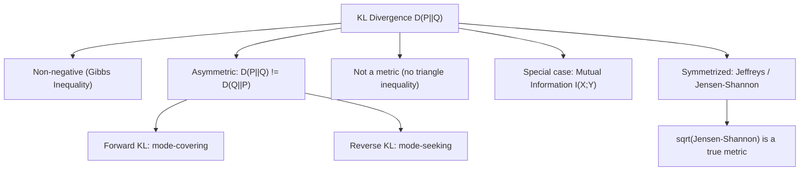

## Properties and Asymmetry of KL Divergence

### Definition Recap

The Kullback-Leibler (KL) divergence between two probability distributions $P$ and $Q$ defined over the same alphabet $\mathcal{X}$ is:

$$D(P \| Q) = \sum_{x \in \mathcal{X}} P(x) \log \frac{P(x)}{Q(x)}$$

For continuous distributions, the sum is replaced by an integral:

$$D(P \| Q) = \int_{-\infty}^{\infty} p(x) \log \frac{p(x)}{q(x)} \, dx$$

KL divergence is also called relative entropy. It measures how much a distribution $Q$ diverges from a reference distribution $P$, expressed in bits (log base 2) or nats (log base $e$), depending on convention.

### Core Properties

**Non-negativity (Gibbs' Inequality)**

$$D(P \| Q) \geq 0$$

with equality if and only if $P(x) = Q(x)$ for all $x$ where $P(x) > 0$. This follows from Jensen's inequality applied to the concave function $\log$:

$$-D(P\|Q) = \sum_x P(x) \log \frac{Q(x)}{P(x)} \leq \log \sum_x P(x)\frac{Q(x)}{P(x)} = \log \sum_x Q(x) \leq \log 1 = 0$$

The proof relies on $Q$ being a valid probability distribution, so $\sum_x Q(x) \leq 1$ (equality when $Q$ has the same support as $P$).

**Not a True Metric**

Despite behaving like a "distance" in an intuitive sense, KL divergence violates two axioms required of a metric:

- It is not symmetric: $D(P\|Q) \neq D(Q\|P)$ in general.
- It does not satisfy the triangle inequality: there is no general guarantee that $D(P\|R) \leq D(P\|Q) + D(Q\|R)$.

Because of this, KL divergence is more accurately described as a **directed divergence** or a premetric, not a distance.

**Convexity**

$D(P\|Q)$ is jointly convex in the pair $(P, Q)$. That is, for two pairs of distributions $(P_1, Q_1)$ and $(P_2, Q_2)$, and $\lambda \in [0,1]$:

$$D(\lambda P_1 + (1-\lambda)P_2 \,\|\, \lambda Q_1 + (1-\lambda)Q_2) \leq \lambda D(P_1\|Q_1) + (1-\lambda) D(P_2\|Q_2)$$

This property underlies convergence proofs for algorithms like the EM algorithm and Blahut-Arimoto.

**Additivity for Independent Distributions**

If $P = P_1 \times P_2$ and $Q = Q_1 \times Q_2$ are product distributions over independent random variables, then:

$$D(P_1 \times P_2 \,\|\, Q_1 \times Q_2) = D(P_1\|Q_1) + D(P_2\|Q_2)$$

**Chain Rule for KL Divergence**

For joint distributions over $(X, Y)$:

$$D(P(x,y) \| Q(x,y)) = D(P(x)\|Q(x)) + \sum_x P(x) \, D(P(y|x)\|Q(y|x))$$

This mirrors the chain rule for entropy and is central to deriving data-processing inequalities.

**Invariance Under Support Mismatch**

$D(P\|Q)$ is only well-defined when $P$ is absolutely continuous with respect to $Q$ — meaning $Q(x) = 0 \implies P(x) = 0$ for all $x$. If there exists an $x$ with $P(x) > 0$ and $Q(x) = 0$, the divergence is conventionally taken to be $+\infty$, since the log-ratio term is undefined and diverges.

### Why KL Divergence Is Asymmetric

The asymmetry is not an incidental technical quirk — it reflects a real semantic difference in what $D(P\|Q)$ and $D(Q\|P)$ each penalize.

**Interpretation via Coding Theory**

$D(P\|Q)$ represents the expected number of extra bits needed to encode samples from the true distribution $P$ using a code optimized for $Q$ instead. Swapping the roles of $P$ and $Q$ changes which distribution is treated as "ground truth" and which is the "model," so there is no reason to expect the same penalty in both directions.

**Mode-Covering vs. Mode-Seeking Behavior**

Consider minimizing $D(P\|Q)$ versus $D(Q\|P)$ with respect to $Q$, holding $P$ fixed (this arises directly in variational inference and generative modeling):

- Minimizing $D(P\|Q)$ (forward KL) forces $Q(x) > 0$ wherever $P(x) > 0$, because $P(x)\log(P(x)/Q(x))$ blows up if $Q(x) \to 0$ while $P(x) > 0$. This produces **mode-covering** (mean-seeking) behavior: $Q$ spreads mass to cover all regions where $P$ has support, even at the cost of putting mass in low-probability regions of $P$.
- Minimizing $D(Q\|P)$ (reverse KL) instead penalizes $Q$ for placing mass where $P(x) = 0$, but tolerates $Q(x) = 0$ in regions where $P(x) > 0$. This produces **mode-seeking** (zero-forcing) behavior: $Q$ tends to lock onto a single dominant mode of $P$ and ignore others.

This distinction has direct practical consequences: variational autoencoders and standard variational inference typically minimize reverse KL $D(Q\|P)$, which is one reason approximate posteriors from these methods often underestimate the variance or multimodality of the true posterior.

**Numeric Illustration**

Let $P$ be a mixture of two well-separated Gaussians (bimodal) and let $Q$ be constrained to be a single Gaussian.

- Forward KL $D(P\|Q)$: minimized by placing $Q$'s single mode between $P$'s two modes, covering both. Resulting $Q$ has larger variance than either component of $P$.
- Reverse KL $D(Q\|P)$: minimized by collapsing $Q$ onto one of $P$'s two modes, since spreading between modes would place mass in the low-density valley of $P$, which reverse KL penalizes heavily.

Here is a diagram of this behavior:

<svg xmlns="http://www.w3.org/2000/svg" viewBox="0 0 720 380">
  \<style\>
    .lbl { font-family: 'Georgia', serif; font-size: 14px; fill: #2b2b2b; }
    .small { font-family: 'Georgia', serif; font-size: 12px; fill: #555; }
    .title { font-family: 'Georgia', serif; font-size: 16px; fill: #1a1a1a; font-weight: bold; }
  \</style\>
  <text x="360" y="26" text-anchor="middle" class="title">Forward vs. Reverse KL Minimization (svg_diagram)</text>

  
  <text x="180" y="55" text-anchor="middle" class="lbl">Forward KL: D(P || Q)</text>
  <line x1="40" y1="170" x2="340" y2="170" stroke="#333" stroke-width="1.5" />
  
  <path d="M 40 170 C 80 170, 90 80, 120 80 C 150 80, 160 170, 190 170 C 220 170, 230 80, 260 80 C 290 80, 300 170, 340 170" fill="none" stroke="#c0392b" stroke-width="2" stroke-dasharray="5,4" />
  
  <path d="M 40 170 C 90 170, 130 95, 190 95 C 250 95, 290 170, 340 170" fill="none" stroke="#2471a3" stroke-width="2.5" />
  <text x="130" y="70" class="small" fill="#c0392b">P (true, bimodal)</text>
  <text x="190" y="200" class="small" fill="#2471a3">Q (wide, covers both modes)</text>

  
  <text x="540" y="55" text-anchor="middle" class="lbl">Reverse KL: D(Q || P)</text>
  <line x1="400" y1="170" x2="700" y2="170" stroke="#333" stroke-width="1.5" />
  <path d="M 400 170 C 440 170, 450 80, 480 80 C 510 80, 520 170, 550 170 C 580 170, 590 80, 620 80 C 650 80, 660 170, 700 170" fill="none" stroke="#c0392b" stroke-width="2" stroke-dasharray="5,4" />
  
  <path d="M 440 170 C 460 170, 470 90, 490 90 C 510 90, 520 170, 540 170" fill="none" stroke="#2471a3" stroke-width="2.5" />
  <text x="490" y="70" class="small" fill="#c0392b">P (true, bimodal)</text>
  <text x="460" y="200" class="small" fill="#2471a3">Q (locks onto one mode)</text>

  <text x="360" y="250" text-anchor="middle" class="small" fill="#333">Forward KL spreads Q to cover all of P's support (mean-seeking).</text>
  <text x="360" y="270" text-anchor="middle" class="small" fill="#333">Reverse KL concentrates Q on a single mode, avoiding P's low-density valley (mode-seeking).</text>

  <rect x="40" y="310" width="20" height="4" fill="#c0392b" />
  <text x="70" y="316" class="small">True distribution P</text>
  <rect x="220" y="310" width="20" height="4" fill="#2471a3" />
  <text x="250" y="316" class="small">Approximation Q</text>
</svg>

### Symmetrized Variants

Because raw KL divergence is asymmetric, several symmetrized alternatives are used when a true distance-like measure is needed.

**Jeffreys Divergence**

$$D_J(P, Q) = D(P\|Q) + D(Q\|P)$$

Symmetric by construction, but still not a metric (fails the triangle inequality) and can still be unbounded if either directional term diverges.

**Jensen-Shannon Divergence**

Defined using the mixture distribution $M = \frac{1}{2}(P + Q)$:

$$D_{JS}(P, Q) = \frac{1}{2} D(P\|M) + \frac{1}{2} D(Q\|M)$$

The Jensen-Shannon divergence is symmetric, always finite (bounded between 0 and $\log 2$ in bits), and its square root satisfies the triangle inequality, making $\sqrt{D_{JS}}$ a true metric. This is why Jensen-Shannon divergence is preferred in applications like comparing generative model outputs (e.g., the original GAN objective is related to $D_{JS}$).

### Relationship to Other Information-Theoretic Quantities

**Mutual Information as a KL Divergence**

Mutual information is a special case of KL divergence between the joint distribution and the product of marginals:

$$I(X;Y) = D\big(P(x,y) \,\|\, P(x)P(y)\big)$$

This immediately inherits non-negativity ($I(X;Y) \geq 0$) directly from Gibbs' inequality, with equality if and only if $X$ and $Y$ are independent.

**Cross-Entropy Decomposition**

KL divergence connects entropy $H$ and cross-entropy $H(P, Q)$:

$$D(P\|Q) = H(P, Q) - H(P)$$

where $H(P,Q) = -\sum_x P(x)\log Q(x)$. This decomposition is the basis for using KL divergence (equivalently, cross-entropy, since $H(P)$ is constant with respect to $Q$) as a loss function in classification and generative modeling.

### Practical Example

Suppose $P = (0.5, 0.5)$ and $Q = (0.9, 0.1)$ over a binary alphabet.

$$D(P\|Q) = 0.5 \log_2\frac{0.5}{0.9} + 0.5\log_2\frac{0.5}{0.1} \approx 0.5(-0.848) + 0.5(2.322) \approx 0.737 \text{ bits}$$

$$D(Q\|P) = 0.9 \log_2\frac{0.9}{0.5} + 0.1\log_2\frac{0.1}{0.5} \approx 0.9(0.848) + 0.1(-2.322) \approx 0.531 \text{ bits}$$

The two values, $0.737$ versus $0.531$ bits, confirm $D(P\|Q) \neq D(Q\|P)$ numerically. [Inference] The direction of the gap (which of the two is larger) depends on the specific distributions chosen and does not follow a fixed rule in general.

### Flow of Relationships

### Next Steps

- **Jensen-Shannon Divergence** — full derivation, boundedness proof, and its use in GAN training objectives
- **f-Divergences** — the general family unifying KL, total variation, Hellinger distance, and chi-squared divergence
- **Data Processing Inequality** — how KL divergence and mutual information behave under Markov chains
- **Variational Inference** — practical consequences of forward vs. reverse KL minimization in ELBO optimization
- **Fisher Information and the Local Geometry of KL Divergence** — second-order (Taylor) expansion of KL divergence near $P = Q$
- **Rényi Divergence** — a parameterized generalization of KL divergence