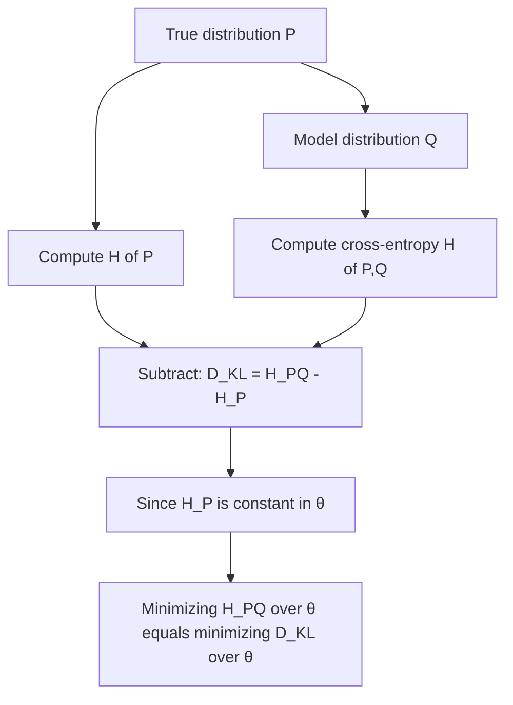

## Cross-Entropy and Its Relation to KL Divergence

### Definition of Cross-Entropy

Cross-entropy measures the average number of bits needed to encode data drawn from a true distribution $P$ when using a code optimized for a different, assumed distribution $Q$. For discrete distributions over the same support, it is defined as:

$$H(P, Q) = -\sum_{x} P(x) \log Q(x)$$

For continuous random variables, the summation becomes an integral:

$$H(P, Q) = -\int P(x) \log Q(x) \, dx$$

Here, $P(x)$ is the true (data-generating) distribution, and $Q(x)$ is the model or approximating distribution. The logarithm base determines the unit: base 2 gives bits, base $e$ gives nats.

### Relationship to Shannon Entropy

Ordinary Shannon entropy $H(P)$ is the special case of cross-entropy where the coding distribution matches the true distribution:

$$H(P) = H(P, P) = -\sum_x P(x) \log P(x)$$

Cross-entropy $H(P, Q)$ is always at least as large as $H(P)$ when $Q \neq P$, because using the "wrong" distribution to build a code introduces inefficiency. This gap is precisely what KL divergence captures.

### Deriving the Relationship to KL Divergence

KL divergence, $D_{KL}(P \parallel Q)$, quantifies the extra bits needed on average when encoding samples from $P$ using a code built for $Q$, relative to using the optimal code for $P$:

$$D_{KL}(P \parallel Q) = \sum_x P(x) \log \frac{P(x)}{Q(x)}$$

Expanding this expression algebraically:

$$D_{KL}(P \parallel Q) = \sum_x P(x) \log P(x) - \sum_x P(x) \log Q(x)$$

$$D_{KL}(P \parallel Q) = -H(P) + H(P, Q)$$

Rearranging gives the core identity linking the three quantities:

$$H(P, Q) = H(P) + D_{KL}(P \parallel Q)$$

**Key Points**
- Cross-entropy decomposes into two additive parts: the irreducible entropy of the true distribution, and the "penalty" for using an imperfect model.
- $D_{KL}(P \parallel Q) \geq 0$ always (Gibbs' inequality), with equality if and only if $P = Q$ almost everywhere.
- Consequently, $H(P, Q) \geq H(P)$ always holds, confirming that no distribution mismatch can reduce the coding cost below the true entropy.

### Intuition: Two Sources of Cost

When $Q \neq P$, the total cross-entropy cost has two components:
1. **Intrinsic uncertainty** — $H(P)$, the cost that exists even with perfect knowledge of $P$, arising purely from the randomness in the data itself.
2. **Model mismatch penalty** — $D_{KL}(P \parallel Q)$, the additional cost purely attributable to using $Q$ instead of $P$.

This decomposition explains why cross-entropy is a strictly worse (or equal) measure of "coding efficiency" than entropy alone, and why minimizing cross-entropy and minimizing KL divergence become equivalent optimization problems in many practical settings.

### Why This Matters for Machine Learning

In most supervised learning setups (e.g., classification with softmax outputs), the true distribution $P$ is the fixed empirical label distribution (typically a one-hot vector or dataset-derived distribution), and $Q$ is the model's predicted distribution, parameterized by weights $\theta$.

Because $H(P)$ does not depend on the model parameters $\theta$, minimizing cross-entropy loss with respect to $\theta$ is mathematically identical to minimizing KL divergence with respect to $\theta$:

$$\arg\min_{\theta} H(P, Q_\theta) = \arg\min_{\theta} \left[ H(P) + D_{KL}(P \parallel Q_\theta) \right] = \arg\min_{\theta} D_{KL}(P \parallel Q_\theta)$$

This is why cross-entropy loss is used ubiquitously in classification tasks: it is computationally simpler (avoiding an explicit $\log P(x)$ term that may be degenerate for one-hot labels, since $0 \log 0$ is defined as $0$ by convention) while optimizing the exact same objective as KL divergence minimization.

**Example**
Suppose a true label distribution is one-hot: $P = [1, 0, 0]$ for a 3-class problem, and a model predicts $Q = [0.7, 0.2, 0.1]$.

Cross-entropy:
$$H(P, Q) = -(1 \cdot \log 0.7 + 0 \cdot \log 0.2 + 0 \cdot \log 0.1) = -\log 0.7 \approx 0.357 \text{ nats}$$

Since $H(P) = 0$ for a one-hot (deterministic) distribution, the entire cross-entropy value equals the KL divergence in this case:
$$D_{KL}(P \parallel Q) = H(P, Q) - H(P) = 0.357 - 0 = 0.357 \text{ nats}$$

This illustrates why, for hard-label classification, cross-entropy loss and KL divergence loss produce numerically identical gradients with respect to model parameters.

### Asymmetry and Non-Metric Properties

Both cross-entropy and KL divergence inherit the same asymmetry: $H(P, Q) \neq H(Q, P)$ in general, and $D_{KL}(P \parallel Q) \neq D_{KL}(Q \parallel P)$. This means neither functions as a true distance metric — the triangle inequality does not hold, and swapping the "true" and "model" roles changes the value and its interpretation (forward KL vs. reverse KL, each penalizing different kinds of mismatch between mass coverage and mode-seeking behavior).

### Diagram: Decomposition of Cross-Entropy

<svg xmlns="http://www.w3.org/2000/svg" viewBox="0 0 640 220">
  <text x="320" y="24" font-size="15" font-family="sans-serif" text-anchor="middle" fill="#222" font-weight="bold">Cross-Entropy Decomposition (svg_diagram)</text>

  <rect x="60" y="70" width="220" height="60" fill="#a8d5ba" stroke="#333" stroke-width="1.5" />
  <text x="170" y="95" font-size="14" font-family="sans-serif" text-anchor="middle" fill="#111">H(P)</text>
  <text x="170" y="115" font-size="11" font-family="sans-serif" text-anchor="middle" fill="#333">Intrinsic entropy</text>

  <rect x="280" y="70" width="220" height="60" fill="#f4b183" stroke="#333" stroke-width="1.5" />
  <text x="390" y="95" font-size="14" font-family="sans-serif" text-anchor="middle" fill="#111">D_KL(P‖Q)</text>
  <text x="390" y="115" font-size="11" font-family="sans-serif" text-anchor="middle" fill="#333">Mismatch penalty</text>

  <rect x="60" y="160" width="440" height="40" fill="none" stroke="#333" stroke-width="1.5" stroke-dasharray="4,3" />
  <text x="280" y="185" font-size="14" font-family="sans-serif" text-anchor="middle" fill="#111">H(P, Q) = H(P) + D_KL(P‖Q)</text>

  <line x1="170" y1="130" x2="170" y2="160" stroke="#333" stroke-width="1" />
  <line x1="390" y1="130" x2="390" y2="160" stroke="#333" stroke-width="1" />
</svg>

### Common Pitfalls

- Confusing cross-entropy with KL divergence as interchangeable in general — they only coincide in the constant-$H(P)$ optimization context described above, not as raw numerical values when $H(P) \neq 0$.
- Assuming symmetry — reversing $P$ and $Q$ changes both the cross-entropy and KL divergence values and their real-world meaning.
- Forgetting the $0 \log 0 = 0$ convention, which prevents undefined terms when probabilities are exactly zero in $P$.
- [Inference] In practice, numerical implementations often add a small epsilon to $Q(x)$ to avoid $\log(0)$ instability when the model assigns near-zero probability to the true class; exact epsilon values and clipping behavior vary by library and version.

### Process Flow: From KL Divergence to Cross-Entropy Loss

**Related Topics**
- Forward KL vs. Reverse KL divergence and mode-seeking vs. mode-covering behavior
- Jensen-Shannon divergence as a symmetrized alternative
- Cross-entropy loss in softmax classification and log-likelihood equivalence
- Perplexity as an exponentiated form of cross-entropy in language modeling
- f-divergences as a generalized family containing KL divergence
- Maximum likelihood estimation and its connection to cross-entropy minimization