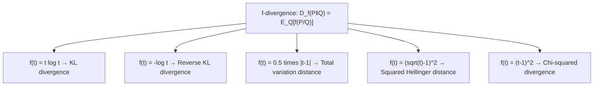

## f-Divergences

### Motivation

KL divergence, Jensen-Shannon divergence, and total variation distance all share a common structure: each measures a form of "distance" between two probability distributions by comparing their density ratio. The f-divergence framework generalizes this idea, showing that these seemingly distinct measures are all specific instances of a single family, parameterized by the choice of a convex function $f$.

### Definition

Given two probability distributions $P$ and $Q$ over the same space, and a convex function $f$ satisfying $f(1) = 0$, the f-divergence is defined as:

$$D_f(P \parallel Q) = \sum_x Q(x) \, f\left(\frac{P(x)}{Q(x)}\right)$$

For continuous distributions, the sum becomes an integral:

$$D_f(P \parallel Q) = \int Q(x) \, f\left(\frac{P(x)}{Q(x)}\right) dx$$

The requirement that $f$ be convex with $f(1) = 0$ ensures, via Jensen's inequality, that $D_f(P \parallel Q) \geq 0$ always, with equality when $P = Q$ almost everywhere.

### Why Convexity and f(1)=0 Matter

The condition $f(1) = 0$ guarantees that if $P(x) = Q(x)$ everywhere, the density ratio is always $1$, making every term in the sum zero. Convexity of $f$, combined with Jensen's inequality applied to the expectation under $Q$, guarantees the divergence is non-negative:

$$D_f(P \parallel Q) = \mathbb{E}_Q\left[f\left(\frac{P}{Q}\right)\right] \geq f\left(\mathbb{E}_Q\left[\frac{P}{Q}\right]\right) = f(1) = 0$$

This single inequality is the mathematical backbone that guarantees every member of the f-divergence family behaves as a proper (non-negative) divergence.

**Key Points**
- f-divergences are a parametric family: choosing a different convex $f$ yields a different named divergence.
- All f-divergences are non-negative and vanish exactly when $P = Q$.
- Most f-divergences are not symmetric and not true metrics, mirroring the behavior of KL divergence specifically.

### Recovering Known Divergences

Different choices of $f$ recover familiar divergences as special cases:

**KL Divergence**: Setting $f(t) = t \log t$ gives:
$$D_f(P\parallel Q) = \sum_x Q(x) \frac{P(x)}{Q(x)} \log\frac{P(x)}{Q(x)} = \sum_x P(x)\log\frac{P(x)}{Q(x)} = D_{KL}(P \parallel Q)$$

**Reverse KL Divergence**: Setting $f(t) = -\log t$ gives:
$$D_f(P \parallel Q) = \sum_x Q(x)\left(-\log\frac{P(x)}{Q(x)}\right) = \sum_x Q(x)\log\frac{Q(x)}{P(x)} = D_{KL}(Q \parallel P)$$

**Total Variation Distance**: Setting $f(t) = \frac{1}{2}|t - 1|$ gives:
$$D_f(P \parallel Q) = \frac{1}{2}\sum_x |P(x) - Q(x)| = D_{TV}(P, Q)$$

**Squared Hellinger Distance**: Setting $f(t) = (\sqrt{t} - 1)^2$ gives:
$$D_f(P \parallel Q) = \sum_x Q(x)\left(\sqrt{\frac{P(x)}{Q(x)}} - 1\right)^2 = \sum_x \left(\sqrt{P(x)} - \sqrt{Q(x)}\right)^2$$

**Chi-Squared Divergence**: Setting $f(t) = (t-1)^2$ gives:
$$D_f(P \parallel Q) = \sum_x \frac{(P(x) - Q(x))^2}{Q(x)}$$

**Jensen-Shannon Divergence**: Can also be expressed as an f-divergence with $f(t) = t\log\frac{2t}{t+1} + \log\frac{2}{t+1}$, though it is more commonly derived directly via the mixture construction covered previously.

### Diagram: The f-Divergence Family

### Data Processing Inequality for f-Divergences

A key structural property shared by all f-divergences is that they satisfy a data processing inequality: applying any (possibly stochastic) function or channel $T$ to both $P$ and $Q$ cannot increase divergence:

$$D_f(T(P) \parallel T(Q)) \leq D_f(P \parallel Q)$$

This generalizes the same data processing inequality familiar from mutual information, and reflects the intuitive idea that processing data can only destroy, never create, distinguishing information between two distributions.

**Example**
Consider $P = [0.6, 0.4]$ and $Q = [0.5, 0.5]$. Compute the chi-squared f-divergence using $f(t) = (t-1)^2$:

$$D_f(P\parallel Q) = \frac{(0.6-0.5)^2}{0.5} + \frac{(0.4-0.5)^2}{0.5} = \frac{0.01}{0.5} + \frac{0.01}{0.5} = 0.02 + 0.02 = 0.04$$

Compare this to the total variation distance for the same pair, using $f(t) = \frac{1}{2}|t-1|$:

$$D_{TV}(P,Q) = \frac{1}{2}(|0.6-0.5| + |0.4-0.5|) = \frac{1}{2}(0.1+0.1) = 0.1$$

The two divergences give different numerical values for the same distribution pair, illustrating that the choice of $f$ changes not just the formula but the sensitivity of the measure to specific kinds of discrepancy (chi-squared divergence penalizes relative deviations more sharply than total variation distance for large ratios).

### Variational Representation

Many f-divergences admit a variational (dual) representation, expressing the divergence as a supremum over a function class:

$$D_f(P \parallel Q) = \sup_{T} \left( \mathbb{E}_P[T(x)] - \mathbb{E}_Q[f^*(T(x))] \right)$$

where $f^*$ is the convex conjugate (Fenchel conjugate) of $f$. This representation underlies estimation techniques that approximate f-divergences using neural networks, since the supremum can be approximated by optimizing a parameterized function $T_\theta$ — this is the theoretical basis for f-GAN objectives, which generalize the original GAN framework to arbitrary f-divergences.

### Diagram: Convex Function and Jensen's Inequality

<svg xmlns="http://www.w3.org/2000/svg" viewBox="0 0 640 260">
  <text x="320" y="24" font-size="15" font-family="sans-serif" text-anchor="middle" fill="#222" font-weight="bold">Convexity Underlying f-Divergence Non-negativity (svg_diagram)</text>

  <line x1="60" y1="220" x2="580" y2="220" stroke="#333" stroke-width="1.2" />
  <line x1="60" y1="220" x2="60" y2="40" stroke="#333" stroke-width="1.2" />

  <path d="M 100 200 Q 320 40 540 200" fill="none" stroke="#4a7fc9" stroke-width="2.5" />

  <circle cx="180" cy="163" r="4" fill="#c0392b" />
  <circle cx="460" cy="163" r="4" fill="#c0392b" />
  <line x1="180" y1="163" x2="460" y2="163" stroke="#c0392b" stroke-width="1.5" stroke-dasharray="3,2" />

  <circle cx="320" cy="163" r="4" fill="#27ae60" />
  <circle cx="320" cy="86" r="4" fill="#27ae60" />
  <line x1="320" y1="163" x2="320" y2="86" stroke="#27ae60" stroke-width="1.2" stroke-dasharray="2,2" />

  <text x="320" y="240" font-size="12" font-family="sans-serif" text-anchor="middle" fill="#111">f(E[X]) ≤ E[f(X)] guarantees D_f ≥ 0</text>
</svg>

### Common Pitfalls

- Assuming all f-divergences are symmetric — most, including KL and chi-squared, are not; only specific choices of $f$ (e.g., leading to total variation or JS-style constructions) yield symmetry.
- Treating f-divergences as metrics by default — the triangle inequality generally fails; total variation distance is a notable exception that is a true metric.
- Assuming any convex function works — $f$ must be strictly convex at $t=1$ for the divergence to be strictly positive whenever $P \neq Q$; some choices only weakly satisfy convexity and lead to degenerate cases.
- [Inference] When estimating f-divergences from finite samples via the variational representation, the choice of function class for $T_\theta$ affects both bias and variance of the estimate, and different f-divergence choices are empirically known to have different sensitivity to outliers and tail behavior, though precise convergence rates depend on the specific estimator and sample regime used.

### Applications

- **Robust statistics**: Certain f-divergences (e.g., chi-squared) are used to construct minimax-robust hypothesis tests and estimators.
- **Generative modeling**: f-GANs generalize adversarial training to optimize arbitrary f-divergences between real and generated data distributions.
- **Information geometry**: f-divergences induce a Riemannian metric structure (via their second-order Taylor expansion near $P=Q$) connecting to the Fisher information metric.
- **Hypothesis testing**: f-divergences bound error exponents in binary hypothesis testing via Chernoff-Stein-type inequalities.

**Related Topics**
- Fisher information and its connection to the local behavior of f-divergences
- Total variation distance as a metric and its use in bounding statistical distinguishability
- Hellinger distance and its role in statistical estimation theory
- f-GAN framework and variational divergence minimization
- Rényi divergence as another generalized divergence family with a tunable order parameter
- Data processing inequality and its unifying role across divergence measures and mutual information