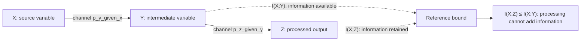

## Data Processing Inequality

### Statement

The data processing inequality (DPI) formalizes a fundamental intuition: no processing of data, deterministic or stochastic, can increase the amount of information that data contains about something else. If $X$, $Y$, and $Z$ form a Markov chain, denoted $X \to Y \to Z$ (meaning $Z$ depends on $X$ only through $Y$), then:

$$I(X ; Z) \leq I(X ; Y)$$

Equivalently stated for the other direction of the chain:

$$I(X ; Z) \leq I(Y ; Z)$$

The core message: transforming or processing $Y$ into $Z$ can only destroy or preserve information about $X$ — it can never create new information about $X$ that wasn't already present in $Y$.

### Markov Chain Precondition

The inequality requires the Markov chain condition $X \to Y \to Z$, meaning the joint distribution factors as:

$$p(x, y, z) = p(x) \, p(y \mid x) \, p(z \mid y)$$

This formalizes that $Z$ is generated from $Y$ alone (possibly stochastically) without any direct dependence on $X$ given $Y$. In other words, $X$ and $Z$ are conditionally independent given $Y$.

**Key Points**
- The DPI applies to any processing function or channel, deterministic or stochastic, applied to $Y$ to produce $Z$.
- Equality holds if and only if $Y$ is a sufficient statistic for $X$ with respect to $Z$ — that is, no information about $X$ relevant to predicting $Z$ is lost in the transformation.
- The DPI is not specific to mutual information alone; it generalizes to KL divergence and the broader f-divergence family covered previously.

### Proof Sketch

The DPI for mutual information follows directly from the chain rule of mutual information and the non-negativity of conditional mutual information. Starting from the chain rule applied to $I(X; Y, Z)$:

$$I(X; Y, Z) = I(X; Y) + I(X; Z \mid Y) = I(X; Z) + I(X; Y \mid Z)$$

Because $X \to Y \to Z$ forms a Markov chain, $X$ and $Z$ are conditionally independent given $Y$, so:

$$I(X; Z \mid Y) = 0$$

Substituting this into the chain rule expansion:

$$I(X; Y) = I(X; Z) + I(X; Y \mid Z)$$

Since conditional mutual information is always non-negative, $I(X; Y \mid Z) \geq 0$, it follows immediately that:

$$I(X; Y) \geq I(X; Z)$$

which is exactly the data processing inequality.

### Diagram: Markov Chain Structure

<svg xmlns="http://www.w3.org/2000/svg" viewBox="0 0 640 200">
  <text x="320" y="24" font-size="15" font-family="sans-serif" text-anchor="middle" fill="#222" font-weight="bold">Markov Chain X → Y → Z (svg_diagram)</text>

  <circle cx="100" cy="120" r="40" fill="#a8d5ba" stroke="#333" stroke-width="1.5" />
  <text x="100" y="126" font-size="16" font-family="sans-serif" text-anchor="middle" fill="#111">X</text>

  <circle cx="320" cy="120" r="40" fill="#f4b183" stroke="#333" stroke-width="1.5" />
  <text x="320" y="126" font-size="16" font-family="sans-serif" text-anchor="middle" fill="#111">Y</text>

  <circle cx="540" cy="120" r="40" fill="#c9b8e8" stroke="#333" stroke-width="1.5" />
  <text x="540" y="126" font-size="16" font-family="sans-serif" text-anchor="middle" fill="#111">Z</text>

  <line x1="140" y1="120" x2="280" y2="120" stroke="#333" stroke-width="2" />
  <polygon points="280,120 268,114 268,126" fill="#333" />

  <line x1="360" y1="120" x2="500" y2="120" stroke="#333" stroke-width="2" />
  <polygon points="500,120 488,114 488,126" fill="#333" />

  <text x="210" y="105" font-size="12" font-family="sans-serif" text-anchor="middle" fill="#333">p(y|x)</text>
  <text x="430" y="105" font-size="12" font-family="sans-serif" text-anchor="middle" fill="#333">p(z|y)</text>

  <text x="320" y="175" font-size="12" font-family="sans-serif" text-anchor="middle" fill="#555">I(X;Z) ≤ I(X;Y), since Z depends on X only through Y</text>
</svg>

### DPI for KL Divergence and f-Divergences

The data processing inequality is not unique to mutual information — it holds for KL divergence and, more generally, for the entire f-divergence family. If $T$ represents any stochastic transformation (channel) applied to two distributions $P$ and $Q$, producing induced distributions $T(P)$ and $T(Q)$:

$$D_{KL}(T(P) \parallel T(Q)) \leq D_{KL}(P \parallel Q)$$

$$D_f(T(P) \parallel T(Q)) \leq D_f(P \parallel Q)$$

This unifies the DPI as a single structural property of the entire divergence framework, not a special feature of mutual information alone. Intuitively, applying the same processing to both distributions can only make them harder (or equally easy) to distinguish, never easier.

**Example**
Suppose $X$ is a fair coin flip encoded as $0$ or $1$. Let $Y = X$ (perfect copy, so $I(X;Y) = 1$ bit). Now suppose $Z$ is generated by passing $Y$ through a binary symmetric channel with flip probability $p = 0.1$ — that is, $Z = Y$ with probability $0.9$ and $Z = 1-Y$ with probability $0.1$.

Because noise is added between $Y$ and $Z$, information is lost:
$$I(X;Z) = 1 - H_b(0.1) \approx 1 - 0.469 = 0.531 \text{ bits}$$

where $H_b(p)$ is the binary entropy function. This confirms $I(X;Z) \approx 0.531 < I(X;Y) = 1$, exactly as the DPI predicts — the noisy channel between $Y$ and $Z$ can only reduce, never increase, the information $Z$ retains about $X$.

### When Equality Holds

Equality $I(X;Z) = I(X;Y)$ holds precisely when $I(X; Y \mid Z) = 0$, meaning $Z$ is a sufficient statistic for $X$ — all information in $Y$ that is relevant to $X$ survives the transformation into $Z$. A simple case: if the processing step from $Y$ to $Z$ is an invertible (bijective) deterministic function, no information can possibly be lost, so equality holds automatically.

### Diagram: Information Flow and Loss

### Common Pitfalls

- Forgetting the Markov chain requirement — the DPI does not apply if $Z$ has a direct dependency on $X$ that bypasses $Y$; the inequality specifically requires conditional independence of $X$ and $Z$ given $Y$.
- Assuming the inequality is always strict — equality is common and expected whenever the processing step is invertible or otherwise loss-free with respect to the relevant information.
- Confusing "processing" with only deterministic functions — the DPI holds equally for stochastic channels (e.g., adding noise), not just deterministic transformations.
- [Inference] In practical machine learning pipelines (e.g., deep neural network layers viewed as a Markov chain of representations), the DPI is often invoked to argue that each layer can only lose task-relevant information relative to the input; however, whether this bound is tight or loose in any specific trained network depends on the architecture and learned parameters, and is not guaranteed by the inequality itself.

### Applications

- **Information bottleneck theory**: Uses the DPI to formalize a trade-off between compressing a representation and preserving task-relevant information across a chain of neural network layers.
- **Cryptography and secure communication**: The DPI underlies proofs that an eavesdropper cannot extract more information from a processed (encrypted) signal than existed in the original signal relative to a shared secret.
- **Statistical sufficiency**: Directly connects to the concept of a sufficient statistic in classical statistics — a sufficient statistic is exactly the case where the DPI holds with equality.
- **Channel coding theorems**: Used in converse proofs (impossibility results) in Shannon's channel coding theorem, bounding achievable rates by showing no processing scheme can exceed channel capacity.

**Related Topics**
- Sufficient statistics and the Fisher-Neyman factorization theorem
- Information bottleneck method in deep learning
- Markov chains and their role in information-theoretic proofs
- Channel capacity and the converse coding theorem
- Conditional mutual information and its chain rule decomposition
- Fano's inequality as a complementary bound on estimation error