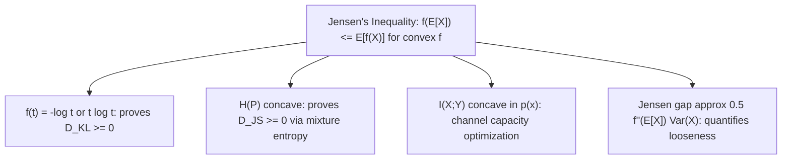

## Jensen's Inequality and Convexity

### Statement of Jensen's Inequality

Jensen's inequality relates the value of a convex function at an expectation to the expectation of the function's values. For a convex function $f$ and a random variable $X$:

$$f(\mathbb{E}[X]) \leq \mathbb{E}[f(X)]$$

For a concave function $g$, the inequality reverses:

$$g(\mathbb{E}[X]) \geq \mathbb{E}[g(X)]$$

Equality holds in both cases if and only if $f$ (or $g$) is affine on the support of $X$, or $X$ is degenerate (constant with probability 1).

### Convex and Concave Functions Defined

A function $f$ is convex on an interval if, for any two points $x_1, x_2$ in its domain and any $\lambda \in [0,1]$:

$$f(\lambda x_1 + (1-\lambda) x_2) \leq \lambda f(x_1) + (1-\lambda) f(x_2)$$

Geometrically, this means the line segment (chord) connecting any two points on the graph of $f$ lies on or above the graph itself. A function is concave if the inequality reverses, meaning the chord lies on or below the graph. If $f$ is twice differentiable, convexity corresponds to $f''(x) \geq 0$ everywhere, and concavity to $f''(x) \leq 0$ everywhere.

**Key Points**
- $\log(x)$ is concave, which is why $-\log(x)$ (used throughout information theory) is convex.
- $x \log x$ is convex, which directly underlies the non-negativity proof for KL divergence and f-divergences.
- Jensen's inequality is the single most-used inequality across information-theoretic proofs, including entropy bounds, divergence non-negativity, and channel capacity results.

### Diagram: Convex Function and Jensen's Inequality

<svg xmlns="http://www.w3.org/2000/svg" viewBox="0 0 640 260">
  <text x="320" y="24" font-size="15" font-family="sans-serif" text-anchor="middle" fill="#222" font-weight="bold">Jensen's Inequality for a Convex Function (svg_diagram)</text>

  <line x1="60" y1="220" x2="580" y2="220" stroke="#333" stroke-width="1.2" />
  <line x1="60" y1="220" x2="60" y2="40" stroke="#333" stroke-width="1.2" />

  <path d="M 100 200 Q 320 40 540 200" fill="none" stroke="#4a7fc9" stroke-width="2.5" />

  <line x1="180" y1="163" x2="460" y2="130" stroke="#c0392b" stroke-width="1.5" stroke-dasharray="3,2" />
  <circle cx="180" cy="163" r="4" fill="#c0392b" />
  <circle cx="460" cy="130" r="4" fill="#c0392b" />

  <circle cx="320" cy="146" r="4" fill="#e67e22" />
  <text x="335" y="142" font-size="11" font-family="sans-serif" fill="#e67e22">E[f(X)] (on chord)</text>

  <circle cx="320" cy="86" r="4" fill="#27ae60" />
  <text x="335" y="90" font-size="11" font-family="sans-serif" fill="#27ae60">f(E[X]) (on curve)</text>

  <line x1="320" y1="146" x2="320" y2="86" stroke="#555" stroke-width="1" stroke-dasharray="2,2" />

  <text x="320" y="240" font-size="12" font-family="sans-serif" text-anchor="middle" fill="#111">f(E[X]) ≤ E[f(X)] for convex f</text>
</svg>

### Proof Sketch (Discrete Case)

For a convex function $f$ and a discrete random variable $X$ taking values $x_1, \ldots, x_n$ with probabilities $p_1, \ldots, p_n$, Jensen's inequality can be proven by induction using the two-point definition of convexity. The base case with two points is the convexity definition itself:

$$f(p_1 x_1 + p_2 x_2) \leq p_1 f(x_1) + p_2 f(x_2), \quad p_1 + p_2 = 1$$

Extending inductively to $n$ points, assume the inequality holds for $n-1$ points. Group the first $n-1$ terms using their combined weight $q = \sum_{i=1}^{n-1} p_i$, and apply the two-point case combined with the inductive hypothesis on the grouped term. This chain of applications generalizes the inequality to any finite mixture, and by a standard limiting/measure-theoretic argument, to continuous distributions as well.

### Applications Across Information Theory

**Non-negativity of KL Divergence**: As shown in the earlier discussion of cross-entropy and f-divergences, applying Jensen's inequality to the convex function $f(t) = -\log t$ (or equivalently $t \log t$) directly proves $D_{KL}(P \parallel Q) \geq 0$:

$$D_{KL}(P\parallel Q) = \sum_x P(x)\log\frac{P(x)}{Q(x)} = -\sum_x P(x)\log\frac{Q(x)}{P(x)} \geq -\log\sum_x P(x)\frac{Q(x)}{P(x)} = -\log 1 = 0$$

**Concavity of Entropy**: Shannon entropy $H(P)$ is a concave function of the distribution $P$. This directly underlies the Jensen-Shannon divergence identity discussed earlier, where $D_{JS}(P \parallel Q) = H(M) - \frac{1}{2}H(P) - \frac{1}{2}H(Q) \geq 0$ follows exactly from concavity of $H$.

**Data Processing and Channel Capacity**: Convexity/concavity arguments underlie proofs that mutual information $I(X;Y)$ is concave in the input distribution $p(x)$ for fixed channel $p(y|x)$, and convex in the channel $p(y|x)$ for fixed input distribution — a structural fact used in channel capacity optimization.

**Example**
Let $X$ take values $\{1, 4, 9\}$ each with probability $\frac{1}{3}$, and consider the convex function $f(x) = x^2$.

Compute $\mathbb{E}[X]$:
$$\mathbb{E}[X] = \frac{1}{3}(1 + 4 + 9) = \frac{14}{3} \approx 4.667$$

Compute $f(\mathbb{E}[X])$:
$$f(\mathbb{E}[X]) = \left(\frac{14}{3}\right)^2 = \frac{196}{9} \approx 21.78$$

Compute $\mathbb{E}[f(X)]$:
$$\mathbb{E}[f(X)] = \frac{1}{3}(1^2 + 4^2 + 9^2) = \frac{1}{3}(1+16+81) = \frac{98}{3} \approx 32.67$$

Since $21.78 \leq 32.67$, Jensen's inequality is confirmed for this example, with a substantial gap reflecting the significant spread (variance) in $X$'s distribution — the size of this gap is closely related to the variance of $X$ under $f(x)=x^2$, since for this specific case $\mathbb{E}[X^2] - (\mathbb{E}[X])^2$ is exactly the variance.

### The Jensen Gap and Its Relation to Variance

The difference between the two sides of Jensen's inequality, $\mathbb{E}[f(X)] - f(\mathbb{E}[X])$, is called the Jensen gap. For a twice-differentiable convex $f$, a second-order Taylor expansion around $\mathbb{E}[X]$ shows the gap is approximately proportional to the variance of $X$ scaled by the local curvature of $f$:

$$\mathbb{E}[f(X)] - f(\mathbb{E}[X]) \approx \frac{1}{2} f''(\mathbb{E}[X]) \, \text{Var}(X)$$

This approximation clarifies an important intuition: Jensen's inequality becomes tighter (closer to equality) as $X$ becomes less spread out (lower variance), and as $f$ becomes less curved (closer to linear/affine) near $\mathbb{E}[X]$.

### Diagram: Role of Jensen's Inequality Across Information Theory

### Common Pitfalls

- Applying Jensen's inequality with the wrong direction — convex functions give $f(\mathbb{E}[X]) \leq \mathbb{E}[f(X)]$, while concave functions reverse this; mixing these up is a common source of sign errors in derivations.
- Assuming strict inequality always holds — equality is guaranteed whenever $X$ is constant (zero variance) or $f$ is affine on the relevant domain, both of which occur in edge cases like $P = Q$ in divergence proofs.
- Forgetting that convexity is a global property over the relevant domain — a function convex on one interval may not be convex elsewhere, so the inequality must be applied only within the valid domain.
- [Inference] The tightness of the Jensen gap approximation using the variance term is a second-order (local) approximation; for distributions with heavy tails or large deviations from the mean, this approximation may not accurately capture the true gap, and higher-order terms or exact computation may be needed depending on the specific function and distribution involved.

### Applications

- **Rate-distortion theory**: Convexity of mutual information in the channel is used to establish convexity of the rate-distortion function itself, enabling well-behaved optimization.
- **Arithmetic-geometric mean inequality**: A classical special case of Jensen's inequality applied to the concave function $\log(x)$, foundational in many combinatorial and information-theoretic bounds.
- **Bayesian inference and variational methods**: Jensen's inequality underlies the derivation of the Evidence Lower Bound (ELBO) in variational inference, where $\log p(x) \geq \mathbb{E}_q[\log p(x,z) - \log q(z)]$ is derived via Jensen's inequality applied to the concave $\log$ function.
- **Portfolio theory and utility functions**: Outside information theory proper, Jensen's inequality is foundational in economics for risk-aversion arguments, though the same mathematical structure appears wherever convex/concave cost functions interact with expectations.

**Related Topics**
- Evidence Lower Bound (ELBO) and variational inference
- Rate-distortion theory and convex optimization of channels
- Log-sum inequality as a direct corollary of Jensen's inequality
- Concavity of entropy and its role in maximum entropy principles
- Convex optimization methods used in information-theoretic proofs
- Arithmetic-geometric mean inequality and its information-theoretic applications