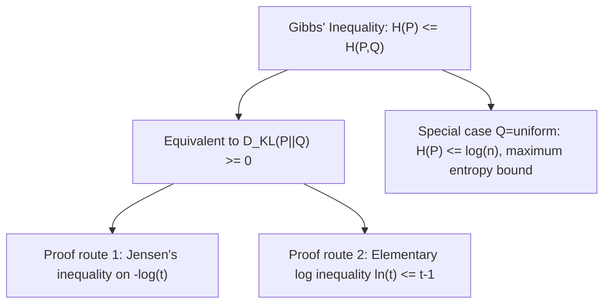

## Gibbs' Inequality

### Statement

Gibbs' inequality is the foundational result establishing that KL divergence is always non-negative, and that Shannon entropy is bounded above by cross-entropy. For two probability distributions $P$ and $Q$ over the same discrete support:

$$-\sum_x P(x) \log P(x) \leq -\sum_x P(x) \log Q(x)$$

Equivalently, in terms of entropy and cross-entropy:

$$H(P) \leq H(P, Q)$$

with equality if and only if $P(x) = Q(x)$ for all $x$ (almost everywhere, in the continuous case). This is precisely the statement that $D_{KL}(P \parallel Q) \geq 0$, since $D_{KL}(P \parallel Q) = H(P,Q) - H(P)$ as derived earlier.

### Historical Context

Gibbs' inequality predates modern information theory, originating in the statistical mechanics work of Josiah Willard Gibbs in the late 19th century, in the context of entropy in physical systems. Claude Shannon's later formalization of information-theoretic entropy inherited this inequality directly, making it one of the oldest mathematical results underlying the field.

**Key Points**
- Gibbs' inequality is mathematically equivalent to the non-negativity of KL divergence — the two statements are simply different ways of writing the same underlying fact.
- It applies to any pair of valid probability distributions over the same support, with no additional assumptions required.
- The equality condition ($P = Q$ almost everywhere) is both necessary and sufficient, making it a strict (tight) inequality in all other cases.

### Proof via Jensen's Inequality

The most direct modern proof uses the concavity of the logarithm function and Jensen's inequality, discussed in the preceding topic. Starting from the definition of KL divergence:

$$D_{KL}(P \parallel Q) = \sum_x P(x) \log\frac{P(x)}{Q(x)} = -\sum_x P(x) \log\frac{Q(x)}{P(x)}$$

Since $-\log(t)$ is convex, Jensen's inequality applied to the random variable $\frac{Q(X)}{P(X)}$ (where $X \sim P$) gives:

$$-\sum_x P(x) \log\frac{Q(x)}{P(x)} \geq -\log\left(\sum_x P(x) \frac{Q(x)}{P(x)}\right) = -\log\left(\sum_x Q(x)\right) = -\log(1) = 0$$

This directly establishes $D_{KL}(P \parallel Q) \geq 0$, and hence Gibbs' inequality, using the sum $\sum_x Q(x) = 1$ (since $Q$ is a valid probability distribution over the same support as $P$).

### Alternative Proof via the Log Inequality

An elementary alternative proof relies on the standard calculus inequality $\ln(t) \leq t - 1$ for all $t > 0$, with equality only at $t=1$. Applying this to $t = \frac{Q(x)}{P(x)}$ for each $x$ where $P(x) > 0$:

$$\ln\frac{Q(x)}{P(x)} \leq \frac{Q(x)}{P(x)} - 1$$

Multiplying both sides by $P(x)$ (non-negative) and summing over all $x$:

$$\sum_x P(x) \ln\frac{Q(x)}{P(x)} \leq \sum_x P(x)\left(\frac{Q(x)}{P(x)} - 1\right) = \sum_x Q(x) - \sum_x P(x) = 1 - 1 = 0$$

Since $\sum_x P(x)\ln\frac{Q(x)}{P(x)} = -D_{KL}(P\parallel Q)$ (using natural log), this gives $-D_{KL}(P\parallel Q) \leq 0$, i.e., $D_{KL}(P\parallel Q) \geq 0$, confirming Gibbs' inequality through an entirely different elementary route.

### Diagram: The Log Inequality Underlying Gibbs' Inequality

<svg xmlns="http://www.w3.org/2000/svg" viewBox="0 0 640 260">
  <text x="320" y="24" font-size="15" font-family="sans-serif" text-anchor="middle" fill="#222" font-weight="bold">ln(t) ≤ t − 1 for All t &gt; 0 (svg_diagram)</text>

  <line x1="60" y1="220" x2="580" y2="220" stroke="#333" stroke-width="1.2" />
  <line x1="320" y1="220" x2="320" y2="40" stroke="#333" stroke-width="1.2" />

  <line x1="120" y1="200" x2="520" y2="60" stroke="#c0392b" stroke-width="2" />
  <text x="500" y="70" font-size="11" font-family="sans-serif" fill="#c0392b">t − 1</text>

  <path d="M 140 220 Q 220 130 320 110 Q 420 95 520 78" fill="none" stroke="#4a7fc9" stroke-width="2.5" />
  <text x="500" y="95" font-size="11" font-family="sans-serif" fill="#4a7fc9">ln(t)</text>

  <circle cx="320" cy="140" r="4" fill="#27ae60" />
  <text x="335" y="140" font-size="11" font-family="sans-serif" fill="#27ae60">t=1: both curves touch (equality)</text>

  <text x="320" y="240" font-size="12" font-family="sans-serif" text-anchor="middle" fill="#111">ln(t) lies on or below the tangent line t − 1</text>
</svg>

**Example**
Let $P = [0.4, 0.6]$ and $Q = [0.5, 0.5]$ over a 2-outcome space. Compute $H(P)$ and $H(P, Q)$ using $\log_2$:

$$H(P) = -(0.4 \log_2 0.4 + 0.6 \log_2 0.6) \approx -(0.4(-1.322) + 0.6(-0.737)) \approx 0.529 + 0.442 = 0.971 \text{ bits}$$

$$H(P, Q) = -(0.4\log_2 0.5 + 0.6\log_2 0.5) = -\log_2 0.5 = 1.0 \text{ bit}$$

Confirming Gibbs' inequality: $H(P) = 0.971 \leq H(P,Q) = 1.0$. The gap, $D_{KL}(P\parallel Q) = 1.0 - 0.971 = 0.029$ bits, is strictly positive precisely because $P \neq Q$, exactly as the equality condition predicts.

### Connection to Maximum Entropy

Gibbs' inequality directly underlies a key result in maximum entropy principles: among all probability distributions over a fixed discrete support of size $n$, the uniform distribution $Q(x) = \frac{1}{n}$ maximizes entropy. This follows by setting $Q$ to the uniform distribution in Gibbs' inequality:

$$H(P) \leq H(P, Q_{\text{uniform}}) = -\sum_x P(x)\log\frac{1}{n} = \log n$$

This shows $H(P) \leq \log n$ for any distribution $P$, with equality exactly when $P$ is itself the uniform distribution (satisfying the Gibbs' inequality equality condition $P = Q$).

### Diagram: Gibbs' Inequality Logical Structure

### Common Pitfalls

- Assuming Gibbs' inequality requires $P$ and $Q$ to share special properties beyond being valid probability distributions over the same support — no such extra conditions are needed.
- Misremembering the direction of the inequality — entropy $H(P)$ is always the smaller (or equal) quantity, never larger than cross-entropy $H(P,Q)$.
- Overlooking the support requirement — if $Q(x) = 0$ for some $x$ where $P(x) > 0$, the cross-entropy term becomes infinite (undefined in the limit), and the inequality still technically holds but becomes a trivial statement ($H(P) \leq \infty$).
- [Inference] In applied settings using empirical (sample-based) estimates of $P$ and $Q$ rather than the true distributions, Gibbs' inequality holds exactly for the plug-in estimates themselves, but the estimated $D_{KL}$ may not equal the true population divergence due to sampling error, particularly with sparse categorical data.

### Applications

- **Maximum entropy modeling**: Directly justifies why uniform distributions maximize entropy under no constraints, and more generally underlies Lagrangian derivations of maximum-entropy distributions under moment constraints.
- **Source coding theorems**: Provides the theoretical lower bound showing that no code can achieve an average length below the true entropy when the code is optimized for a mismatched distribution.
- **Statistical mechanics**: The original context of Gibbs' work, where entropy bounds constrain the free energy and equilibrium behavior of physical systems.
- **Machine learning regularization**: Used implicitly whenever cross-entropy loss is interpreted as always bounded below by the true label entropy, providing a theoretical floor for achievable loss values.

**Related Topics**
- Maximum entropy principle and Lagrangian derivation of exponential family distributions
- Log-sum inequality as a generalized multi-term version of the log inequality used here
- Source coding theorem and the Kraft-McMillan inequality
- Bregman divergences as a further generalization connecting convexity to divergence measures
- Free energy and its relationship to entropy in statistical mechanics
- Convexity and Jensen's inequality as the shared mathematical foundation