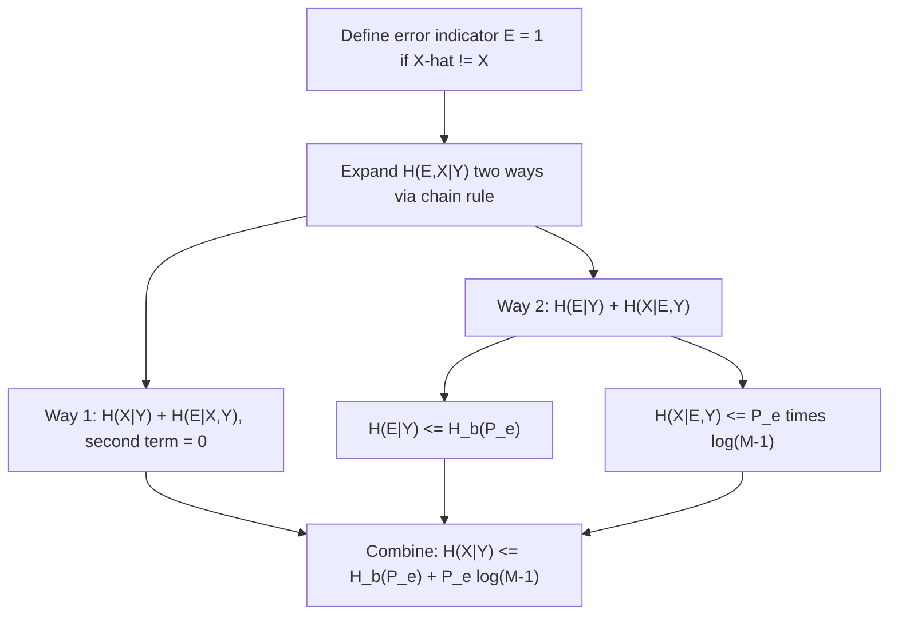

## Fano's Inequality

### Motivation

Fano's inequality connects two seemingly different quantities: the probability of error in estimating a random variable, and the conditional entropy (uncertainty) that remains about that variable given an observation. It provides a formal lower bound on estimation error, making it one of the primary tools for proving converse (impossibility) results in information theory — that is, showing when reliable estimation or communication is fundamentally impossible below a certain error rate.

### Setup

Let $X$ be a random variable taking values in a finite alphabet of size $|\mathcal{X}| = M$, and let $\hat{X}$ be an estimate of $X$ formed from an observation $Y$ (so $\hat{X}$ is a function of $Y$, possibly randomized). Define the probability of error as:

$$P_e = P(\hat{X} \neq X)$$

Fano's inequality relates $P_e$ to the conditional entropy $H(X \mid Y)$, which measures the remaining uncertainty about $X$ after observing $Y$.

### Statement

Fano's inequality states:

$$H(X \mid Y) \leq H_b(P_e) + P_e \log(M - 1)$$

where $H_b(P_e) = -P_e \log P_e - (1-P_e)\log(1-P_e)$ is the binary entropy function evaluated at the error probability, and $M = |\mathcal{X}|$ is the size of the alphabet from which $X$ is drawn.

A commonly used looser but simpler bound, obtained by using $H_b(P_e) \leq 1$ bit (in base-2 log), is:

$$H(X\mid Y) \leq 1 + P_e \log(M-1)$$

Rearranging either form gives a lower bound directly on the error probability itself:

$$P_e \geq \frac{H(X\mid Y) - 1}{\log(M-1)}$$

**Key Points**
- Fano's inequality gives a lower bound on error probability, not an upper bound — it tells you how bad estimation must be, given a certain level of remaining uncertainty, not how good it can be.
- As $H(X\mid Y) \to 0$ (near-perfect knowledge of $X$ given $Y$), the bound correctly allows $P_e \to 0$.
- As $H(X\mid Y)$ grows large (little information about $X$ in $Y$), the bound forces $P_e$ to be large, capturing the intuition that you cannot reliably guess $X$ if $Y$ tells you almost nothing about it.

### Proof Sketch

The proof proceeds by defining an error indicator variable $E = 1$ if $\hat{X} \neq X$ and $E=0$ otherwise, then applying the chain rule for entropy to $H(E, X \mid Y)$ in two different orders and comparing the results.

Expanding one way:
$$H(E, X \mid Y) = H(X \mid Y) + H(E \mid X, Y)$$

Since $E$ is a deterministic function of $X$ and $\hat{X}$ (which is itself a function of $Y$), $H(E \mid X, Y) = 0$, so:
$$H(E, X\mid Y) = H(X\mid Y)$$

Expanding the other way:
$$H(E, X\mid Y) = H(E \mid Y) + H(X \mid E, Y)$$

The term $H(E\mid Y) \leq H(E) = H_b(P_e)$ since conditioning cannot increase entropy, and unconditional entropy of a binary variable is bounded by the binary entropy function. The term $H(X \mid E, Y)$ can be bounded by considering the two cases of $E$: when $E=0$ (correct estimate), $X$ is known exactly, contributing zero entropy; when $E=1$ (incorrect estimate), $X$ can take at most $M-1$ remaining values, so this term is bounded by $\log(M-1)$. Combining these with the law of total expectation over $E$ yields:

$$H(X\mid Y) \leq H_b(P_e) + P_e \log(M-1)$$

which is exactly Fano's inequality.

### Diagram: Fano's Inequality Proof Structure

### Diagram: Interpreting the Bound

<svg xmlns="http://www.w3.org/2000/svg" viewBox="0 0 640 260">
  <text x="320" y="24" font-size="15" font-family="sans-serif" text-anchor="middle" fill="#222" font-weight="bold">Fano's Inequality: Uncertainty vs. Error Bound (svg_diagram)</text>

  <line x1="70" y1="220" x2="580" y2="220" stroke="#333" stroke-width="1.2" />
  <line x1="70" y1="220" x2="70" y2="40" stroke="#333" stroke-width="1.2" />

  <text x="30" y="130" font-size="12" font-family="sans-serif" text-anchor="middle" transform="rotate(-90 30 130)">H(X|Y)</text>
  <text x="320" y="245" font-size="12" font-family="sans-serif" text-anchor="middle">P_e (error probability)</text>

  <path d="M 70 210 Q 250 190 400 100 Q 480 60 570 50" fill="none" stroke="#4a7fc9" stroke-width="2.5" />

  <text x="470" y="45" font-size="11" font-family="sans-serif" fill="#4a7fc9">Fano bound curve</text>

  <rect x="90" y="150" width="140" height="55" fill="#a8d5ba" opacity="0.5" stroke="none" />
  <text x="160" y="180" font-size="11" font-family="sans-serif" text-anchor="middle" fill="#111">Low H(X|Y):</text>
  <text x="160" y="195" font-size="10" font-family="sans-serif" text-anchor="middle" fill="#111">low P_e permitted</text>

  <rect x="400" y="60" width="150" height="55" fill="#f4b183" opacity="0.5" stroke="none" />
  <text x="475" y="85" font-size="11" font-family="sans-serif" text-anchor="middle" fill="#111">High H(X|Y):</text>
  <text x="475" y="100" font-size="10" font-family="sans-serif" text-anchor="middle" fill="#111">high P_e forced</text>
</svg>

**Example**
Suppose $X$ is drawn uniformly from an alphabet of size $M = 4$, and an estimator based on $Y$ achieves conditional entropy $H(X\mid Y) = 1.5$ bits (base 2).

Using the simplified bound $H(X\mid Y) \leq 1 + P_e \log_2(M-1) = 1 + P_e \log_2 3$:

$$1.5 \leq 1 + P_e (1.585)$$

$$P_e \geq \frac{1.5 - 1}{1.585} \approx \frac{0.5}{1.585} \approx 0.315$$

This means any estimator facing this level of residual uncertainty must have an error probability of at least approximately $31.5\%$ — no estimation scheme, however cleverly designed, can do better than this floor given the stated conditional entropy.

### Relation to Channel Coding Converse

Fano's inequality is the central tool in proving the converse part of Shannon's noisy channel coding theorem — the statement that reliable communication (arbitrarily low error probability) is impossible at rates exceeding channel capacity $C$. The argument uses Fano's inequality to show that if the transmission rate $R > C$, the error probability $P_e$ is bounded away from zero as block length grows, establishing the fundamental limit rather than just a practical difficulty.

### Common Pitfalls

- Misusing Fano's inequality as an achievability result — it is strictly a converse (impossibility) tool, providing a lower bound on error, not a recipe for achieving low error.
- Forgetting the alphabet-size dependence — the $\log(M-1)$ term means the bound weakens (permits higher $P_e$ for the same entropy) as the alphabet grows larger, which is often mishandled when applying the inequality to different-sized problems.
- Using the simplified $1 + P_e\log(M-1)$ bound when tighter analysis is needed — the full $H_b(P_e)$ term is more accurate, especially when $P_e$ is small, since $H_b(P_e) < 1$ for $P_e \neq 0.5$.
- [Inference] In finite-blocklength or non-asymptotic settings (as opposed to the classical asymptotic channel coding theorem), Fano's inequality still holds as stated, but achieving a bound close to the true fundamental limit in such regimes typically requires more refined tools (e.g., strong converse techniques), and the basic Fano bound alone may be loose.

### Applications

- **Channel coding converse proofs**: The primary application, establishing that rates above capacity cannot support arbitrarily reliable communication.
- **Statistical estimation lower bounds**: Used broadly in minimax theory to establish fundamental limits on parameter estimation error given a fixed amount of data or information.
- **Distributed computing and communication complexity**: Used to lower-bound the amount of communication needed between parties to solve a computational task with bounded error.
- **Machine learning theory**: Applied in PAC-learning and information-theoretic generalization bounds to establish limits on how well a learner can predict given limited information about the underlying data distribution.

**Related Topics**
- Shannon's noisy channel coding theorem and its converse proof
- Minimax lower bounds in statistical estimation theory
- Binary entropy function and its properties
- Strong converse theorems and finite-blocklength information theory
- Data processing inequality as a complementary tool in converse proofs
- Information-theoretic generalization bounds in machine learning