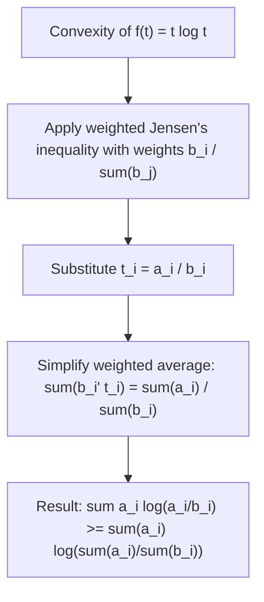

## Log-Sum Inequality

### Statement

The log-sum inequality is a generalization of the elementary two-term convexity argument used throughout information theory, extending it to sums of multiple non-negative terms. For non-negative real numbers $a_1, \ldots, a_n$ and $b_1, \ldots, b_n$ (with $b_i > 0$):

$$\sum_{i=1}^n a_i \log\frac{a_i}{b_i} \geq \left(\sum_{i=1}^n a_i\right) \log\frac{\sum_{i=1}^n a_i}{\sum_{i=1}^n b_i}$$

Equality holds if and only if the ratio $\frac{a_i}{b_i}$ is the same constant for all $i$. By convention, $0 \log \frac{0}{b} = 0$ and $a \log \frac{a}{0} = \infty$ for $a > 0$.

### Intuition

The log-sum inequality states that computing the weighted log-ratio term-by-term and summing gives a value at least as large as computing a single log-ratio using the aggregated (summed) totals. This is a direct consequence of the convexity of the function $f(t) = t\log t$, applied via a weighted (multi-point) form of Jensen's inequality rather than the two-point version.

**Key Points**
- The log-sum inequality is the key algebraic tool used to prove the convexity of KL divergence in its arguments, as well as several related information-theoretic inequalities.
- It reduces to Gibbs' inequality (and hence KL divergence non-negativity) as a special case, when the $a_i$ and $b_i$ are interpreted as probability values.
- The equality condition — constant ratio $a_i/b_i$ across all $i$ — mirrors the equality condition of KL divergence non-negativity, where $P = Q$ corresponds to a constant ratio of exactly $1$.

### Proof via Convexity of $t \log t$

The proof relies on the convexity of $f(t) = t \log t$ for $t > 0$. Define weights $b_i' = \frac{b_i}{\sum_j b_j}$ (normalized to sum to 1), and let $t_i = \frac{a_i}{b_i}$. Then, by the weighted (Jensen's) form of convexity applied to $f$:

$$f\left(\sum_i b_i' t_i\right) \leq \sum_i b_i' f(t_i)$$

Substituting $t_i = \frac{a_i}{b_i}$ and expanding $f(t_i) = t_i \log t_i = \frac{a_i}{b_i}\log\frac{a_i}{b_i}$, then multiplying through by $\sum_j b_j$ and simplifying the weighted sum $\sum_i b_i' t_i = \frac{\sum_i a_i}{\sum_i b_i}$, produces exactly the log-sum inequality after algebraic rearrangement.

### Diagram: Log-Sum Inequality Derivation

### Application: Proving KL Divergence Non-negativity

Setting $a_i = P(x_i)$ and $b_i = Q(x_i)$ for probability distributions $P$ and $Q$ over the same support, the log-sum inequality gives:

$$\sum_i P(x_i)\log\frac{P(x_i)}{Q(x_i)} \geq \left(\sum_i P(x_i)\right)\log\frac{\sum_i P(x_i)}{\sum_i Q(x_i)} = 1 \cdot \log\frac{1}{1} = 0$$

This recovers $D_{KL}(P\parallel Q) \geq 0$, providing yet another proof route for Gibbs' inequality — this time via the log-sum inequality rather than direct Jensen's inequality or the elementary log bound.

### Application: Convexity of KL Divergence

The log-sum inequality is the standard tool for proving that KL divergence is a jointly convex function of the pair $(P, Q)$. That is, for two pairs of distributions $(P_1, Q_1)$ and $(P_2, Q_2)$, and $\lambda \in [0,1]$:

$$D_{KL}(\lambda P_1 + (1-\lambda)P_2 \parallel \lambda Q_1 + (1-\lambda)Q_2) \leq \lambda D_{KL}(P_1\parallel Q_1) + (1-\lambda) D_{KL}(P_2\parallel Q_2)$$

This joint convexity property is applied term-by-term across the support using the log-sum inequality (with $a_i$ and $b_i$ representing the two mixture components at each point $x_i$), and is a critical structural fact used in proving the concavity of channel capacity as a function of the input distribution.

**Example**
Let $a_1 = 2, a_2 = 3$ and $b_1 = 4, b_2 = 6$ (using natural log for this computation).

Left-hand side:
$$a_1\log\frac{a_1}{b_1} + a_2\log\frac{a_2}{b_2} = 2\log\frac{2}{4} + 3\log\frac{3}{6} = 2\log(0.5) + 3\log(0.5)$$
$$= 2(-0.693) + 3(-0.693) = -1.386 - 2.079 = -3.465$$

Right-hand side:
$$(a_1+a_2)\log\frac{a_1+a_2}{b_1+b_2} = 5\log\frac{5}{10} = 5\log(0.5) = 5(-0.693) = -3.465$$

In this case, both sides are exactly equal, which is expected since $\frac{a_1}{b_1} = \frac{2}{4} = 0.5$ and $\frac{a_2}{b_2} = \frac{3}{6} = 0.5$ — the ratios are identical across both terms, satisfying the equality condition precisely.

### Diagram: Equality Condition Illustration

<svg xmlns="http://www.w3.org/2000/svg" viewBox="0 0 640 220">
  <text x="320" y="24" font-size="15" font-family="sans-serif" text-anchor="middle" fill="#222" font-weight="bold">Log-Sum Equality Condition (svg_diagram)</text>

  <rect x="60" y="70" width="220" height="50" fill="#a8d5ba" stroke="#333" stroke-width="1.5" />
  <text x="170" y="100" font-size="13" font-family="sans-serif" text-anchor="middle" fill="#111">a_1/b_1 = a_2/b_2 = ... = c</text>

  <rect x="360" y="70" width="220" height="50" fill="#f4b183" stroke="#333" stroke-width="1.5" />
  <text x="470" y="100" font-size="13" font-family="sans-serif" text-anchor="middle" fill="#111">Equality holds exactly</text>

  <line x1="280" y1="95" x2="360" y2="95" stroke="#333" stroke-width="2" />
  <polygon points="360,95 348,89 348,101" fill="#333" />

  <text x="320" y="160" font-size="12" font-family="sans-serif" text-anchor="middle" fill="#333">Constant ratio across all i is necessary and sufficient</text>
</svg>

### Common Pitfalls

- Forgetting the non-negativity requirement on $a_i$ and positivity requirement on $b_i$ — the inequality is not generally valid outside these domains, and the standard conventions for zero terms must be applied carefully.
- Assuming equality holds whenever totals match — equality specifically requires the ratio $a_i/b_i$ to be constant across every index $i$, not merely that the aggregated sums produce the same log-ratio value coincidentally.
- Confusing the log-sum inequality with the related but distinct inequality $\log(\sum a_i) \geq \sum \log(a_i)$ (which does not generally hold) — the log-sum inequality has a specific weighted structure with the $a_i/b_i$ ratio term that must be preserved.
- [Inference] While the log-sum inequality is algebraically exact for any finite collection of non-negative terms satisfying the stated conditions, its use as a component in more complex information-theoretic proofs (e.g., joint convexity of KL divergence) typically requires careful handling of edge cases like zero-probability terms, and different textbook treatments may adopt slightly different conventions for these boundary cases.

### Applications

- **Convexity proofs**: The primary tool for establishing joint convexity of KL divergence and related divergence measures in their distribution arguments.
- **Channel capacity concavity**: Used indirectly (via KL divergence convexity properties) in proving that mutual information is concave in the input distribution for a fixed channel.
- **Rate-distortion function convexity**: Applied in establishing the convexity of the rate-distortion function, ensuring well-posed optimization in lossy compression theory.
- **Information geometry**: Underlies proofs of convexity properties used when studying the geometric structure of families of probability distributions under KL divergence.

**Related Topics**
- Joint convexity of KL divergence in both of its arguments
- Concavity of mutual information and channel capacity optimization
- Rate-distortion theory and convex optimization of encoding schemes
- Jensen's inequality as the foundational convexity tool underlying the log-sum inequality
- Bregman divergences and their relationship to convex function-based divergence measures
- Information geometry and the convex structure of statistical manifolds