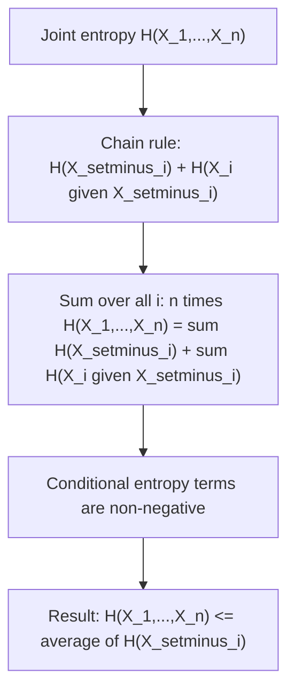

## Han's Inequality

### Motivation

Han's inequality is a family of results relating the joint entropy of a collection of random variables to the average entropy of subsets of those variables. It generalizes the intuitive idea that removing variables from a joint collection should not increase entropy per variable, and provides a precise, provable bound on how entropy behaves under subset averaging — a structural fact used throughout multivariate information theory.

### Setup

Let $X_1, X_2, \ldots, X_n$ be $n$ random variables with joint entropy $H(X_1, \ldots, X_n)$. For a subset $S \subseteq \{1, \ldots, n\}$ of size $k$, define $H(X_S)$ as the joint entropy of the variables indexed by $S$. Han's inequality concerns the average of $H(X_S)$ over all subsets of a given size.

### Statement (Two-Variable Case, Foundational Form)

The simplest and most foundational form of Han's inequality applies to $n$ variables and compares the joint entropy to the average of the $(n-1)$-variable marginal entropies (each formed by dropping exactly one variable):

$$H(X_1, \ldots, X_n) \leq \frac{1}{n}\sum_{i=1}^n H(X_1, \ldots, X_{i-1}, X_{i+1}, \ldots, X_n)$$

In words: the full joint entropy is at most the average of the joint entropies obtained by leaving out each single variable in turn.

### General Statement (Subset Averaging Form)

More generally, define $H_k$ as the average joint entropy over all $\binom{n}{k}$ subsets of size $k$:

$$H_k = \frac{1}{\binom{n}{k}} \sum_{|S|=k} H(X_S)$$

Han's inequality states that the sequence $\frac{H_k}{k}$ is non-increasing in $k$:

$$\frac{H_1}{1} \geq \frac{H_2}{2} \geq \cdots \geq \frac{H_n}{n}$$

This means the average entropy contributed per variable decreases (or stays the same) as larger subsets are considered — adding more variables to a joint collection cannot increase the average "entropy per variable."

**Key Points**
- Han's inequality is fundamentally a statement about diminishing average entropy contribution per variable as more variables are grouped together.
- The special case $k=1$ versus $k=n$ gives $H_1 \geq \frac{H_n}{n} = \frac{H(X_1,\ldots,X_n)}{n}$, directly bounding joint entropy by $n$ times the average single-variable entropy.
- The inequality holds for any joint distribution over $X_1, \ldots, X_n$, with no independence assumptions required.

### Proof Sketch (Foundational Form)

The proof of the foundational (leave-one-out) form relies on the chain rule of entropy and the fact that conditioning cannot increase entropy. Start from the chain rule for the full joint entropy:

$$H(X_1, \ldots, X_n) = H(X_i) + H(X_1, \ldots, X_n \mid X_i) \quad \text{(not directly useful; instead use the following)}$$

The standard proof instead uses:

$$H(X_1,\ldots,X_n) = H(X_1,\ldots,X_{i-1},X_{i+1},\ldots,X_n) + H(X_i \mid X_1,\ldots,X_{i-1},X_{i+1},\ldots,X_n)$$

Summing this identity over all $i = 1, \ldots, n$:

$$n \cdot H(X_1,\ldots,X_n) = \sum_{i=1}^n H(X_{\setminus i}) + \sum_{i=1}^n H(X_i \mid X_{\setminus i})$$

where $X_{\setminus i}$ denotes all variables except $X_i$. Since conditional entropy is always non-negative, $\sum_i H(X_i \mid X_{\setminus i}) \geq 0$, and rearranging gives:

$$H(X_1,\ldots,X_n) \leq \frac{1}{n}\sum_{i=1}^n H(X_{\setminus i})$$

which is exactly the foundational form of Han's inequality.

### Diagram: Han's Inequality Structure

### The Non-Increasing Sequence $H_k/k$

The general subset-averaging form extends this idea using a more elaborate combinatorial argument involving averaging over all subsets of each size $k$, applying the chain rule and non-negativity of conditional entropy within each subset relation. The resulting monotonicity, $\frac{H_1}{1} \geq \frac{H_2}{2} \geq \cdots \geq \frac{H_n}{n}$, is often visualized as a concave-like "diminishing returns" structure: adding each additional variable to a growing joint collection contributes, on average, no more entropy per variable than the variables already included contributed.

**Example**
Consider three binary random variables $X_1, X_2, X_3$ that are i.i.d. fair coin flips, so each has entropy $H(X_i) = 1$ bit, and by independence, $H(X_1,X_2,X_3) = 3$ bits.

Compute $H_1$: the average single-variable entropy.
$$H_1 = \frac{1}{3}(H(X_1) + H(X_2) + H(X_3)) = \frac{1}{3}(1+1+1) = 1 \text{ bit}$$

Compute $H_2$: the average two-variable joint entropy over all $\binom{3}{2}=3$ pairs. Since the variables are independent, each pair has joint entropy $H(X_i,X_j) = 2$ bits.
$$H_2 = \frac{1}{3}(2+2+2) = 2 \text{ bits}$$

Compute $H_3 = H(X_1,X_2,X_3) = 3$ bits (only one subset of size 3).

Checking the non-increasing sequence:
$$\frac{H_1}{1} = 1, \quad \frac{H_2}{2} = 1, \quad \frac{H_3}{3} = 1$$

All three ratios are exactly equal at $1$, which is expected: for independent variables, each additional variable contributes exactly its own full entropy with no redundancy, so the "diminishing returns" effect vanishes entirely and the sequence is constant rather than strictly decreasing.

### Diagram: Diminishing Entropy Per Variable

<svg xmlns="http://www.w3.org/2000/svg" viewBox="0 0 640 260">
  <text x="320" y="24" font-size="15" font-family="sans-serif" text-anchor="middle" fill="#222" font-weight="bold">Han's Inequality: H_k / k Is Non-Increasing (svg_diagram)</text>

  <line x1="80" y1="220" x2="560" y2="220" stroke="#333" stroke-width="1.2" />
  <line x1="80" y1="220" x2="80" y2="50" stroke="#333" stroke-width="1.2" />

  <text x="320" y="245" font-size="12" font-family="sans-serif" text-anchor="middle">k (subset size)</text>
  <text x="30" y="140" font-size="12" font-family="sans-serif" text-anchor="middle" transform="rotate(-90 30 140)">H_k / k</text>

  <circle cx="150" cy="90" r="5" fill="#4a7fc9" />
  <circle cx="300" cy="120" r="5" fill="#4a7fc9" />
  <circle cx="450" cy="150" r="5" fill="#4a7fc9" />

  <line x1="150" y1="90" x2="300" y2="120" stroke="#4a7fc9" stroke-width="2" />
  <line x1="300" y1="120" x2="450" y2="150" stroke="#4a7fc9" stroke-width="2" />

  <text x="150" y="75" font-size="11" font-family="sans-serif" text-anchor="middle">H_1/1</text>
  <text x="300" y="105" font-size="11" font-family="sans-serif" text-anchor="middle">H_2/2</text>
  <text x="450" y="135" font-size="11" font-family="sans-serif" text-anchor="middle">H_3/3</text>
</svg>

### Relation to Redundancy and Dependence

Han's inequality is closely tied to the presence of statistical dependence among variables. When variables are correlated or dependent, joint entropy grows sub-additively (i.e., strictly less than the sum of individual entropies), reflecting redundant information shared across variables. Han's inequality formalizes exactly how this redundancy manifests when comparing entropy contributions at different subset sizes — the more dependence present, the more sharply the sequence $H_k/k$ decreases.

### Common Pitfalls

- Confusing Han's inequality with simple subadditivity of entropy ($H(X_1,\ldots,X_n) \leq \sum_i H(X_i)$) — Han's inequality is a more refined, structured statement about the relationship between different subset sizes, not merely the total sum bound.
- Assuming the sequence $H_k/k$ is always strictly decreasing — as shown in the independent-variables example, the sequence can be constant when there is no redundancy among the variables.
- Misapplying the inequality to non-identically distributed or dependent variables without recomputing subset entropies correctly — the general form requires careful subset-by-subset entropy computation, not a shortcut based on marginal entropies alone.
- [Inference] In high-dimensional settings with many variables, computing all $\binom{n}{k}$ subset entropies exactly becomes computationally expensive, and in practice approximations or bounds derived from Han's inequality are often used instead of exact subset enumeration, though the precise computational trade-offs depend on the application and dimensionality involved.

### Applications

- **Multivariate mutual information and interaction information**: Han's inequality provides bounds used in decomposing joint entropy into components attributable to different orders of variable interaction.
- **Data compression for multiple sources**: Used in distributed source coding (Slepian-Wolf type settings) to bound achievable compression rates when correlated sources are compressed separately.
- **Graph and hypergraph entropy bounds**: Applied in combinatorics to bound the entropy of structures defined over multiple interacting variables, connecting to entropy-based counting arguments.
- **Network information theory**: Used in deriving outer bounds (converse results) for multi-terminal communication systems, similar in spirit to Fano's inequality but for multivariate settings.

**Related Topics**
- Subadditivity of entropy and its relationship to independence
- Chain rule of entropy and its role in multivariate decompositions
- Slepian-Wolf theorem and distributed source coding
- Interaction information and higher-order mutual information measures
- Submodularity of entropy functions in combinatorial information theory
- Shearer's lemma as a related combinatorial entropy inequality