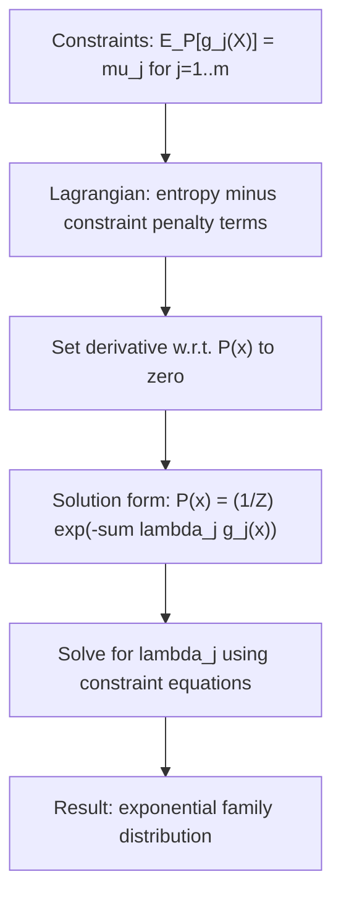

## Maximum Entropy Principle

### Core Idea

The maximum entropy principle states that, among all probability distributions satisfying a given set of known constraints (such as observed moments or expectations), the distribution that best represents current knowledge is the one with the highest Shannon entropy. This distribution introduces no additional assumptions beyond what the constraints require — it is the "least committal" or "maximally uninformative" choice consistent with the available information.

### Motivation

When only partial information about a distribution is available (e.g., its mean, variance, or a set of expectation constraints), infinitely many distributions can satisfy those constraints. The maximum entropy principle provides a principled, non-arbitrary way to select a single representative distribution: choose the one that avoids injecting any unwarranted structure or assumptions beyond what is explicitly known.

**Key Points**
- The principle formalizes a specific notion of "assuming as little as possible" using entropy as the precise mathematical measure of uncommittedness.
- With no constraints at all (beyond normalization), the maximum entropy distribution over a finite discrete support is exactly the uniform distribution, consistent with Gibbs' inequality shown earlier.
- The resulting maximum entropy distributions, under common constraint types, recover many well-known distributions as special cases (uniform, exponential, Gaussian).

### General Formulation

Given a set of $m$ constraint functions $g_1(x), \ldots, g_m(x)$ with known expected values $\mu_1, \ldots, \mu_m$ under the true (unknown) distribution, the maximum entropy problem is:

$$\max_{P} \, H(P) \quad \text{subject to} \quad \mathbb{E}_P[g_j(X)] = \mu_j \text{ for } j=1,\ldots,m, \quad \sum_x P(x) = 1$$

This is a constrained optimization problem solved using Lagrange multipliers.

### Solving via Lagrange Multipliers

Introducing Lagrange multipliers $\lambda_0$ (for normalization) and $\lambda_1, \ldots, \lambda_m$ (for each constraint), the Lagrangian is:

$$\mathcal{L} = -\sum_x P(x)\log P(x) - \lambda_0\left(\sum_x P(x) - 1\right) - \sum_{j=1}^m \lambda_j\left(\sum_x P(x) g_j(x) - \mu_j\right)$$

Taking the derivative with respect to $P(x)$ and setting it to zero:

$$-\log P(x) - 1 - \lambda_0 - \sum_{j=1}^m \lambda_j g_j(x) = 0$$

Solving for $P(x)$:

$$P(x) = \exp\left(-1-\lambda_0 - \sum_{j=1}^m \lambda_j g_j(x)\right) = \frac{1}{Z}\exp\left(-\sum_{j=1}^m \lambda_j g_j(x)\right)$$

where $Z = e^{1+\lambda_0}$ is a normalization constant (the partition function) ensuring $\sum_x P(x) = 1$. This exponential family form is the universal solution shape for maximum entropy problems under expectation constraints.

**Key Points**
- The maximum entropy distribution under expectation constraints always takes the exponential family form, regardless of the specific constraint functions chosen.
- The Lagrange multipliers $\lambda_j$ are determined by solving the constraint equations $\mathbb{E}_P[g_j(X)] = \mu_j$ given the exponential form of $P$.
- The partition function $Z$ (normalization constant) plays a central role in statistical mechanics, where it is directly related to free energy.

### Diagram: Maximum Entropy Optimization Structure

### Special Cases: Recovering Known Distributions

**No constraints (only normalization)**: Over a finite support of size $n$, the maximum entropy solution is the uniform distribution $P(x) = \frac{1}{n}$, consistent with the Gibbs' inequality result discussed earlier showing $H(P) \leq \log n$ with equality at the uniform distribution.

**Known mean, support on non-negative reals**: If the only constraint is $\mathbb{E}[X] = \mu$ over $x \geq 0$, the maximum entropy distribution is the exponential distribution:

$$P(x) = \frac{1}{\mu} e^{-x/\mu}, \quad x \geq 0$$

**Known mean and variance, support on all reals**: If both $\mathbb{E}[X] = \mu$ and $\text{Var}(X) = \sigma^2$ are constrained, the maximum entropy distribution is the Gaussian:

$$P(x) = \frac{1}{\sqrt{2\pi\sigma^2}} \exp\left(-\frac{(x-\mu)^2}{2\sigma^2}\right)$$

This result explains, from an information-theoretic perspective, why the Gaussian distribution arises so frequently: it is the least-committal distribution consistent with knowing only the first two moments.

**Example**
Consider a discrete random variable over $\{1, 2, 3, 4, 5, 6\}$ (a die), with the sole constraint that the expected value $\mathbb{E}[X] = 3.5$ (matching a fair die average). Since this constraint is exactly the value produced by the uniform distribution itself, the maximum entropy solution collapses to the uniform distribution:

$$P(x) = \frac{1}{6} \text{ for } x = 1,\ldots,6$$

If instead the constraint were $\mathbb{E}[X] = 5.0$ (a biased die favoring higher numbers), the maximum entropy solution would take the exponential family form $P(x) \propto e^{-\lambda x}$ with a negative $\lambda$ (favoring larger $x$), and the specific value of $\lambda$ would need to be solved numerically to satisfy $\sum_x x \cdot P(x) = 5.0$ exactly.

### Diagram: Maximum Entropy Distributions Under Different Constraints

<svg xmlns="http://www.w3.org/2000/svg" viewBox="0 0 640 260">
  <text x="320" y="24" font-size="15" font-family="sans-serif" text-anchor="middle" fill="#222" font-weight="bold">Constraint Type Determines Maximum Entropy Form (svg_diagram)</text>

  <rect x="30" y="60" width="170" height="50" fill="#a8d5ba" stroke="#333" stroke-width="1.5" />
  <text x="115" y="82" font-size="12" font-family="sans-serif" text-anchor="middle" fill="#111">No constraints</text>
  <text x="115" y="98" font-size="11" font-family="sans-serif" text-anchor="middle" fill="#111">→ Uniform</text>

  <rect x="235" y="60" width="170" height="50" fill="#f4b183" stroke="#333" stroke-width="1.5" />
  <text x="320" y="82" font-size="12" font-family="sans-serif" text-anchor="middle" fill="#111">Mean fixed, x≥0</text>
  <text x="320" y="98" font-size="11" font-family="sans-serif" text-anchor="middle" fill="#111">→ Exponential</text>

  <rect x="440" y="60" width="170" height="50" fill="#c9b8e8" stroke="#333" stroke-width="1.5" />
  <text x="525" y="82" font-size="12" font-family="sans-serif" text-anchor="middle" fill="#111">Mean+variance fixed</text>
  <text x="525" y="98" font-size="11" font-family="sans-serif" text-anchor="middle" fill="#111">→ Gaussian</text>

  <text x="320" y="160" font-size="12" font-family="sans-serif" text-anchor="middle" fill="#333">All are special cases of the exponential family solution form</text>
</svg>

### Connection to KL Divergence Minimization

The maximum entropy principle can be equivalently reformulated as a minimum KL divergence problem relative to a uniform (or other reference) prior. Since $H(P) = \log n - D_{KL}(P \parallel U)$ for a uniform reference $U$ over a support of size $n$ (a direct rearrangement of Gibbs' inequality), maximizing $H(P)$ is equivalent to minimizing $D_{KL}(P\parallel U)$. This generalizes naturally: maximum entropy under constraints, relative to a non-uniform prior distribution $Q$, becomes exactly the problem of minimizing $D_{KL}(P \parallel Q)$ subject to the same constraints — a formulation known as the principle of minimum discrimination information.

### Common Pitfalls

- Assuming the maximum entropy distribution is always unique without checking that the constraint set is feasible and that the optimization is convex (it is, given the concavity of entropy, but the feasible region defined by constraints must be non-empty).
- Forgetting that the specific exponential family form depends entirely on the choice of constraint functions $g_j(x)$ — different constraints yield entirely different distributional families, not just different parameter values within a fixed family.
- Conflating maximum entropy with "no information" — the principle explicitly incorporates the given constraints; it only avoids adding information beyond those constraints, rather than ignoring them.
- [Inference] In continuous, unbounded, or high-dimensional settings, solving for the Lagrange multipliers analytically is often intractable, and numerical or iterative methods (e.g., iterative scaling algorithms) are typically used in practice; convergence behavior and computational cost depend heavily on the specific constraint structure and dimensionality involved.

### Applications

- **Statistical mechanics**: The original domain of the principle (via Jaynes' formulation), where maximum entropy distributions correspond to equilibrium states (e.g., the Boltzmann distribution) under energy constraints.
- **Natural language processing**: Maximum entropy models (multinomial logistic regression) are derived directly from this principle, using feature-expectation constraints matched to training data statistics.
- **Bayesian priors and objective inference**: Used to construct non-informative or reference priors in Bayesian statistics, minimizing the influence of subjective assumptions.
- **Ecology and species distribution modeling**: Maximum entropy modeling (MaxEnt) is a widely used technique for predicting species distributions from presence-only data, using environmental covariates as constraint functions.

**Related Topics**
- Exponential family distributions and their sufficient statistics
- Principle of minimum discrimination information and KL divergence minimization
- Lagrangian duality and constrained optimization in information theory
- Gibbs' inequality as the foundational bound underlying the uniform-distribution special case
- Maximum entropy models in natural language processing (logistic regression connection)
- Jaynes' formulation of statistical mechanics via information theory