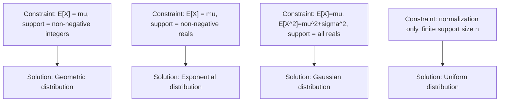

## Entropy Maximization Under Constraints

### Overview

This topic examines, in detail, the mechanics of solving constrained entropy maximization problems: how constraint types map to specific distributional families, how to verify a candidate solution, and how to handle the practical challenges of solving for Lagrange multipliers explicitly. It builds directly on the general maximum entropy framework and Lagrangian setup introduced previously, focusing here on worked derivations and solution verification.

### Recap of the Lagrangian Setup

For a discrete distribution $P$ over support $\mathcal{X}$, subject to normalization and $m$ expectation constraints $\mathbb{E}_P[g_j(X)] = \mu_j$, the general solution form is:

$$P(x) = \frac{1}{Z(\lambda_1,\ldots,\lambda_m)} \exp\left(-\sum_{j=1}^m \lambda_j g_j(x)\right)$$

where $Z(\lambda_1,\ldots,\lambda_m) = \sum_x \exp\left(-\sum_j \lambda_j g_j(x)\right)$ is the partition function, chosen to ensure $P$ sums to 1. The remaining task in any concrete problem is solving for the specific multipliers $\lambda_j$ that satisfy the given constraints.

### Worked Derivation: Single Linear Constraint on a Finite Support

Consider a random variable $X$ over $\{0, 1, 2, \ldots, n\}$ with the single constraint $\mathbb{E}[X] = \mu$. Using $g_1(x) = x$, the solution form is:

$$P(x) = \frac{1}{Z}e^{-\lambda x}, \quad Z = \sum_{x=0}^n e^{-\lambda x}$$

This is a truncated geometric distribution, with the geometric ratio $r = e^{-\lambda}$. The partition function is a finite geometric series:

$$Z = \sum_{x=0}^n r^x = \frac{1 - r^{n+1}}{1 - r}$$

The multiplier $\lambda$ (equivalently, $r$) must be solved numerically or via known geometric-series identities so that $\mathbb{E}[X] = \sum_x x P(x) = \mu$ holds exactly. As $n \to \infty$ with $r < 1$, this reduces to the standard (untruncated) geometric distribution, the discrete analogue of the continuous exponential distribution derived in the general treatment.

### Worked Derivation: Two Constraints (Mean and Second Moment)

Consider a continuous random variable over all of $\mathbb{R}$, subject to two constraints: $\mathbb{E}[X] = \mu$ and $\mathbb{E}[X^2] = \mu^2 + \sigma^2$ (equivalently, fixing both the mean and variance). Using $g_1(x) = x$ and $g_2(x) = x^2$, the solution form is:

$$P(x) = \frac{1}{Z}\exp(-\lambda_1 x - \lambda_2 x^2)$$

Completing the square in the exponent:

$$-\lambda_1 x - \lambda_2 x^2 = -\lambda_2\left(x + \frac{\lambda_1}{2\lambda_2}\right)^2 + \frac{\lambda_1^2}{4\lambda_2}$$

This confirms the distribution has Gaussian form, since the exponent is a negative quadratic in $x$. Matching this to the standard Gaussian form $-\frac{(x-\mu)^2}{2\sigma^2}$ identifies:

$$\lambda_2 = \frac{1}{2\sigma^2}, \qquad \lambda_1 = -\frac{\mu}{\sigma^2}$$

This explicit matching confirms and extends the general result from the previous topic: fixing exactly the first two moments always yields a Gaussian, and here the Lagrange multipliers are solved in closed form rather than left implicit.

**Key Points**
- Linear constraints (fixing $\mathbb{E}[X]$) on different support types produce different exponential family members: geometric on non-negative integers, exponential on non-negative reals.
- Quadratic constraints (fixing $\mathbb{E}[X^2]$ alongside $\mathbb{E}[X]$) always produce Gaussian-form solutions due to the completing-the-square structure of the exponent.
- Solving for Lagrange multipliers explicitly is only tractable in closed form for a limited set of constraint types (typically linear and quadratic); more complex constraints generally require numerical methods.

### Diagram: Constraint Type to Distribution Mapping

### Verifying a Candidate Maximum Entropy Solution

Given a candidate solution of exponential family form, verification proceeds in two steps: (1) confirm the candidate satisfies all stated constraints exactly (by direct computation of expectations), and (2) confirm it is a valid probability distribution (non-negative everywhere, sums/integrates to exactly 1). Because the entropy maximization problem is concave (entropy is concave, and the constraint set defined by linear expectation equations is convex), any solution satisfying the first-order Lagrangian conditions and the constraints is guaranteed to be the unique global maximum — no additional second-order checks are needed for this specific problem class.

**Example**
Verify that the exponential distribution $P(x) = \lambda e^{-\lambda x}$ for $x \geq 0$ satisfies $\mathbb{E}[X] = \frac{1}{\lambda}$, confirming the earlier claim that this is the maximum entropy solution under a mean constraint $\mu = \frac{1}{\lambda}$.

Compute the expectation using integration by parts:
$$\mathbb{E}[X] = \int_0^\infty x \lambda e^{-\lambda x}\,dx$$

Let $u = x$, $dv = \lambda e^{-\lambda x}dx$, so $du = dx$, $v = -e^{-\lambda x}$:

$$\mathbb{E}[X] = \left[-xe^{-\lambda x}\right]_0^\infty + \int_0^\infty e^{-\lambda x}\,dx = 0 + \left[-\frac{1}{\lambda}e^{-\lambda x}\right]_0^\infty = 0 - \left(-\frac{1}{\lambda}\right) = \frac{1}{\lambda}$$

This confirms $\mathbb{E}[X] = \frac{1}{\lambda}$ exactly, validating that setting $\lambda = \frac{1}{\mu}$ produces a distribution satisfying the constraint $\mathbb{E}[X] = \mu$, consistent with the exponential distribution being the correct maximum entropy solution for this constraint type.

### Diagram: Verification Workflow

<svg xmlns="http://www.w3.org/2000/svg" viewBox="0 0 640 220">
  <text x="320" y="24" font-size="15" font-family="sans-serif" text-anchor="middle" fill="#222" font-weight="bold">Verifying a Maximum Entropy Candidate (svg_diagram)</text>

  <rect x="30" y="70" width="170" height="55" fill="#a8d5ba" stroke="#333" stroke-width="1.5" />
  <text x="115" y="95" font-size="12" font-family="sans-serif" text-anchor="middle" fill="#111">Candidate P(x)</text>
  <text x="115" y="112" font-size="11" font-family="sans-serif" text-anchor="middle" fill="#111">exponential family form</text>

  <rect x="235" y="70" width="170" height="55" fill="#f4b183" stroke="#333" stroke-width="1.5" />
  <text x="320" y="95" font-size="12" font-family="sans-serif" text-anchor="middle" fill="#111">Check constraints</text>
  <text x="320" y="112" font-size="11" font-family="sans-serif" text-anchor="middle" fill="#111">E_P[g_j(X)] = mu_j?</text>

  <rect x="440" y="70" width="170" height="55" fill="#c9b8e8" stroke="#333" stroke-width="1.5" />
  <text x="525" y="95" font-size="12" font-family="sans-serif" text-anchor="middle" fill="#111">Check validity</text>
  <text x="525" y="112" font-size="11" font-family="sans-serif" text-anchor="middle" fill="#111">sums/integrates to 1?</text>

  <line x1="200" y1="97" x2="235" y2="97" stroke="#333" stroke-width="2" />
  <polygon points="235,97 223,91 223,103" fill="#333" />
  <line x1="405" y1="97" x2="440" y2="97" stroke="#333" stroke-width="2" />
  <polygon points="440,97 428,91 428,103" fill="#333" />

  <text x="320" y="170" font-size="12" font-family="sans-serif" text-anchor="middle" fill="#333">Concavity guarantees: both checks pass implies global maximum</text>
</svg>

### Inequality Constraints and Additional Complexity

Not all constraints are equalities. When constraints are inequalities (e.g., $\mathbb{E}[X] \leq \mu$ rather than $\mathbb{E}[X] = \mu$), the Karush-Kuhn-Tucker (KKT) conditions generalize the Lagrangian approach, introducing complementary slackness conditions: either the constraint is active (holds with equality) and the corresponding multiplier is non-negative, or the constraint is inactive (strict inequality) and its multiplier is exactly zero. This adds a combinatorial element to the solution process, since it may not be known in advance which constraints will be active at the optimum.

### Common Pitfalls

- Assuming the exponential family form alone guarantees a valid solution — the Lagrange multipliers must still be solved so that all original constraints are satisfied exactly, not merely that the functional form is correct.
- Skipping the normalization check — a common error is deriving the correct exponent structure but forgetting to compute or verify the correct partition function $Z$, leading to an unnormalized (invalid) candidate distribution.
- Treating inequality constraints the same as equality constraints — doing so can produce an over-constrained or infeasible solution; KKT conditions must be applied to correctly identify which constraints are active.
- [Inference] For constraint functions $g_j(x)$ that are highly nonlinear or for supports with complex geometry (e.g., non-convex or disconnected domains), closed-form solutions for the Lagrange multipliers are typically unavailable, and numerical optimization methods are used in practice; the reliability and convergence speed of such methods depends on the specific problem structure and is not guaranteed in general.

### Applications

- **Portfolio and risk modeling**: Entropy maximization under moment constraints (mean, variance, sometimes skewness) is used to construct maximally uncommitted models of asset return distributions.
- **Image reconstruction**: Maximum entropy methods under linear measurement constraints are used in tomography and other inverse problems to select a plausible image consistent with observed data.
- **Spectral estimation**: Maximum entropy spectral estimation constructs power spectral density estimates consistent with a limited number of known autocorrelation values, a classical application in signal processing.
- **Species and ecological modeling**: As mentioned in the general treatment, MaxEnt modeling directly applies these worked-derivation techniques using environmental covariates as constraint functions.

**Related Topics**
- Karush-Kuhn-Tucker (KKT) conditions and inequality-constrained optimization
- Exponential family distributions and natural parameterization
- Spectral estimation and the maximum entropy method in signal processing
- Bayesian inference and the role of maximum entropy priors
- Iterative proportional fitting and numerical methods for constraint satisfaction
- Convex optimization duality and its connection to Lagrangian methods