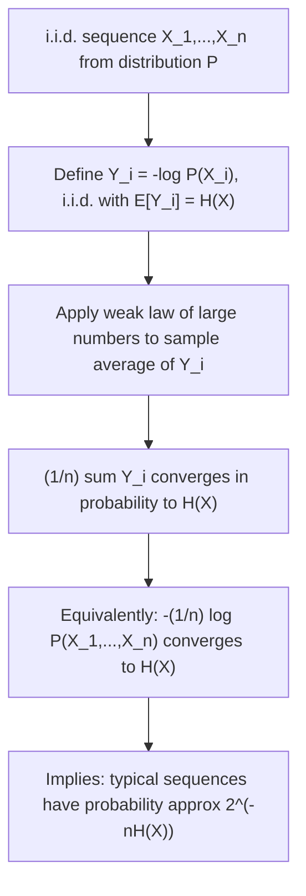

## Asymptotic Equipartition Property: Statement and Intuition

### Overview

The Asymptotic Equipartition Property (AEP) is one of the central results connecting entropy to the practical behavior of long sequences of random variables. It formalizes the intuition that, for a long sequence drawn i.i.d. from a distribution, the sequence will almost certainly fall into a relatively small set of "typical" outcomes, each occurring with roughly equal probability — despite the fact that, in principle, many other (atypical) sequences remain possible.

### Setup

Let $X_1, X_2, \ldots, X_n$ be i.i.d. random variables drawn from a distribution $P$ with entropy $H(X)$. Consider the joint probability of observing a specific sequence $(x_1, x_2, \ldots, x_n)$:

$$P(x_1, x_2, \ldots, x_n) = \prod_{i=1}^n P(x_i)$$

The AEP concerns the behavior of this joint probability, or more precisely its logarithm, as $n$ grows large.

### Statement of the AEP

The Asymptotic Equipartition Property states that, for i.i.d. sequences, the normalized negative log-probability of the sequence converges (in probability) to the entropy of the source:

$$-\frac{1}{n}\log P(X_1, X_2, \ldots, X_n) \to H(X) \quad \text{as } n \to \infty$$

This convergence is a direct consequence of the weak law of large numbers applied to the sequence of random variables $-\log P(X_i)$, since:

$$-\frac{1}{n}\log P(X_1,\ldots,X_n) = -\frac{1}{n}\sum_{i=1}^n \log P(X_i)$$

is simply the sample average of the i.i.d. random variables $-\log P(X_i)$, each with expectation $\mathbb{E}[-\log P(X_i)] = H(X)$ by definition of entropy.

**Key Points**
- The AEP is fundamentally an application of the weak law of large numbers to the specific random variable $-\log P(X)$.
- The convergence is in probability, meaning that for any $\epsilon > 0$, the probability that the sample average deviates from $H(X)$ by more than $\epsilon$ goes to zero as $n \to \infty$ — it does not claim the convergence holds for every individual sequence.
- The AEP underlies the entire framework of typical sequences and typical sets, which is the foundation for Shannon's source coding theorem.

### Intuition: "Typical" Sequences

The AEP implies that, for large $n$, most of the probability mass concentrates on a set of sequences whose probability is approximately $2^{-nH(X)}$ each (using $\log_2$). These sequences are called **typical sequences**. Although the total number of possible sequences of length $n$ can be enormous (e.g., $|\mathcal{X}|^n$ for an alphabet of size $|\mathcal{X}|$), the typical set contains only approximately $2^{nH(X)}$ sequences — a dramatically smaller number whenever $H(X) < \log|\mathcal{X}|$ (i.e., whenever the source is not uniformly distributed).

This is the core surprising insight of the AEP: despite the vast number of theoretically possible sequences, almost all of the probability mass is concentrated on a relatively small, "equiprobable" subset.

### Diagram: Typical Set vs. Full Sequence Space

<svg xmlns="http://www.w3.org/2000/svg" viewBox="0 0 640 260">
  <text x="320" y="24" font-size="15" font-family="sans-serif" text-anchor="middle" fill="#222" font-weight="bold">Typical Set Within All Possible Sequences (svg_diagram)</text>

  <rect x="60" y="60" width="520" height="160" fill="none" stroke="#333" stroke-width="1.5" />
  <text x="320" y="80" font-size="12" font-family="sans-serif" text-anchor="middle" fill="#333">All sequences: |X|^n total</text>

  <circle cx="320" cy="150" r="80" fill="#a8d5ba" opacity="0.7" stroke="#333" stroke-width="1.5" />
  <text x="320" y="145" font-size="12" font-family="sans-serif" text-anchor="middle" fill="#111">Typical set</text>
  <text x="320" y="162" font-size="11" font-family="sans-serif" text-anchor="middle" fill="#111">≈ 2^(nH(X)) sequences</text>

  <text x="320" y="240" font-size="12" font-family="sans-serif" text-anchor="middle" fill="#333">Nearly all probability mass concentrates in this much smaller set</text>
</svg>

### Two Key Consequences of the AEP

The AEP produces two essential structural facts that together justify the "asymptotic equipartition" name:

1. **Near-equal probability**: Every sequence in the typical set has probability approximately $2^{-nH(X)}$ — hence "equipartition," since probability mass is spread roughly evenly across the typical sequences, rather than concentrated unevenly on a few dominant outcomes.

2. **Small typical set size, large total mass**: The typical set contains approximately $2^{nH(X)}$ sequences (a small fraction of the full $|\mathcal{X}|^n$ possible sequences when $H(X) < \log|\mathcal{X}|$), yet this small set captures nearly all of the total probability mass (approaching $1$ as $n \to \infty$).

**Key Points**
- These two facts together explain why entropy $H(X)$, rather than the raw alphabet size $|\mathcal{X}|$, is the correct measure of the "effective" number of outcomes that matter for long sequences.
- The AEP is the conceptual bridge connecting entropy (an expectation-based quantity) to a concrete, countable notion of typical sequence set size.
- The gap between $\log|\mathcal{X}|$ (maximum possible entropy per symbol) and the actual $H(X)$ directly measures how much smaller the typical set is compared to the full sequence space.

### Diagram: AEP Derivation Flow

**Example**
Consider a biased coin with $P(\text{heads}) = 0.8$ and $P(\text{tails}) = 0.2$. The entropy of a single flip (using $\log_2$) is:

$$H(X) = -(0.8\log_2 0.8 + 0.2\log_2 0.2) \approx -(0.8(-0.322) + 0.2(-2.322)) \approx 0.257 + 0.464 = 0.722 \text{ bits}$$

For a sequence of $n=100$ flips, the AEP predicts that a "typical" sequence (one with close to $80$ heads and $20$ tails, matching the true proportions) will have probability approximately:

$$P(\text{typical sequence}) \approx 2^{-100 \times 0.722} = 2^{-72.2}$$

By contrast, a highly atypical sequence, such as all $100$ flips being tails, has a vastly smaller and very different probability:

$$P(\text{all tails}) = 0.2^{100} = 2^{100 \log_2 0.2} \approx 2^{-232.2}$$

This stark difference — $2^{-72.2}$ versus $2^{-232.2}$ — illustrates concretely how atypical sequences (deviating from the source's true statistics) become overwhelmingly less probable than typical sequences as $n$ grows, even though both are, in principle, valid possible outcomes of the same underlying random process.

### Relation to Source Coding

The AEP is the direct theoretical justification for Shannon's source coding theorem: because nearly all probability mass concentrates on approximately $2^{nH(X)}$ typical sequences, one only needs approximately $nH(X)$ bits to index (encode) any typical sequence, rather than $n\log|\mathcal{X}|$ bits that would be required to index all possible sequences. This is the essential reason why entropy $H(X)$ represents the fundamental compression limit — the average number of bits per symbol needed for lossless compression, discussed in detail in dedicated source coding topics.

### Common Pitfalls

- Assuming the AEP guarantees every long sequence has probability exactly $2^{-nH(X)}$ — the AEP is a statement about convergence in probability for the typical set; individual atypical sequences (though increasingly rare) can and do have very different probabilities.
- Confusing "typical" with "most probable" — in many cases, the single most probable individual sequence (e.g., all heads for a biased coin favoring heads) is not actually a member of the typical set, since the typical set is defined by proximity to the expected empirical statistics, not by having the single highest probability.
- Treating the AEP as an exact finite-$n$ statement — the property is fundamentally asymptotic; for small or moderate $n$, deviations from the idealized "equipartition" behavior can be substantial, and the convergence rate depends on the specific source distribution.
- [Inference] The precise rate at which the empirical average $-\frac{1}{n}\log P(X_1,\ldots,X_n)$ converges to $H(X)$ depends on higher moments of $-\log P(X)$ (e.g., its variance), and different sources with the same entropy can exhibit different convergence rates in practice, though the asymptotic limit itself remains $H(X)$ in all cases satisfying the i.i.d. assumption.

### Applications

- **Source coding theorem**: The AEP is the direct theoretical foundation for Shannon's result that $H(X)$ bits per symbol is both necessary and (asymptotically) sufficient for lossless compression.
- **Typical set decoding**: Used in proofs of channel coding theorems, where decoders can restrict attention to jointly typical sequences to achieve reliable communication near capacity.
- **Statistical mechanics**: The AEP has a direct analogue in the equipartition of energy across microstates in statistical mechanics, reflecting the historical cross-pollination between the two fields.
- **Large deviations theory**: The AEP is a foundational special case of the more general large deviations framework, which characterizes the probability of atypical (rare) events more precisely.

**Related Topics**
- Typical sets and their formal definition with epsilon-tolerance
- Shannon's source coding theorem and optimal compression rates
- Weak law of large numbers and its role in information-theoretic proofs
- Joint typicality and its use in channel coding theorem proofs
- Large deviations theory and rare event probability bounds
- Statistical mechanics equipartition and its historical connection to the AEP