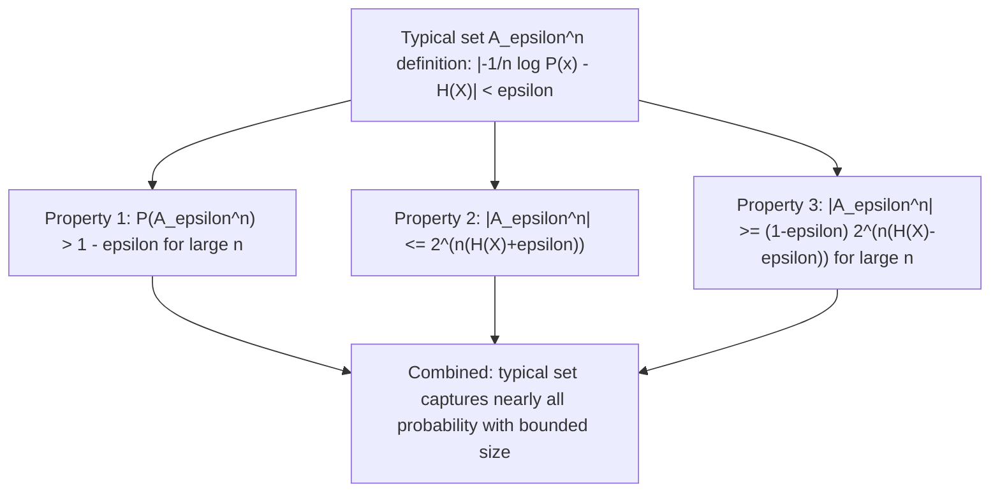

## Typical Sets and Their Properties

### Definition of the Typical Set

Building on the Asymptotic Equipartition Property introduced previously, the **typical set** $A_\epsilon^{(n)}$ formalizes the informal notion of "typical sequences" with a precise epsilon-tolerance definition. For a sequence $(x_1,\ldots,x_n)$ drawn i.i.d. from a distribution $P$ with entropy $H(X)$, the typical set is defined as:

$$A_\epsilon^{(n)} = \left\{ (x_1,\ldots,x_n) \in \mathcal{X}^n : \left| -\frac{1}{n}\log P(x_1,\ldots,x_n) - H(X) \right| < \epsilon \right\}$$

In words: a sequence belongs to the typical set if its normalized negative log-probability (sometimes called the empirical entropy of that specific sequence) is within $\epsilon$ of the true source entropy $H(X)$.

### Three Fundamental Properties

The typical set satisfies three properties that together constitute a formal restatement of the AEP, and are typically proven together as a package.

**Property 1 — High Probability**: For any $\epsilon > 0$, and sufficiently large $n$:

$$P(A_\epsilon^{(n)}) > 1 - \epsilon$$

This states that the probability of the sequence actually drawn falling into the typical set approaches $1$ as $n$ grows, regardless of how small $\epsilon$ is chosen.

**Property 2 — Bounded Cardinality**: The number of sequences in the typical set is bounded above:

$$|A_\epsilon^{(n)}| \leq 2^{n(H(X)+\epsilon)}$$

**Property 3 — Bounded Below Cardinality (for large $n$)**: For sufficiently large $n$, the typical set also has a lower bound on its size:

$$|A_\epsilon^{(n)}| \geq (1-\epsilon) 2^{n(H(X)-\epsilon)}$$

**Key Points**
- These three properties jointly confirm both halves of the AEP intuition: the typical set is simultaneously small (relative to $|\mathcal{X}|^n$, when $H(X) < \log|\mathcal{X}|$) and yet captures nearly all the probability mass.
- Every sequence within the typical set has approximately equal probability, specifically bounded between $2^{-n(H(X)+\epsilon)}$ and $2^{-n(H(X)-\epsilon)}$, directly from the definition.
- The typical set is not the same as the set of most probable individual sequences — as noted previously, the single most likely sequence for a biased source may lie outside the typical set.

### Diagram: Typical Set Property Structure

### Proof Sketch of Property 1 (High Probability)

Property 1 follows directly from the weak law of large numbers, exactly as used in the AEP derivation. Since $-\frac{1}{n}\log P(X_1,\ldots,X_n)$ converges in probability to $H(X)$, by definition of convergence in probability, for any $\epsilon > 0$:

$$P\left(\left|-\frac{1}{n}\log P(X_1,\ldots,X_n) - H(X)\right| < \epsilon\right) \to 1 \quad \text{as } n \to \infty$$

which is exactly the statement that $P(A_\epsilon^{(n)}) \to 1$, and hence exceeds $1-\epsilon$ for sufficiently large $n$.

### Proof Sketch of Property 2 (Upper Bound on Size)

Since every sequence in $A_\epsilon^{(n)}$ satisfies $P(x_1,\ldots,x_n) \geq 2^{-n(H(X)+\epsilon)}$ (from the typical set definition, rearranging the inequality), and probabilities across all sequences in the typical set must sum to at most $1$:

$$1 \geq \sum_{(x_1,\ldots,x_n) \in A_\epsilon^{(n)}} P(x_1,\ldots,x_n) \geq |A_\epsilon^{(n)}| \cdot 2^{-n(H(X)+\epsilon)}$$

Rearranging directly gives:

$$|A_\epsilon^{(n)}| \leq 2^{n(H(X)+\epsilon)}$$

### Proof Sketch of Property 3 (Lower Bound on Size, for Large $n$)

For sufficiently large $n$, using Property 1, $P(A_\epsilon^{(n)}) > 1-\epsilon$. Since every sequence in the typical set has probability at most $2^{-n(H(X)-\epsilon)}$ (the other side of the typical set inequality):

$$1 - \epsilon < P(A_\epsilon^{(n)}) = \sum_{(x_1,\ldots,x_n)\in A_\epsilon^{(n)}} P(x_1,\ldots,x_n) \leq |A_\epsilon^{(n)}| \cdot 2^{-n(H(X)-\epsilon)}$$

Rearranging gives:

$$|A_\epsilon^{(n)}| \geq (1-\epsilon) 2^{n(H(X)-\epsilon)}$$

**Example**
Consider a binary source with $P(1) = 0.5, P(0) = 0.5$ (a fair coin), so $H(X) = 1$ bit exactly. Since the source is already uniform, every sequence of length $n$ has exactly the same probability $2^{-n}$, meaning the typical set (for any $\epsilon > 0$) essentially includes the entire sequence space $\{0,1\}^n$ for this special case, since $-\frac{1}{n}\log P(x_1,\ldots,x_n) = 1 = H(X)$ exactly for every sequence, trivially satisfying the epsilon-tolerance condition.

Now consider a biased source with $P(1) = 0.9, P(0) = 0.1$, so $H(X) \approx 0.469$ bits. For $n = 20$ and $\epsilon = 0.05$, the typical set includes only those sequences whose empirical proportion of 1s is close enough to $0.9$ that the resulting empirical entropy falls within $\pm 0.05$ of $0.469$ bits — a strict subset of the full $2^{20}$ possible sequences, excluding both the all-zeros sequence and sequences with a very different proportion of 1s than the true source statistics.

### Diagram: Probability Bounds Within the Typical Set

<svg xmlns="http://www.w3.org/2000/svg" viewBox="0 0 640 220">
  <text x="320" y="24" font-size="15" font-family="sans-serif" text-anchor="middle" fill="#222" font-weight="bold">Probability Range for Sequences in the Typical Set (svg_diagram)</text>

  <line x1="80" y1="140" x2="560" y2="140" stroke="#333" stroke-width="1.5" />

  <line x1="180" y1="120" x2="180" y2="160" stroke="#333" stroke-width="1.5" />
  <text x="180" y="110" font-size="11" font-family="sans-serif" text-anchor="middle">2^(-n(H+ε))</text>

  <line x1="460" y1="120" x2="460" y2="160" stroke="#333" stroke-width="1.5" />
  <text x="460" y="110" font-size="11" font-family="sans-serif" text-anchor="middle">2^(-n(H-ε))</text>

  <rect x="180" y="135" width="280" height="10" fill="#a8d5ba" opacity="0.7" />
  <text x="320" y="180" font-size="12" font-family="sans-serif" text-anchor="middle" fill="#111">Every typical sequence's probability falls in this narrow band</text>
</svg>

### Relation to Source Coding and Compression

The typical set provides the direct constructive mechanism behind Shannon's source coding theorem: since $|A_\epsilon^{(n)}| \leq 2^{n(H(X)+\epsilon)}$, one can index every sequence in the typical set using approximately $n(H(X)+\epsilon)$ bits (roughly $\log_2 |A_\epsilon^{(n)}|$ bits), while assigning a separate, less efficient encoding to the rare atypical sequences. Because the typical set captures probability $> 1-\epsilon$, the overall expected code length per symbol approaches $H(X)$ bits as $n\to\infty$ and $\epsilon \to 0$, establishing achievability of the entropy rate as a compression limit.

### Diagram: Typical-Set-Based Coding Scheme

<svg xmlns="http://www.w3.org/2000/svg" viewBox="0 0 640 220">
  <text x="320" y="24" font-size="15" font-family="sans-serif" text-anchor="middle" fill="#222" font-weight="bold">Two-Part Code Using the Typical Set (svg_diagram)</text>

  <rect x="60" y="60" width="240" height="70" fill="#a8d5ba" stroke="#333" stroke-width="1.5" />
  <text x="180" y="90" font-size="12" font-family="sans-serif" text-anchor="middle" fill="#111">Typical sequences</text>
  <text x="180" y="108" font-size="11" font-family="sans-serif" text-anchor="middle" fill="#111">≈ n(H(X)+ε) bits each</text>

  <rect x="340" y="60" width="240" height="70" fill="#f4b183" stroke="#333" stroke-width="1.5" />
  <text x="460" y="90" font-size="12" font-family="sans-serif" text-anchor="middle" fill="#111">Atypical sequences</text>
  <text x="460" y="108" font-size="11" font-family="sans-serif" text-anchor="middle" fill="#111">n log|X| bits (rare, costly)</text>

  <text x="320" y="170" font-size="12" font-family="sans-serif" text-anchor="middle" fill="#333">Expected rate → H(X) bits/symbol as n→∞, since atypical sequences occur with vanishing probability</text>
</svg>

### Common Pitfalls

- Assuming a sequence's membership in the typical set depends on it looking "patternless" or "random-looking" in an informal sense — membership is defined strictly and only by the precise empirical entropy condition relative to $\epsilon$, not by any intuitive notion of randomness.
- Forgetting that the typical set definition depends on both $n$ and $\epsilon$ simultaneously — a sequence may be typical for one choice of $\epsilon$ and not another, and the set itself changes as $n$ grows.
- Assuming the typical set properties hold for small or finite $n$ without qualification — Properties 1 and 3 are explicitly asymptotic ("for sufficiently large $n$"), and finite-$n$ behavior can deviate substantially from the idealized bounds.
- [Inference] The exact rate at which $n$ must grow for the stated probability and cardinality bounds to hold within a given tolerance depends on the variance of $-\log P(X)$ for the specific source distribution, and different sources with identical entropy may require different sequence lengths in practice to approach the asymptotic bounds closely, though this does not affect the validity of the bounds themselves in the limit.

### Applications

- **Lossless source coding**: The direct constructive basis for achieving compression rates arbitrarily close to the entropy rate $H(X)$, as described above.
- **Channel coding and joint typicality**: Extended to joint typical sets over pairs of sequences $(X^n, Y^n)$, forming the core technical tool in proving the achievability part of Shannon's noisy channel coding theorem.
- **Universal source coding**: Algorithms that do not know the source distribution in advance (e.g., Lempel-Ziv-style compressors) implicitly rely on typical set concentration behavior to achieve near-optimal compression asymptotically.
- **Rate-distortion theory**: Typical set arguments extend to jointly typical source-reconstruction sequence pairs, underlying achievability proofs in lossy compression.

**Related Topics**
- Joint typicality and its use in channel coding theorem proofs
- Shannon's source coding theorem and achievability arguments
- Lempel-Ziv coding and universal compression algorithms
- Rate-distortion theory and lossy source coding
- Method of types as an alternative combinatorial approach to typical sequences
- Large deviations theory and the exponential rate of atypical sequence probability