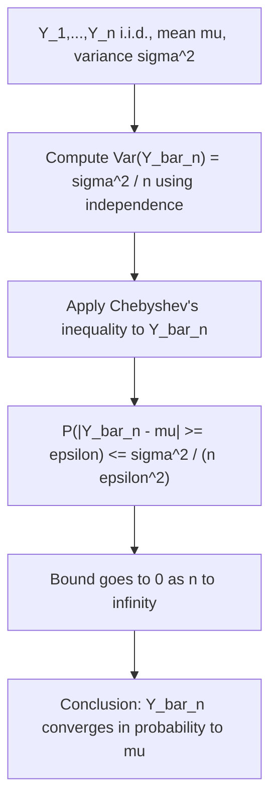

## Weak Law of Large Numbers Connection

### Overview

This topic examines, in depth, the specific probabilistic machinery underlying the AEP and typical set results covered previously: the weak law of large numbers (WLLN). While earlier discussions invoked the WLLN briefly to justify convergence of the normalized log-probability, here the law itself is stated precisely, proven, and its convergence mode is examined carefully to clarify exactly what guarantees it does and does not provide.

### Statement of the Weak Law of Large Numbers

Let $Y_1, Y_2, \ldots, Y_n$ be i.i.d. random variables with finite mean $\mathbb{E}[Y_i] = \mu$ and finite variance $\text{Var}(Y_i) = \sigma^2$. Define the sample mean:

$$\bar{Y}_n = \frac{1}{n}\sum_{i=1}^n Y_i$$

The weak law of large numbers states that $\bar{Y}_n$ converges in probability to $\mu$:

$$\bar{Y}_n \xrightarrow{P} \mu \quad \text{as } n \to \infty$$

Formally, convergence in probability means: for every $\epsilon > 0$,

$$\lim_{n\to\infty} P(|\bar{Y}_n - \mu| \geq \epsilon) = 0$$

**Key Points**
- The WLLN requires only finite mean and finite variance (a common sufficient condition, though weaker conditions exist for some versions of the law).
- Convergence in probability is weaker than almost sure convergence (the subject of the strong law of large numbers) — it does not guarantee that $\bar{Y}_n$ eventually stays close to $\mu$ forever, only that the probability of a large deviation vanishes at each fixed large $n$.
- In the AEP context, $Y_i = -\log P(X_i)$, and $\mu = \mathbb{E}[-\log P(X_i)] = H(X)$ by the definition of entropy — this substitution is exactly what connects the WLLN to entropy convergence.

### Proof via Chebyshev's Inequality

The standard elementary proof of the WLLN (under the finite-variance assumption) uses Chebyshev's inequality. For the sample mean $\bar{Y}_n$, using independence to compute its variance:

$$\text{Var}(\bar{Y}_n) = \text{Var}\left(\frac{1}{n}\sum_{i=1}^n Y_i\right) = \frac{1}{n^2}\sum_{i=1}^n \text{Var}(Y_i) = \frac{n\sigma^2}{n^2} = \frac{\sigma^2}{n}$$

Applying Chebyshev's inequality, which states $P(|Z - \mathbb{E}[Z]| \geq \epsilon) \leq \frac{\text{Var}(Z)}{\epsilon^2}$ for any random variable $Z$:

$$P(|\bar{Y}_n - \mu| \geq \epsilon) \leq \frac{\text{Var}(\bar{Y}_n)}{\epsilon^2} = \frac{\sigma^2}{n\epsilon^2}$$

As $n \to \infty$, the right-hand side $\frac{\sigma^2}{n\epsilon^2} \to 0$ for any fixed $\epsilon > 0$, which directly establishes:

$$\lim_{n\to\infty} P(|\bar{Y}_n - \mu| \geq \epsilon) = 0$$

completing the proof.

### Diagram: WLLN Proof Structure

### Applying the WLLN to Derive the AEP

Substituting $Y_i = -\log P(X_i)$ directly into the WLLN framework recovers the AEP result from the earlier topic. Since $X_1,\ldots,X_n$ are i.i.d. draws from $P$, the transformed variables $Y_i = -\log P(X_i)$ are also i.i.d. (as a fixed function of i.i.d. variables), with:

$$\mathbb{E}[Y_i] = \mathbb{E}[-\log P(X_i)] = H(X)$$

Provided $\text{Var}(-\log P(X_i)) < \infty$ (finite variance of the "self-information" random variable, a mild condition satisfied for essentially all sources of practical interest), the WLLN applies directly:

$$-\frac{1}{n}\sum_{i=1}^n \log P(X_i) = \bar{Y}_n \xrightarrow{P} H(X)$$

which is exactly the AEP statement derived previously, now shown explicitly as a direct instance of the general WLLN rather than merely asserted.

**Example**
Consider again the biased coin with $P(1) = 0.9, P(0) = 0.1$. The random variable $Y = -\log_2 P(X)$ takes value $-\log_2 0.9 \approx 0.152$ bits when $X=1$ (probability 0.9), and $-\log_2 0.1 \approx 3.322$ bits when $X=0$ (probability 0.1).

Compute $\mathbb{E}[Y]$:
$$\mathbb{E}[Y] = 0.9(0.152) + 0.1(3.322) = 0.137 + 0.332 = 0.469 \text{ bits} = H(X)$$

confirming the expected value matches entropy exactly, as required.

Compute $\text{Var}(Y)$ using $\mathbb{E}[Y^2] - (\mathbb{E}[Y])^2$:
$$\mathbb{E}[Y^2] = 0.9(0.152)^2 + 0.1(3.322)^2 = 0.9(0.0231) + 0.1(11.036) = 0.0208 + 1.1036 = 1.124$$
$$\text{Var}(Y) = 1.124 - (0.469)^2 = 1.124 - 0.220 = 0.904$$

Using this variance, Chebyshev's inequality gives a concrete finite-$n$ bound: for $n = 1000$ and $\epsilon = 0.05$,
$$P(|\bar{Y}_{1000} - 0.469| \geq 0.05) \leq \frac{0.904}{1000 \times 0.05^2} = \frac{0.904}{2.5} \approx 0.362$$

This Chebyshev bound is fairly loose (it does not guarantee a small deviation probability even at $n=1000$), illustrating a key limitation discussed next: while the WLLN guarantees eventual convergence, the Chebyshev-based bound is often far from tight in practice, and tighter concentration inequalities are typically needed for meaningful finite-$n$ guarantees.

### Diagram: Convergence in Probability Visualized

<svg xmlns="http://www.w3.org/2000/svg" viewBox="0 0 640 260">
  <text x="320" y="24" font-size="15" font-family="sans-serif" text-anchor="middle" fill="#222" font-weight="bold">Convergence in Probability of the Sample Mean (svg_diagram)</text>

  <line x1="80" y1="220" x2="560" y2="220" stroke="#333" stroke-width="1.2" />
  <line x1="80" y1="220" x2="80" y2="40" stroke="#333" stroke-width="1.2" />

  <text x="320" y="245" font-size="12" font-family="sans-serif" text-anchor="middle">n (sample size)</text>
  <text x="30" y="130" font-size="12" font-family="sans-serif" text-anchor="middle" transform="rotate(-90 30 130)">P(|Y_bar_n − mu| ≥ ε)</text>

  <path d="M 100 60 Q 250 140 400 190 Q 480 205 550 212" fill="none" stroke="#4a7fc9" stroke-width="2.5" />

  <line x1="80" y1="212" x2="560" y2="212" stroke="#999" stroke-width="1" stroke-dasharray="3,2" />
  <text x="500" y="205" font-size="10" font-family="sans-serif" fill="#999">approaches 0</text>
</svg>

### Distinguishing Weak vs. Strong Law of Large Numbers

The weak law guarantees convergence in probability, while the strong law of large numbers (SLLN) guarantees the stronger property of almost sure convergence:

$$P\left(\lim_{n\to\infty} \bar{Y}_n = \mu\right) = 1$$

Almost sure convergence implies convergence in probability, but not vice versa in general (though for many common cases, both hold simultaneously under similar moment conditions). The distinction matters for the AEP: the classical AEP statement is typically proven and stated using the weak law (convergence in probability), though a strong law version of the AEP also exists (sometimes called the Shannon-McMillan-Breiman theorem in the more general context of stationary ergodic processes), providing the stronger almost-sure convergence guarantee.

**Key Points**
- The weak law suffices to establish the core typical-set properties (high probability, bounded cardinality) needed for source coding theorems.
- The strong law / Shannon-McMillan-Breiman theorem extends the AEP beyond i.i.d. sources to the broader class of stationary ergodic processes, a significant generalization used in more advanced treatments.
- For the purposes of the standard source coding theorem, the weak law's convergence-in-probability guarantee is sufficient; the strong law's almost-sure guarantee, while stronger, is not strictly necessary for the basic achievability and converse results.

### Common Pitfalls

- Confusing convergence in probability with convergence of every individual realization — the WLLN does not claim that $\bar{Y}_n$ gets close to $\mu$ for a specific fixed sequence forever; it only bounds the probability of large deviations at each $n$.
- Assuming the Chebyshev-based bound is tight — as shown in the worked example, the Chebyshev inequality is often quite loose; tighter bounds (e.g., via Hoeffding's inequality for bounded random variables, or the central limit theorem for approximate normal behavior) frequently give much sharper finite-sample guarantees.
- Overlooking the finite-variance requirement — the elementary Chebyshev-based proof of the WLLN explicitly requires $\text{Var}(Y_i) < \infty$; extensions exist for weaker conditions (e.g., using truncation arguments), but these require more sophisticated proof techniques.
- [Inference] Whether the finite-variance condition for $Y_i = -\log P(X_i)$ holds depends on the tail behavior of the source distribution $P$; for most standard discrete or well-behaved continuous distributions this condition is satisfied, but pathological distributions with extremely heavy tails in the probability values could in principle violate it, though such cases are atypical in practical information-theoretic applications.

### Applications

- **AEP and typical sets**: As demonstrated, the WLLN is the direct probabilistic engine underlying the AEP and all associated typical-set-based coding results.
- **Monte Carlo estimation**: The WLLN is the theoretical justification for why sample averages from repeated random simulation converge to true expectations, foundational across computational statistics.
- **Statistical estimation and consistency**: Many estimators (e.g., the sample mean as an estimator of the population mean) are shown to be consistent using WLLN-type arguments, connecting information theory to broader statistical theory.
- **Concentration inequalities in learning theory**: The WLLN is the conceptual precursor to modern concentration inequalities (Hoeffding, Bernstein, McDiarmid) used extensively in statistical learning theory to bound generalization error.

**Related Topics**
- Strong law of large numbers and almost sure convergence
- Shannon-McMillan-Breiman theorem for stationary ergodic processes
- Chebyshev's inequality and other concentration inequalities (Hoeffding, Bernstein)
- Central limit theorem and its refinement of convergence rate behavior
- Modes of stochastic convergence (in probability, almost surely, in distribution, in mean)
- Concentration inequalities in statistical learning theory and generalization bounds