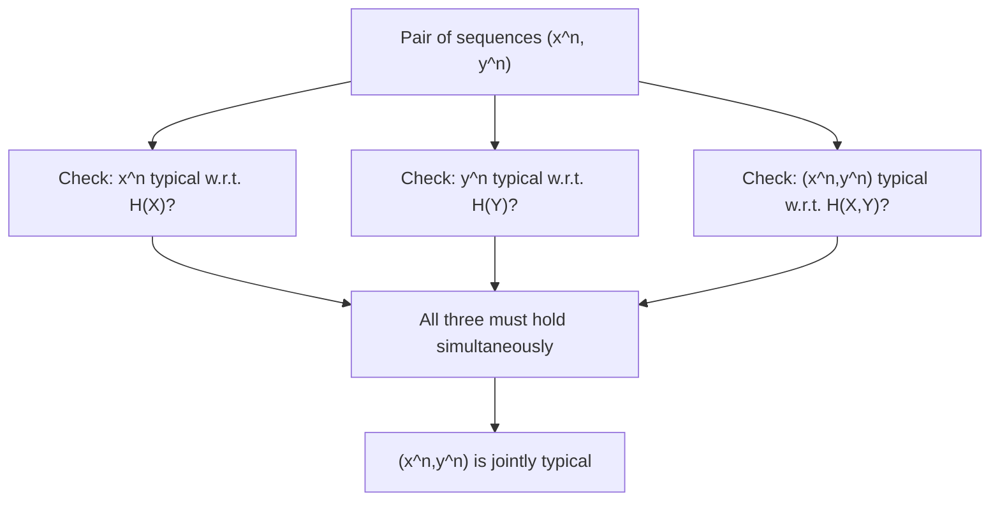
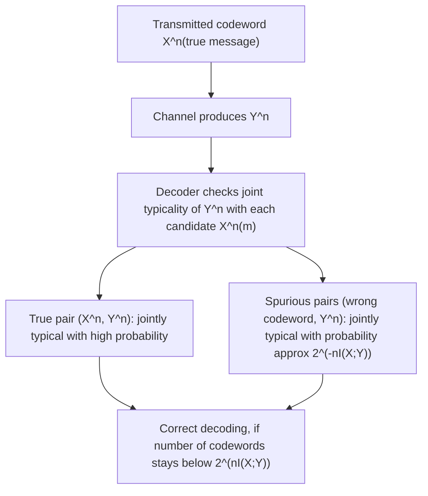

## Joint AEP for Pairs of Sequences

### Motivation

The single-sequence AEP, covered previously, concerns the behavior of one i.i.d. sequence drawn from a distribution $P$. Many information-theoretic problems, however, involve two correlated sequences simultaneously — most importantly, the input and output of a noisy channel. The joint AEP extends the typical-set framework to pairs of sequences $(X^n, Y^n)$ drawn from a joint distribution $P(x,y)$, introducing the essential concept of **joint typicality**, which underlies the achievability proof of Shannon's noisy channel coding theorem.

### Setup

Let $(X_1,Y_1), (X_2,Y_2), \ldots, (X_n,Y_n)$ be pairs of random variables drawn i.i.d. from a joint distribution $P(x,y)$, with marginals $P(x)$ and $P(y)$. Denote a specific realized pair of sequences as $(x^n, y^n) = ((x_1,\ldots,x_n),(y_1,\ldots,y_n))$.

### Definition of the Jointly Typical Set

The jointly typical set $A_\epsilon^{(n)}$ consists of pairs of sequences $(x^n, y^n)$ satisfying three simultaneous epsilon-tolerance conditions:

$$\left| -\frac{1}{n}\log P(x^n) - H(X) \right| < \epsilon$$

$$\left| -\frac{1}{n}\log P(y^n) - H(Y) \right| < \epsilon$$

$$\left| -\frac{1}{n}\log P(x^n,y^n) - H(X,Y) \right| < \epsilon$$

In words: not only must each individual sequence be typical with respect to its own marginal entropy, but the pair together must also be typical with respect to the joint entropy $H(X,Y)$.

**Key Points**
- Joint typicality is a strictly stronger requirement than each sequence being marginally typical on its own — a pair can have both $x^n$ and $y^n$ individually typical while still failing to be jointly typical, if their combination doesn't reflect the true joint statistics.
- The joint AEP generalizes directly from the single-variable case by applying the WLLN simultaneously to three sequences of i.i.d. random variables: $-\log P(X_i)$, $-\log P(Y_i)$, and $-\log P(X_i,Y_i)$.
- Joint typicality is the essential tool for channel coding theorem proofs, where the transmitted codeword and received sequence must be checked for joint (not merely marginal) consistency with the channel statistics.

### Diagram: Joint Typicality Requires All Three Conditions

### Properties of the Jointly Typical Set

The jointly typical set satisfies a direct extension of the three single-sequence AEP properties:

**Property 1 — High Probability**: For sufficiently large $n$, if $(X^n,Y^n)$ are drawn jointly from $P(x,y)$ (i.e., the true joint distribution), then:

$$P((X^n,Y^n) \in A_\epsilon^{(n)}) > 1-\epsilon$$

**Property 2 — Bounded Cardinality**:

$$|A_\epsilon^{(n)}| \leq 2^{n(H(X,Y)+\epsilon)}$$

**Property 3 — Independent Pairing Probability**: This is the property most specific to (and most important for) the joint AEP, distinguishing it from a simple restatement of the single-sequence result. If $\tilde{X}^n$ and $\tilde{Y}^n$ are drawn **independently** according to their respective marginals $P(x)$ and $P(y)$ (rather than jointly from $P(x,y)$), the probability that this independently-drawn pair happens to land in the jointly typical set is approximately:

$$P((\tilde{X}^n,\tilde{Y}^n) \in A_\epsilon^{(n)}) \approx 2^{-nI(X;Y)}$$

More precisely, this probability is bounded as:

$$(1-\epsilon) 2^{-n(I(X;Y)+3\epsilon)} \leq P((\tilde{X}^n,\tilde{Y}^n)\in A_\epsilon^{(n)}) \leq 2^{-n(I(X;Y)-3\epsilon)}$$

**Key Points**
- Property 3 is the critical result exploited in channel coding proofs: it shows that if a decoder searches through independently-generated codewords for one that appears jointly typical with the received sequence, the probability of a spurious (incorrect) match decays exponentially in $n$, at a rate governed exactly by the mutual information $I(X;Y)$.
- This is precisely why mutual information $I(X;Y)$, rather than any other quantity, emerges as the fundamental rate at which reliable communication is possible — it directly controls the rate of false-positive matches in the typical-set decoding scheme.
- The exponent $I(X;Y) = H(X)+H(Y)-H(X,Y)$ measures exactly how much "extra constraint" joint typicality imposes beyond the two marginal typicality conditions considered separately.

### Proof Sketch of Property 3

The proof relies on combining the bounded cardinality property with the near-uniform probability property of each marginal typical set. Since there are approximately $2^{nH(X)}$ typical $x^n$ sequences and $2^{nH(Y)}$ typical $y^n$ sequences (by the single-variable AEP), a naive count of possible independent pairings gives approximately $2^{n(H(X)+H(Y))}$ total pairs. However, only approximately $2^{nH(X,Y)}$ of these pairs are actually jointly typical (from Property 2). Since $\tilde{X}^n$ and $\tilde{Y}^n$ are independent, each possible pairing is (approximately) equally likely among the roughly $2^{n(H(X)+H(Y))}$ combinations of typical sequences, giving:

$$P((\tilde{X}^n,\tilde{Y}^n)\in A_\epsilon^{(n)}) \approx \frac{2^{nH(X,Y)}}{2^{n(H(X)+H(Y))}} = 2^{n(H(X,Y)-H(X)-H(Y))} = 2^{-nI(X;Y)}$$

using the identity $I(X;Y) = H(X)+H(Y)-H(X,Y)$ established in earlier mutual information topics.

### Diagram: Why the Exponent Is Mutual Information

<svg xmlns="http://www.w3.org/2000/svg" viewBox="0 0 640 260">
  <text x="320" y="24" font-size="15" font-family="sans-serif" text-anchor="middle" fill="#222" font-weight="bold">Independent Pairing Landing in Joint Typical Set (svg_diagram)</text>

  <rect x="60" y="60" width="230" height="150" fill="none" stroke="#333" stroke-width="1.5" />
  <text x="175" y="80" font-size="11" font-family="sans-serif" text-anchor="middle" fill="#333">≈2^(nH(X)) typical x^n</text>

  <rect x="350" y="60" width="230" height="150" fill="none" stroke="#333" stroke-width="1.5" />
  <text x="465" y="80" font-size="11" font-family="sans-serif" text-anchor="middle" fill="#333">≈2^(nH(Y)) typical y^n</text>

  <circle cx="320" cy="150" r="55" fill="#a8d5ba" opacity="0.6" stroke="#333" stroke-width="1.5" />
  <text x="320" y="145" font-size="10" font-family="sans-serif" text-anchor="middle" fill="#111">Jointly typical</text>
  <text x="320" y="160" font-size="10" font-family="sans-serif" text-anchor="middle" fill="#111">≈2^(nH(X,Y)) pairs</text>

  <text x="320" y="235" font-size="12" font-family="sans-serif" text-anchor="middle" fill="#333">Fraction of all pairs that are jointly typical ≈ 2^(-nI(X;Y))</text>
</svg>

**Example**
Consider a binary symmetric channel with input $X \sim \text{Bernoulli}(0.5)$ and crossover (flip) probability $p=0.1$, so the output $Y$ is $X$ flipped with probability $0.1$. Recall from the data processing inequality discussion that $I(X;Y) = 1 - H_b(0.1) \approx 1 - 0.469 = 0.531$ bits.

For a block length of $n = 50$, the joint AEP predicts that an independently-generated pair $(\tilde{X}^{50}, \tilde{Y}^{50})$ — i.e., an output sequence not actually produced by passing $\tilde{X}^{50}$ through the channel, but instead generated separately — will land in the jointly typical set with probability approximately:

$$P \approx 2^{-50 \times 0.531} = 2^{-26.55}$$

This exponentially small probability is exactly what allows a channel decoder to distinguish the true (correctly channel-generated) pairing from spurious, incorrectly matched pairings with high confidence, provided the number of candidate codewords does not grow faster than this exponential decay rate allows — precisely the condition captured by the channel capacity bound $C = \max_{P(x)} I(X;Y)$.

### Diagram: Joint AEP in Channel Decoding

### Relation to Channel Capacity

Property 3 directly explains why channel capacity $C = \max_{P(x)} I(X;Y)$ represents the fundamental limit on reliable communication rate. If a code contains approximately $2^{nR}$ codewords (where $R$ is the transmission rate in bits per channel use), the expected number of spurious codewords that would incorrectly appear jointly typical with a given received sequence is approximately:

$$2^{nR} \times 2^{-nI(X;Y)} = 2^{n(R-I(X;Y))}$$

If $R < I(X;Y)$, this expected number of spurious matches vanishes exponentially as $n\to\infty$, allowing reliable decoding. If $R > I(X;Y)$, the expected number of spurious matches grows exponentially, making reliable decoding impossible — this is exactly the achievability/converse boundary that defines channel capacity, with capacity given by choosing the input distribution $P(x)$ that maximizes $I(X;Y)$.

### Common Pitfalls

- Assuming marginal typicality of $x^n$ and $y^n$ separately implies joint typicality of the pair — this is false in general; joint typicality is a strictly additional requirement, not automatically implied by the two marginal conditions.
- Misapplying Property 3 to non-independent pairings — the exponentially small probability $2^{-nI(X;Y)}$ applies specifically to independently generated pairs; a pair actually drawn from the true joint distribution $P(x,y)$ has high (not low) probability of being jointly typical, per Property 1.
- Forgetting that all three joint AEP properties are asymptotic statements ("for sufficiently large $n$") — finite-blocklength behavior can deviate substantially, an issue also noted in the single-sequence AEP discussion.
- [Inference] The specific value of $n$ required for the joint AEP bounds to hold within a useful tolerance depends on the joint distribution's higher-order statistics (variances and covariances of the relevant log-probability terms), and this can differ substantially between channels with the same mutual information but different underlying structure, though the asymptotic capacity result itself remains unaffected.

### Applications

- **Shannon's noisy channel coding theorem (achievability)**: The primary and most important application, using joint typicality decoding to prove that rates up to capacity $C$ are achievable with vanishing error probability.
- **Multiple access and broadcast channels**: Joint typicality arguments extend to more than two sequences simultaneously, forming the basis for achievability proofs in network information theory with multiple correlated sources or destinations.
- **Distributed source coding (Slepian-Wolf)**: Joint typicality of correlated source sequences underlies achievability proofs for compressing correlated sources separately but decoding them jointly.
- **Rate-distortion theory**: Joint typicality between source sequences and their reconstructions is used analogously to establish achievability of rate-distortion bounds in lossy compression.

**Related Topics**
- Shannon's noisy channel coding theorem: full achievability and converse proof
- Channel capacity and its characterization as maximized mutual information
- Random coding argument and codebook generation in channel coding proofs
- Slepian-Wolf theorem for distributed source coding of correlated sources
- Multiple access channels and network information theory
- Method of types as an alternative technique for proving AEP-related results