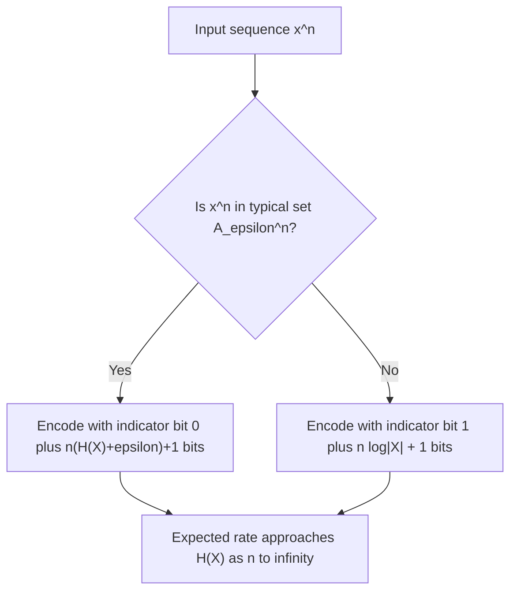
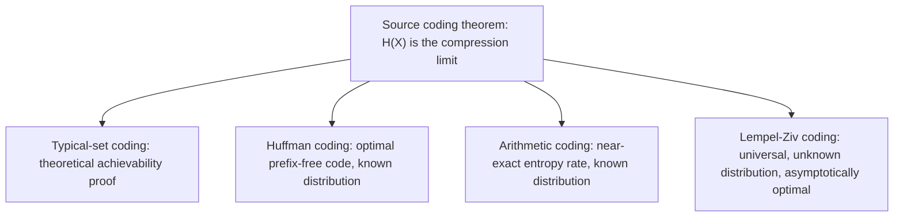

## Implications for Data Compression

### Overview

This topic synthesizes the AEP, typical sets, and entropy concepts developed previously into their most direct practical consequence: the theoretical limits and constructive methods of lossless data compression. It connects the abstract asymptotic results to concrete coding schemes and quantifies exactly how close to the entropy limit practical compression can approach.

### The Fundamental Compression Limit

Shannon's source coding theorem states that for an i.i.d. source with entropy $H(X)$, the average number of bits per symbol required for lossless compression is bounded below by $H(X)$, and this bound can be approached arbitrarily closely as block length $n \to \infty$. Formally, for any $\epsilon > 0$, there exists a compression scheme with rate $R < H(X) + \epsilon$ bits per symbol achieving vanishing error probability as $n$ grows, while no scheme achieving rate $R < H(X)$ can have vanishing error probability.

**Key Points**
- $H(X)$ is both the achievable and the fundamental lower-bound rate — this two-sided result (achievability and converse) is what makes entropy the exact, not merely approximate, compression limit.
- The AEP and typical-set machinery, covered in the preceding topics, provide the direct constructive proof of achievability.
- The converse (impossibility of rates below $H(X)$) follows from a source-coding analogue of Fano-type arguments, showing that insufficient bits per symbol necessarily forces reconstruction error probability bounded away from zero.

### Typical-Set-Based Compression Scheme

The direct construction, foreshadowed in the typical sets discussion, proceeds as follows: partition all possible length-$n$ sequences into the typical set $A_\epsilon^{(n)}$ and its complement (the atypical sequences).

**Step 1 — Encode typical sequences**: Since $|A_\epsilon^{(n)}| \leq 2^{n(H(X)+\epsilon)}$, each typical sequence can be assigned a unique codeword of length $n(H(X)+\epsilon)+1$ bits (the $+1$ accounts for rounding to an integer number of bits), prefixed with a single indicator bit (e.g., $0$) denoting "typical."

**Step 2 — Encode atypical sequences**: Since there are at most $|\mathcal{X}|^n$ total sequences, each atypical sequence can be assigned a codeword of length $n\log|\mathcal{X}|+1$ bits, prefixed with an indicator bit (e.g., $1$) denoting "atypical."

**Step 3 — Compute expected rate**: Because $P(A_\epsilon^{(n)}) > 1-\epsilon$ (Property 1 of the typical set), the atypical sequences occur with vanishing total probability, so their contribution to the expected code length becomes negligible as $n\to\infty$, and the overall expected rate approaches $H(X)$ bits per symbol.

### Diagram: Two-Part Typical-Set Coding Scheme

### Quantifying the Expected Rate

Let $l(x^n)$ denote the codeword length assigned to sequence $x^n$ under this scheme. The expected code length per symbol is:

$$\frac{1}{n}\mathbb{E}[l(X^n)] = \frac{1}{n}\left[\sum_{x^n \in A_\epsilon^{(n)}} P(x^n)(n(H(X)+\epsilon)+2) + \sum_{x^n \notin A_\epsilon^{(n)}} P(x^n)(n\log|\mathcal{X}|+2)\right]$$

Bounding this using $P(A_\epsilon^{(n)}) \leq 1$ and $P(A_\epsilon^{(n),c}) < \epsilon$:

$$\frac{1}{n}\mathbb{E}[l(X^n)] \leq (H(X)+\epsilon) + \epsilon \log|\mathcal{X}| + \frac{2}{n} = H(X) + \epsilon(1+\log|\mathcal{X}|) + \frac{2}{n}$$

As $n\to\infty$ and $\epsilon \to 0$ (in that order, or jointly with appropriate rate conditions), the expected rate per symbol converges to exactly $H(X)$, confirming achievability.

**Example**
Consider a source with alphabet size $|\mathcal{X}| = 4$ and entropy $H(X) = 1.5$ bits (less than the maximum possible $\log_2 4 = 2$ bits, indicating some non-uniformity in the source distribution). For a block length $n = 1000$ and $\epsilon = 0.01$:

Typical sequence codeword length: approximately $1000(1.5+0.01)+1 = 1511$ bits, or about $1.511$ bits per symbol.

If instead a naive fixed-length code assigned $\log_2 4 = 2$ bits to every possible sequence (ignoring typicality), the rate would be a full $2$ bits per symbol — approximately $32\%$ higher than the typical-set-based scheme's rate. This numerically illustrates the compression gain available by exploiting the source's non-uniform statistics via the typical-set construction, approaching the theoretical limit of $1.5$ bits per symbol as $\epsilon \to 0$ and $n$ grows further.

### Diagram: Achievable Rate vs. Naive Fixed-Length Coding

<svg xmlns="http://www.w3.org/2000/svg" viewBox="0 0 640 240">
  <text x="320" y="24" font-size="15" font-family="sans-serif" text-anchor="middle" fill="#222" font-weight="bold">Typical-Set Coding vs. Naive Fixed-Length Coding (svg_diagram)</text>

  <line x1="100" y1="200" x2="540" y2="200" stroke="#333" stroke-width="1.2" />

  <rect x="140" y="80" width="90" height="120" fill="#f4b183" stroke="#333" stroke-width="1.5" />
  <text x="185" y="75" font-size="12" font-family="sans-serif" text-anchor="middle">2.0 bits/symbol</text>
  <text x="185" y="220" font-size="11" font-family="sans-serif" text-anchor="middle">Naive fixed-length</text>

  <rect x="400" y="110" width="90" height="90" fill="#a8d5ba" stroke="#333" stroke-width="1.5" />
  <text x="445" y="105" font-size="12" font-family="sans-serif" text-anchor="middle">1.5 bits/symbol</text>
  <text x="445" y="220" font-size="11" font-family="sans-serif" text-anchor="middle">Typical-set coding (H(X))</text>
</svg>

### Practical Compression Algorithms and the Entropy Limit

While the typical-set scheme is a theoretical construction (not directly implemented in practice, since explicitly enumerating typical sequences is computationally intractable for realistic block lengths), practical algorithms achieve rates approaching $H(X)$ through different, computationally efficient mechanisms:

**Huffman coding**: Constructs an optimal prefix-free code for a known source distribution, achieving expected rate within $1$ bit of $H(X)$ for single-symbol codes, and approaching $H(X)$ arbitrarily closely when applied to blocks of symbols rather than individual symbols.

**Arithmetic coding**: Achieves expected rate even closer to $H(X)$ than Huffman coding (avoiding the integer-bits-per-symbol constraint that limits Huffman coding's efficiency), by representing an entire sequence as a single fractional number within an interval whose size reflects the sequence's probability.

**Lempel-Ziv coding (LZ77/LZ78)**: A universal compression method that does not require prior knowledge of the source distribution, yet is proven (via typical-set / AEP-style arguments applied to more general sources) to asymptotically achieve the entropy rate for a broad class of sources, including stationary ergodic sources beyond the simple i.i.d. case.

**Key Points**
- The typical-set construction is primarily a theoretical/proof device establishing achievability, not a practical algorithm — real compressors use different constructive techniques that achieve the same asymptotic rate.
- Huffman coding is optimal among prefix-free codes for a known distribution but can be suboptimal for a single symbol at a time; block-based Huffman coding narrows this gap.
- Arithmetic coding and its modern variants (range coding) are widely used in practice precisely because they approach the entropy limit more tightly than symbol-by-symbol Huffman coding.

### Diagram: From Theory to Practical Algorithms

### The Redundancy Gap

The difference between a practical code's actual rate and the entropy limit $H(X)$ is called **redundancy**:

$$\text{Redundancy} = R_{\text{actual}} - H(X)$$

For Huffman coding applied symbol-by-symbol, redundancy is bounded by $1$ bit per symbol in the worst case (a classical result), but this gap shrinks toward zero when Huffman coding is applied to increasingly long blocks of symbols jointly, exactly mirroring the $n\to\infty$ behavior of the typical-set scheme.

### Common Pitfalls

- Assuming the entropy limit $H(X)$ can be achieved exactly at any finite block length — the source coding theorem is fundamentally asymptotic; finite-length codes always carry some redundancy, however small.
- Confusing Huffman coding's single-symbol suboptimality (up to $1$ bit of redundancy) with a failure of the source coding theorem itself — the theorem's bound is approached only in the limit of coding over long blocks or using more sophisticated techniques like arithmetic coding.
- Assuming universal compressors like Lempel-Ziv achieve the entropy rate for any source without qualification — the relevant theoretical guarantees typically require the source to be stationary and ergodic; performance can degrade for sources violating these assumptions.
- [Inference] The practical compression ratio achieved by real-world algorithms on actual data (e.g., text, images) depends heavily on how well the assumed statistical model (i.i.d., Markov, or more general) matches the true, often highly structured, statistics of the data; entropy estimates derived from simplistic models may substantially overstate the achievable compression compared to more sophisticated context-based models.

### Applications

- **General-purpose file compression**: Algorithms like DEFLATE (used in ZIP, gzip) combine Lempel-Ziv-style dictionary methods with Huffman coding, directly applying these entropy-based principles.
- **Modern multimedia compression**: Formats such as JPEG, MP3, and video codecs use entropy coding stages (often arithmetic or range coding) as a final step after lossy transformation, extracting the remaining statistical redundancy predicted by these theoretical limits.
- **Text compression benchmarks**: The theoretical entropy rate of natural language (estimated via various statistical models) provides a benchmark against which practical text compressors are evaluated.
- **Communication protocol design**: Source coding principles inform the design of efficient data serialization and transmission formats where bandwidth or storage is constrained.

**Related Topics**
- Huffman coding algorithm and prefix-free code construction
- Arithmetic coding and its near-optimal entropy achievement
- Lempel-Ziv universal compression and dictionary-based methods
- Kraft-McMillan inequality and prefix-free code existence conditions
- Shannon-McMillan-Breiman theorem for stationary ergodic sources
- Rate-distortion theory for lossy compression beyond the lossless limit