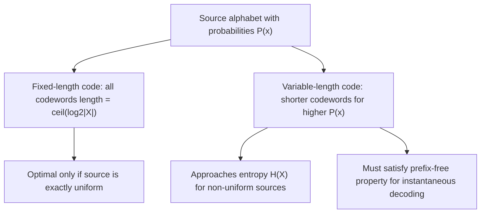

## Fixed-Length vs. Variable-Length Codes

### Overview

This topic examines the two fundamental structural approaches to source coding — fixed-length and variable-length codes — comparing their design principles, efficiency trade-offs, and the specific conditions under which each is preferable. It draws directly on the entropy limit and typical-set concepts established previously to formalize why variable-length codes generally achieve better compression for non-uniform sources.

### Fixed-Length Codes

A fixed-length code assigns every source symbol (or every sequence of symbols, in block coding) a codeword of the same, predetermined length. For a source alphabet of size $|\mathcal{X}|$, encoding single symbols requires:

$$l = \lceil \log_2 |\mathcal{X}| \rceil \text{ bits per symbol}$$

This length is fixed regardless of the actual probability distribution over the alphabet — a fixed-length code treats a highly probable symbol identically (in terms of code length) to a rare one.

**Key Points**
- Fixed-length codes are simple to implement, requiring no variable-length parsing on decoding (each codeword occupies exactly the same number of bits, so codeword boundaries are always known in advance).
- Fixed-length codes are optimal only when the source distribution is exactly uniform, since in that case $H(X) = \log_2|\mathcal{X}|$ exactly, matching the fixed-length rate with no redundancy.
- For any non-uniform source, fixed-length single-symbol coding is strictly suboptimal, wasting bits relative to the entropy limit $H(X)$ established by the source coding theorem.

### Variable-Length Codes

A variable-length code assigns codewords of differing lengths to different source symbols, typically assigning shorter codewords to more probable symbols and longer codewords to less probable ones. This is the direct mechanism by which practical codes (Huffman, arithmetic coding, discussed previously) approach the entropy limit.

### The Prefix (Prefix-Free) Condition

For variable-length codes to be uniquely decodable without needing a separator symbol between codewords, the standard requirement is the **prefix property** (also called prefix-free or instantaneous): no codeword is a prefix of any other codeword. This property allows a decoder to determine the end of each codeword as soon as it is received, without needing to look ahead at future symbols.

**Key Points**
- Prefix-free codes are a strict subset of uniquely decodable codes, but they are the standard choice in practice because they permit instantaneous (symbol-by-symbol) decoding, unlike some uniquely decodable codes that require examining an entire sequence before decoding can begin.
- Not all uniquely decodable codes are prefix-free, but every prefix-free code is uniquely decodable — prefix-free is a sufficient, not necessary, condition for unique decodability.
- The Kraft-McMillan inequality (covered in the following topic) precisely characterizes which sets of codeword lengths admit a valid prefix-free code.

### Diagram: Fixed-Length vs. Variable-Length Structure

### Diagram: Prefix-Free Code Structure

<svg xmlns="http://www.w3.org/2000/svg" viewBox="0 0 640 260">
  <text x="320" y="24" font-size="15" font-family="sans-serif" text-anchor="middle" fill="#222" font-weight="bold">Prefix-Free Code as a Binary Tree (svg_diagram)</text>

  <circle cx="320" cy="50" r="6" fill="#333" />

  <line x1="320" y1="50" x2="200" y2="110" stroke="#333" stroke-width="1.5" />
  <line x1="320" y1="50" x2="440" y2="110" stroke="#333" stroke-width="1.5" />
  <text x="245" y="75" font-size="11" font-family="sans-serif">0</text>
  <text x="395" y="75" font-size="11" font-family="sans-serif">1</text>

  <rect x="170" y="110" width="60" height="30" fill="#a8d5ba" stroke="#333" />
  <text x="200" y="130" font-size="11" font-family="sans-serif" text-anchor="middle">Symbol A (code: 0)</text>

  <line x1="440" y1="110" x2="380" y2="170" stroke="#333" stroke-width="1.5" />
  <line x1="440" y1="110" x2="500" y2="170" stroke="#333" stroke-width="1.5" />
  <text x="400" y="145" font-size="11" font-family="sans-serif">0</text>
  <text x="480" y="145" font-size="11" font-family="sans-serif">1</text>

  <rect x="350" y="170" width="60" height="30" fill="#f4b183" stroke="#333" />
  <text x="380" y="190" font-size="10" font-family="sans-serif" text-anchor="middle">Symbol B (10)</text>

  <rect x="470" y="170" width="60" height="30" fill="#c9b8e8" stroke="#333" />
  <text x="500" y="190" font-size="10" font-family="sans-serif" text-anchor="middle">Symbol C (11)</text>

  <text x="320" y="235" font-size="12" font-family="sans-serif" text-anchor="middle" fill="#333">Symbols occupy leaves only — no codeword is a prefix of another</text>
</svg>

### Efficiency Comparison: A Worked Example

Consider a source with alphabet $\{A, B, C, D\}$ and probabilities $P(A)=0.5, P(B)=0.25, P(C)=0.125, P(D)=0.125$. The entropy is:

$$H(X) = -(0.5\log_2 0.5 + 0.25\log_2 0.25 + 0.125\log_2 0.125 + 0.125\log_2 0.125)$$
$$= 0.5(1) + 0.25(2) + 0.125(3) + 0.125(3) = 0.5+0.5+0.375+0.375 = 1.75 \text{ bits}$$

**Fixed-length code**: With $|\mathcal{X}|=4$, a fixed-length code requires $\lceil\log_2 4\rceil = 2$ bits per symbol, regardless of the actual probabilities.

**Variable-length code** (matching this distribution): Assign $A \to 0$ (1 bit), $B \to 10$ (2 bits), $C \to 110$ (3 bits), $D \to 111$ (3 bits). The expected code length is:

$$\mathbb{E}[l] = 0.5(1) + 0.25(2) + 0.125(3) + 0.125(3) = 0.5+0.5+0.375+0.375 = 1.75 \text{ bits}$$

**Key Points**
- In this example, the variable-length code achieves the expected length of exactly $1.75$ bits, matching entropy $H(X)$ exactly — this occurs because the chosen probabilities happen to be exact powers of $\frac{1}{2}$, allowing a perfectly efficient prefix-free code (a special case discussed further in the Kraft-McMillan and Huffman coding treatments).
- The fixed-length code's $2$ bits per symbol represents a redundancy of $2 - 1.75 = 0.25$ bits per symbol compared to the entropy limit — wasted capacity purely due to ignoring the non-uniform structure of the source.
- This example illustrates the general principle: variable-length coding exploits known probability structure to reduce expected code length below what fixed-length coding can achieve, with the gap growing as the source distribution becomes more non-uniform (skewed).

### Diagram: Redundancy Comparison

<svg xmlns="http://www.w3.org/2000/svg" viewBox="0 0 640 220">
  <text x="320" y="24" font-size="15" font-family="sans-serif" text-anchor="middle" fill="#222" font-weight="bold">Redundancy: Fixed-Length vs. Variable-Length (svg_diagram)</text>

  <line x1="100" y1="180" x2="540" y2="180" stroke="#333" stroke-width="1.2" />

  <rect x="150" y="60" width="90" height="120" fill="#f4b183" stroke="#333" stroke-width="1.5" />
  <text x="195" y="55" font-size="12" font-family="sans-serif" text-anchor="middle">2.0 bits</text>
  <text x="195" y="200" font-size="11" font-family="sans-serif" text-anchor="middle">Fixed-length</text>

  <rect x="400" y="75" width="90" height="105" fill="#a8d5ba" stroke="#333" stroke-width="1.5" />
  <text x="445" y="70" font-size="12" font-family="sans-serif" text-anchor="middle">1.75 bits (=H(X))</text>
  <text x="445" y="200" font-size="11" font-family="sans-serif" text-anchor="middle">Variable-length</text>
</svg>

### When Fixed-Length Codes Are Still Preferred

Despite their suboptimality for non-uniform sources, fixed-length codes retain practical advantages in specific settings:

- **Random access**: Fixed-length codes allow direct computation of any symbol's position (e.g., the $k$-th symbol starts at bit position $k \times l$), enabling efficient random access without sequential decoding — a property variable-length codes generally lack.
- **Error resilience**: A bit error in a fixed-length code corrupts only a single, known-length codeword; in variable-length codes, a bit error can cause loss of codeword synchronization, potentially corrupting all subsequent decoding (a phenomenon known as error propagation).
- **Simplicity**: Fixed-length codes require no dynamic table lookups or tree traversal during decoding, which can be advantageous in hardware-constrained or latency-sensitive applications.

**Key Points**
- The choice between fixed-length and variable-length coding is not purely about compression efficiency — practical system requirements (random access, error resilience, decoding complexity) often outweigh pure entropy-rate considerations.
- Many practical systems use a hybrid approach: fixed-length blocks internally encoded with variable-length entropy coding, balancing random-access granularity against compression efficiency.
- The source coding theorem's entropy limit applies most directly to systems prioritizing compression ratio; systems with other priorities may deliberately accept some redundancy above $H(X)$.

### Common Pitfalls

- Assuming variable-length codes are always strictly better — this is true only for expected (average-case) code length; worst-case code length for variable-length codes can exceed the fixed-length alternative for rare, long-codeword symbols.
- Forgetting the prefix-free requirement when designing a variable-length code by hand — a naive assignment of shorter codewords to frequent symbols can accidentally create ambiguous codes if the prefix property is not explicitly verified.
- Assuming all uniquely decodable codes are equally practical — non-prefix-free uniquely decodable codes exist but are rarely used because they require decoding delay (waiting for additional symbols before resolving ambiguity).
- [Inference] The practical performance gap between fixed-length and variable-length coding in real systems depends on how accurately the assumed source distribution matches the true data statistics; if the distribution is misestimated, a variable-length code optimized for the wrong distribution can, in principle, perform worse than a simple fixed-length code, though this is generally avoided through adaptive or empirically-estimated coding schemes in practice.

### Applications

- **Database and file system indexing**: Fixed-length encoding is often preferred for indexed fields requiring fast random access to specific records.
- **Streaming and real-time compression**: Variable-length entropy coding is standard in audio/video/text compression where average bit rate matters more than random access to individual symbols.
- **Network packet formats**: Often use fixed-length headers for fast parsing, combined with variable-length payload compression to balance efficiency with processing simplicity.
- **Error-correcting code design**: The choice between fixed- and variable-length source coding directly affects how error-correcting codes must be layered on top to protect against synchronization loss.

**Related Topics**
- Kraft-McMillan inequality and existence conditions for prefix-free codes
- Huffman coding as the optimal variable-length prefix-free code construction
- Uniquely decodable codes versus prefix-free (instantaneous) codes
- Error propagation and synchronization loss in variable-length code transmission
- Arithmetic coding as a further refinement beyond symbol-by-symbol variable-length coding
- Block coding and its role in bridging fixed-length and variable-length trade-offs