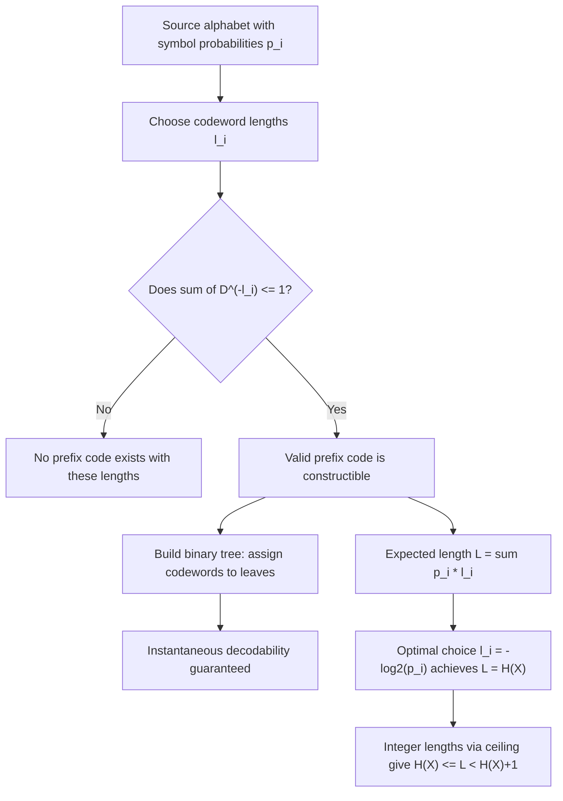

## Prefix Codes and the Kraft Inequality

### Definition of a Prefix Code

A prefix code (also called a prefix-free code or instantaneous code) is a code in which no codeword is a prefix of any other codeword. Given a source alphabet $\{x_1, x_2, \ldots, x_n\}$ mapped to binary codewords $\{c_1, c_2, \ldots, c_n\}$ with lengths $\{l_1, l_2, \ldots, l_n\}$, the prefix condition requires that for any two distinct symbols $x_i$ and $x_j$, $c_i$ is not a prefix of $c_j$ and $c_j$ is not a prefix of $c_i$.

This property guarantees **instantaneous decodability**: a decoder scanning a bitstream left to right can identify the end of a codeword the moment it is completed, without needing to look ahead at subsequent bits or wait for a delimiter.

### Why Prefix Codes Matter

Prefix codes sit within a hierarchy of code classes used in source coding:

- **Non-singular codes**: every symbol maps to a distinct codeword (necessary but not sufficient for unambiguous decoding of sequences).
- **Uniquely decodable codes**: any concatenated sequence of codewords can be decoded in only one way, though the decoder may need to see future bits to resolve ambiguity.
- **Prefix codes**: a strict subset of uniquely decodable codes that are also instantaneously decodable.

Every prefix code is uniquely decodable, but not every uniquely decodable code is a prefix code. Prefix codes are practically preferred because they eliminate decoding lookahead and buffering delay, which matters for streaming and low-latency applications.

### The Binary Tree Representation

A binary prefix code corresponds naturally to a binary tree in which:

- Each edge is labeled 0 or 1.
- Each codeword corresponds to a path from the root to a node.
- Codewords are assigned only to **leaf nodes** (nodes with no children).

The prefix condition is equivalent to the statement that no codeword's node is an ancestor of another codeword's node — which is guaranteed automatically if every codeword sits at a leaf, since leaves have no descendants.

<svg xmlns="http://www.w3.org/2000/svg" viewBox="0 0 640 380">
  <text x="320" y="24" text-anchor="middle" font-size="15" font-weight="bold" fill="#1a1a1a">Binary Tree Representation of a Prefix Code (svg_diagram)</text>

  
  <circle cx="320" cy="60" r="8" fill="#2c3e50" />
  <text x="320" y="45" text-anchor="middle" font-size="12" fill="#2c3e50">root</text>

  
  <line x1="320" y1="60" x2="180" y2="130" stroke="#555" stroke-width="1.5" />
  <line x1="320" y1="60" x2="460" y2="130" stroke="#555" stroke-width="1.5" />
  <text x="235" y="90" font-size="13" fill="#c0392b">0</text>
  <text x="395" y="90" font-size="13" fill="#c0392b">1</text>

  <circle cx="180" cy="130" r="8" fill="#27ae60" />
  <text x="180" y="115" text-anchor="middle" font-size="12" fill="#27ae60">A = 0 (leaf)</text>

  <circle cx="460" cy="130" r="8" fill="#2c3e50" />

  
  <line x1="460" y1="130" x2="380" y2="210" stroke="#555" stroke-width="1.5" />
  <line x1="460" y1="130" x2="540" y2="210" stroke="#555" stroke-width="1.5" />
  <text x="405" y="170" font-size="13" fill="#c0392b">0</text>
  <text x="515" y="170" font-size="13" fill="#c0392b">1</text>

  <circle cx="380" cy="210" r="8" fill="#27ae60" />
  <text x="380" y="195" text-anchor="middle" font-size="12" fill="#27ae60">B = 10 (leaf)</text>

  <circle cx="540" cy="210" r="8" fill="#2c3e50" />

  
  <line x1="540" y1="210" x2="460" y2="290" stroke="#555" stroke-width="1.5" />
  <line x1="540" y1="210" x2="620" y2="290" stroke="#555" stroke-width="1.5" />
  <text x="485" y="250" font-size="13" fill="#c0392b">0</text>
  <text x="595" y="250" font-size="13" fill="#c0392b">1</text>

  <circle cx="460" cy="290" r="8" fill="#27ae60" />
  <text x="460" y="275" text-anchor="middle" font-size="12" fill="#27ae60">C = 110 (leaf)</text>

  <circle cx="620" cy="290" r="8" fill="#27ae60" />
  <text x="605" y="275" text-anchor="middle" font-size="12" fill="#27ae60">D = 111 (leaf)</text>

  <text x="320" y="345" text-anchor="middle" font-size="12" fill="#555">All codewords occupy leaves only — no codeword lies on the path to another.</text>
  <text x="320" y="365" text-anchor="middle" font-size="12" fill="#555">Depth of each leaf = codeword length.</text>
</svg>

Internal nodes are never used as codewords; if they were, that internal node's label would be a prefix of every codeword in its subtree, violating the prefix property.

### The Kraft Inequality — Statement

For a prefix code over a $D$-ary alphabet (binary corresponds to $D = 2$) with codeword lengths $l_1, l_2, \ldots, l_n$, the following inequality must hold:

$$\sum_{i=1}^{n} D^{-l_i} \leq 1$$

For the binary case ($D = 2$):

$$\sum_{i=1}^{n} 2^{-l_i} \leq 1$$

This is the **Kraft inequality** (also called the Kraft–McMillan inequality, since McMillan later showed the same bound holds for the broader class of uniquely decodable codes, not just prefix codes).

### Why the Inequality Holds — Intuition and Proof Sketch

**Intuition via the binary tree**: A full binary tree has $2^l$ leaves at depth $l$. A codeword of length $l_i$ placed at depth $l_i$ "claims" a node and, in doing so, removes from availability all $2^{L-l_i}$ leaves of the full tree at maximum depth $L$ that would descend from it (where $L = \max_i l_i$). Since the tree has only $2^L$ leaves total, and the claimed subtrees cannot overlap (that would violate the prefix property), the total claimed leaves cannot exceed $2^L$:

$$\sum_{i=1}^{n} 2^{L - l_i} \leq 2^L$$

Dividing both sides by $2^L$ yields the Kraft inequality directly.

**Proof direction 1 (necessity)**: Any valid prefix code satisfies the inequality, by the counting argument above.

**Proof direction 2 (sufficiency)**: Given any set of lengths $l_1, \ldots, l_n$ satisfying $\sum_i 2^{-l_i} \leq 1$, a prefix code with exactly those lengths can always be constructed. This is typically shown constructively: sort lengths in increasing order, and greedily assign each codeword the lowest available node at its required depth, marking descendant nodes as unavailable. The inequality guarantees this greedy assignment never runs out of room.

Together these two directions make the Kraft inequality a full characterization: a set of lengths is realizable as a prefix code **if and only if** it satisfies the Kraft inequality.

<svg xmlns="http://www.w3.org/2000/svg" viewBox="0 0 640 260">
  <text x="320" y="24" text-anchor="middle" font-size="15" font-weight="bold" fill="#1a1a1a">Kraft Inequality: Leaf-Claiming at Max Depth L=3 (svg_diagram)</text>

  <text x="60" y="55" font-size="12" fill="#333">Full tree bottom row (depth 3): 8 leaf slots</text>

  
  <g font-size="11" text-anchor="middle">
    <rect x="40" y="70" width="60" height="30" fill="#27ae60" stroke="#1a1a1a" />
    <text x="70" y="90">A (len 1)</text>
    <rect x="100" y="70" width="60" height="30" fill="#27ae60" stroke="#1a1a1a" />
    <text x="130" y="90">claims</text>

    <rect x="160" y="70" width="60" height="30" fill="#2980b9" stroke="#1a1a1a" />
    <text x="190" y="90">B (len 2)</text>
    <rect x="220" y="70" width="60" height="30" fill="#2980b9" stroke="#1a1a1a" />
    <text x="250" y="90">claims</text>

    <rect x="280" y="70" width="60" height="30" fill="#e67e22" stroke="#1a1a1a" />
    <text x="310" y="90">C (len 3)</text>
    <rect x="340" y="70" width="60" height="30" fill="#e67e22" stroke="#1a1a1a" opacity="0.4" />

    <rect x="400" y="70" width="60" height="30" fill="#8e44ad" stroke="#1a1a1a" />
    <text x="430" y="90">D (len 3)</text>
    <rect x="460" y="70" width="60" height="30" fill="#8e44ad" stroke="#1a1a1a" opacity="0.4" />
  </g>

  <text x="60" y="140" font-size="12" fill="#333">A (len 1) claims 4 of 8 slots; B (len 2) claims 2 of 8; C, D (len 3) claim 1 each.</text>
  <text x="60" y="160" font-size="12" fill="#333">Total claimed = 4 + 2 + 1 + 1 = 8 = full tree. Sum of 2^(-li) = 1/2 + 1/4 + 1/8 + 1/8 = 1.</text>
  <text x="60" y="190" font-size="12" fill="#333">Equality in the Kraft inequality ⇔ the code is "complete" — no unused leaf capacity remains.</text>
</svg>

### Worked Example — Verifying a Valid Prefix Code

Consider codeword lengths $l_A = 1$, $l_B = 2$, $l_C = 3$, $l_D = 3$ for symbols $A, B, C, D$.

$$\sum 2^{-l_i} = 2^{-1} + 2^{-2} + 2^{-3} + 2^{-3} = 0.5 + 0.25 + 0.125 + 0.125 = 1.0$$

Since the sum equals exactly $1$, this satisfies the Kraft inequality with equality, and a valid prefix code exists: $A = 0$, $B = 10$, $C = 110$, $D = 111$. Checking directly: no codeword here is a prefix of another, confirming instantaneous decodability.

### Worked Example — Detecting an Invalid Length Set

Consider a proposed set of lengths $l_1 = 1, l_2 = 1, l_3 = 2$.

$$\sum 2^{-l_i} = 2^{-1} + 2^{-1} + 2^{-2} = 0.5 + 0.5 + 0.25 = 1.25$$

Since $1.25 > 1$, no prefix code can realize these lengths. This matches intuition: with two codewords of length 1, only two possible bit values (0 and 1) exist at depth 1, and both are consumed — no depth-1 slot remains, and neither remaining slot can be safely subdivided to add a length-2 codeword without one string becoming a prefix of another.

### Kraft Inequality and the McMillan Extension

McMillan's theorem extends this result: the Kraft inequality is a necessary condition not just for prefix codes, but for **any uniquely decodable code**, prefix or not. Formally: if a code with lengths $l_1, \ldots, l_n$ is uniquely decodable, then $\sum_i D^{-l_i} \leq 1$.

Combined with the sufficiency direction (any length set satisfying Kraft's inequality can be realized as a prefix code), this yields an important practical consequence: **for any uniquely decodable code, there exists a prefix code with the same length distribution and hence the same expected codeword length.** This is why source coding theory (e.g., in deriving optimal codes like Huffman codes) can restrict attention to prefix codes without loss of generality — nothing is gained in compression efficiency by allowing more general uniquely decodable but non-instantaneous codes.

### Connection to Entropy and Optimal Coding

The Kraft inequality is the structural constraint that links code lengths to achievable compression. For a source with symbol probabilities $p_1, \ldots, p_n$, the expected codeword length is:

$$L = \sum_{i=1}^{n} p_i l_i$$

Minimizing $L$ subject to the Kraft inequality constraint $\sum_i 2^{-l_i} \leq 1$ (using Lagrange multipliers) shows that the optimal (real-valued, unconstrained-to-integers) length assignment is:

$$l_i^* = -\log_2 p_i$$

Substituting back gives the minimum achievable expected length as the **entropy** of the source:

$$L^* = \sum_i p_i \left(-\log_2 p_i\right) = H(X)$$

Because actual codeword lengths must be positive integers, this ideal is generally not exactly attainable, but the Kraft inequality guarantees that integer lengths $l_i = \lceil -\log_2 p_i \rceil$ (Shannon–Fano style) always form a valid prefix code, and that the resulting expected length satisfies:

$$H(X) \leq L < H(X) + 1$$

This is the **source coding theorem** bound for prefix codes, and it is the reason Huffman coding — which finds the length assignment strictly minimizing $L$ among all prefix codes — is guaranteed to exist and can get arbitrarily close to the entropy bound when coding is extended over blocks of symbols.

### Kraft Inequality Flow of Reasoning

### Key Points

- A **prefix code** ensures no codeword is a prefix of another, which guarantees instantaneous, unambiguous decoding.
- Prefix codes correspond exactly to codewords placed at the **leaves** of a binary (or $D$-ary) tree.
- The **Kraft inequality**, $\sum_i D^{-l_i} \leq 1$, is a necessary and sufficient condition for a set of lengths to be realizable as a prefix code.
- **Equality** in the Kraft inequality corresponds to a "complete" tree with no wasted leaf capacity.
- **McMillan's theorem** shows the same inequality is necessary for the broader class of uniquely decodable codes, so prefix codes lose no generality in optimal source coding.
- The Kraft inequality underlies the derivation of the **source coding theorem** bound, $H(X) \leq L < H(X) + 1$, connecting code length constraints directly to Shannon entropy.

### Related Topics

- Huffman coding algorithm and proof of optimality among prefix codes
- Shannon–Fano coding and its relationship to the Kraft-derived length bound
- Kraft–McMillan theorem: full proof of necessity for uniquely decodable codes
- Extension to $D$-ary (non-binary) prefix codes and generalized Kraft inequality
- Arithmetic coding as an alternative to symbol-by-symbol prefix coding
- Block coding and approaching entropy in the limit of long symbol sequences
- Canonical Huffman codes and efficient codeword length transmission