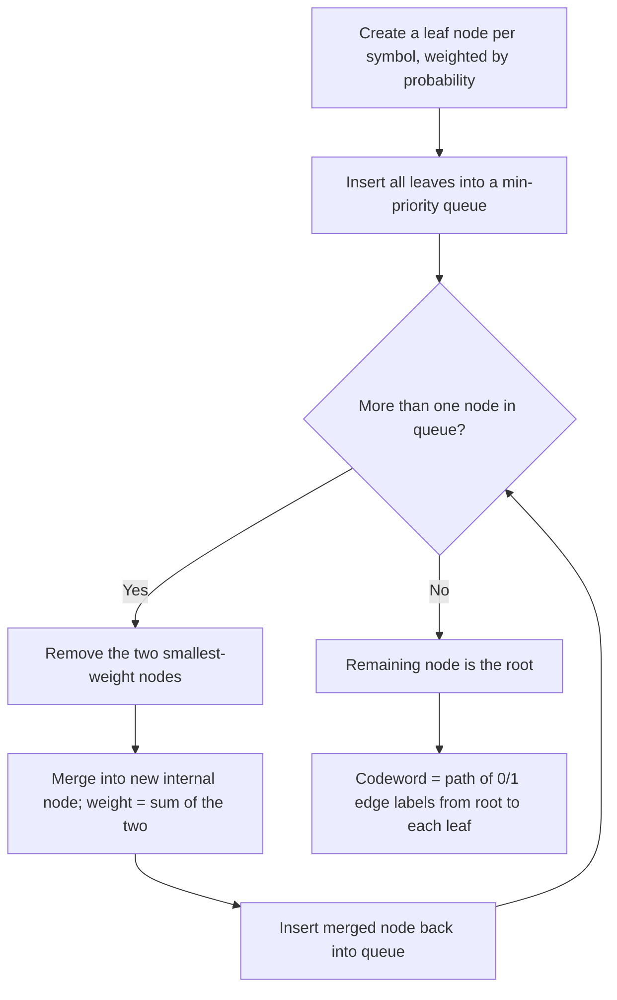

## Huffman Coding Algorithm and Optimality Proof

### Problem Statement

Given a source alphabet $\{x_1, \ldots, x_n\}$ with known probabilities $\{p_1, \ldots, p_n\}$, Huffman coding constructs a binary prefix code that minimizes the expected codeword length:

$$L = \sum_{i=1}^{n} p_i l_i$$

among **all** possible prefix codes for that distribution — not just among codes of a particular structural family. This distinguishes Huffman coding from constructions like Shannon–Fano coding, which are simple and provably close to entropy but not guaranteed optimal.

### The Algorithm

Huffman's method is a greedy, bottom-up tree-construction procedure:

1. Create a leaf node for each symbol $x_i$, weighted by its probability $p_i$, and place all leaf nodes into a collection (conceptually a min-priority queue).
2. Repeat until only one node remains:
   - Remove the two nodes with the **smallest** weights from the collection.
   - Create a new internal node whose weight is the sum of the two removed weights, and attach the two removed nodes as its children (one labeled with bit 0, the other with bit 1 — the assignment convention is arbitrary but must be consistent).
   - Insert this new internal node back into the collection.
3. The single remaining node is the root of the Huffman tree. The codeword for each symbol is the sequence of edge labels (0s and 1s) on the path from the root to that symbol's leaf.

Because every symbol ends up at a leaf and internal nodes are never assigned codewords, the resulting code automatically satisfies the prefix property.

### Worked Example — Full Construction

Consider a 5-symbol alphabet with probabilities:

| Symbol | Probability |
|---|---|
| A | 0.35 |
| B | 0.25 |
| C | 0.20 |
| D | 0.12 |
| E | 0.08 |

**Step 1**: Initial queue (sorted ascending): E(0.08), D(0.12), C(0.20), B(0.25), A(0.35).

**Step 2**: Merge two smallest — E(0.08) and D(0.12) → new node DE(0.20). Queue: C(0.20), DE(0.20), B(0.25), A(0.35).

**Step 3**: Merge two smallest — C(0.20) and DE(0.20) → new node CDE(0.40). Queue: B(0.25), A(0.35), CDE(0.40).

**Step 4**: Merge two smallest — B(0.25) and A(0.35) → new node AB(0.60). Queue: CDE(0.40), AB(0.60).

**Step 5**: Merge remaining two — CDE(0.40) and AB(0.60) → root(1.00).

**Resulting codeword lengths** (reading tree depth): A and B end up at depth 2, C at depth 2, D and E at depth 3.

Tracing the actual bit assignments (0 = left/first-merged-in-pair convention, arbitrary but consistent):

| Symbol | Codeword | Length |
|---|---|---|
| A | 11 | 2 |
| B | 10 | 2 |
| C | 01 | 2 |
| D | 001 | 3 |
| E | 000 | 3 |

**Verify Kraft equality**: $2^{-2} + 2^{-2} + 2^{-2} + 2^{-3} + 2^{-3} = 0.25(3) + 0.125(2) = 0.75 + 0.25 = 1.0$ — a complete code, as expected from a full Huffman tree.

**Expected length**:
$$L = 0.35(2) + 0.25(2) + 0.20(2) + 0.12(3) + 0.08(3) = 0.70 + 0.50 + 0.40 + 0.36 + 0.24 = 2.20 \text{ bits}$$

**Entropy for comparison**:
$$H(X) = -\sum_i p_i \log_2 p_i \approx 0.35(1.515) + 0.25(2.000) + 0.20(2.322) + 0.12(3.059) + 0.08(3.644)$$
$$\approx 0.530 + 0.500 + 0.464 + 0.367 + 0.292 \approx 2.153 \text{ bits}$$

Efficiency: $\eta = H(X)/L \approx 2.153/2.20 \approx 97.9\%$ — very close to the entropy bound, illustrating that Huffman coding typically performs far better in practice than the loose worst-case $H(X)+1$ bound suggests.

<svg xmlns="http://www.w3.org/2000/svg" viewBox="0 0 640 320">
  <text x="320" y="22" text-anchor="middle" font-size="15" font-weight="bold" fill="#1a1a1a">Huffman Tree for the Worked Example (svg_diagram)</text>

  <circle cx="320" cy="50" r="8" fill="#2c3e50" />
  <text x="335" y="45" font-size="11" fill="#2c3e50">1.00</text>

  <line x1="320" y1="50" x2="200" y2="110" stroke="#555" stroke-width="1.5" />
  <line x1="320" y1="50" x2="440" y2="110" stroke="#555" stroke-width="1.5" />
  <text x="245" y="75" font-size="12" fill="#c0392b">0</text>
  <text x="400" y="75" font-size="12" fill="#c0392b">1</text>

  <circle cx="200" cy="110" r="7" fill="#2c3e50" />
  <text x="215" y="105" font-size="11" fill="#2c3e50">CDE 0.40</text>
  <circle cx="440" cy="110" r="7" fill="#2c3e50" />
  <text x="455" y="105" font-size="11" fill="#2c3e50">AB 0.60</text>

  <line x1="200" y1="110" x2="140" y2="170" stroke="#555" stroke-width="1.5" />
  <line x1="200" y1="110" x2="260" y2="170" stroke="#555" stroke-width="1.5" />
  <text x="160" y="135" font-size="12" fill="#c0392b">0</text>
  <text x="240" y="135" font-size="12" fill="#c0392b">1</text>

  <circle cx="140" cy="170" r="7" fill="#27ae60" />
  <text x="100" y="190" font-size="12" fill="#27ae60">C = 01 (0.20)</text>
  <circle cx="260" cy="170" r="7" fill="#2c3e50" />
  <text x="270" y="160" font-size="11" fill="#2c3e50">DE 0.20</text>

  <line x1="260" y1="170" x2="220" y2="230" stroke="#555" stroke-width="1.5" />
  <line x1="260" y1="170" x2="300" y2="230" stroke="#555" stroke-width="1.5" />
  <text x="230" y="195" font-size="12" fill="#c0392b">0</text>
  <text x="290" y="195" font-size="12" fill="#c0392b">1</text>

  <circle cx="220" cy="230" r="7" fill="#27ae60" />
  <text x="175" y="250" font-size="12" fill="#27ae60">E = 000 (0.08)</text>
  <circle cx="300" cy="230" r="7" fill="#27ae60" />
  <text x="270" y="250" font-size="12" fill="#27ae60">D = 001 (0.12)</text>

  <line x1="440" y1="110" x2="380" y2="170" stroke="#555" stroke-width="1.5" />
  <line x1="440" y1="110" x2="500" y2="170" stroke="#555" stroke-width="1.5" />
  <text x="395" y="135" font-size="12" fill="#c0392b">0</text>
  <text x="480" y="135" font-size="12" fill="#c0392b">1</text>

  <circle cx="380" cy="170" r="7" fill="#27ae60" />
  <text x="350" y="190" font-size="12" fill="#27ae60">B = 10 (0.25)</text>
  <circle cx="500" cy="170" r="7" fill="#27ae60" />
  <text x="470" y="190" font-size="12" fill="#27ae60">A = 11 (0.35)</text>
</svg>

### Optimality Proof

Huffman coding's optimality among prefix codes rests on three lemmas, typically proven together by induction on alphabet size $n$.

**Lemma 1 (Sibling property / ordering)**: In an optimal prefix code, if $p_i > p_j$, then $l_i \leq l_j$ (a more probable symbol never gets a strictly longer codeword than a less probable one). *Proof idea*: if this were violated, swapping the two codewords would strictly reduce $L$, contradicting optimality.

**Lemma 2 (Two longest codewords are siblings)**: In some optimal prefix code, the two least probable symbols have codewords of equal (maximal) length and differ only in their last bit — i.e., they are siblings in the tree. *Proof idea*: any leaf without a sibling could have its last bit removed while remaining prefix-free and improving $L$, contradicting optimality (a code where the deepest leaf is unpaired is not optimal, since it could be shortened). If two deepest leaves are not already the two least-probable symbols, swapping labels to make them so cannot increase $L$, by Lemma 1's exchange argument.

**Lemma 3 (Reduction / merging invariance)**: Let $X'$ be the alphabet obtained by merging the two least probable symbols $x_i, x_j$ of $X$ into a single symbol with probability $p_i + p_j$. If $C'$ is an optimal prefix code for $X'$, then the code $C$ obtained by taking $C'$ and appending a 0/1 to the merged symbol's codeword to split it back into $x_i$ and $x_j$ is an optimal prefix code for $X$.

*Proof of Lemma 3*: Let $L(C)$ be the expected length of $C$ over $X$ and $L(C')$ the expected length of $C'$ over $X'$. Because $x_i$ and $x_j$'s codewords in $C$ are exactly the merged symbol's codeword in $C'$ plus one extra bit each:

$$L(C) = L(C') + p_i + p_j$$

This relationship holds for **any** prefix code built this way, not just the optimal one. So if $C$ were not optimal for $X$, there would exist some other code $C^*$ for $X$ with $L(C^*) < L(C)$. By Lemma 2, $C^*$ can be assumed to have $x_i, x_j$ as siblings (an exchange argument if not), and merging them back would give a code for $X'$ with expected length $L(C^*) - p_i - p_j < L(C) - p_i - p_j = L(C')$, contradicting the assumed optimality of $C'$ for $X'$. Hence no such $C^*$ exists, and $C$ is optimal for $X$. $\blacksquare$

**Inductive conclusion**: The base case ($n = 2$ symbols) is trivially optimal (both get length-1 codewords, and no prefix code can do better than 1 bit per symbol for two outcomes). By Lemma 3, if Huffman coding is optimal for any alphabet of size $n-1$ (as produced by merging the two smallest-probability symbols), it is optimal for the original alphabet of size $n$. Since Huffman's algorithm performs exactly this merge-and-recurse process at every step, induction establishes that Huffman coding is optimal for every finite alphabet size.

### Handling Ties and Non-Uniqueness

Huffman codes are optimal in expected length but **not unique** in codeword assignment: ties in weight during merging can be broken arbitrarily (which two equal-weight nodes merge first, or which child gets bit 0 vs. 1) without affecting $L$. Multiple different Huffman trees can therefore achieve the identical optimal expected length for the same distribution. **[Inference]** Implementations commonly break ties using insertion order or a secondary key (e.g., preferring to merge less-recently-created nodes first) to produce more balanced trees or bound maximum codeword length, but this is an implementation choice rather than a requirement of the optimality proof itself.

### Limitations of Huffman Coding

- **Integer-length constraint**: Because every codeword must be an integer number of bits, Huffman coding cannot exactly reach $H(X)$ unless the distribution is dyadic (each $p_i$ a power of $\tfrac{1}{2}$), consistent with the source coding theorem's $H(X) \leq L < H(X) + 1$ bound.
- **Known, fixed distribution required**: The standard algorithm assumes the full probability distribution is known in advance. This is problematic for sources with unknown or time-varying statistics, motivating **adaptive Huffman coding** variants that update the tree as symbols are observed.
- **Poor performance on highly skewed single-symbol distributions**: As with any single-symbol prefix code, a source dominated by one very likely symbol still wastes a full bit per occurrence relative to entropy (the "worst case" scenario discussed under the source coding theorem), which motivates block-based Huffman coding or arithmetic coding for such sources.
- **No exploitation of inter-symbol dependencies**: Standard Huffman coding treats each symbol independently, ignoring statistical dependencies between consecutive symbols in the source sequence. Context-based or blocked schemes are needed to exploit such structure.

### Key Points

- Huffman coding is a greedy bottom-up algorithm: repeatedly merge the two lowest-probability nodes until a single tree remains.
- The resulting code is always prefix-free, since only leaves receive codewords.
- Huffman coding is **provably optimal** among all prefix codes for a given distribution — no other prefix code achieves a lower expected length.
- The optimality proof rests on three lemmas: probability-ordering of lengths, the two least-probable symbols being tree siblings, and the invariance of optimality under symbol merging (used for the inductive argument).
- Ties during construction do not affect optimality but can produce multiple distinct optimal trees.
- Huffman coding still cannot reach the entropy bound exactly except for dyadic distributions, and requires either known statistics or an adaptive variant when statistics are unknown.

### Related Topics

- Adaptive (dynamic) Huffman coding for unknown or evolving source statistics
- Canonical Huffman codes: compact representation and transmission of code tables
- Length-limited Huffman coding for constrained maximum codeword length
- Arithmetic coding as a fractional-bit alternative that surpasses Huffman on skewed distributions
- Golomb and Rice coding as specialized prefix codes for geometric-like distributions
- Extending Huffman coding to $D$-ary output alphabets
- Practical use of Huffman coding within compression standards (e.g., DEFLATE, JPEG)