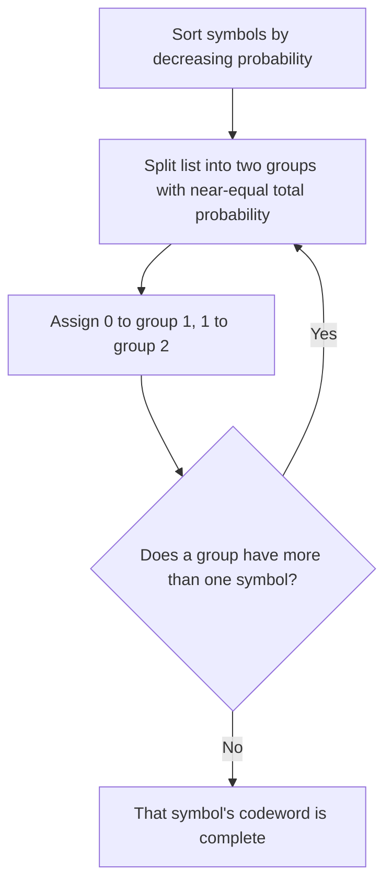

## Shannon-Fano Coding

### Overview and Historical Context

Shannon-Fano coding is a method for constructing a prefix code from a known probability distribution, developed independently by Claude Shannon and Robert Fano around 1948–1949. It predates Huffman coding (1952) and served as an early demonstration that source coding could approach the entropy limit. Two distinct construction procedures are commonly called "Shannon-Fano coding" in the literature: Fano's **top-down splitting method** and Shannon's **length-assignment method** based directly on $-\log_2 p_i$. Both produce valid prefix codes with expected length within one bit of entropy, but they are algorithmically different and can produce different codeword length assignments for the same distribution.

### Method 1 — Fano's Top-Down Splitting Procedure

This is the version most commonly taught as "Shannon-Fano coding":

1. List all symbols in **decreasing order of probability**.
2. Divide the list into two parts such that the total probability of each part is as close to equal as possible.
3. Assign the bit `0` to all symbols in the first part and `1` to all symbols in the second part.
4. Recursively apply steps 2–3 to each part independently, appending additional bits, until every part contains exactly one symbol.

Each recursive split contributes one bit to the codewords of the symbols within that part, and because every symbol terminates at a distinct leaf-like partition, the result is a valid prefix code.

### Worked Example — Fano's Splitting Method

Using the same 5-symbol distribution as before, sorted descending:

| Symbol | Probability |
|---|---|
| A | 0.35 |
| B | 0.25 |
| C | 0.20 |
| D | 0.12 |
| E | 0.08 |

**Split 1**: Cumulative sums — A alone: 0.35; A+B: 0.60; A+B+C: 0.80. Splitting after A+B (0.60) versus after A (0.35) versus after A+B+C (0.80): the split point closest to half of 1.00 (i.e., 0.50) is after A (0.35 vs. 0.65 remaining) compared to after A+B (0.60 vs. 0.40). Distance from 0.5: $|0.35 - 0.65| = 0.30$ vs. $|0.60-0.40| = 0.20$. The A+B split is closer, so **Group 1 = {A, B}** (prefix bit 0), **Group 2 = {C, D, E}** (prefix bit 1).

**Split 2 (within Group 1 = {A, B})**: Only two symbols, so A gets bit 0 appended → codeword `00`; B gets bit 1 appended → codeword `01`.

**Split 3 (within Group 2 = {C, D, E}, probabilities 0.20, 0.12, 0.08)**: Cumulative — C alone: 0.20 (of the subgroup total 0.40, i.e., fraction 0.50); C+D: 0.32 (fraction 0.80). Splitting after C alone gives proportions closest to half **within this subgroup**, so **Group 2a = {C}** (bit 0 within this branch), **Group 2b = {D, E}** (bit 1 within this branch). C's codeword: `10`.

**Split 4 (within Group 2b = {D, E})**: D gets bit 0 → codeword `110`; E gets bit 1 → codeword `111`.

**Resulting Shannon-Fano (Fano method) code**:

| Symbol | Codeword | Length |
|---|---|---|
| A | 00 | 2 |
| B | 01 | 2 |
| C | 10 | 2 |
| D | 110 | 3 |
| E | 111 | 3 |

**[Inference]** This particular split happens to produce the identical length assignment as the Huffman example in the prior topic (lengths 2,2,2,3,3), though the actual bit patterns differ. This coincidence is not guaranteed in general — Fano's splitting heuristic does not always match Huffman's globally optimal lengths, especially for less balanced distributions.

**Expected length**: Using the same lengths as before:
$$L = 0.35(2) + 0.25(2) + 0.20(2) + 0.12(3) + 0.08(3) = 2.20 \text{ bits}$$

which matches the Huffman result in this particular case, though this is not guaranteed for all distributions.

### Method 2 — Shannon's Length-Assignment Method

The version more directly attributable to Shannon assigns codeword lengths analytically rather than by recursive splitting:

$$l_i = \left\lceil -\log_2 p_i \right\rceil$$

Symbols are then assigned codewords using the **Shannon-Fano-Elias** construction (closely related to arithmetic coding): order symbols by probability, compute cumulative probabilities $F_i = \sum_{k<i} p_k$, and use the binary expansion of $F_i$ (or the midpoint $F_i + p_i/2$) truncated to $l_i$ bits as the codeword.

This method is guaranteed by the Kraft inequality (since $\sum_i 2^{-\lceil -\log_2 p_i \rceil} \leq \sum_i 2^{-(-\log_2 p_i)} = \sum_i p_i = 1$) to produce a valid prefix code satisfying $H(X) \leq L < H(X) + 1$, matching the general source coding theorem bound derived earlier.

### Worked Example — Shannon's Length-Assignment Method

Using the same distribution:

| Symbol | $p_i$ | $-\log_2 p_i$ | $l_i = \lceil -\log_2 p_i \rceil$ |
|---|---|---|---|
| A | 0.35 | 1.515 | 2 |
| B | 0.25 | 2.000 | 2 |
| C | 0.20 | 2.322 | 3 |
| D | 0.12 | 3.059 | 4 |
| E | 0.08 | 3.644 | 4 |

**Verify Kraft inequality**: $2^{-2} + 2^{-2} + 2^{-3} + 2^{-4} + 2^{-4} = 0.25 + 0.25 + 0.125 + 0.0625 + 0.0625 = 0.75$, which is $\leq 1$ (with slack, since this is a sufficient but not necessarily tight construction).

**Expected length**:
$$L = 0.35(2) + 0.25(2) + 0.20(3) + 0.12(4) + 0.08(4) = 0.70 + 0.50 + 0.60 + 0.48 + 0.32 = 2.60 \text{ bits}$$

Comparing to entropy $H(X) \approx 2.153$ bits (computed in the prior topic) and to Huffman's $L = 2.20$ bits, Shannon's length-assignment method here is noticeably **less efficient** than both Fano's splitting method and Huffman coding for this particular distribution — illustrating that Shannon-Fano coding's guarantee is only the loose $H(X) \leq L < H(X)+1$ bound, not optimality.

### Why Shannon-Fano Is Not Always Optimal

Unlike Huffman coding, neither Shannon-Fano variant is guaranteed to minimize $L$ over all prefix codes for a given distribution. The core reasons:

- **Fano's splitting method** makes a locally greedy choice (splitting as evenly as possible) at each partition without considering how that choice affects the total expected length globally — it is a top-down heuristic, whereas Huffman's bottom-up merge process directly optimizes based on combined weights at each step.
- **Shannon's length-assignment method** rounds every ideal length up independently per symbol via the ceiling function, which can waste more than necessary when a smarter joint assignment (like Huffman's) would give a shorter code overall while still satisfying Kraft's inequality.

**[Inference]** The gap between Shannon-Fano and Huffman is typically small in practice and both satisfy the same asymptotic entropy bound, but Huffman coding weakly dominates Shannon-Fano coding in expected length for any given fixed distribution, since Huffman is provably optimal and Shannon-Fano is not.

<svg xmlns="http://www.w3.org/2000/svg" viewBox="0 0 640 260">
  <text x="320" y="22" text-anchor="middle" font-size="15" font-weight="bold" fill="#1a1a1a">Comparing Expected Lengths for the Example Distribution (svg_diagram)</text>

  <line x1="80" y1="220" x2="580" y2="220" stroke="#333" stroke-width="1.5" />

  <text x="60" y="224" font-size="11" fill="#333" text-anchor="end">0</text>

  <rect x="120" y="220" width="30" height="-90" fill="#2980b9" />
  <text x="135" y="220" text-anchor="middle" font-size="11" fill="#333" transform="rotate(0)" />
  <text x="135" y="235" text-anchor="middle" font-size="10" fill="#333">H(X)</text>
  <text x="135" y="123" text-anchor="middle" font-size="10" fill="#2980b9">2.15</text>

  <rect x="220" y="220" width="30" height="-92" fill="#27ae60" />
  <text x="235" y="235" text-anchor="middle" font-size="10" fill="#333">Huffman</text>
  <text x="235" y="121" text-anchor="middle" font-size="10" fill="#27ae60">2.20</text>

  <rect x="320" y="220" width="30" height="-92" fill="#e67e22" />
  <text x="335" y="235" text-anchor="middle" font-size="10" fill="#333">Fano split</text>
  <text x="335" y="121" text-anchor="middle" font-size="10" fill="#e67e22">2.20</text>

  <rect x="420" y="220" width="30" height="-109" fill="#8e44ad" />
  <text x="435" y="235" text-anchor="middle" font-size="10" fill="#333">Shannon LA</text>
  <text x="435" y="104" text-anchor="middle" font-size="10" fill="#8e44ad">2.60</text>

  <text x="320" y="255" text-anchor="middle" font-size="11" fill="#555">All satisfy H(X) ≤ L &lt; H(X)+1, but only Huffman is provably minimal.</text>
</svg>

### Comparison Table

| Property | Fano splitting method | Shannon length-assignment | Huffman coding |
|---|---|---|---|
| Construction direction | Top-down (recursive split) | Direct formula per symbol | Bottom-up (greedy merge) |
| Guaranteed optimal? | No | No | Yes |
| Satisfies $H(X) \leq L < H(X)+1$? | Yes | Yes | Yes |
| Typical performance | Often close to Huffman | Can be noticeably worse | Always $\leq$ any other prefix code |
| Historical role | Independent 1949 predecessor | Basis for arithmetic coding ideas | 1952 refinement; standard in practice |

### Practical Relevance Today

Shannon-Fano coding is now primarily of **historical and pedagogical** interest: it demonstrates that near-entropy prefix codes are achievable and motivates the entropy-based length formula $l_i \approx -\log_2 p_i$, but it has been superseded in practice by Huffman coding (which is never worse and often better) and by arithmetic/range coding (which removes the integer-length constraint entirely). **[Inference]** Modern compression systems essentially never use Shannon-Fano coding directly in production; its main modern relevance is as a conceptual stepping stone toward understanding both Huffman coding and the length-probability correspondence exploited more fully by arithmetic coding.

### Key Points

- Shannon-Fano coding refers to two related but distinct historical constructions: Fano's recursive top-down splitting, and Shannon's direct length-assignment formula $l_i = \lceil -\log_2 p_i \rceil$.
- Both variants produce valid prefix codes (verifiable via the Kraft inequality) satisfying the general bound $H(X) \leq L < H(X) + 1$.
- Neither method is guaranteed optimal; **Huffman coding always performs at least as well** for any fixed distribution.
- Fano's splitting method tends to perform closer to Huffman in practice than Shannon's pure length-assignment method, though this is distribution-dependent.
- Shannon-Fano coding's main modern role is historical and pedagogical, illustrating the entropy–length relationship that later underpins arithmetic coding.

### Related Topics

- Shannon-Fano-Elias coding as a direct precursor to arithmetic coding
- Formal proof that Huffman coding always weakly dominates Shannon-Fano coding in expected length
- Arithmetic coding: removing the integer-codeword-length constraint entirely
- Kraft inequality: the shared validity constraint underlying all three code families
- Historical development of source coding from 1948–1952
- Tunstall coding as a variable-to-fixed-length alternative approach