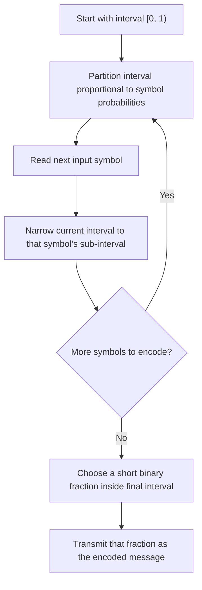

## Arithmetic Coding

### Motivation: Breaking the Integer-Length Barrier

Every prefix code discussed so far — Huffman, Shannon-Fano — assigns each symbol an integer number of bits, even though the information-theoretically ideal length for a symbol with probability $p_i$ is $-\log_2 p_i$, which is generally fractional. This integer constraint is precisely what causes the unavoidable redundancy in the source coding theorem's bound $H(X) \leq L < H(X) + 1$ for symbol-by-symbol coding.

Arithmetic coding sidesteps this constraint entirely by encoding an **entire message** (a full sequence of symbols) as a single number — more specifically, as a sub-interval of $[0, 1)$ — rather than concatenating individually rounded per-symbol codewords. This allows the *effective* number of bits contributed by each symbol to be fractional, letting the overall code rate approach entropy far more tightly than any per-symbol prefix code can, without needing to resort to explicit blocking.

### Core Idea: Successive Interval Subdivision

Arithmetic coding represents the entire input sequence as an interval $[\text{low}, \text{high}) \subseteq [0, 1)$. The algorithm proceeds as follows:

1. Begin with the interval $[0, 1)$.
2. Partition the current interval into sub-intervals proportional to each symbol's probability, in a fixed, agreed-upon order (e.g., alphabetical or by symbol index).
3. For each symbol in the input sequence, in order, narrow the current interval to the sub-interval corresponding to that symbol.
4. After processing all symbols, any number within the final (very narrow) interval uniquely identifies the entire sequence. The encoder transmits a short binary fraction that lies within this final interval.

Because each successive symbol narrows the interval by a factor equal to its probability, the width of the final interval after encoding $N$ symbols is exactly $\prod_{i=1}^{N} p_i$ (for a memoryless source, i.e., the joint probability of the full sequence). The number of bits needed to specify a point precisely enough to distinguish this interval from all others is approximately:

$$-\log_2 \left(\prod_{i=1}^{N} p_i\right) = -\sum_{i=1}^{N} \log_2 p_i$$

which is exactly the ideal (fractional-bit) total code length for the sequence under the source's true probabilities.

### Worked Example — Encoding a Short Sequence

Consider a 3-symbol alphabet with probabilities $P(A) = 0.5$, $P(B) = 0.3$, $P(C) = 0.2$, and cumulative ranges assigned in order:

- A: $[0.0, 0.5)$
- B: $[0.5, 0.8)$
- C: $[0.8, 1.0)$

**Encode the sequence "BAC"**:

**Step 1 — Symbol B**: Current interval $[0, 1)$ narrows to B's range directly: $[0.5, 0.8)$.

**Step 2 — Symbol A**: Subdivide $[0.5, 0.8)$ (width 0.3) proportionally: A occupies the first 50% → $[0.5, 0.5 + 0.3 \times 0.5) = [0.5, 0.65)$.

**Step 3 — Symbol C**: Subdivide $[0.5, 0.65)$ (width 0.15) proportionally: C occupies the last 20% → $[0.5 + 0.15 \times 0.8, 0.65) = [0.62, 0.65)$.

**Final interval**: $[0.62, 0.65)$, width $= 0.03$.

**Verify via direct multiplication**: $P(B) \times P(A) \times P(C) = 0.3 \times 0.5 \times 0.2 = 0.03$ ✓, matching the final interval width exactly.

Any real number in $[0.62, 0.65)$ — for instance $0.63$ — uniquely identifies the sequence "BAC" given the fixed partition rule; the decoder reverses the same subdivision process to recover the symbols one at a time.

**Ideal code length for this sequence**: $-\log_2(0.03) \approx 5.06$ bits — a genuinely fractional value, unattainable by any integer-length per-symbol prefix code applied symbol-by-symbol.

<svg xmlns="http://www.w3.org/2000/svg" viewBox="0 0 640 260">
  <text x="320" y="22" text-anchor="middle" font-size="15" font-weight="bold" fill="#1a1a1a">Interval Narrowing for Encoding "BAC" (svg_diagram)</text>

  <text x="40" y="55" font-size="12" fill="#333">[0, 1)</text>
  <rect x="90" y="42" width="500" height="18" fill="none" stroke="#333" />
  <rect x="90" y="42" width="250" height="18" fill="#2980b9" opacity="0.3" />
  <text x="215" y="55" text-anchor="middle" font-size="10" fill="#2980b9">A [0,0.5)</text>
  <rect x="340" y="42" width="150" height="18" fill="#27ae60" opacity="0.5" />
  <text x="415" y="55" text-anchor="middle" font-size="10" fill="#27ae60">B [0.5,0.8)</text>
  <rect x="490" y="42" width="100" height="18" fill="#e67e22" opacity="0.3" />
  <text x="540" y="55" text-anchor="middle" font-size="10" fill="#e67e22">C [0.8,1)</text>

  <text x="40" y="105" font-size="12" fill="#333">after B: [0.5, 0.8)</text>
  <rect x="340" y="92" width="150" height="18" fill="none" stroke="#333" />
  <rect x="340" y="92" width="75" height="18" fill="#2980b9" opacity="0.5" />
  <text x="377" y="105" text-anchor="middle" font-size="9" fill="#2980b9">A</text>
  <rect x="415" y="92" width="45" height="18" fill="#27ae60" opacity="0.6" />
  <text x="437" y="105" text-anchor="middle" font-size="9" fill="#27ae60">B</text>
  <rect x="460" y="92" width="30" height="18" fill="#e67e22" opacity="0.5" />
  <text x="475" y="105" text-anchor="middle" font-size="9" fill="#e67e22">C</text>

  <text x="40" y="155" font-size="12" fill="#333">after A: [0.5, 0.65)</text>
  <rect x="340" y="142" width="75" height="18" fill="none" stroke="#333" />
  <rect x="340" y="142" width="37.5" height="18" fill="#2980b9" opacity="0.4" />
  <rect x="377.5" y="142" width="22.5" height="18" fill="#27ae60" opacity="0.6" />
  <rect x="400" y="142" width="15" height="18" fill="#e67e22" opacity="0.6" />

  <text x="40" y="205" font-size="12" fill="#333">after C: [0.62, 0.65)</text>
  <rect x="400" y="192" width="15" height="18" fill="#e67e22" stroke="#333" />

  <text x="320" y="240" text-anchor="middle" font-size="12" fill="#555">Final width = 0.03 = P(B) x P(A) x P(C), exactly matching the joint probability.</text>
</svg>

### Decoding Process

Decoding reverses the encoding logic given the same fixed partition table:

1. Start with the received fraction (e.g., $0.63$).
2. Determine which symbol's sub-interval of $[0, 1)$ contains this value; emit that symbol.
3. Rescale the value relative to that sub-interval (the inverse of the narrowing operation) to obtain the effective position within the remaining interval.
4. Repeat until the expected number of symbols have been decoded (message length must be known or signaled separately, e.g., via an explicit end-of-message symbol or transmitted length).

Because the encoder and decoder use identical, deterministic partition rules driven by the same probability model, the process is fully reversible and lossless.

### Practical Implementation: Finite Precision

The idealized description above assumes arbitrary-precision real-number arithmetic, which is impractical in real systems. Practical arithmetic coders address this with:

- **Incremental output**: as the interval narrows, leading bits of `low` and `high` that agree can be output immediately and shifted out, since they will never change with further symbols — this avoids needing to store the full-precision interval endpoints for the entire message.
- **Fixed-precision registers**: implementations typically use 32-bit or 64-bit integer registers to represent `low` and `high`, with **underflow/rescaling handling** for the case where the interval becomes very narrow but straddles a value like $0.5$ without the leading bits yet agreeing (the classic E3 scaling case in many textbook treatments).
- **Renormalization**: periodically rescaling the interval (doubling its width and shifting out determined bits) to prevent the interval from shrinking below the precision of the registers.

**[Inference]** These finite-precision techniques are implementation details that do not change the theoretical compression ratio achievable, but they are essential engineering components of any real, deployed arithmetic coder; the specific renormalization strategy varies across implementations (e.g., classic Witten-Neal-Cleary arithmetic coding versus modern range coders).

### Relationship to Entropy and the Source Coding Theorem

For a sequence of $N$ i.i.d. symbols, arithmetic coding's total code length (accounting for the small overhead of representing the interval with a finite-precision fraction, typically at most 2 bits of total overhead for the whole message under standard implementations) satisfies:

$$L_{\text{total}} < -\sum_{i=1}^{N} \log_2 p(x_i) + 2 = N \cdot H(X) + 2 \text{ (in expectation, for i.i.d. sources)}$$

Dividing by $N$ for the per-symbol rate:

$$\frac{L_{\text{total}}}{N} < H(X) + \frac{2}{N}$$

This achieves the **same asymptotic convergence to entropy** that blocked Huffman coding achieves via the $H(X) \leq L_N^*/N < H(X) + 1/N$ bound — but arithmetic coding reaches this convergence **naturally**, without needing to explicitly enumerate an exponentially large joint alphabet of $N$-symbol blocks the way blocked Huffman coding requires. This is arithmetic coding's central practical advantage.

### Advantages Over Huffman Coding

- **No integer-length restriction per symbol**: arithmetic coding can effectively allocate less than 1 bit to a very probable symbol, which Huffman coding can never do for a single symbol (Huffman's minimum possible codeword length is 1 bit).
- **Naturally adapts to skewed distributions**: sources with one highly dominant symbol (e.g., $P(x_1) = 0.99$) are handled efficiently without needing explicit blocking, unlike Huffman coding where a single dominant symbol still costs a full bit.
- **Easy integration with adaptive and context-based models**: because the interval-narrowing procedure only requires a probability estimate at each step, arithmetic coding pairs naturally with adaptive probability models that update based on observed context (as used in **PPM**, **context-mixing compressors**, and modern codecs), whereas adaptive Huffman coding requires more complex tree-restructuring procedures.

### Disadvantages and Practical Considerations

- **Computational cost**: arithmetic coding traditionally requires more arithmetic operations (multiplications/divisions) per symbol than Huffman's simple table lookups, though modern range coders mitigate this with approximations.
- **Error propagation**: a single bit error in the encoded stream can corrupt the interval tracking for all subsequent symbols, making arithmetic coding more sensitive to transmission errors than symbol-independent block codes, unless combined with error-resilience mechanisms.
- **Patent history**: **[Unverified]** Several historical arithmetic coding implementations were covered by patents that limited adoption in some software through the 1990s and 2000s; the general algorithmic concept itself is not patentable, and many implementations and patent terms have since become freely usable, though the precise current licensing status of any specific named implementation is not verified here.

### Relationship to Range Coding

**Range coding** is a closely related, arithmetically equivalent technique that operates on integer ranges rather than real-valued intervals in $[0,1)$, avoiding some of the precision and renormalization complexities of classical arithmetic coding. Range coding is used extensively in modern compressors (e.g., within LZMA) and is often treated as a practical implementation variant of the same underlying interval-subdivision principle rather than a fundamentally different algorithm.

### Key Points

- Arithmetic coding encodes an entire sequence as a single sub-interval of $[0, 1)$, narrowed successively according to each symbol's probability.
- The final interval's width equals the joint probability of the encoded sequence, and the number of bits needed to specify a point in it approaches $-\log_2 P(\text{sequence})$.
- This removes the integer-codeword-length restriction inherent to Huffman and Shannon-Fano coding, allowing effectively fractional bits per symbol.
- Arithmetic coding achieves the same $H(X) + O(1/N)$ asymptotic convergence to entropy as blocked Huffman coding, but without needing to explicitly construct an exponentially large block alphabet.
- Practical implementations require finite-precision techniques: incremental bit output, renormalization, and underflow handling.
- Arithmetic coding integrates naturally with adaptive, context-based probability models, making it foundational to many modern compression systems.

### Next Steps

- Range coding implementation details and comparison with classical arithmetic coding
- Adaptive arithmetic coding: updating probability models on the fly (order-0 and higher-order context models)
- PPM (Prediction by Partial Matching) as a context-modeling front end for arithmetic coding
- Asymmetric Numeral Systems (ANS) as a modern, faster alternative achieving similar entropy-approaching performance
- Integration of arithmetic coding into standards such as JPEG, H.264/HEVC (CABAC), and LZMA
- Error resilience and synchronization techniques for arithmetic-coded streams