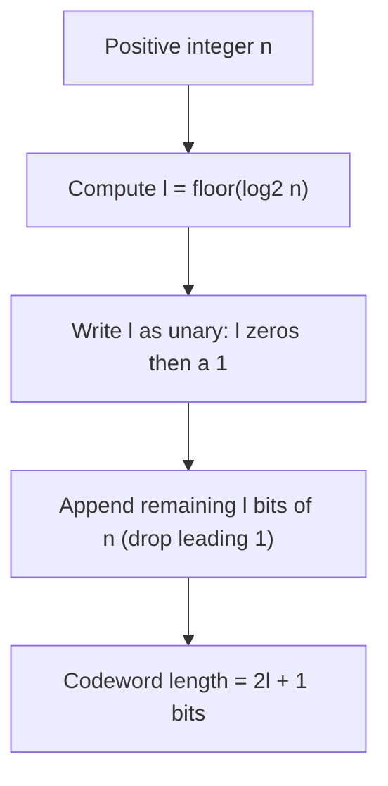

## Elias Coding and Universal Codes

### Motivation: Coding Without Known Probabilities

Huffman and arithmetic coding both require the encoder to know (or estimate) the source's probability distribution in advance. **Universal codes** address a different problem: encoding a sequence of positive integers (or symbols mappable to positive integers) efficiently **without any prior knowledge of their distribution**, while still guaranteeing bounded redundancy relative to the entropy of whatever distribution actually generated them. This makes universal codes especially useful for encoding values with unbounded range — such as run lengths, integer residuals, or symbol ranks — where a fixed-alphabet Huffman table is impractical or unknown ahead of time.

A code is called **universal** if, for any distribution in a broad class (typically distributions where larger integers are monotonically less probable), the expected code length is within a constant factor or additive term of the entropy of that distribution, uniformly over the whole class — without the encoder needing to know which specific distribution applies.

### Elias Gamma Coding

Elias gamma coding encodes a positive integer $n$ by conceptually splitting it into two parts: the number of bits needed to represent $n$ (i.e., its magnitude class), and the specific value within that class.

**Encoding procedure**:

1. Compute $l = \lfloor \log_2 n \rfloor$, the position of the highest set bit (so $2^l \leq n < 2^{l+1}$).
2. Write $l$ in **unary** as $l$ zeros followed by a single 1 (this is the "prefix" that signals how many more bits follow).
3. Append the remaining $l$ bits of $n$ (i.e., $n$ in binary, with the leading 1 bit dropped, since it is implied by the unary prefix).

The resulting codeword length is exactly $2l + 1 = 2\lfloor \log_2 n \rfloor + 1$ bits.

**Worked example — encoding $n = 13$**:

- Binary of 13 is `1101`, so $l = 3$ (since $2^3 = 8 \leq 13 < 16 = 2^4$).
- Unary prefix for $l=3$: `000` followed by `1` → `0001`.
- Remaining bits of 13 after dropping the leading 1: `101`.
- Full codeword: `0001` + `101` = `0001101` (7 bits, matching $2(3)+1 = 7$).

| $n$ | Binary | $l$ | Unary prefix | Remaining bits | Gamma codeword |
|---|---|---|---|---|---|
| 1 | 1 | 0 | 1 | (none) | 1 |
| 2 | 10 | 1 | 01 | 0 | 010 |
| 5 | 101 | 2 | 001 | 01 | 00101 |
| 13 | 1101 | 3 | 0001 | 101 | 0001101 |

**Prefix property**: The unary prefix unambiguously tells the decoder exactly how many bits follow, so no gamma codeword can be a prefix of another — the code is instantaneously decodable, satisfying the Kraft inequality by construction.

### Elias Delta Coding

Elias delta coding improves on gamma coding for **larger** integers by encoding the magnitude-class value $l+1$ using gamma coding itself (recursively), rather than plain unary.

**Encoding procedure**:

1. Compute $l = \lfloor \log_2 n \rfloor$ as before.
2. Encode $(l+1)$ using **Elias gamma coding** — this becomes the prefix.
3. Append the remaining $l$ bits of $n$, exactly as in gamma coding.

Because the magnitude prefix itself is compressed logarithmically instead of linearly (unary), delta coding's codeword length grows like $O(\log n + \log \log n)$ rather than gamma's $O(\log n)$ purely in the prefix, making it more efficient for large $n$, at the cost of slightly more overhead for small $n$.

**Worked example — encoding $n = 13$ via delta coding**:

- $l = 3$, so we need to encode $l + 1 = 4$ using gamma coding.
- Gamma-encode 4: binary of 4 is `100`, so its own $l' = 2$; unary prefix `001`, remaining bits `00` → gamma(4) = `00100`.
- Append the remaining $l=3$ bits of 13 (same as before): `101`.
- Full delta codeword: `00100` + `101` = `00100101` (8 bits).

**[Inference]** For $n=13$ specifically, delta coding (8 bits) is actually longer than gamma coding (7 bits) — delta coding's asymptotic advantage only manifests for sufficiently large $n$, where the savings from compressing the magnitude prefix logarithmically outweigh delta's extra fixed overhead. The crossover point depends on the exact constants in each scheme.

### Elias Omega Coding

Elias omega coding takes the recursive compression idea further, applying it repeatedly: the length of the length of the length, and so on, until reaching a base case. This produces even better asymptotic performance for very large integers, at the cost of more decoding complexity (recursive parsing rather than a single fixed-structure prefix).

**Encoding procedure (informal)**:

1. Start with the integer $n$; initialize the output as a single terminating bit `0`.
2. Repeatedly prepend the binary representation of the current value (including its leading 1 bit, unlike gamma/delta) to the front of the output, then set the current value to one less than the number of bits just prepended.
3. Stop when the current value is 1 (since the binary representation of 1 is just `1`, and further recursion would not add information).

**[Inference]** Omega coding's exact worked bit-by-bit trace is more intricate than gamma or delta due to its recursive self-referential structure; the qualitative property — progressively better compression of the magnitude information for very large integers, at increasing decode complexity — is the key takeaway rather than the precise bit sequence for any single example.

### Comparison of Elias Code Families

| Code | Prefix encodes | Codeword length (approx.) | Best suited for |
|---|---|---|---|
| Gamma | $l$ in unary | $2\lfloor \log_2 n \rfloor + 1$ | Small to moderate integers |
| Delta | $l+1$ in gamma | $\approx \log_2 n + 2\log_2 \log_2 n$ | Larger integers |
| Omega | Recursive gamma-of-gamma... | $\approx \log_2 n + \log_2 \log_2 n + \ldots$ | Very large or unbounded-range integers |

<svg xmlns="http://www.w3.org/2000/svg" viewBox="0 0 640 280">
  <text x="320" y="22" text-anchor="middle" font-size="15" font-weight="bold" fill="#1a1a1a">Elias Code Length Growth vs Integer Magnitude (svg_diagram)</text>

  <line x1="70" y1="230" x2="580" y2="230" stroke="#333" stroke-width="1.5" />
  <line x1="70" y1="230" x2="70" y2="40" stroke="#333" stroke-width="1.5" />
  <text x="320" y="255" text-anchor="middle" font-size="12" fill="#333">integer n (log scale, increasing)</text>
  <text x="30" y="130" font-size="12" fill="#333" transform="rotate(-90 30 130)">codeword length</text>

  <polyline points="70,220 150,190 230,150 310,100 390,60 470,45 550,42" fill="none" stroke="#c0392b" stroke-width="2" />
  <text x="470" y="35" font-size="11" fill="#c0392b">gamma (2 log n + 1)</text>

  <polyline points="70,225 150,205 230,175 310,140 390,110 470,90 550,78" fill="none" stroke="#2980b9" stroke-width="2" />
  <text x="470" y="95" text-anchor="start" font-size="11" fill="#2980b9">delta</text>

  <polyline points="70,228 150,213 230,192 310,165 390,140 470,120 550,105" fill="none" stroke="#27ae60" stroke-width="2" />
  <text x="470" y="130" text-anchor="start" font-size="11" fill="#27ae60">omega</text>

  <text x="320" y="272" text-anchor="middle" font-size="11" fill="#555">Gamma grows fastest for large n; omega grows slowest but decodes least simply.</text>
</svg>

### Universality: The Formal Property

A code assigning length $l(n)$ to integer $n$ is universal with respect to a class of probability distributions $\mathcal{P}$ if there exists a constant $c$ such that, for every distribution $P \in \mathcal{P}$:

$$E_P[l(n)] \leq c \cdot H(P) + O(1)$$

**[Inference]** Elias gamma, delta, and omega codes are generally described in the literature as universal for the class of distributions where $P(n)$ is monotonically non-increasing in $n$ — a natural condition since, for such distributions, assigning shorter codewords to smaller integers (as all three Elias schemes do) aligns codeword length with likelihood in the correct direction. The precise constants $c$ differ between gamma, delta, and omega coding and depend on the specific formal analysis being referenced.

### Practical Applications

Elias-family and related universal integer codes are widely used as building blocks within larger compression systems, particularly for encoding auxiliary values whose distribution is not known or modeled explicitly:

- **Run-length encoding**: run lengths in binary images or sparse data are often gamma- or delta-coded, since short runs are typically much more common than long ones.
- **LZ77/LZSS-family compressors**: match lengths and offsets in dictionary-based compression are sometimes encoded with Elias-style codes when an adaptive Huffman or arithmetic model for these specific values is not maintained separately.
- **Inverted index compression** (information retrieval): gaps between successive document IDs in posting lists are frequently small, favorable to gamma coding's short codewords for small integers.
- **Golomb and Rice coding**: closely related integer coding schemes, particularly well-suited to geometrically distributed data (e.g., prediction residuals in lossless audio/image compression), often compared alongside Elias codes as alternative universal-style integer coders, though Golomb-Rice codes are tuned via an explicit parameter rather than being fully parameter-free like Elias codes.

### Elias Codes vs. Fixed-Alphabet Prefix Codes

| Property | Huffman / Shannon-Fano | Elias gamma/delta/omega |
|---|---|---|
| Requires known probabilities | Yes | No |
| Alphabet size | Fixed, finite | Unbounded (any positive integer) |
| Optimality | Optimal (Huffman) for the given distribution | Not optimal for any specific distribution, but bounded redundancy across a broad class |
| Typical use case | Known, finite symbol set | Open-ended integer values (lengths, gaps, residuals) |

### Key Points

- Universal codes encode positive integers efficiently without requiring the source distribution to be known in advance, while bounding redundancy relative to whatever the true entropy turns out to be.
- **Elias gamma coding** splits an integer into a unary-coded magnitude prefix and the remaining binary digits, giving length $2\lfloor \log_2 n \rfloor + 1$.
- **Elias delta coding** compresses the magnitude prefix itself using gamma coding, improving asymptotic performance for large integers at a small fixed-overhead cost for small ones.
- **Elias omega coding** applies this recursive compression repeatedly, yielding the best asymptotic length growth among the three at the cost of more complex decoding.
- All three variants are prefix codes by construction and are considered universal for distributions where probability decreases monotonically with integer value.
- These codes underpin practical techniques such as run-length encoding, inverted index compression, and auxiliary value encoding within larger compressors like LZ77-family algorithms.

### Related Topics

- Golomb and Rice coding: parameterized universal codes for geometric distributions
- Fibonacci coding as a self-synchronizing alternative universal code
- Exp-Golomb coding as used in video compression standards (H.264/H.265)
- Formal derivation of universality bounds and redundancy constants for Elias code families
- Application of universal codes within LZ77/LZSS and modern general-purpose compressors
- Comparison of universal integer codes to adaptive arithmetic coding for unknown distributions