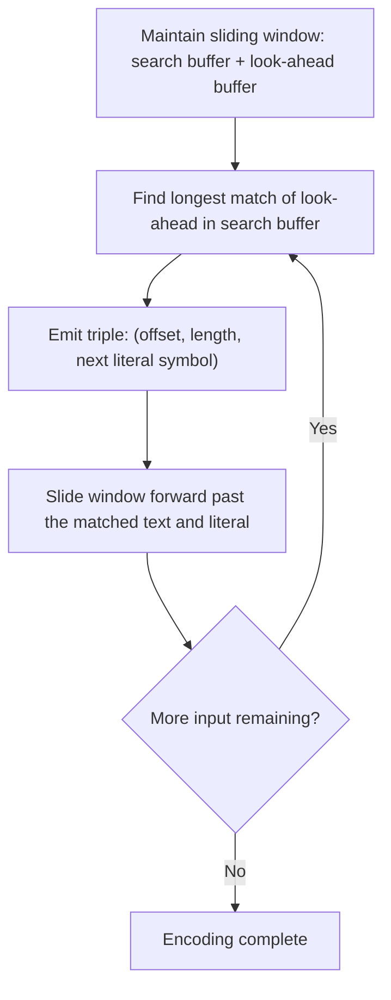
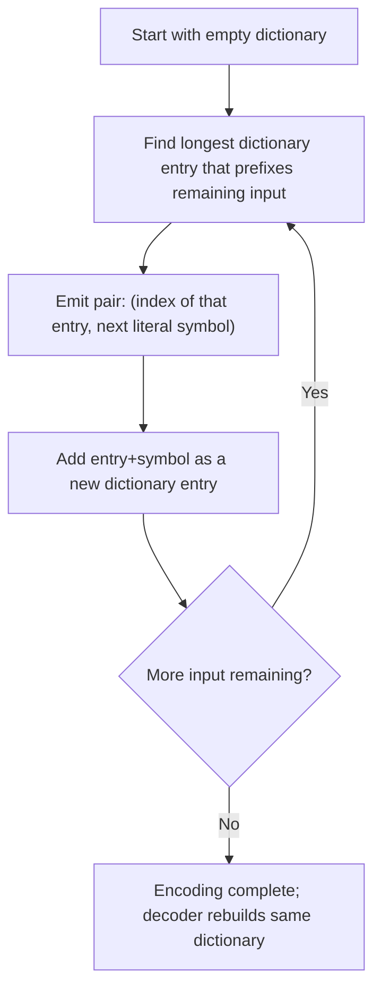

## Lempel-Ziv Algorithms (LZ77, LZ78, LZW)

### Motivation: Coding Without a Static Probability Model

Huffman coding, Shannon-Fano coding, and arithmetic coding all require either a known probability distribution or an adaptive model of one. Lempel-Ziv (LZ) algorithms take a fundamentally different, **dictionary-based** approach: rather than modeling symbol probabilities directly, they exploit **repeated substrings** within the data itself, replacing repeated sequences with compact references to earlier occurrences. This makes LZ algorithms **universal** in a different sense than Elias codes — they require no prior statistical model at all and adapt automatically to whatever redundancy structure the specific input data exhibits, including higher-order dependencies that simple symbol-frequency models cannot capture.

LZ77 (1977) and LZ78 (1978), both due to Abraham Lempel and Jacob Ziv, are the two foundational variants; LZW (Lempel-Ziv-Welch, 1984) is a widely used refinement of LZ78.

### LZ77: Sliding Window Compression

LZ77 maintains a **sliding window** over the recently processed input, divided conceptually into a **search buffer** (already-seen data) and a **look-ahead buffer** (upcoming data to encode). At each step, the encoder searches the search buffer for the longest match to the upcoming data in the look-ahead buffer, and emits a triple:

$$(\text{offset}, \text{length}, \text{next symbol})$$

where **offset** is the distance back to the start of the matched substring, **length** is how many characters matched, and **next symbol** is the literal character following the match (needed to handle the case of no match, or to guarantee progress).

**Worked example**: Encoding the string `ABABABA` with LZ77 (search buffer = everything processed so far):

| Position | Search buffer so far | Look-ahead | Match found | Output triple |
|---|---|---|---|---|
| 1 | (empty) | ABABABA | none | (0, 0, 'A') |
| 2 | A | BABABA | none | (0, 0, 'B') |
| 3 | AB | ABABA | "ABA" matches at offset 2 | (2, 3, 'B') |
| 6 | ABABAB | A | "A" matches at offset 2, length 1 | (2, 1, end-of-input) |

Decoding reverses this: at each triple, the decoder copies `length` characters starting `offset` positions back in the already-decoded output, then appends the literal next symbol.

<svg xmlns="http://www.w3.org/2000/svg" viewBox="0 0 640 220">
  <text x="320" y="22" text-anchor="middle" font-size="15" font-weight="bold" fill="#1a1a1a">LZ77 Sliding Window (svg_diagram)</text>

  <text x="40" y="60" font-size="12" fill="#333">Search buffer (already seen)</text>
  <rect x="40" y="70" width="240" height="30" fill="#2980b9" opacity="0.3" stroke="#333" />
  <text x="160" y="90" text-anchor="middle" font-size="13" fill="#2c3e50">A B A B A B</text>

  <text x="290" y="60" font-size="12" fill="#333">Look-ahead buffer</text>
  <rect x="290" y="70" width="120" height="30" fill="#e67e22" opacity="0.3" stroke="#333" />
  <text x="350" y="90" text-anchor="middle" font-size="13" fill="#2c3e50">A B A</text>

  <line x1="200" y1="100" x2="350" y2="150" stroke="#c0392b" stroke-width="1.5" stroke-dasharray="4" />
  <text x="320" y="170" text-anchor="middle" font-size="12" fill="#c0392b">Match found: "ABA" at offset 2, length 3</text>

  <text x="320" y="200" text-anchor="middle" font-size="12" fill="#555">Output: (offset=2, length=3, next symbol)</text>
</svg>

**Practical variants**: DEFLATE (used in gzip, PNG, ZIP) uses an LZ77 variant combined with Huffman coding of the resulting offset/length/literal tokens — the LZ77 stage removes repeated-substring redundancy, and the Huffman stage compresses the remaining token stream's statistical redundancy, illustrating how LZ and entropy-coding techniques compose rather than compete.

### LZ78: Dictionary-Building Without a Window

LZ78 discards the sliding window in favor of an explicit, growing **dictionary** of previously seen substrings, built incrementally as encoding proceeds. Each output token is a pair:

$$(\text{dictionary index}, \text{next symbol})$$

where the dictionary index refers to the longest previously-seen dictionary entry that is a prefix of the upcoming input, and the next symbol is the character that extends that entry to form a **new** dictionary entry.

**Worked example**: Encoding `ABABABA` with LZ78 (dictionary starts empty, index 0 conventionally denotes "no match"):

| Step | Input remaining | Longest dictionary prefix match | Output pair | New dictionary entry |
|---|---|---|---|---|
| 1 | ABABABA | none (dict empty) | (0, 'A') | 1: "A" |
| 2 | BABABA | none | (0, 'B') | 2: "B" |
| 3 | ABABA | "A" (entry 1) | (1, 'B') | 3: "AB" |
| 4 | ABA | "AB" (entry 3) | (3, 'A') | 4: "ABA" |
| 5 | (empty, "A" remains as final leftover) | "A" (entry 1) | (1, end) | — |

Each step both emits a token **and** grows the dictionary by exactly one new entry, so the dictionary self-builds without ever needing to be transmitted separately — the decoder reconstructs the identical dictionary by performing the same insertion steps as it decodes each token.

### LZW: Eliminating the Explicit Literal

LZW (Lempel-Ziv-Welch) refines LZ78 by removing the need to transmit an explicit "next symbol" alongside each dictionary index. Instead:

1. The dictionary is **pre-initialized** with every single-character symbol of the alphabet (e.g., all 256 byte values for byte-oriented compression), so any single character always has a valid dictionary match from the start.
2. The encoder always extends the current match by one more character and only emits an index (not a literal) when the extended string is **not** found in the dictionary — at which point it emits the index for the longest match found so far, adds the extended (unmatched) string as a new dictionary entry, and resumes matching from the unmatched character.

**Worked example**: Encoding `ABABABA` with LZW (dictionary pre-loaded with 'A'→1, 'B'→2; new entries start at index 3):

| Step | Current match | Next char | Extended string in dict? | Action |
|---|---|---|---|---|
| 1 | "A" | B | "AB" not in dict | Emit 1 ("A"); add "AB"→3; current becomes "B" |
| 2 | "B" | A | "BA" not in dict | Emit 2 ("B"); add "BA"→4; current becomes "A" |
| 3 | "A" | B | "AB" **is** in dict (entry 3) | Extend current match to "AB"; continue |
| 4 | "AB" | A | "ABA" not in dict | Emit 3 ("AB"); add "ABA"→5; current becomes "A" |
| 5 | "A" | (end of input) | — | Emit 1 ("A") for final leftover match |

**Output token stream**: `1, 2, 3, 1` — only indices, no literal symbols at all, since the pre-initialized single-character dictionary guarantees every character is always matchable.

### Comparison of LZ77, LZ78, and LZW

| Property | LZ77 | LZ78 | LZW |
|---|---|---|---|
| Structure | Sliding window over recent input | Explicit growing dictionary, unbounded lookback | Explicit growing dictionary, pre-seeded with single characters |
| Token content | (offset, length, next symbol) | (dictionary index, next symbol) | (dictionary index only) |
| Dictionary size limit | Implicit (window size) | Can grow unboundedly (often capped in practice) | Can grow unboundedly (often capped in practice) |
| Notable derivatives | DEFLATE (gzip, zlib, PNG), LZSS, Snappy | LZW (direct successor) | GIF, TIFF (LZW variant), classic Unix `compress` |

<svg xmlns="http://www.w3.org/2000/svg" viewBox="0 0 640 200">
  <text x="320" y="22" text-anchor="middle" font-size="15" font-weight="bold" fill="#1a1a1a">LZ Family Relationships (svg_diagram)</text>

  <rect x="40" y="60" width="150" height="50" fill="#2980b9" opacity="0.25" stroke="#2980b9" />
  <text x="115" y="90" text-anchor="middle" font-size="13" fill="#2c3e50">LZ77 (1977)</text>

  <rect x="250" y="60" width="150" height="50" fill="#27ae60" opacity="0.25" stroke="#27ae60" />
  <text x="325" y="90" text-anchor="middle" font-size="13" fill="#2c3e50">LZ78 (1978)</text>

  <rect x="460" y="60" width="150" height="50" fill="#8e44ad" opacity="0.25" stroke="#8e44ad" />
  <text x="535" y="90" text-anchor="middle" font-size="13" fill="#2c3e50">LZW (1984)</text>

  <line x1="325" y1="110" x2="535" y2="110" stroke="#333" stroke-width="1.5" marker-end="url(#arrow)" />
  <text x="430" y="130" text-anchor="middle" font-size="11" fill="#333">removes explicit literal</text>

  <text x="115" y="150" text-anchor="middle" font-size="11" fill="#555">-&gt; DEFLATE, LZSS, Snappy</text>
  <text x="535" y="150" text-anchor="middle" font-size="11" fill="#555">-&gt; GIF, TIFF, Unix compress</text>
</svg>

### Why LZ Algorithms Are Considered "Universal"

**[Inference]** LZ77 and LZ78 (and by extension LZW) are often described in the information theory literature as **universal source coding algorithms** in a formal asymptotic sense: for a sufficiently long input generated by a stationary ergodic source (a broad class encompassing most sources with statistical regularity, not just memoryless ones), the compression ratio achieved by LZ-family algorithms converges to the source's true entropy rate as the input length grows, without the algorithm needing to know the source's statistics in advance. This universality result is generally attributed to Ziv and Lempel's original theoretical analysis and is distinct from — though related in spirit to — the "universal codes" property of Elias-family integer codes, since LZ universality concerns adapting to unknown *sequential/contextual* structure rather than encoding integers efficiently under an unknown but monotonic distribution.

### Relationship to Entropy Coding

LZ-family algorithms and entropy coders (Huffman, arithmetic) are **complementary rather than competing** techniques, and are very commonly combined in practical compressors:

- **LZ stage**: removes redundancy from repeated substrings, producing a stream of tokens (offsets, lengths, literals, or dictionary indices).
- **Entropy coding stage**: compresses the resulting token stream further, since tokens themselves are typically not uniformly distributed (e.g., short offsets and short literals tend to be more common than long ones).

This two-stage design is exactly the structure of DEFLATE (LZ77 + Huffman), and is echoed in more modern schemes that pair LZ-style matching with arithmetic or range coding (e.g., LZMA) or with Asymmetric Numeral Systems (e.g., Zstandard).

### Key Points

- LZ77 uses a sliding window over recent input and emits (offset, length, next-symbol) triples referencing earlier matched substrings.
- LZ78 replaces the sliding window with an explicit, incrementally built dictionary, emitting (dictionary index, next-symbol) pairs.
- LZW refines LZ78 by pre-seeding the dictionary with all single characters, allowing tokens to contain only a dictionary index with no separate literal.
- All three approaches are **dictionary-based** rather than probability-model-based, distinguishing them fundamentally from Huffman, Shannon-Fano, and arithmetic coding.
- LZ algorithms are considered universal in the asymptotic sense: compression ratio converges to the true entropy rate of a stationary ergodic source as input length grows, without prior knowledge of source statistics.
- In practice, LZ-family algorithms are frequently combined with entropy coding (e.g., DEFLATE's LZ77 + Huffman) to compress both substring redundancy and residual statistical redundancy in a single pipeline.

### Related Topics

- DEFLATE algorithm: combining LZ77 with Huffman coding in detail
- LZMA and the combination of LZ77-style matching with range coding
- Entropy rate of stationary ergodic sources and its role in LZ universality proofs
- Practical dictionary size limits, hashing, and match-finding strategies in real LZ77 implementations
- Burrows-Wheeler Transform (BWT) as an alternative dictionary-free redundancy-exploiting technique (e.g., bzip2)
- Comparison of dictionary-based compression versus context-modeling approaches (PPM, context mixing)