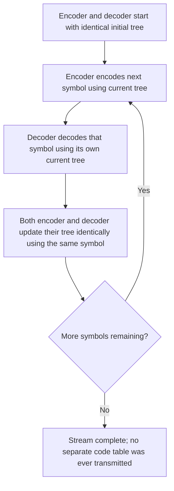

## Adaptive and Dynamic Huffman Coding

### Motivation: When the Distribution Isn't Known in Advance

Standard (static) Huffman coding requires the full probability distribution of the source to be known before encoding begins, so that a single fixed tree can be built and then either transmitted to the decoder or assumed shared in advance. This creates two practical problems: (1) a **two-pass requirement** — the encoder must scan the entire input once to gather symbol frequencies before a second pass can encode it, which is incompatible with streaming or single-pass applications; and (2) **overhead** from transmitting the code table itself alongside the compressed data, which can be significant for small inputs or rapidly changing statistics.

Adaptive (also called dynamic) Huffman coding solves both problems by having the encoder and decoder **build and update the same Huffman tree incrementally**, symbol by symbol, based only on the symbols processed so far — with no separate code table ever transmitted.

### Core Principle: Synchronized Incremental Updates

The key requirement for adaptive Huffman coding to work correctly is that the **encoder and decoder must remain perfectly synchronized** at every step, since there is no explicit code table to fall back on. This synchronization is achieved by both sides:

1. Starting from an identical initial state (typically an empty tree, or a tree with all symbols at a designated minimal frequency).
2. After each symbol is encoded/decoded, both sides update their tree using the **same deterministic update procedure**, based only on information both sides now possess (the symbol just processed).

Because both sides perform identical updates in lockstep, the tree used to encode symbol $k+1$ always reflects the frequency statistics of exactly the first $k$ symbols, and both sides agree on what that tree looks like without ever exchanging it explicitly.

### The Problem With Naive Rebuilding

A naive approach — simply rebuilding the entire Huffman tree from scratch after every new symbol using the classic bottom-up merge algorithm — is correct but computationally expensive: a full rebuild costs $O(n \log n)$ (where $n$ is the current alphabet size), making the total cost of adaptively encoding a message of length $N$ symbols $O(N \cdot n \log n)$, which is impractical for long messages or large alphabets. Practical adaptive Huffman algorithms instead **update the existing tree incrementally**, adjusting only the parts of the tree affected by the new symbol's frequency increase.

### The FGK Algorithm (Faller-Gallager-Knuth)

The FGK algorithm, developed independently by Faller, then Gallager, and refined by Knuth, maintains an invariant on the tree called the **sibling property**:

> Every node in the tree can be listed in order of non-increasing weight such that each node is adjacent in this list to its sibling.

Equivalently, at every node level, nodes are ordered by weight, and each pair of tree-siblings occupies adjacent positions in this weight-ordering. Maintaining this property at all times guarantees the tree remains a valid Huffman tree (i.e., optimal for the frequencies observed so far) after every update.

**Update procedure after processing a symbol**:

1. If the symbol has been seen before, locate its existing leaf node.
2. If the symbol is new, split a designated "0-weight" placeholder leaf (the **NYT — Not Yet Transmitted — node**) into an internal node with two children: a new NYT node and a new leaf for this symbol.
3. Increment the weight of the (now-located or newly-created) leaf by 1.
4. Propagate this weight increase up toward the root, and at each level, if the sibling-property ordering would be violated (i.e., this node's new weight exceeds that of some node earlier in the weight-ordering that is not its ancestor), **swap** the node with the highest-weight-ordered node of the same original weight to restore the ordering (this is the core "slide and increment" operation).
5. Continue this increment-and-possibly-swap process up to the root.

**[Inference]** The NYT (Not Yet Transmitted) node mechanism specifically handles new symbols: since the decoder cannot yet know the position of a symbol it hasn't seen, the encoder transmits a special NYT escape code followed by a fixed-length representation of the new symbol itself (e.g., its raw byte value), after which both sides split the NYT leaf into an internal node as described. This escape mechanism is standard across FGK-style implementations, though exact NYT-encoding conventions can vary slightly between specific implementations.

<svg xmlns="http://www.w3.org/2000/svg" viewBox="0 0 640 260">
  <text x="320" y="22" text-anchor="middle" font-size="15" font-weight="bold" fill="#1a1a1a">Adaptive Huffman: NYT Node Splitting (svg_diagram)</text>

  <text x="140" y="55" text-anchor="middle" font-size="12" fill="#333">Before: new symbol seen</text>
  <circle cx="140" cy="90" r="8" fill="#2c3e50" />
  <line x1="140" y1="90" x2="90" y2="140" stroke="#555" stroke-width="1.5" />
  <line x1="140" y1="90" x2="190" y2="140" stroke="#555" stroke-width="1.5" />
  <circle cx="90" cy="140" r="7" fill="#27ae60" />
  <text x="90" y="160" text-anchor="middle" font-size="11" fill="#27ae60">A (w=3)</text>
  <circle cx="190" cy="140" r="7" fill="#e67e22" />
  <text x="190" y="160" text-anchor="middle" font-size="11" fill="#e67e22">NYT (w=0)</text>

  <text x="470" y="55" text-anchor="middle" font-size="12" fill="#333">After: NYT splits for symbol "C"</text>
  <circle cx="470" cy="90" r="8" fill="#2c3e50" />
  <line x1="470" y1="90" x2="420" y2="140" stroke="#555" stroke-width="1.5" />
  <line x1="470" y1="90" x2="520" y2="140" stroke="#555" stroke-width="1.5" />
  <circle cx="420" cy="140" r="7" fill="#27ae60" />
  <text x="420" y="160" text-anchor="middle" font-size="11" fill="#27ae60">A (w=3)</text>
  <circle cx="520" cy="140" r="7" fill="#2c3e50" />
  <text x="520" y="160" text-anchor="middle" font-size="11" fill="#2c3e50">new internal</text>

  <line x1="520" y1="140" x2="480" y2="190" stroke="#555" stroke-width="1.5" />
  <line x1="520" y1="140" x2="560" y2="190" stroke="#555" stroke-width="1.5" />
  <circle cx="480" cy="190" r="7" fill="#e67e22" />
  <text x="480" y="210" text-anchor="middle" font-size="11" fill="#e67e22">NYT (w=0)</text>
  <circle cx="560" cy="190" r="7" fill="#8e44ad" />
  <text x="560" y="210" text-anchor="middle" font-size="11" fill="#8e44ad">C (w=1)</text>

  <text x="320" y="240" text-anchor="middle" font-size="12" fill="#555">NYT leaf splits into a new internal node with a fresh NYT child and the new symbol's leaf.</text>
</svg>

### The Vitter Algorithm

The Vitter algorithm, introduced by Jeffrey Vitter in 1987, refines FGK by maintaining a **stronger invariant** (an additional numbering/ordering constraint on nodes beyond the basic sibling property) that guarantees the adaptive tree stays as close as possible to what a *static* Huffman tree would look like for the same frequencies at every point in time, while still supporting efficient $O(1)$ amortized update time per symbol (as opposed to FGK's update cost, which can be higher in the worst case for certain input patterns).

**[Inference]** The precise numbering invariant Vitter's algorithm maintains is more intricate than the basic sibling property and involves assigning implicit numeric weights to nodes that respect a specific total order; a full formal treatment involves invariants beyond the scope of a conceptual overview, but the practical upshot is that Vitter's algorithm provides provably tighter worst-case bounds on total code length relative to the best possible static Huffman code computed with hindsight, compared to FGK.

### Comparison: Static vs. Adaptive Huffman Coding

| Property | Static Huffman | Adaptive (FGK / Vitter) Huffman |
|---|---|---|
| Passes over data required | Two (frequency count, then encode) | One (single pass, online) |
| Code table transmission | Required (adds overhead) | Not required (tree inferred identically by both sides) |
| Suitability for streaming | Poor (needs full input first) | Good (encodes as data arrives) |
| Adapts to changing statistics mid-stream | No (fixed tree throughout) | Yes (tree evolves with observed frequencies) |
| Per-symbol update cost | N/A (built once) | $O(\log n)$ typical, with careful implementations achieving good amortized bounds |
| Guaranteed optimal for final overall distribution | Yes, for the full known distribution | Not necessarily — tree reflects a running average that lags behind non-stationary sources |

### Advantages of Adaptive Huffman Coding

- **Single-pass, online operation**: suitable for streaming data, real-time compression, and situations where the entire input isn't available upfront.
- **No code table overhead**: eliminates the need to transmit or embed a frequency table, which particularly benefits small files or messages where table overhead would be proportionally large.
- **Automatic adaptation to non-stationary sources**: if the source's statistics genuinely change partway through a message (e.g., different data types concatenated together), the adaptive tree gradually shifts to reflect the more recent local statistics, which a single static tree computed once cannot do.

### Disadvantages and Practical Considerations

- **Implementation complexity**: maintaining the sibling property (or Vitter's stronger invariant) under incremental updates is considerably more intricate to implement correctly than the simple static merge-and-build procedure.
- **Lag/transient inefficiency**: early in the stream, before enough symbols have been observed to build a representative tree, adaptive coding can be less efficient than a static code built with full knowledge of the eventual distribution — there is an inherent "learning cost" paid at the start of any adaptive scheme.
- **Largely superseded by adaptive arithmetic coding in modern practice**: because arithmetic coding can update its probability model incrementally in essentially the same online spirit as adaptive Huffman coding, but without Huffman's integer-codeword-length restriction, adaptive arithmetic coding (and context-mixing extensions of it) is generally preferred in modern high-performance compressors when an online, statistics-agnostic entropy coder is needed. **[Inference]** Adaptive Huffman coding retains pedagogical value and occasional use in resource-constrained settings where arithmetic coding's higher computational cost is undesirable, but it is not the dominant choice in most contemporary general-purpose compression software.

### Relationship to the Broader Source Coding Landscape

Adaptive Huffman coding sits at an interesting intersection of ideas covered so far: it retains Huffman's core tree-based, integer-length prefix code structure (and therefore still cannot beat the $H(X) \leq L < H(X)+1$ bound at the symbol level), while borrowing the "no advance statistics needed" philosophy more commonly associated with universal codes (Elias, LZ-family) and adaptive arithmetic coding. This makes it a useful conceptual bridge between static entropy coding and the fully adaptive, statistics-agnostic techniques that dominate modern practical compression.

### Key Points

- Adaptive Huffman coding builds and updates the Huffman tree incrementally as symbols are processed, with encoder and decoder remaining synchronized without ever exchanging an explicit code table.
- The **sibling property** (nodes orderable by weight such that siblings are adjacent) is the key invariant maintained to guarantee the tree stays a valid, near-optimal Huffman tree at every step.
- The **NYT (Not Yet Transmitted) node** mechanism handles the introduction of previously unseen symbols via an escape code plus raw symbol transmission.
- The **FGK algorithm** was the original practical incremental-update method; the **Vitter algorithm** later improved worst-case guarantees via a stronger node-ordering invariant.
- Adaptive Huffman coding trades implementation complexity and early-stream inefficiency for single-pass operation and elimination of code-table overhead.
- In modern practice, adaptive arithmetic coding generally supersedes adaptive Huffman coding for high-performance applications, though adaptive Huffman remains relevant pedagogically and in some constrained settings.

### Related Topics

- Adaptive arithmetic coding and incremental probability model updates
- Context modeling and higher-order adaptive statistics (PPM-style prediction)
- Formal proof and complexity analysis of the FGK sibling-property update procedure
- Vitter's algorithm: detailed invariant and amortized $O(1)$ update proof
- Comparison of adaptive Huffman, adaptive arithmetic coding, and LZ-family methods on non-stationary data
- Practical historical use cases of adaptive Huffman coding (e.g., early modem compression protocols)