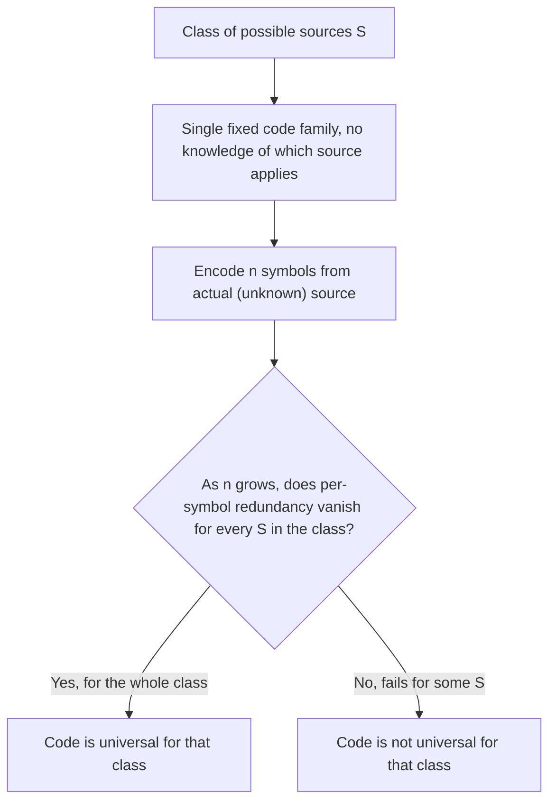
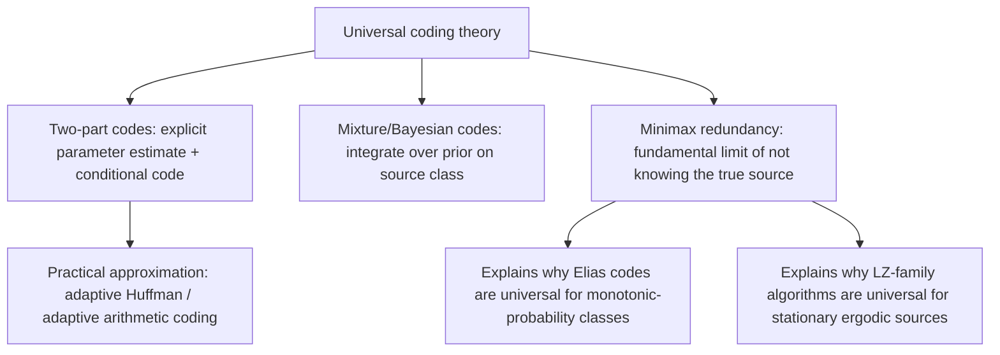

## Universal Codes for Unknown Source Distributions

### The General Problem

All the entropy-coding techniques discussed so far — Huffman, Shannon-Fano, arithmetic coding — assume the encoder has access to the source's probability distribution, either known in advance or estimated adaptively as data arrives. **Universal source coding** addresses a more general question: can a single, fixed coding scheme perform well (in the sense of approaching the entropy rate) across an entire **class** of possible source distributions, without being tuned to any one of them in particular, and without even adaptively estimating probabilities the way adaptive Huffman or adaptive arithmetic coding do?

This topic ties together several threads introduced separately in earlier sessions — Elias integer codes, LZ-family dictionary methods, and adaptive coding — under a single unifying formal framework, and introduces the additional key results (Kolmogorov complexity connections, minimax redundancy) that formalize what "universal" precisely means.

### Formal Definition of Universality

A sequence of codes $\{C_n\}$ (one for each block length $n$) is **universal** for a class of sources $\mathcal{S}$ if, for every source $S \in \mathcal{S}$, the per-symbol redundancy vanishes as $n \to \infty$:

$$\lim_{n \to \infty} \left[ \frac{L_n}{n} - H_S \right] = 0$$

where $L_n$ is the expected length of encoding $n$ symbols under $C_n$, and $H_S$ is the entropy rate of source $S$. Crucially, the code $C_n$ itself must not depend on knowing which specific $S \in \mathcal{S}$ generated the data — only on $n$ and the class $\mathcal{S}$ as a whole.

This is a stronger and more general requirement than what any single fixed-distribution Huffman or arithmetic code can offer, since those are optimized for one particular distribution and can perform arbitrarily poorly if the true source differs from the assumed one.

### Two-Part (Two-Stage) Universal Codes

One conceptually simple construction of a universal code is the **two-part code**: encode a description of the model (or its estimated parameters) first, followed by the data encoded under that model.

$$L_{\text{total}}(x^n) = L(\hat{\theta}) + L(x^n \mid \hat{\theta})$$

where $\hat{\theta}$ is an estimate of the source parameters (e.g., empirical symbol frequencies) derived from the data itself, $L(\hat{\theta})$ is the cost of describing that estimate, and $L(x^n \mid \hat{\theta})$ is the cost of encoding the data using the code optimal for $\hat{\theta}$ (e.g., a Huffman or arithmetic code built from $\hat{\theta}$).

**Trade-off**: A richer, more precise parameter estimate $\hat{\theta}$ typically reduces $L(x^n \mid \hat{\theta})$ (better model fit) but increases $L(\hat{\theta})$ (more bits to describe the model). Two-part codes must balance this trade-off, and the overhead $L(\hat{\theta})$ is a direct, quantifiable source of the code's non-zero redundancy at finite $n$ — this overhead is precisely what vanishes per-symbol as $n \to \infty$, since $L(\hat{\theta})$ typically grows much more slowly (often logarithmically in $n$) than $L(x^n \mid \hat{\theta})$ (which grows linearly in $n$).

### Mixture (Bayesian) Universal Codes

An alternative to explicitly estimating and transmitting $\hat{\theta}$ is to encode data using a **mixture distribution** over the entire class of possible sources, weighted by a prior:

$$Q(x^n) = \int_{\theta} w(\theta) \, P_\theta(x^n) \, d\theta$$

where $w(\theta)$ is a prior weighting over possible parameter values $\theta$, and $P_\theta(x^n)$ is the probability of the observed sequence under the source with parameter $\theta$. A code (typically implemented via arithmetic coding) built directly from this mixture distribution $Q$ requires no explicit parameter transmission — the "model selection" happens implicitly through the integral.

**[Inference]** This mixture-code approach is closely connected to Bayesian statistics and to the **Krichevsky-Trofimov (KT) estimator**, a specific well-studied choice of prior/mixture for binary memoryless sources that is known to achieve near-optimal minimax redundancy; the general mixture-code framework extends to broader source classes but the precise redundancy bounds depend on the specific prior and source class chosen, which is beyond a general conceptual treatment.

### Minimax Redundancy

For a given source class $\mathcal{S}$ and block length $n$, the **minimax redundancy** is the best achievable worst-case redundancy, minimizing over all possible codes and maximizing over all sources in the class:

$$R_n^*(\mathcal{S}) = \min_{C_n} \max_{S \in \mathcal{S}} \left[ L_n(C_n, S) - n H_S \right]$$

This quantity characterizes the fundamental price of not knowing which source in $\mathcal{S}$ generated the data. For many well-studied classes (e.g., all memoryless sources over a finite alphabet of size $k$), classical results show that the minimax redundancy grows as:

$$R_n^*(\mathcal{S}) \approx \frac{k-1}{2} \log_2 n + O(1)$$

**[Inference]** This logarithmic-in-$n$ growth rate (rather than growth proportional to $n$) is the key formal result explaining why universal codes can still have vanishing *per-symbol* redundancy $R_n^*/n \to 0$ even though the absolute redundancy $R_n^*$ grows without bound — this specific asymptotic formula is a standard result associated with Rissanen's and Davisson's work on universal coding theory, though exact constants and regularity conditions vary by the precise source class and technical assumptions used in different treatments.

<svg xmlns="http://www.w3.org/2000/svg" viewBox="0 0 640 240">
  <text x="320" y="22" text-anchor="middle" font-size="15" font-weight="bold" fill="#1a1a1a">Absolute vs Per-Symbol Redundancy Growth (svg_diagram)</text>

  <line x1="70" y1="200" x2="580" y2="200" stroke="#333" stroke-width="1.5" />
  <line x1="70" y1="200" x2="70" y2="40" stroke="#333" stroke-width="1.5" />
  <text x="320" y="222" text-anchor="middle" font-size="12" fill="#333">n (block length, increasing)</text>

  <polyline points="70,190 150,160 230,135 310,115 390,100 470,88 550,78" fill="none" stroke="#c0392b" stroke-width="2" />
  <text x="470" y="70" font-size="11" fill="#c0392b">absolute redundancy R_n ~ (k-1)/2 log2(n)</text>

  <polyline points="70,60 150,110 230,140 310,155 390,165 470,172 550,177" fill="none" stroke="#2980b9" stroke-width="2" />
  <text x="150" y="95" font-size="11" fill="#2980b9">per-symbol redundancy R_n / n -&gt; 0</text>

  <text x="320" y="238" text-anchor="middle" font-size="11" fill="#555">Absolute redundancy grows (slowly); per-symbol redundancy still vanishes.</text>
</svg>

### Connections to Techniques Covered Previously

Universal coding theory provides the formal justification for several techniques introduced earlier as standalone tools:

- **Elias gamma/delta/omega codes** are universal codes for the specific class of sources where probability is monotonically non-increasing in symbol value — a narrower, structurally-defined class rather than a general parametric family, but universal in exactly the formal sense defined here.
- **LZ77/LZ78/LZW algorithms** were noted earlier to be asymptotically universal for stationary ergodic sources — a much broader class than memoryless sources, since it includes sources with arbitrary (even infinite-order) statistical dependencies between symbols, as long as the underlying process is stationary and ergodic.
- **Adaptive Huffman and adaptive arithmetic coding** are practical, computationally efficient approximations to the two-part or mixture-code idea: instead of formally integrating over a prior, they maintain a running frequency estimate and update it online, which is conceptually similar to (though not always formally identical to) the two-part code's parameter-estimation step, applied incrementally rather than once at the end.

### Universality Versus Optimality: An Important Distinction

A universal code is **not** claimed to be optimal for any single specific distribution — by design, it sacrifices some efficiency on any individual source in exchange for guaranteed bounded (and asymptotically vanishing per-symbol) redundancy across the *entire class*. This mirrors the earlier observation that Elias codes are never optimal for a specific known distribution the way Huffman coding is, but they don't need to be, since their purpose is different: robust performance under uncertainty about the distribution, rather than peak performance for one known distribution.

| Property | Distribution-specific optimal code (e.g., Huffman for known $p$) | Universal code (e.g., LZ, Elias, mixture code) |
|---|---|---|
| Requires known distribution | Yes | No |
| Optimal for the true distribution, if known | Yes | No (some bounded redundancy remains) |
| Performance guarantee | Only for the assumed distribution | Across an entire class of distributions |
| Redundancy as $n \to \infty$ (per symbol) | Approaches 0 only if the assumed model is correct | Approaches 0 for every source in the class |

### Practical Significance

**[Inference]** Universal coding theory is largely why modern general-purpose compressors (gzip, zstd, and similar tools) can perform reasonably well across wildly different file types — text, executables, structured data — without needing a human to specify which statistical model applies to each file in advance; the LZ-family matching stage handles the "unknown source structure" problem in a formally universal way, while an entropy-coding backend (Huffman, range coding, or ANS) captures residual statistical redundancy in the resulting token stream. This combination is a practical instantiation of the universal-coding principles described here, though individual compressor implementations involve many engineering choices beyond the pure theoretical framework.

### Key Points

- A **universal code** achieves vanishing per-symbol redundancy across an entire class of sources, without requiring the encoder to know which specific source in the class generated the data.
- **Two-part codes** explicitly estimate and transmit a model, then encode data conditional on that model; the model-description cost is the primary source of redundancy, and it typically grows only logarithmically in block length.
- **Mixture (Bayesian) codes** avoid explicit model transmission by encoding under a probability distribution averaged over a prior across the source class.
- **Minimax redundancy** formalizes the fundamental price of distributional uncertainty and, for many classical source classes, grows as $O(\log n)$ in absolute terms while vanishing per symbol.
- Elias codes, LZ-family algorithms, and adaptive Huffman/arithmetic coding are all instances (or practical approximations) of universal coding principles, each suited to a different class of source uncertainty.
- Universality trades peak efficiency on any single known distribution for guaranteed robustness across an entire class of unknown distributions.

### Related Topics

- Krichevsky-Trofimov estimator and minimax-optimal universal coding for binary memoryless sources
- Minimum Description Length (MDL) principle and its relationship to two-part universal codes
- Kolmogorov complexity and algorithmic information theory as the individual-sequence analogue of universal coding
- Context Tree Weighting (CTW) as a universal code for tree-structured (finite-context) sources
- Rissanen's stochastic complexity and its role in model selection
- Formal entropy rate of stationary ergodic sources and its relationship to LZ-family universality proofs