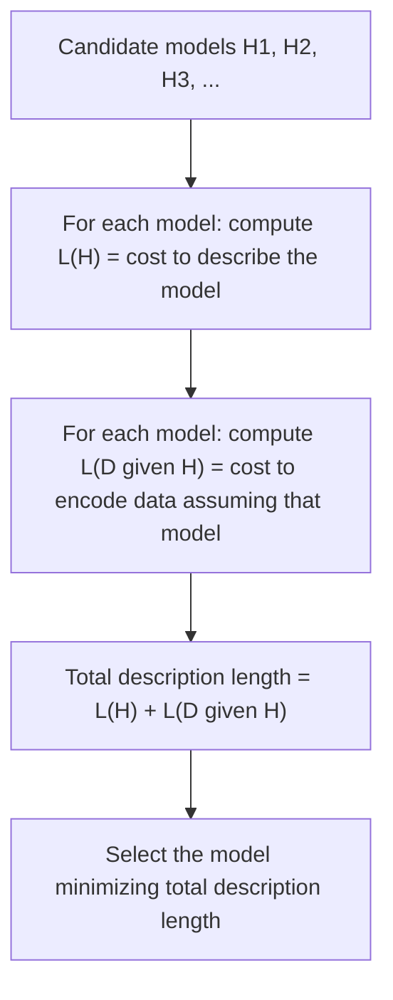

## Minimum Description Length Principle

### Core Idea

The Minimum Description Length (MDL) principle reframes statistical model selection as a data compression problem: among a set of candidate models, the **best model is the one that permits the shortest total description of the data**, where "description" includes both the cost of specifying the model itself and the cost of specifying the data given that model. This directly generalizes the two-part universal coding framework introduced previously — MDL is, in essence, that same two-part code idea elevated from a coding technique into a general-purpose principle for **statistical inference and model comparison**.

The guiding slogan, often attributed to Jorma Rissanen (who formalized MDL in the late 1970s and 1980s), is that **learning is compression**: a model that captures genuine, generalizable structure in the data will compress it well, while a model that merely memorizes noise or overfits will not, because the noise itself has no compressible structure and must be encoded at close to its raw entropy cost.

### The Two-Part Code Formalization

For a candidate model (or hypothesis) $H$ and observed data $D$, the MDL principle selects the model minimizing:

$$L(H) + L(D \mid H)$$

where $L(H)$ is the number of bits needed to describe the model itself, and $L(D \mid H)$ is the number of bits needed to describe the data using a code that is optimal under the assumption that $H$ is correct (i.e., the entropy-coding length of $D$ if $H$'s implied probability distribution were used to build a Huffman, arithmetic, or equivalent optimal code for $D$).

This is exactly the two-part code decomposition from universal coding theory, but now interpreted with $H$ playing the role of a **statistical model or hypothesis** (e.g., "this data follows a polynomial of degree 3" or "this data was generated by a Markov chain of order 2") rather than merely a set of estimated frequency parameters.

### Why This Penalizes Overfitting Naturally

A central motivation for MDL is that it provides a **principled, automatic trade-off** between model complexity and data fit, without requiring an externally chosen regularization parameter (as in many other model-selection approaches):

- An **overly simple model** (e.g., a constant function fit to noisy data) has small $L(H)$ but large $L(D \mid H)$, because the model fits poorly and the residual deviations from the model's predictions must be encoded at high cost (they look close to random/incompressible under this model).
- An **overly complex model** (e.g., a very high-degree polynomial that passes through every data point exactly) has small $L(D \mid H)$ (the data is perfectly predicted, so little or no residual needs encoding) but large $L(H)$, because specifying a high-degree polynomial's many coefficients precisely requires many bits.
- The **MDL-optimal model** sits at the point where the sum $L(H) + L(D \mid H)$ is minimized — intuitively, the model complex enough to capture genuine structure, but not so complex that its own description cost outweighs the savings it provides in describing the data.

<svg xmlns="http://www.w3.org/2000/svg" viewBox="0 0 640 280">
  <text x="320" y="22" text-anchor="middle" font-size="15" font-weight="bold" fill="#1a1a1a">MDL Trade-off Between Model and Data Cost (svg_diagram)</text>

  <line x1="70" y1="230" x2="580" y2="230" stroke="#333" stroke-width="1.5" />
  <line x1="70" y1="230" x2="70" y2="40" stroke="#333" stroke-width="1.5" />
  <text x="320" y="255" text-anchor="middle" font-size="12" fill="#333">model complexity, increasing</text>
  <text x="30" y="130" font-size="12" fill="#333" transform="rotate(-90 30 130)">description length (bits)</text>

  <polyline points="90,60 200,110 320,150 440,190 550,220" fill="none" stroke="#c0392b" stroke-width="2" />
  <text x="480" y="215" font-size="11" fill="#c0392b">L(D given H) decreases</text>

  <polyline points="90,225 200,190 320,150 440,105 550,55" fill="none" stroke="#2980b9" stroke-width="2" />
  <text x="150" y="200" font-size="11" fill="#2980b9">L(H) increases</text>

  <polyline points="90,215 200,145 320,120 440,155 550,205" fill="none" stroke="#27ae60" stroke-width="3" />
  <text x="330" y="105" font-size="11" fill="#27ae60" font-weight="bold">total = L(H) + L(D|H)</text>

  <circle cx="320" cy="120" r="6" fill="#27ae60" />
  <text x="320" y="105" text-anchor="middle" font-size="11" fill="#1a1a1a">MDL-optimal complexity</text>
</svg>

### Worked Conceptual Example — Polynomial Curve Fitting

Suppose $N$ data points $(x_i, y_i)$ are observed, and candidate models are polynomials of degree $0, 1, 2, \ldots, N-1$.

- **Degree 0** (constant model): $L(H)$ is small (one coefficient), but if the true relationship is nonlinear, residuals $y_i - \hat{y}_i$ will be large and require many bits to encode under $L(D \mid H)$.
- **Degree $N-1$** (a polynomial passing exactly through every point): $L(D \mid H) \approx 0$ (residuals are exactly zero), but $L(H)$ is large, since $N$ coefficients must be specified — and specifying them to sufficient precision to exactly reproduce noisy data typically costs at least as many bits as the noise itself carried, since noise (by definition) has no compressible structure.
- **Some intermediate degree** (e.g., degree 2 or 3, if that's the true underlying relationship plus noise) typically minimizes the total: enough parameters to capture genuine structure, cheap enough to describe, leaving only true residual noise to encode in $L(D \mid H)$.

**[Inference]** This qualitative account captures the standard MDL intuition for polynomial model selection, but the exact optimal degree in any real numerical example depends on the specific data, the precision used to encode coefficients, and the coding scheme chosen for $L(D \mid H)$ (e.g., assuming Gaussian residuals versus another noise model); a fully worked numerical example would require specifying these choices explicitly.

### Refined vs. Crude MDL

- **Crude (two-part) MDL** is the literal two-stage description above: explicitly separate $L(H)$ and $L(D \mid H)$. This is intuitive and directly tied to the two-part universal coding construction, but the exact value of $L(H)$ can be somewhat arbitrary, depending on how model parameters are discretized or encoded (e.g., how many bits of precision are used for each coefficient).
- **Refined MDL** (developed later by Rissanen and others) replaces the explicit two-part split with the **stochastic complexity** of the data relative to a whole *model class* (not a single fitted model), typically computed via the mixture/Bayesian universal coding approach or the **normalized maximum likelihood (NML)** distribution. This avoids the somewhat arbitrary parameter-encoding-precision choices of crude MDL and gives a more principled, minimax-optimal description length. **[Inference]** Refined MDL's stochastic complexity formulation is mathematically more involved, generally requiring the normalized maximum likelihood distribution to be computed or approximated over the entire model class, which can be computationally demanding for complex model families; crude two-part MDL remains more commonly used in practice for its simplicity, despite refined MDL's stronger theoretical guarantees.

### Relationship to Other Model Selection Criteria

MDL is one of several information-theoretically motivated approaches to model selection, and its two-part-code structure closely parallels — though is not always numerically identical to — several classical statistical criteria:

| Criterion | Core formula (schematic) | Relationship to MDL |
|---|---|---|
| **Akaike Information Criterion (AIC)** | $-2\ln(\hat{L}) + 2k$ | Penalizes complexity linearly in parameter count $k$; asymptotically related to, but not identical to, certain MDL approximations |
| **Bayesian Information Criterion (BIC)** | $-2\ln(\hat{L}) + k\ln(n)$ | Derived from a Bayesian/Laplace approximation; the $k \ln(n)$ penalty term closely parallels the $O(\log n)$ model-description cost that appears in two-part MDL and minimax redundancy results |
| **MDL (two-part)** | $L(H) + L(D \mid H)$ | Directly interpretable as a code length in bits; BIC can often be derived as a specific large-sample approximation to a particular MDL instantiation |

**[Inference]** The precise formal relationship between MDL and BIC (i.e., under what specific priors and asymptotic conditions they coincide exactly) is a substantive technical result in the statistics and information theory literature, and the exact equivalence conditions are not elaborated further here; the qualitative takeaway is that all three criteria embody a similar "fit minus complexity penalty" structure motivated by different theoretical starting points (compression for MDL, Kullback-Leibler-based asymptotics for AIC, Bayesian marginal likelihood approximation for BIC).

### MDL and Occam's Razor

MDL is frequently described as a formal, quantitative instantiation of **Occam's Razor** — the philosophical principle that, among explanations equally consistent with observed evidence, the simplest should be preferred. MDL operationalizes "simplicity" precisely as **description length in bits**, replacing an informal philosophical preference with a concrete, computable, and information-theoretically justified quantity. This is considered one of MDL's most conceptually appealing features: it converts an intuitive but vague methodological preference into something directly measurable and comparable across models.

### Practical Applications

- **Model order selection**: choosing the order of an autoregressive model, the number of hidden states in a hidden Markov model, or the degree of a polynomial fit, by minimizing total description length rather than relying on held-out validation data alone.
- **Clustering and mixture model selection**: determining the number of clusters or mixture components by trading off the cost of describing cluster assignments/parameters against the cost of describing residual within-cluster variation.
- **Decision tree and grammar induction**: MDL-based criteria are used to prevent decision trees or induced grammars from growing arbitrarily complex, by penalizing tree/grammar size directly in the same bit-based currency as the data-fit term.
- **Universal prediction and machine learning theory**: MDL provides a theoretical foundation connecting compression, learning, and generalization, and is sometimes invoked in learning theory to argue that good compressors are, in a formal sense, good learners.

### Key Points

- The **MDL principle** selects the model minimizing the total two-part description length $L(H) + L(D \mid H)$: the cost of describing the model plus the cost of describing the data given that model.
- This directly generalizes the two-part universal coding framework, reinterpreting model-description cost and residual-data cost as a natural, automatic complexity penalty.
- MDL naturally penalizes both underfitting (large $L(D\mid H)$) and overfitting (large $L(H)$) without needing an externally tuned regularization parameter.
- **Refined MDL** improves on crude two-part MDL by using stochastic complexity (often via normalized maximum likelihood) to avoid arbitrary parameter-encoding choices.
- MDL is closely related to, though not always numerically identical to, classical model-selection criteria like AIC and BIC, all of which embody some form of fit-versus-complexity trade-off.
- MDL is often presented as a rigorous, quantitative formalization of Occam's Razor, measuring "simplicity" directly in bits.

### Related Topics

- Normalized Maximum Likelihood (NML) and refined MDL's stochastic complexity
- Formal relationship and derivation connecting BIC to specific MDL approximations
- Kolmogorov complexity as the individual-sequence, uncomputable idealization that MDL approximates practically
- MDL-based decision tree pruning and grammar induction algorithms
- Context Tree Weighting as a practical universal code closely related to MDL model averaging
- Applications of MDL in unsupervised learning and cluster-number selection