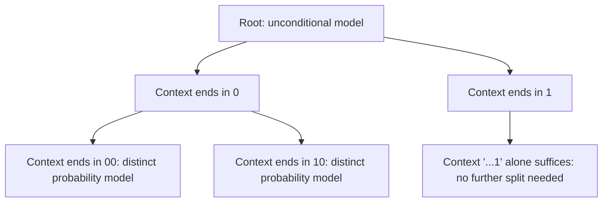
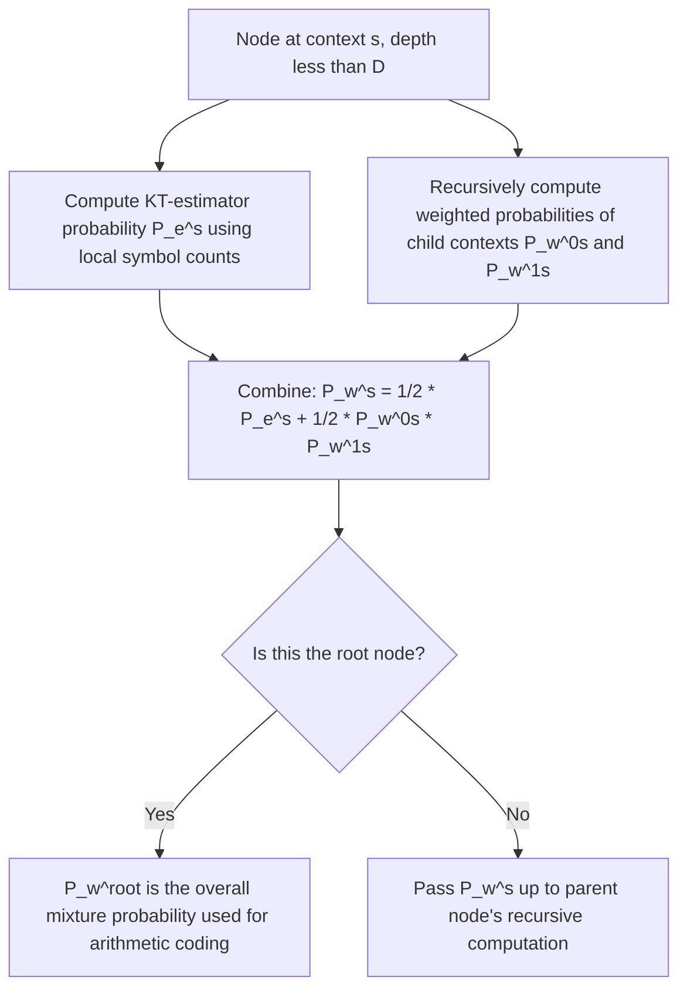

## Context Tree Weighting

### Motivation: Modeling Sources With Memory

Every universal coding technique discussed so far — Elias codes, LZ-family algorithms in their basic asymptotic sense, two-part and mixture universal codes — either assumes symbols are drawn independently (memoryless sources) or handles dependency structure only implicitly (as with LZ's dictionary matching). Real sources, however, frequently exhibit **finite-order Markov dependency**: the probability of the next symbol depends on some limited number of preceding symbols (its **context**), but the *order* of that dependency (how many preceding symbols matter) is typically unknown in advance and may even vary across the source.

Context Tree Weighting (CTW), introduced by Willems, Shtarkov, and Tjalkens in 1995, is a universal coding algorithm specifically designed for this setting: it achieves near-optimal compression for **tree-structured (variable-order Markov) sources** without needing to know the correct model order beforehand, by efficiently mixing over *all* possible context-tree structures up to some maximum depth simultaneously.

### Context Trees and Variable-Order Markov Sources

A **context tree source** models the probability of the next binary symbol as depending on a variable-length suffix of the preceding symbols, where the required suffix length can differ depending on which specific preceding symbols were observed. This is a strict generalization of a fixed-order Markov source, in which every context uses exactly the same fixed number of preceding symbols.

**Conceptual example**: A context tree source might specify that if the previous symbol was `1`, the next-symbol probability depends only on that single most recent bit (order-1 context suffices), but if the previous symbol was `0`, the probability additionally depends on the bit before that (needing an order-2 context) — different branches of the tree can have different effective depths.

### The Core Challenge CTW Solves

If the true context-tree structure (which suffixes matter, and to what depth) were known, an adaptive arithmetic coder could simply be run separately within each context, using the KT estimator (or similar) for each context's local probability estimate. The difficulty is that the **correct tree structure itself is unknown**: trying every possible tree structure separately and picking the best one after the fact is not a valid online, causal coding strategy (it would require seeing the whole sequence first, and would also incur a large model-selection description cost, similar to the two-part MDL overhead).

CTW's key innovation is to **efficiently compute a weighted mixture over every possible context-tree structure up to a maximum depth $D$**, without ever explicitly enumerating them (which would be computationally intractable, since the number of possible tree structures grows extremely rapidly with depth). It achieves this efficient mixture via a recursive, bottom-up weighting formula applied to a fixed, complete binary tree of contexts up to depth $D$.

### The Recursive Weighting Formula

For each node $s$ (representing a specific context suffix) in the depth-$D$ complete context tree, CTW recursively defines a **weighted probability** $P_w^s$ combining:

1. The **KT estimator probability** $P_e^s$ — the probability assigned by treating this context as a "leaf" (i.e., assuming this exact context suffix is sufficient, with no further splitting), using the Krichevsky-Trofimov estimator based on the symbol counts observed in this context so far.
2. The **weighted probabilities of the two child contexts** $P_w^{0s}$ and $P_w^{1s}$ (extending the context one bit deeper in each direction), combined recursively.

The recursive formula (for a node at depth less than $D$) is:

$$P_w^s = \frac{1}{2} P_e^s + \frac{1}{2} P_w^{0s} \cdot P_w^{1s}$$

For leaf nodes at the maximum depth $D$, $P_w^s = P_e^s$ directly (no further splitting is possible). The $\tfrac{1}{2}$–$\tfrac{1}{2}$ weighting reflects an implicit uniform prior belief over whether this particular context should be treated as sufficient on its own, versus needing to be split further into its two child contexts.

<svg xmlns="http://www.w3.org/2000/svg" viewBox="0 0 640 300">
  <text x="320" y="22" text-anchor="middle" font-size="15" font-weight="bold" fill="#1a1a1a">CTW Recursive Weighting Over a Depth-2 Context Tree (svg_diagram)</text>

  <circle cx="320" cy="55" r="9" fill="#2c3e50" />
  <text x="320" y="40" text-anchor="middle" font-size="11" fill="#2c3e50">root: P_w = avg(P_e, P_w0 * P_w1)</text>

  <line x1="320" y1="55" x2="190" y2="130" stroke="#555" stroke-width="1.5" />
  <line x1="320" y1="55" x2="450" y2="130" stroke="#555" stroke-width="1.5" />

  <circle cx="190" cy="130" r="8" fill="#2980b9" />
  <text x="190" y="115" text-anchor="middle" font-size="10" fill="#2980b9">context "0"</text>
  <circle cx="450" cy="130" r="8" fill="#2980b9" />
  <text x="450" y="115" text-anchor="middle" font-size="10" fill="#2980b9">context "1"</text>

  <line x1="190" y1="130" x2="120" y2="210" stroke="#555" stroke-width="1.5" />
  <line x1="190" y1="130" x2="260" y2="210" stroke="#555" stroke-width="1.5" />
  <circle cx="120" cy="210" r="7" fill="#27ae60" />
  <text x="120" y="230" text-anchor="middle" font-size="9" fill="#27ae60">"00" leaf</text>
  <circle cx="260" cy="210" r="7" fill="#27ae60" />
  <text x="260" y="230" text-anchor="middle" font-size="9" fill="#27ae60">"10" leaf</text>

  <line x1="450" y1="130" x2="380" y2="210" stroke="#555" stroke-width="1.5" />
  <line x1="450" y1="130" x2="520" y2="210" stroke="#555" stroke-width="1.5" />
  <circle cx="380" cy="210" r="7" fill="#27ae60" />
  <text x="380" y="230" text-anchor="middle" font-size="9" fill="#27ae60">"01" leaf</text>
  <circle cx="520" cy="210" r="7" fill="#27ae60" />
  <text x="520" y="230" text-anchor="middle" font-size="9" fill="#27ae60">"11" leaf</text>

  <text x="320" y="270" text-anchor="middle" font-size="11" fill="#555">Each node's P_w blends "treat as leaf" against "split further,"</text>
  <text x="320" y="288" text-anchor="middle" font-size="11" fill="#555">implicitly averaging over every possible tree pruning of this depth-2 tree.</text>
</svg>

### Why This Achieves a Mixture Over All Tree Structures

**[Inference]** The elegance of the CTW recursion is that expanding the formula $P_w^s = \tfrac{1}{2}P_e^s + \tfrac{1}{2}P_w^{0s}P_w^{1s}$ fully down to the root corresponds mathematically to a sum over every possible way of "pruning" the complete depth-$D$ binary tree into a valid (proper) context-tree model, each weighted by $2^{-(\text{number of internal nodes in that pruning})}$ — effectively an implicit Occam-style prior favoring smaller (shallower) trees, similar in spirit to the model-complexity penalty in MDL. This equivalence between the simple bottom-up recursion and an exponentially large implicit sum is the key mathematical insight that makes CTW computationally tractable (linear in sequence length and tree depth $D$) despite implicitly considering an enormous space of candidate models.

### Using CTW for Actual Compression

Once $P_w^{\text{root}}$ is available at each step (updated incrementally as each new symbol arrives and context counts are updated), it is used directly as the probability estimate driving an **arithmetic coder**: the mixture probability $P_w^{\text{root}}$ (conditioned on the current context, implicitly, through the recursive structure) plays exactly the role that a known or adaptively-estimated $p_i$ plays in standard adaptive arithmetic coding. The two techniques are combined directly — CTW supplies the probability model, arithmetic coding performs the actual entropy coding.

### CTW as a Universal Code for Tree Sources

CTW is provably universal for the class of **finite-context tree sources up to depth $D$**: for any true tree-structured source in this class, CTW's per-symbol redundancy vanishes as the sequence length grows, without CTW ever being told the true tree structure or model order in advance. This directly parallels the abstract universal-coding framework from earlier — CTW is, in effect, an efficiently computable **mixture (Bayesian) universal code**, using a specific structured prior over the space of context-tree models rather than a general parametric family.

| Property | Fixed-order adaptive Markov model | CTW |
|---|---|---|
| Model order must be specified | Yes (fixed in advance) | No (mixes over all orders up to depth $D$) |
| Handles variable-depth dependency | No | Yes |
| Computational cost per symbol | $O(1)$ for fixed order | $O(D)$, linear in maximum depth |
| Universality guarantee | Only for sources of exactly the assumed order | For the entire class of tree sources up to depth $D$ |

### Relationship to Other Techniques Covered

- **Versus two-part MDL**: CTW achieves the same conceptual goal as two-part MDL (balancing model complexity against data fit) but does so via an efficient mixture rather than an explicit search-and-select procedure over discrete model orders, avoiding the combinatorial cost of trying every possible tree depth and structure separately.
- **Versus LZ-family algorithms**: both are universal with respect to broad classes of sources with memory, but LZ methods exploit *literal repeated substrings*, while CTW exploits *statistical* context-dependent symbol probabilities, even when exact substrings do not repeat. **[Inference]** In practice, CTW-based compressors are generally reported in the literature to achieve better compression ratios than pure LZ-based methods on many types of data, particularly text, at the cost of higher computational complexity, though relative performance is data-dependent and can vary by implementation and tuning.
- **Versus PPM (Prediction by Partial Matching)**: PPM is a related, earlier context-modeling approach that also blends predictions from multiple context orders (typically via explicit "escape" mechanisms to back off to lower orders when a higher-order context has insufficient data), whereas CTW achieves a similar effect through its clean recursive mixture formula rather than explicit escape probabilities. **[Inference]** CTW is often noted in the literature as having stronger, cleaner theoretical universality guarantees than classical PPM, though PPM variants have historically also achieved strong practical compression performance and remain influential in the design of modern context-modeling compressors.

### Practical Considerations and Limitations

- **Maximum depth $D$ must still be chosen**: while CTW avoids needing to know the *exact* order, it does require an upper bound $D$ on the depth to consider, and sources with dependencies longer than $D$ are not fully captured — this is a a practical, not fundamental, limitation, since $D$ can be set generously if compute allows.
- **Computational cost**: each symbol requires updating and combining probabilities along a path of length $D$ through the context tree, making CTW more computationally expensive per symbol than simpler fixed-order adaptive models, though still linear (not exponential) in $D$.
- **Primarily developed and analyzed for binary alphabets**: **[Unverified]** The original CTW formulation is most directly and cleanly presented for binary sources; extensions to larger alphabets exist in the literature, but the precise details and relative efficiency of such extensions are not covered here and may vary across specific proposed generalizations.

### Key Points

- **Context Tree Weighting** is a universal source coding algorithm for tree-structured (variable-order Markov) sources, mixing over all possible context-tree structures up to a maximum depth $D$.
- The core recursive formula $P_w^s = \tfrac{1}{2}P_e^s + \tfrac{1}{2}P_w^{0s}P_w^{1s}$ efficiently computes an implicit weighted average over an exponentially large space of candidate tree models.
- CTW's mixture probability is used directly as the input to an arithmetic coder, combining CTW's context modeling with arithmetic coding's near-entropy encoding.
- CTW is provably universal for finite-context tree sources up to depth $D$, without requiring the true model order to be known in advance.
- CTW is conceptually related to two-part MDL (balancing fit against complexity) and to PPM (blending multiple context orders), but achieves its guarantees through a clean, efficiently computable recursive mixture rather than explicit model search or escape mechanisms.

### Related Topics

- Krichevsky-Trofimov estimator: the local probability estimate used at each context-tree node
- Prediction by Partial Matching (PPM) and escape-probability context blending
- Extensions of CTW to non-binary alphabets and higher-order structured sources
- Practical compressor implementations incorporating CTW-style context modeling
- Relationship between CTW's implicit tree-pruning prior and MDL's explicit complexity penalty
- Context mixing compressors (e.g., PAQ-family) as generalizations blending multiple heterogeneous predictive models