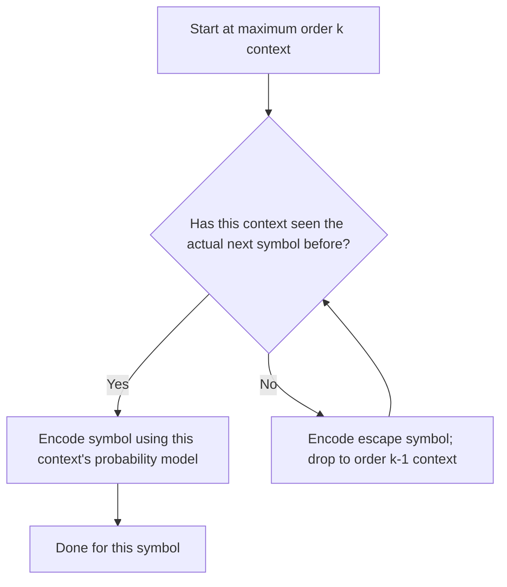

## Prediction by Partial Matching

### Overview and Historical Context

Prediction by Partial Matching (PPM) is a context-modeling technique for lossless compression, introduced by Cleary and Witten in 1984, predating Context Tree Weighting by roughly a decade. Like CTW, PPM addresses the problem of predicting the next symbol using variable-length preceding context, but it does so through an explicit **escape mechanism** that blends predictions from multiple context orders, rather than CTW's implicit recursive mixture formula. PPM has historically been highly influential and forms the modeling backbone of several strong practical compressors, pairing naturally with arithmetic coding as its entropy-coding backend.

### Core Idea: Blending Multiple Context Orders via Escape

PPM maintains statistical models for several context orders simultaneously — typically from some maximum order $k$ down to order $-1$ or $0$ (a fallback uniform/default model). For each symbol to be encoded, PPM attempts to use the **highest-order context** first (the longest recent history), and only falls back to progressively **lower-order contexts** if the higher-order context has not yet seen the current symbol in that specific context.

This fallback is implemented via a special **escape symbol**: within a given context's local probability model, in addition to probabilities for all symbols actually observed in that context, some probability mass is reserved for an escape event, signaling "the actual next symbol is not among those I've seen in this context — try a lower-order context instead."

### Worked Conceptual Example

Suppose the maximum context order is 2, and the encoder is about to encode the next character after having seen the preceding text `"...THE CAT SA"` with current context `"SA"`.

- **Order-2 model (context "SA")**: If this exact two-character context has previously been followed only by `T` (as in "SAT"), the model assigns high probability to `T` and reserves some probability mass for escape.
- If the actual next character is `T`: encode it directly using the order-2 model — no escape needed, and this is the cheapest case.
- If the actual next character is, say, `M` (never seen after "SA" before): emit an **escape** from the order-2 model, then consult the **order-1 model (context "A")**, which has seen more data and is more likely to have observed `M` following `A` at some point elsewhere in the text.
- If even the order-1 model has not seen `M` after `A`, escape again, dropping to **order-0** (unconditional frequency of `M` overall) or ultimately to a fixed fallback model guaranteeing every possible symbol has *some* nonzero probability (avoiding the "zero-frequency problem").

<svg xmlns="http://www.w3.org/2000/svg" viewBox="0 0 640 260">
  <text x="320" y="22" text-anchor="middle" font-size="15" font-weight="bold" fill="#1a1a1a">PPM Escape Cascade Through Context Orders (svg_diagram)</text>

  <rect x="60" y="50" width="140" height="50" fill="#2980b9" opacity="0.3" stroke="#2980b9" />
  <text x="130" y="80" text-anchor="middle" font-size="12" fill="#1a1a1a">Order-2 "SA"</text>

  <rect x="250" y="50" width="140" height="50" fill="#27ae60" opacity="0.3" stroke="#27ae60" />
  <text x="320" y="80" text-anchor="middle" font-size="12" fill="#1a1a1a">Order-1 "A"</text>

  <rect x="440" y="50" width="140" height="50" fill="#e67e22" opacity="0.3" stroke="#e67e22" />
  <text x="510" y="80" text-anchor="middle" font-size="12" fill="#1a1a1a">Order-0 fallback</text>

  <line x1="200" y1="75" x2="250" y2="75" stroke="#c0392b" stroke-width="2" marker-end="url(#arrow)" />
  <text x="225" y="65" text-anchor="middle" font-size="11" fill="#c0392b">escape</text>

  <line x1="390" y1="75" x2="440" y2="75" stroke="#c0392b" stroke-width="2" marker-end="url(#arrow)" />
  <text x="415" y="65" text-anchor="middle" font-size="11" fill="#c0392b">escape</text>

  <text x="320" y="150" text-anchor="middle" font-size="12" fill="#555">Each escape costs bits, but successful high-order matches are very cheap —</text>
  <text x="320" y="170" text-anchor="middle" font-size="12" fill="#555">PPM's efficiency hinges on how well escape probabilities are estimated.</text>
</svg>

### The Zero-Frequency Problem and Escape Probability Estimation

A key technical challenge in PPM is **estimating the escape probability itself**: how much probability mass should a context reserve for symbols it hasn't seen yet, balancing the cost of unnecessary escapes (if too much mass is reserved) against the cost of encoding truly novel symbols inefficiently (if too little mass is reserved)? This is closely related to the classical **zero-frequency problem** in probability estimation — assigning nonzero probability to events not yet observed.

Several PPM variants differ primarily in their escape-probability estimation method, historically labeled with letters:

| Variant | Escape probability estimation approach |
|---|---|
| **PPMA** | Escape probability set to $\frac{1}{n+1}$, where $n$ is the total count of symbols observed in this context (treats escape as if it were one additional observed "symbol type") |
| **PPMB** | Escape probability based on the number of *distinct* symbol types seen, discounting each observed symbol's count slightly to reserve mass for escape |
| **PPMC** | A refinement of PPMB's approach, using the count of distinct symbols seen in the context as the numerator of the escape probability estimate |
| **PPMD** | Further refinements to the counting/discounting scheme, tuned empirically for improved practical performance |

**[Inference]** These specific historical variant labels (PPMA through PPMD and beyond) and their precise escape-formula differences are documented in the original and follow-up PPM literature; exact formulas for each variant involve specific counting conventions that are easy to get subtly wrong from memory, so implementers should consult primary sources for exact formulas rather than relying on a from-memory summary. The general pattern — different heuristics for splitting a context's total probability mass between "already seen symbols" and "escape to lower order" — is the well-established conceptual core across all named variants.

### Exclusion

A refinement used in most practical PPM implementations is **exclusion**: when escaping from a higher-order context to a lower-order one, symbols that were already possible (and rejected as "not the actual next symbol") in the higher-order context are excluded from consideration in the lower-order context's probability calculation. This avoids "wasting" probability mass in the lower-order model on symbols already known to be incorrect, tightening the effective probability estimates at each fallback level and improving compression efficiency.

### Relationship to Context Tree Weighting

PPM and CTW address the same underlying problem — combining predictions across multiple context orders when the correct order is unknown — but differ in their formal foundations:

| Property | PPM | CTW |
|---|---|---|
| Mechanism for combining context orders | Explicit escape symbol and sequential fallback | Implicit recursive mixture over all tree structures |
| Theoretical universality guarantee | Less clean/formal in the original formulation | Strong, provable universality for tree sources up to depth $D$ |
| Escape probability estimation | Heuristic, several competing named variants (PPMA-D, etc.) | Handled implicitly and elegantly via the $\tfrac{1}{2}$–$\tfrac{1}{2}$ recursive weighting and KT estimator |
| Historical practical performance | Historically very strong, widely implemented, influential | **[Inference]** Often reported as achieving comparable or better compression in various studies, though with generally higher computational cost |
| Conceptual mechanism | Sequential "try highest order first, fall back on failure" | Parallel "blend all orders simultaneously via weighted mixture" |

**[Inference]** In practice, well-tuned PPM implementations (particularly PPMD and its descendants) have historically achieved highly competitive compression ratios on text data, sometimes matching or approaching CTW-based or more sophisticated context-mixing methods; a definitive, universally-agreed ranking between specific PPM variants and CTW depends heavily on the specific data type, tuning, and benchmark used, and is not asserted as a fixed ordering here.

### PPM and Arithmetic Coding

Like CTW, PPM's output at each step is a probability distribution over the next symbol (conditioned on context, incorporating the escape mechanism across orders), which is then encoded using an **arithmetic coder**. PPM's role is entirely as a **modeling** front end; it does not itself specify how bits are produced — that task is delegated to the arithmetic (or range) coding backend, exactly mirroring the model/entropy-coder separation seen throughout this material (Huffman + statistics, CTW + arithmetic coding, LZ + Huffman in DEFLATE).

### Practical Applications and Legacy

- **PPMd** (a further-refined descendant of the PPM family) has been used in several general-purpose archivers and is notably one of the compression methods available within formats like **7-Zip** and certain implementations of **RAR**.
- **[Unverified]** The specific set of compressors and archive formats currently offering PPMd or other PPM-variant support, and their relative popularity, may have changed since this material's underlying training data; readers working with a specific tool should verify current documentation for that tool directly rather than relying on this general historical description.
- PPM's context-blending philosophy directly influenced later, more general **context-mixing compressors** (e.g., the PAQ family), which extend the basic idea of combining multiple predictive models beyond just varying-order Markov contexts, incorporating many heterogeneous prediction sources (word models, sparse contexts, matching models) combined via more sophisticated weighting schemes than PPM's escape mechanism or CTW's binary tree mixture.

### Key Points

- **PPM** predicts the next symbol by attempting progressively lower-order contexts, using an explicit **escape symbol** to signal fallback when a higher-order context hasn't seen the actual next symbol before.
- The **zero-frequency problem** — assigning nonzero probability to unseen symbols — is addressed via various escape-probability estimation heuristics, historically labeled PPMA through PPMD and beyond.
- **Exclusion** improves efficiency by removing already-rejected symbols from consideration when falling back to a lower-order context.
- PPM and CTW solve the same conceptual problem (unknown-order context modeling) via different mechanisms: explicit sequential escape versus implicit recursive mixture.
- PPM's output feeds into an arithmetic coder, consistent with the general model/entropy-coder separation seen across other context-modeling and universal coding techniques.
- PPM's ideas directly influenced later context-mixing compressors that combine many heterogeneous predictive models beyond simple order-based Markov contexts.

### Related Topics

- PPMd and its specific refinements over earlier PPM variants
- Context-mixing compression (PAQ family) as a generalization beyond order-based context blending
- Formal comparison of escape-probability estimators (PPMA, PPMB, PPMC, PPMD) and their theoretical justifications
- Zero-frequency problem and Laplace/Krichevsky-Trofimov-style smoothing techniques
- Integration of PPM-style modeling with range coding in practical archiver implementations
- Burrows-Wheeler Transform as an alternative context-exploitation technique not based on explicit order-based prediction