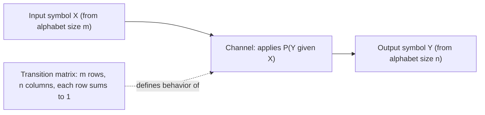
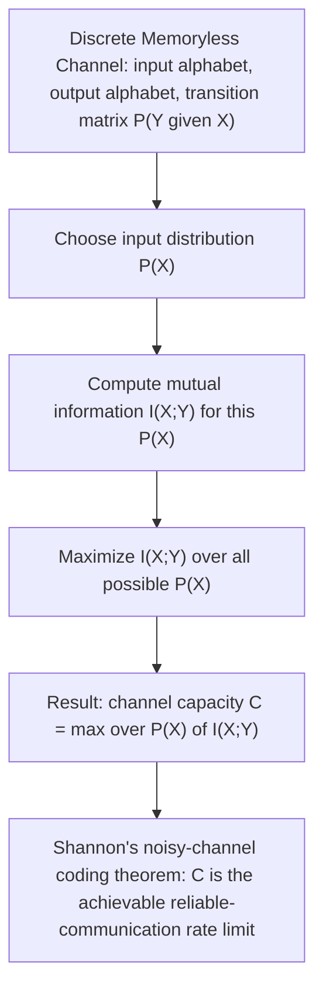

## Discrete Memoryless Channels

### Transition from Source Coding to Channel Coding

Every topic covered so far — prefix codes, Huffman coding, arithmetic coding, universal codes, context modeling — has addressed **source coding**: representing data compactly assuming it is transmitted or stored perfectly, with no corruption. Real communication systems, however, must also contend with **noise**: a transmitted symbol may be received incorrectly due to physical imperfections in the transmission medium (electrical interference, signal attenuation, quantum effects in optical fiber, and so on). This introduces the second major branch of classical information theory: **channel coding**, and its foundational object of study is the **discrete memoryless channel (DMC)**.

This marks a shift in perspective: source coding asked "how few bits can represent this data?", while channel coding asks "how reliably can bits be transmitted over an imperfect medium, and at what rate?"

### Formal Definition

A **discrete memoryless channel** is characterized by three components:

1. A finite **input alphabet** $\mathcal{X} = \{x_1, \ldots, x_m\}$.
2. A finite **output alphabet** $\mathcal{Y} = \{y_1, \ldots, y_n\}$.
3. A **transition probability matrix** (also called the channel matrix) specifying $P(Y = y_j \mid X = x_i)$ for every input-output pair — the probability that output $y_j$ is received given that input $x_i$ was sent.

The channel is **memoryless** because each output symbol depends only on the corresponding input symbol at that same time step, not on any previous inputs or outputs:

$$P(y_1, y_2, \ldots, y_n \mid x_1, x_2, \ldots, x_n) = \prod_{i=1}^{n} P(y_i \mid x_i)$$

This is the channel-coding analogue of the "i.i.d." or "memoryless" assumption made about sources in earlier source-coding topics — here applied to the noise process rather than to the data-generating process.

### The Channel Matrix

The transition probabilities are conveniently organized into an $m \times n$ matrix $P$, where entry $P_{ij} = P(y_j \mid x_i)$. Each **row** of this matrix must sum to 1, since it represents a full probability distribution over possible outputs given a fixed input:

$$\sum_{j=1}^{n} P(y_j \mid x_i) = 1 \quad \text{for every } i$$

**Example channel matrix** for a channel with input alphabet $\{0, 1, 2\}$ and output alphabet $\{0, 1, 2\}$:

$$P = \begin{pmatrix} 0.9 & 0.05 & 0.05 \\ 0.1 & 0.8 & 0.1 \\ 0.05 & 0.05 & 0.9 \end{pmatrix}$$

Here, row 1 says: if `0` is sent, it is received correctly 90% of the time, confused with `1` 5% of the time, and confused with `2` 5% of the time.

### The Binary Symmetric Channel (BSC)

The most extensively studied DMC is the **binary symmetric channel**: input and output alphabets are both $\{0, 1\}$, and each bit is flipped independently with a fixed **crossover probability** $p$:

$$P(Y=0 \mid X=0) = 1-p, \quad P(Y=1 \mid X=0) = p$$
$$P(Y=1 \mid X=1) = 1-p, \quad P(Y=0 \mid X=1) = p$$

<svg xmlns="http://www.w3.org/2000/svg" viewBox="0 0 640 260">
  <text x="320" y="22" text-anchor="middle" font-size="15" font-weight="bold" fill="#1a1a1a">Binary Symmetric Channel (svg_diagram)</text>

  <circle cx="140" cy="80" r="10" fill="#2c3e50" />
  <text x="100" y="85" text-anchor="middle" font-size="13" fill="#2c3e50">X=0</text>

  <circle cx="140" cy="190" r="10" fill="#2c3e50" />
  <text x="100" y="195" text-anchor="middle" font-size="13" fill="#2c3e50">X=1</text>

  <circle cx="480" cy="80" r="10" fill="#27ae60" />
  <text x="520" y="85" text-anchor="middle" font-size="13" fill="#27ae60">Y=0</text>

  <circle cx="480" cy="190" r="10" fill="#27ae60" />
  <text x="520" y="195" text-anchor="middle" font-size="13" fill="#27ae60">Y=1</text>

  <line x1="150" y1="80" x2="470" y2="80" stroke="#2980b9" stroke-width="2" />
  <text x="310" y="70" text-anchor="middle" font-size="12" fill="#2980b9">1 - p</text>

  <line x1="150" y1="190" x2="470" y2="190" stroke="#2980b9" stroke-width="2" />
  <text x="310" y="210" text-anchor="middle" font-size="12" fill="#2980b9">1 - p</text>

  <line x1="150" y1="85" x2="470" y2="185" stroke="#c0392b" stroke-width="2" stroke-dasharray="5,3" />
  <text x="320" y="150" text-anchor="middle" font-size="12" fill="#c0392b">p (crossover)</text>

  <line x1="150" y1="185" x2="470" y2="85" stroke="#c0392b" stroke-width="2" stroke-dasharray="5,3" />
  <text x="320" y="115" text-anchor="middle" font-size="12" fill="#c0392b">p (crossover)</text>
</svg>

The BSC is "symmetric" because the crossover probability is identical regardless of which bit value is sent — the channel treats 0-to-1 and 1-to-0 errors identically. This symmetry makes the BSC the simplest non-trivial noisy channel model and a standard first example in developing channel capacity theory.

### The Binary Erasure Channel (BEC)

A second widely-studied channel model is the **binary erasure channel**: input alphabet $\{0, 1\}$, but output alphabet $\{0, 1, e\}$, where $e$ denotes an **erasure** — the receiver knows a bit was corrupted/lost, but (unlike the BSC) is never given an incorrect but plausible-looking value. Each transmitted bit is erased independently with probability $\epsilon$, and otherwise received correctly:

$$P(Y=0 \mid X=0) = 1-\epsilon, \quad P(Y=e \mid X=0) = \epsilon, \quad P(Y=1\mid X=0) = 0$$
$$P(Y=1 \mid X=1) = 1-\epsilon, \quad P(Y=e \mid X=1) = \epsilon, \quad P(Y=0\mid X=1) = 0$$

The BEC models situations where corrupted data can be **detected** (e.g., via a checksum or physical-layer signal loss) but not automatically corrected — conceptually simpler than the BSC in some respects, since there is never silent, undetected corruption, only known gaps.

### Why "Memoryless" Matters

The memoryless assumption is a significant simplification, analogous to the i.i.d. assumption in memoryless source models discussed earlier. Real physical channels often exhibit **burst errors** — correlated error patterns where errors cluster together in time (e.g., due to a temporary strong interference event) rather than occurring independently at each symbol. **[Inference]** Real-world channel coding systems frequently employ interleaving (deliberately spreading out consecutive input symbols across the physical transmission so that a burst error affects many different, non-adjacent logical symbols rather than several consecutive ones) specifically to make a channel with real burst-error behavior *behave* more like a memoryless channel from the point of view of the error-correcting code, since much of channel coding theory (developed for DMCs) does not directly extend to channels with strong memory/correlation.

### Channel Capacity — A Preview

The central question channel coding theory addresses is: given a DMC, what is the **maximum rate** (in bits per channel use) at which information can be transmitted with arbitrarily small error probability, as the number of channel uses grows? This quantity is called the **channel capacity**, formally defined as:

$$C = \max_{P(X)} I(X; Y)$$

where $I(X;Y)$ is the **mutual information** between the channel's input and output, and the maximization is over all possible input probability distributions $P(X)$. This formula — and the deep result (Shannon's noisy-channel coding theorem) that $C$ represents an achievable and tight limit — is developed in detail as a following topic; introducing the DMC formalism here is the necessary prerequisite for that development, just as the Kraft inequality was the necessary prerequisite for the source coding theorem.

### DMC Examples Summary

| Channel | Input alphabet | Output alphabet | Error behavior |
|---|---|---|---|
| Binary Symmetric Channel (BSC) | $\{0,1\}$ | $\{0,1\}$ | Each bit flipped independently with probability $p$ |
| Binary Erasure Channel (BEC) | $\{0,1\}$ | $\{0,1,e\}$ | Each bit erased (known-lost) independently with probability $\epsilon$; never silently flipped |
| General DMC | $\{x_1,\ldots,x_m\}$ | $\{y_1,\ldots,y_n\}$ | Arbitrary transition matrix, memoryless across uses |

### Relationship to Source Coding Concepts

The DMC formalism deliberately parallels the source model formalism from earlier source-coding topics: just as a memoryless source was described by a fixed probability distribution over symbols, a DMC is described by a fixed conditional probability distribution (the transition matrix) relating inputs to outputs. **[Inference]** This structural parallel is intentional in how information theory is typically taught, since many of the same mathematical tools (entropy, mutual information, typical sequences, and asymptotic equipartition arguments) developed for source coding reappear, adapted, in the channel coding context — the DMC is essentially where those tools get a second, dual application.

### Key Points

- A **discrete memoryless channel (DMC)** is defined by a finite input alphabet, finite output alphabet, and a transition probability matrix $P(Y\mid X)$, with each output depending only on the corresponding input (no memory across channel uses).
- Each row of the transition matrix sums to 1, representing a valid probability distribution over outputs for each fixed input.
- The **binary symmetric channel (BSC)** flips each bit independently with crossover probability $p$; the **binary erasure channel (BEC)** instead erases (rather than silently corrupts) each bit independently with probability $\epsilon$.
- Real channels often exhibit correlated (burst) errors violating the memoryless assumption; interleaving is a standard practical technique to make real channels behave more like DMCs for coding purposes.
- The DMC formalism sets up **channel capacity**, $C = \max_{P(X)} I(X;Y)$, as the key quantity determining the maximum reliable transmission rate — the subject of Shannon's noisy-channel coding theorem, covered next.

### Next Steps

- Mutual information: definition, properties, and its role in defining channel capacity
- Channel capacity of the binary symmetric channel and binary erasure channel: closed-form derivations
- Shannon's noisy-channel coding theorem: achievability and converse
- Error-correcting codes: block codes, Hamming codes, and the relationship to channel capacity
- Continuous channels and the Gaussian channel capacity formula
- Joint source-channel coding and the separation theorem