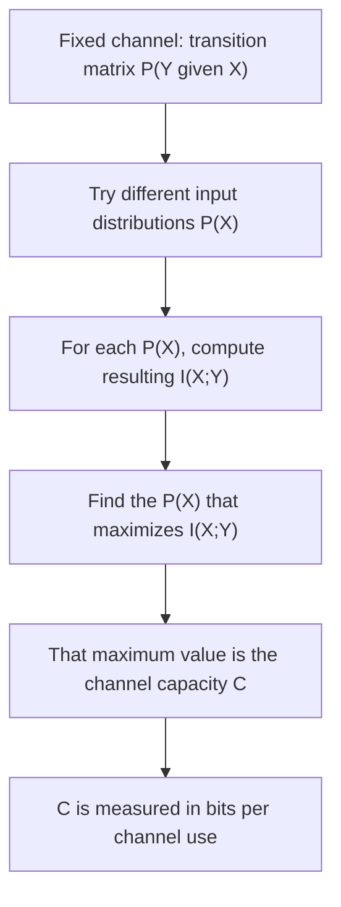

## Channel Capacity Definition

### Recap: The Question Channel Capacity Answers

The previous topic introduced the discrete memoryless channel (DMC) as a triple — input alphabet, output alphabet, transition matrix $P(Y \mid X)$ — and posed the central question of channel coding: what is the maximum rate at which information can be reliably transmitted through this channel? **Channel capacity** is the formal answer to that question, expressed as a single number (in bits per channel use) that Shannon's noisy-channel coding theorem later shows to be both an achievable target and an unbreakable ceiling.

### Mutual Information — The Building Block

Before defining capacity itself, mutual information $I(X;Y)$ must be established, since capacity is defined directly in terms of it. Mutual information measures how much knowing the channel output $Y$ reduces uncertainty about the channel input $X$ (or, equivalently and symmetrically, how much knowing $X$ reduces uncertainty about $Y$):

$$I(X;Y) = H(X) - H(X\mid Y) = H(Y) - H(Y\mid X)$$

where $H(X)$ is the entropy of the input distribution, and $H(X\mid Y)$ is the **conditional entropy** of $X$ given $Y$ — the remaining uncertainty about the input after observing the output. An equivalent, fully symmetric expansion in terms of the joint and marginal distributions is:

$$I(X;Y) = \sum_{x \in \mathcal{X}} \sum_{y \in \mathcal{Y}} P(x,y) \log_2 \frac{P(x,y)}{P(x)P(y)}$$

**Key properties** (stated here for context; not derived in full):

- $I(X;Y) \geq 0$, with equality if and only if $X$ and $Y$ are statistically independent (i.e., the channel output tells you nothing about the input — the worst possible channel).
- $I(X;Y) \leq \min(H(X), H(Y))$ — mutual information cannot exceed the entropy of either variable, since you cannot learn more about $X$ from $Y$ than $X$'s own total uncertainty.
- $I(X;Y) = I(Y;X)$ — mutual information is symmetric in its two arguments, despite the asymmetric "sender/receiver" roles $X$ and $Y$ play physically.

### Formal Definition of Channel Capacity

Given a DMC with fixed transition matrix $P(Y\mid X)$, the **channel capacity** is defined as the maximum mutual information achievable by optimizing over all possible **input distributions** $P(X)$:

$$C = \max_{P(X)} I(X;Y)$$

Several aspects of this definition are worth making explicit:

- The **maximization is over $P(X)$ only** — the channel's transition matrix $P(Y\mid X)$ is fixed (it is a physical property of the communication medium), and the sender has control only over how likely each input symbol is to be chosen (the "distribution" with which the input alphabet is used), not over the channel's behavior itself.
- Capacity is measured in **bits per channel use** (when using $\log_2$), representing the maximum average amount of information that can be conveyed each time the channel is used, under the best possible input strategy.
- Because $I(X;Y)$ is a continuous, concave function of $P(X)$ over a compact (closed and bounded) probability-simplex domain, the maximum is guaranteed to exist (though it may not always have a simple closed form, depending on the channel).

### Why Maximize Over the Input Distribution?

**[Inference]** The reasoning behind maximizing over $P(X)$ specifically (rather than, say, fixing a uniform input distribution) is that the sender is free to choose how often each input symbol is used — for instance, by designing the encoding scheme so that certain input symbols appear more or less frequently in the transmitted codeword stream. A poorly chosen input distribution can waste the channel's potential (e.g., using only one input symbol conveys zero information, regardless of how good the channel itself is), while the capacity-achieving distribution extracts the maximum possible mutual information the channel's physical characteristics allow. This is analogous to how, in source coding, the *specific* code chosen (not just the source's entropy) determines actual achieved compression — here, the specific *input distribution* chosen (not just the channel's raw transition matrix) determines actual achieved information transfer, up to the ceiling set by capacity.

### Worked Example — Capacity of the Binary Symmetric Channel

For the BSC with crossover probability $p$ (introduced in the previous topic), the capacity has a well-known closed form:

$$C_{\text{BSC}} = 1 - H_b(p)$$

where $H_b(p) = -p\log_2 p - (1-p)\log_2(1-p)$ is the **binary entropy function**.

**Derivation sketch**: For the BSC, $I(X;Y) = H(Y) - H(Y\mid X)$. The conditional entropy $H(Y\mid X)$ equals $H_b(p)$ regardless of the input distribution, since given any specific input value, the output is a flip of that value with probability $p$ — so the "noise entropy" contributed by the channel itself is always $H_b(p)$, independent of how inputs are chosen. Maximizing $I(X;Y) = H(Y) - H_b(p)$ is therefore equivalent to maximizing $H(Y)$ alone, and $H(Y)$ is maximized (at exactly 1 bit, its ceiling for a binary alphabet) when $Y$ is uniformly distributed — which occurs precisely when the input $X$ is chosen uniformly ($P(X=0) = P(X=1) = 0.5$), by the BSC's symmetry. Substituting $H(Y)=1$ gives $C_{\text{BSC}} = 1 - H_b(p)$.

**Numerical example**: for $p = 0.1$:

$$H_b(0.1) = -0.1\log_2(0.1) - 0.9\log_2(0.9) \approx 0.1(3.322) + 0.9(0.152) \approx 0.332 + 0.137 = 0.469$$

$$C_{\text{BSC}} \approx 1 - 0.469 = 0.531 \text{ bits per channel use}$$

<svg xmlns="http://www.w3.org/2000/svg" viewBox="0 0 640 280">
  <text x="320" y="22" text-anchor="middle" font-size="15" font-weight="bold" fill="#1a1a1a">BSC Capacity as a Function of Crossover Probability p (svg_diagram)</text>

  <line x1="70" y1="230" x2="580" y2="230" stroke="#333" stroke-width="1.5" />
  <line x1="70" y1="230" x2="70" y2="40" stroke="#333" stroke-width="1.5" />
  <text x="320" y="255" text-anchor="middle" font-size="12" fill="#333">crossover probability p</text>
  <text x="30" y="130" font-size="12" fill="#333" transform="rotate(-90 30 130)">capacity C (bits)</text>

  <text x="60" y="235" font-size="10" fill="#333">0</text>
  <text x="320" y="245" text-anchor="middle" font-size="10" fill="#333">0.5</text>
  <text x="575" y="245" font-size="10" fill="#333">1</text>
  <text x="55" y="45" font-size="10" fill="#333">1</text>

  <polyline points="70,45 130,70 190,105 250,150 300,195 320,228 340,195 390,150 450,105 510,70 570,45" fill="none" stroke="#2980b9" stroke-width="2.5" />

  <text x="320" y="215" text-anchor="middle" font-size="11" fill="#c0392b">C = 0 at p = 0.5 (pure noise)</text>
  <text x="90" y="60" text-anchor="middle" font-size="11" fill="#27ae60">C = 1 at p = 0</text>
  <text x="550" y="60" text-anchor="middle" font-size="11" fill="#27ae60">C = 1 at p = 1</text>
</svg>

The curve confirms the intuition: at $p=0$ (perfect channel), $C=1$ bit per use, the maximum possible for a binary channel. At $p=0.5$ (output is a coin flip regardless of input — complete noise), $C=0$: no information can be reliably conveyed at all. Interestingly, $C=1$ is also recovered at $p=1$ (every bit is flipped with certainty), since a perfectly deterministic — if inverted — channel still conveys full information; the receiver simply needs to know to flip every received bit back.

### Worked Example — Capacity of the Binary Erasure Channel

For the BEC with erasure probability $\epsilon$:

$$C_{\text{BEC}} = 1 - \epsilon$$

**[Inference]** This clean, simpler closed form (compared to the BSC's entropy-function expression) reflects the BEC's more benign error structure: since erasures are always detected and never silently mistaken for a valid bit value, each successfully-received (non-erased) bit conveys full, unambiguous information, and a fraction $\epsilon$ of channel uses simply convey no information at all (are "wasted" on erasures) — so capacity is exactly the fraction of uses that get through cleanly, times 1 bit each. A fuller derivation using the mutual-information definition confirms this intuition formally but is not elaborated symbol-by-symbol here.

### Properties of Channel Capacity

- **$C \geq 0$ always**, since $I(X;Y) \geq 0$ for every valid $P(X)$, and the maximum of a non-negative function is non-negative.
- **$C \leq \log_2 |\mathcal{X}|$** and **$C \leq \log_2 |\mathcal{Y}|$**, since mutual information cannot exceed either variable's own entropy, and entropy over a finite alphabet is bounded by the log of the alphabet size.
- **$C = 0$ if and only if $X$ and $Y$ are independent for every choice of $P(X)$** — this occurs, for instance, in a completely useless channel where the output bears no relationship whatsoever to the input (like the BSC at $p=0.5$).
- **Capacity depends only on the channel**, not on any particular code or coding scheme — it is a property of the physical/statistical transmission medium alone, analogous to how source entropy $H(X)$ is a property of the source alone, independent of which code (Huffman, arithmetic, etc.) is later used to compress it.

### Why Capacity Alone Doesn't Guarantee Reliable Communication (Yet)

**[Inference]** The definition of capacity given here is a purely information-theoretic quantity — a maximum of mutual information — and does not, by itself, describe *how* to actually construct a coding scheme that achieves reliable communication at rates approaching $C$. That constructive and existence claim — that codes exist achieving arbitrarily low error probability at any rate below $C$, and that no code can do so at any rate above $C$ — is precisely the content of **Shannon's noisy-channel coding theorem**, which builds directly on this capacity definition and is the natural next topic. The capacity value itself is best understood as a *ceiling* whose achievability requires separate proof.

### Relationship to Source Coding Concepts Covered Earlier

The channel capacity definition deliberately mirrors the source coding theorem's use of entropy as a fundamental limit:

| Source coding | Channel coding |
|---|---|
| Entropy $H(X)$: minimum achievable expected code length | Capacity $C$: maximum achievable reliable transmission rate |
| Optimized by choosing the best **code** (e.g., Huffman) | Optimized by choosing the best **input distribution**, then separately the best **code** |
| Bound: $H(X) \leq L$, approached via clever coding | Bound: rate $< C$ achievable with vanishing error, rate $> C$ provably impossible |

### Key Points

- **Channel capacity** $C = \max_{P(X)} I(X;Y)$ is the maximum mutual information between channel input and output, optimized over the choice of input distribution, for a fixed channel transition matrix.
- Mutual information $I(X;Y) = H(X) - H(X\mid Y) = H(Y) - H(Y\mid X)$ quantifies how much observing one variable reduces uncertainty about the other, and is always non-negative and symmetric.
- The **BSC's capacity** has the closed form $C = 1 - H_b(p)$, achieved by a uniform input distribution, ranging from 1 bit (perfect or perfectly-inverting channel) down to 0 bits (pure noise at $p=0.5$).
- The **BEC's capacity** has the simpler closed form $C = 1 - \epsilon$, reflecting that erased bits convey no information while successfully received bits convey full information.
- Capacity is a property of the channel alone, analogous to how entropy is a property of the source alone in source coding.
- Capacity defines a ceiling on achievable rates; whether and how that ceiling can actually be approached via real codes is the subject of Shannon's noisy-channel coding theorem.

### Related Topics

- Shannon's noisy-channel coding theorem: achievability and converse proofs
- Conditional entropy and its role in the mutual information decomposition
- Capacity of general (non-binary, asymmetric) discrete memoryless channels
- Continuous-input, continuous-output channels and the Gaussian channel capacity formula (Shannon-Hartley theorem)
- Channel coding rate, redundancy, and error-correcting code design targeting capacity
- Joint typicality and random coding arguments used in capacity-achievability proofs