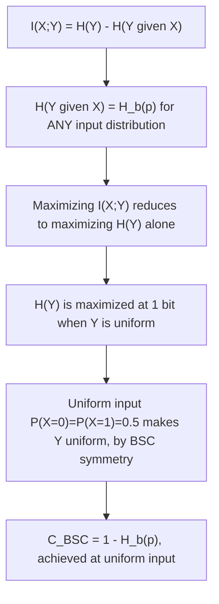

## Binary Symmetric Channel Capacity

### Purpose of This Topic

The previous topic derived the BSC capacity formula $C = 1 - H_b(p)$ as part of establishing the general channel capacity definition. This topic revisits the binary symmetric channel specifically, providing a complete, rigorous, step-by-step derivation, a deeper look at the role of the binary entropy function, worked numerical examples across the full range of $p$, and the operational interpretation of what this capacity value means for actual code design — treating the BSC as the canonical worked example for channel capacity calculations.

### Setup: Restating the BSC

Recall the binary symmetric channel has input alphabet $\mathcal{X} = \{0,1\}$, output alphabet $\mathcal{Y} = \{0,1\}$, and crossover probability $p$ (the probability any given transmitted bit is flipped):

$$P(y \mid x) = \begin{cases} 1-p & \text{if } y = x \\ p & \text{if } y \neq x \end{cases}$$

By convention, $p \in [0, 0.5]$ is typically assumed in practical treatments (a channel with $p > 0.5$ is "worse than random" and can always be converted into an equivalent, better channel with crossover probability $1-p$ simply by having the receiver invert every received bit — so no generality is lost restricting to $p \le 0.5$).

### Full Derivation of $C_{\text{BSC}} = 1 - H_b(p)$

**Step 1 — Express mutual information via the output-entropy decomposition**:

$$I(X;Y) = H(Y) - H(Y \mid X)$$

**Step 2 — Compute $H(Y \mid X)$, and show it is independent of $P(X)$**:

$$H(Y\mid X) = \sum_{x \in \{0,1\}} P(x) \, H(Y \mid X=x)$$

For any fixed input value $x$, the conditional distribution of $Y$ given $X=x$ is a Bernoulli distribution with parameter $p$ (flip with probability $p$, stay the same with probability $1-p$) — this is true **regardless of which specific value $x$ takes**, by the BSC's symmetric definition. So:

$$H(Y \mid X=x) = H_b(p) = -p\log_2 p - (1-p)\log_2(1-p) \quad \text{for every } x$$

Therefore:

$$H(Y\mid X) = \sum_x P(x) \cdot H_b(p) = H_b(p) \sum_x P(x) = H_b(p)$$

since $\sum_x P(x) = 1$ regardless of the specific distribution chosen. This confirms that $H(Y\mid X) = H_b(p)$ **for every possible input distribution** — the "noise floor" contributed by the channel is fixed and cannot be reduced by any clever choice of input distribution.

**Step 3 — Maximize $I(X;Y) = H(Y) - H_b(p)$ over $P(X)$**:

Since $H_b(p)$ is a constant with respect to the choice of $P(X)$, maximizing $I(X;Y)$ is equivalent to simply maximizing $H(Y)$ alone:

$$C = \max_{P(X)} \left[ H(Y) - H_b(p) \right] = \left[\max_{P(X)} H(Y)\right] - H_b(p)$$

**Step 4 — Determine the maximum possible $H(Y)$**:

$Y$ is a binary random variable, so $H(Y) \leq 1$ bit always, with equality if and only if $P(Y=0) = P(Y=1) = 0.5$ (the maximum-entropy distribution over any binary alphabet is the uniform one).

**Step 5 — Confirm that $H(Y)=1$ is achievable, and find the achieving $P(X)$**:

By symmetry of the BSC, if $P(X=0) = P(X=1) = 0.5$ (uniform input), then:

$$P(Y=0) = P(X=0)(1-p) + P(X=1)(p) = 0.5(1-p) + 0.5p = 0.5$$

and similarly $P(Y=1) = 0.5$. So the uniform input distribution achieves $H(Y) = 1$ exactly, confirming this maximum is achievable (not just an unreachable supremum).

**Conclusion**:

$$C_{\text{BSC}} = 1 - H_b(p)$$

achieved specifically by the **uniform input distribution** $P(X=0)=P(X=1)=0.5$.

### The Binary Entropy Function in Detail

Since $C_{\text{BSC}}$ depends entirely on $H_b(p)$, understanding this function's shape is central to understanding BSC capacity:

$$H_b(p) = -p\log_2 p - (1-p)\log_2(1-p), \quad p \in [0,1]$$

**Key properties**:

- $H_b(0) = H_b(1) = 0$ (by convention, using $0 \log_2 0 = 0$): no uncertainty when the outcome is deterministic.
- $H_b(0.5) = 1$: maximum uncertainty (1 bit) at a fair-coin-flip-like crossover probability.
- $H_b(p)$ is **symmetric** about $p=0.5$: $H_b(p) = H_b(1-p)$, since flipping "always" versus "never" both represent zero uncertainty, and any $p$ has the same *amount* of randomness as $1-p$ (just, informally, "in the opposite direction").
- $H_b(p)$ is **concave** on $[0,1]$, increasing on $[0, 0.5]$ and decreasing on $[0.5, 1]$.

### Numerical Table Across the Full Range of $p$

| $p$ | $H_b(p)$ (bits) | $C_{\text{BSC}} = 1 - H_b(p)$ (bits/use) | Interpretation |
|---|---|---|---|
| 0.00 | 0.000 | 1.000 | Perfect channel |
| 0.01 | 0.081 | 0.919 | Very low noise |
| 0.05 | 0.286 | 0.714 | Low noise |
| 0.10 | 0.469 | 0.531 | Moderate noise |
| 0.20 | 0.722 | 0.278 | High noise |
| 0.30 | 0.881 | 0.119 | Very high noise |
| 0.50 | 1.000 | 0.000 | Pure noise (useless channel) |

<svg xmlns="http://www.w3.org/2000/svg" viewBox="0 0 640 260">
  <text x="320" y="22" text-anchor="middle" font-size="15" font-weight="bold" fill="#1a1a1a">Binary Entropy Function H_b(p) (svg_diagram)</text>

  <line x1="70" y1="220" x2="580" y2="220" stroke="#333" stroke-width="1.5" />
  <line x1="70" y1="220" x2="70" y2="40" stroke="#333" stroke-width="1.5" />
  <text x="320" y="245" text-anchor="middle" font-size="12" fill="#333">p</text>
  <text x="40" y="130" font-size="12" fill="#333" transform="rotate(-90 40 130)">H_b(p)</text>

  <text x="65" y="235" font-size="10" fill="#333" text-anchor="end">0</text>
  <text x="325" y="235" font-size="10" fill="#333" text-anchor="middle">0.5</text>
  <text x="580" y="235" font-size="10" fill="#333" text-anchor="end">1</text>
  <text x="60" y="45" font-size="10" fill="#333" text-anchor="end">1</text>

  <polyline points="70,220 100,175 140,140 200,100 260,72 325,42 390,72 450,100 510,140 550,175 580,220" fill="none" stroke="#c0392b" stroke-width="2.5" />

  <line x1="325" y1="220" x2="325" y2="42" stroke="#555" stroke-width="1" stroke-dasharray="3,3" />
  <text x="325" y="35" text-anchor="middle" font-size="11" fill="#555">peak at p=0.5</text>

  <text x="320" y="260" text-anchor="middle" font-size="11" fill="#555">Symmetric about p=0.5; this curve directly determines C_BSC = 1 - H_b(p).</text>
</svg>

### Operational Interpretation: What Capacity Means for Coding

$C_{\text{BSC}} = 1 - H_b(p)$ specifies the maximum number of **information bits** (not raw transmitted bits) that can be reliably conveyed, on average, **per single use of the noisy channel**. For example, at $p=0.1$, $C \approx 0.531$: this means that, using sufficiently sophisticated error-correcting codes (specifically, ones proven to exist by Shannon's noisy-channel coding theorem, developed in the next topic), it is theoretically possible to encode messages such that, for every 1000 uses of this noisy channel, roughly 531 bits of *genuine, error-free* information can be reliably conveyed — with the remaining "budget" of channel uses spent on redundancy that allows the receiver to detect and correct the channel's errors.

**[Inference]** Achieving a rate close to $C$ in practice, historically, required increasingly sophisticated error-correcting codes (from simple repetition and Hamming codes, through convolutional and Reed-Solomon codes, to modern turbo codes and LDPC codes) — capacity itself only establishes that such performance is *possible* in principle, not how to construct a specific practical code achieving it; the gap between theoretical capacity and practically-achievable rates with reasonable decoding complexity narrowed substantially over the decades following Shannon's original 1948 theorem, with LDPC and turbo codes generally regarded as approaching capacity very closely on many channels of practical interest, though the exact closeness achieved depends on the specific channel, code, and block length used.

### Comparing BSC Capacity to the Trivial "No Coding" Rate

Without any error-correcting coding at all (naive direct transmission), every transmitted bit is received correctly with probability $1-p$ and incorrectly with probability $p$ — the "raw" bit rate is nominally 1 bit per channel use, but a fraction $p$ of those bits are simply wrong, with **no way for the receiver to know which ones**. Channel capacity is a fundamentally different, more meaningful quantity: it represents the maximum rate at which bits can be conveyed with **vanishing (arbitrarily small) probability of error**, not merely the raw nominal transmission rate ignoring errors — this is a crucial conceptual distinction that becomes fully precise once Shannon's noisy-channel coding theorem is introduced.

### Symmetry and the Restriction to $p \in [0, 0.5]$

As noted in the setup, capacity is often plotted or tabulated only for $p \in [0, 0.5]$, since $H_b(p) = H_b(1-p)$ guarantees $C_{\text{BSC}}(p) = C_{\text{BSC}}(1-p)$. A channel with $p=0.9$, for instance, has identical capacity to a channel with $p=0.1$, because the receiver can simply relabel/invert every received bit to convert the $p=0.9$ channel into an equivalent $p=0.1$ channel — the "confusing" high-crossover-probability channel is, from an information standpoint, just as good as its low-crossover-probability mirror image, once this relabeling trick is accounted for.

### Key Points

- The **BSC capacity formula** $C_{\text{BSC}} = 1 - H_b(p)$ follows from the fact that $H(Y\mid X) = H_b(p)$ regardless of the input distribution, reducing capacity maximization to simply maximizing $H(Y)$, which is achieved by a **uniform input distribution**.
- The **binary entropy function** $H_b(p)$ is symmetric about $p=0.5$, zero at $p=0$ and $p=1$, and reaches its maximum of 1 bit at $p=0.5$.
- $C_{\text{BSC}}$ therefore ranges from 1 bit/use (perfect or perfectly-invertible channel) down to 0 bits/use (pure noise at $p=0.5$), mirroring $H_b(p)$'s inverse shape.
- Capacity specifies the maximum **reliable** information rate, a fundamentally different and more meaningful quantity than the naive "1 bit per use, some fraction wrong" raw transmission rate.
- By symmetry, $C_{\text{BSC}}(p) = C_{\text{BSC}}(1-p)$, so analysis is typically restricted to $p \in [0, 0.5]$ without loss of generality.
- Achieving rates near $C_{\text{BSC}}$ in practice requires sophisticated error-correcting codes; capacity establishes what is theoretically possible, not a specific construction.

### Related Topics

- Shannon's noisy-channel coding theorem: proving that rates approaching $C$ are achievable with vanishing error probability
- Capacity of the binary erasure channel: full derivation paralleling this BSC treatment
- Low-Density Parity-Check (LDPC) and turbo codes as practical near-capacity-achieving code families
- Hamming codes as an early, simple example of error-correcting code design
- Capacity of general (asymmetric, non-binary) discrete memoryless channels
- Continuous channels and the Shannon-Hartley theorem for Gaussian noise