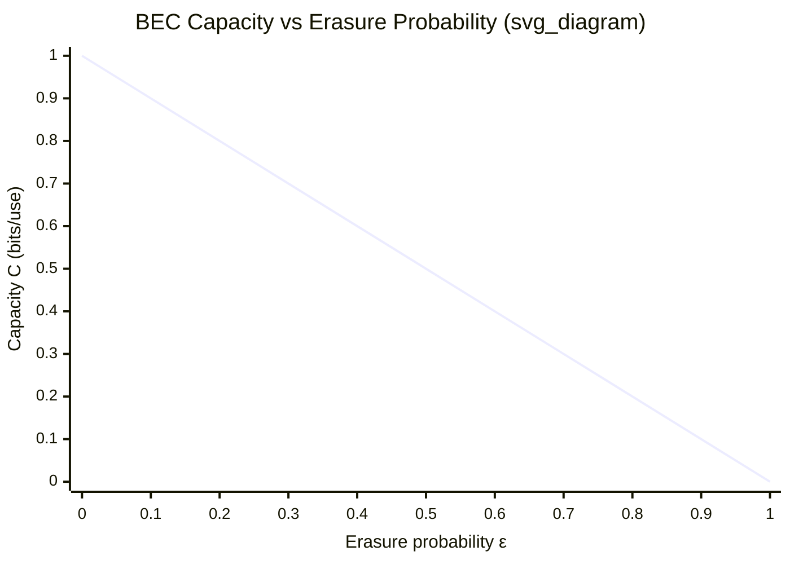

## Binary Erasure Channel Capacity

### Definition

The binary erasure channel (BEC) is a channel model with binary input $X \in \{0, 1\}$ and ternary output $Y \in \{0, 1, e\}$, where $e$ denotes an erasure. Each transmitted bit is either received correctly or erased with probability $\varepsilon$, but it is never flipped to the wrong value. The erasure probability $\varepsilon$ is called the erasure probability or crossover-to-erasure probability of the channel.

Formally, the channel transition probabilities are:

$$P(Y=0 \mid X=0) = 1-\varepsilon, \quad P(Y=e \mid X=0) = \varepsilon, \quad P(Y=1 \mid X=0) = 0$$

$$P(Y=1 \mid X=1) = 1-\varepsilon, \quad P(Y=e \mid X=1) = \varepsilon, \quad P(Y=0 \mid X=1) = 0$$

The defining property of the BEC is that the receiver always knows *which* symbols were erased — there is no ambiguity between an erasure and a correctly-received symbol, unlike the binary symmetric channel (BSC) where errors are silent.

### Channel Diagram

<svg xmlns="http://www.w3.org/2000/svg" viewBox="0 0 500 300">
  <text x="250" y="25" text-anchor="middle" font-size="16" font-weight="bold" fill="#1a1a1a">Binary Erasure Channel (svg_diagram)</text>

  <circle cx="100" cy="90" r="22" fill="#e8f0fe" stroke="#1a56db" stroke-width="2" />
  <text x="100" y="97" text-anchor="middle" font-size="16" fill="#1a1a1a">0</text>

  <circle cx="100" cy="210" r="22" fill="#e8f0fe" stroke="#1a56db" stroke-width="2" />
  <text x="100" y="217" text-anchor="middle" font-size="16" fill="#1a1a1a">1</text>

  <circle cx="400" cy="60" r="22" fill="#fef3e8" stroke="#c2410c" stroke-width="2" />
  <text x="400" y="67" text-anchor="middle" font-size="16" fill="#1a1a1a">0</text>

  <circle cx="400" cy="150" r="22" fill="#fef3e8" stroke="#c2410c" stroke-width="2" />
  <text x="400" y="157" text-anchor="middle" font-size="16" fill="#1a1a1a">e</text>

  <circle cx="400" cy="240" r="22" fill="#fef3e8" stroke="#c2410c" stroke-width="2" />
  <text x="400" y="247" text-anchor="middle" font-size="16" fill="#1a1a1a">1</text>

  <line x1="122" y1="90" x2="378" y2="60" stroke="#374151" stroke-width="1.5" />
  <text x="230" y="68" font-size="12" fill="#374151">1-ε</text>

  <line x1="122" y1="95" x2="378" y2="145" stroke="#374151" stroke-width="1.5" />
  <text x="230" y="112" font-size="12" fill="#374151">ε</text>

  <line x1="122" y1="205" x2="378" y2="155" stroke="#374151" stroke-width="1.5" />
  <text x="230" y="192" font-size="12" fill="#374151">ε</text>

  <line x1="122" y1="210" x2="378" y2="240" stroke="#374151" stroke-width="1.5" />
  <text x="230" y="235" font-size="12" fill="#374151">1-ε</text>

  <text x="100" y="260" text-anchor="middle" font-size="13" fill="#4b5563">Input X</text>
  <text x="400" y="280" text-anchor="middle" font-size="13" fill="#4b5563">Output Y</text>
</svg>

### Capacity Derivation

The channel capacity is $C = \max_{p(x)} I(X;Y)$, maximized over the input distribution $p(x)$.

Let $X$ be Bernoulli with $P(X=1) = p$. To compute $I(X;Y) = H(Y) - H(Y \mid X)$, introduce an indicator variable $E$ for erasure, where $E=1$ if $Y=e$ and $E=0$ otherwise. Since $E$ is a deterministic function of $Y$ (the receiver can always tell whether an erasure occurred), and conversely $Y$ is determined by $(X, E)$ when $E=0$:

$$H(Y) = H(Y, E) = H(E) + H(Y \mid E)$$

$H(E)$ is the binary entropy of the erasure event: $H(E) = H_b(\varepsilon)$, where $H_b(\cdot)$ is the binary entropy function.

$H(Y \mid E)$ splits into two cases: when $E=1$ (erasure occurred), $Y$ is always $e$, contributing zero entropy. When $E=0$, $Y$ equals $X$ exactly, so $H(Y \mid E=0) = H(X) = H_b(p)$. Combining:

$$H(Y \mid E) = (1-\varepsilon) \cdot H_b(p) + \varepsilon \cdot 0 = (1-\varepsilon) H_b(p)$$

So $H(Y) = H_b(\varepsilon) + (1-\varepsilon) H_b(p)$.

For the conditional entropy $H(Y \mid X)$: given $X=x$, $Y$ is either $x$ (with probability $1-\varepsilon$) or $e$ (with probability $\varepsilon$) — this is exactly a binary entropy of $\varepsilon$, regardless of $x$:

$$H(Y \mid X) = H_b(\varepsilon)$$

Therefore:

$$I(X;Y) = H(Y) - H(Y\mid X) = H_b(\varepsilon) + (1-\varepsilon)H_b(p) - H_b(\varepsilon) = (1-\varepsilon) H_b(p)$$

This expression is maximized over $p$ by maximizing $H_b(p)$, which peaks at $p = 1/2$ with $H_b(1/2) = 1$ bit. This gives:

$$\boxed{C_{\text{BEC}} = 1 - \varepsilon \text{ bits per channel use}}$$

### Interpretation

**Key Points**
- Capacity degrades linearly in $\varepsilon$, unlike the BSC where capacity is $1 - H_b(p_{\text{cross}})$, a concave function of the crossover probability.
- At $\varepsilon = 0$, the channel is noiseless and $C=1$, matching the trivial noiseless binary channel.
- At $\varepsilon = 1$, every symbol is erased and $C=0$ — no information gets through regardless of coding.
- The optimizing input distribution is uniform ($p=1/2$) for all values of $\varepsilon$, which simplifies capacity-achieving code design compared to channels where the optimal input distribution depends on the crossover parameter.
- The linear form $1-\varepsilon$ has an intuitive operational meaning: a fraction $\varepsilon$ of transmitted bits are simply lost, and the remaining fraction $1-\varepsilon$ arrive perfectly, so the channel behaves like a noiseless channel operating at a reduced rate.

### Achievability Intuition

A capacity-achieving scheme for the BEC does not need to correct errors, only recover erased positions. Because the receiver knows exactly which symbols were erased, this is structurally the same problem as erasure-correcting codes over a packet-loss network.

**Example**

Consider transmitting $n$ bits with erasure probability $\varepsilon = 0.3$. By the law of large numbers, approximately $0.3n$ bits are erased and $0.7n$ arrive intact. An $(n, k)$ linear code with $k \approx (1-\varepsilon)n = 0.7n$ information bits — such as a maximum distance separable (MDS) code — can recover the original $k$ symbols as long as at least $k$ of the $n$ transmitted symbols survive, which happens with high probability for large $n$ by concentration around the mean erasure count. This matches the capacity $1-\varepsilon$ asymptotically.

Practical near-capacity constructions include Reed-Solomon codes (which are exactly MDS but computationally expensive for large $n$), and sparse-graph codes such as LDPC codes and Fountain/Raptor codes, which achieve rates approaching $1-\varepsilon$ with efficient encoding and iterative decoding via belief propagation on the channel's factor graph.

### Comparison to Binary Symmetric Channel

| Property | BEC | BSC |
|---|---|---|
| Output alphabet | $\{0, 1, e\}$ | $\{0, 1\}$ |
| Error type | Erasure (position known) | Bit flip (position unknown) |
| Capacity | $1 - \varepsilon$ | $1 - H_b(p)$ |
| Capacity shape vs. noise parameter | Linear | Concave |
| Capacity-achieving input | Uniform, all $\varepsilon$ | Uniform, all $p$ |

**[Inference]** The BEC generally admits simpler, more efficient capacity-approaching decoders (e.g., belief propagation on erasure patterns converges without the ambiguity of noisy bit values) compared to the BSC, though actual implementation efficiency depends on code choice, decoder architecture, and hardware — this is a design-dependent claim rather than an intrinsic property of the channel itself.

### Capacity vs. Erasure Probability

### Extension: Erasure Channels with Larger Alphabets

The BEC generalizes to a $q$-ary erasure channel with input alphabet size $q$, erasure probability $\varepsilon$, and capacity:

$$C = (1-\varepsilon)\log_2 q \text{ bits per channel use}$$

**[Confirmed]** This follows the identical derivation pattern: the mutual information decomposes as $(1-\varepsilon)$ times the input entropy, maximized when the input distribution is uniform over the $q$ symbols, giving $\log_2 q$ bits of entropy per unmasked symbol.

### Related Topics

- Binary symmetric channel capacity and its concave capacity curve
- Channel coding theorem and converse for the BEC
- Fountain codes and Raptor codes for erasure correction
- Reed-Solomon codes as MDS erasure codes
- Belief propagation decoding on erasure channels
- Capacity of channels with feedback (BEC with feedback vs. without)
- Gilbert-Elliott channel (bursty erasure/error channel model)
- Network coding over erasure networks