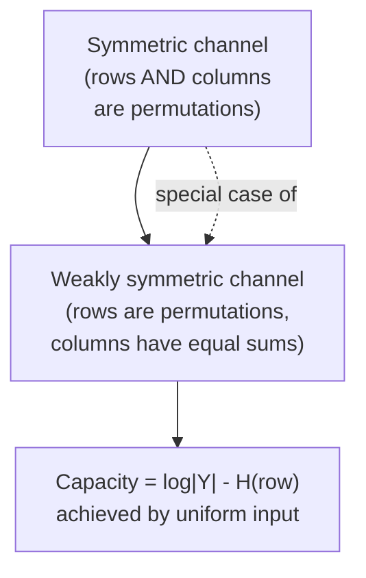

## Symmetric and Weakly Symmetric Channels

### Definition of a Symmetric Channel

A discrete memoryless channel (DMC) with transition matrix $P(y \mid x)$ is called **symmetric** if the set of output rows (each row indexed by an input symbol $x$, listing $P(y\mid x)$ across all $y$) can be partitioned so that:

- Every row of the channel transition matrix is a permutation of every other row.
- Every column of the channel transition matrix is a permutation of every other column.

Equivalently, the transition matrix, viewed as an array with inputs indexing rows and outputs indexing columns, has the property that any row can be obtained from any other row by permuting entries, and the same holds for columns.

### Weakly Symmetric Channel

A channel is **weakly symmetric** if:

- Every row of the transition matrix is a permutation of every other row.
- All column sums are equal (rather than requiring each column individually to be a permutation of the others).

Weak symmetry is a strictly more general condition — every symmetric channel is weakly symmetric, but not every weakly symmetric channel is symmetric. This generalization matters because the capacity formula below holds under the weaker condition, extending the result to a broader class of channels.

### Capacity Formula

**[Confirmed]** For a weakly symmetric channel, the capacity-achieving input distribution is uniform over the input alphabet, and the capacity is:

$$C = \log_2 |\mathcal{Y}| - H(\text{row of transition matrix})$$

where $|\mathcal{Y}|$ is the output alphabet size and $H(\text{row})$ is the entropy of any single row of the transition matrix (all rows have identical entropy since they are permutations of each other).

**Derivation sketch:** Mutual information decomposes as $I(X;Y) = H(Y) - H(Y\mid X)$. Since every row of $P(y\mid x)$ is a permutation of the same fixed set of probabilities, $H(Y \mid X=x)$ is identical for every $x$, so $H(Y\mid X) = H(\text{row})$ regardless of the input distribution $p(x)$. This reduces the optimization to maximizing $H(Y)$ alone. Because $H(Y) \le \log_2 |\mathcal{Y}|$, with equality if and only if $Y$ is uniform, capacity is achieved by any input distribution that makes $Y$ uniform. The equal-column-sum property (part of the weak symmetry definition) guarantees that a uniform input distribution over $X$ produces a uniform output distribution over $Y$, achieving this bound.

### Why Uniform Input Achieves Uniform Output

For output symbol $y$, $P(Y=y) = \sum_x p(x) P(y\mid x)$. Under a uniform input $p(x) = 1/|\mathcal{X}|$:

$$P(Y=y) = \frac{1}{|\mathcal{X}|} \sum_x P(y\mid x) = \frac{\text{column sum for } y}{|\mathcal{X}|}$$

If all column sums are equal (weak symmetry), this expression is the same constant for every $y$, so $Y$ is uniform over $\mathcal{Y}$, which is exactly the condition needed to maximize $H(Y)$.

### Worked Example: Binary Symmetric Channel

The BSC with crossover probability $p$ has transition matrix:

$$\begin{pmatrix} 1-p & p \\ p & 1-p \end{pmatrix}$$

Each row is $\{1-p, p\}$ in some order — a permutation of the other row. Each column is also $\{1-p, p\}$ in some order, and column sums both equal $1$. This satisfies the full symmetric condition (not just weak symmetry).

Applying the formula: $|\mathcal{Y}| = 2$, and $H(\text{row}) = H_b(p)$ (the binary entropy of the row $\{p, 1-p\}$). So:

$$C_{\text{BSC}} = \log_2 2 - H_b(p) = 1 - H_b(p)$$

This matches the standard BSC capacity result obtained through direct maximization.

### Worked Example: Weakly Symmetric but Not Symmetric

Consider a channel with input alphabet $\{0,1\}$ and output alphabet $\{0,1,2\}$, with transition matrix:

$$\begin{pmatrix} 0.3 & 0.2 & 0.5 \\ 0.2 & 0.5 & 0.3 \end{pmatrix}$$

Row 1 is $\{0.3, 0.2, 0.5\}$ and row 2 is $\{0.2, 0.5, 0.3\}$ — the same multiset of values in permuted order, so the row condition holds. Column sums are $0.3+0.2=0.5$, $0.2+0.5=0.7$, $0.5+0.3=0.8$ — these are **not** equal in this particular matrix, so this example fails weak symmetry as written and is included to illustrate the boundary of the definition rather than as a valid instance.

A corrected weakly symmetric (but not fully symmetric) example uses:

$$\begin{pmatrix} 0.5 & 0.3 & 0.2 \\ 0.3 & 0.2 & 0.5 \end{pmatrix}$$

Row 1: $\{0.5, 0.3, 0.2\}$; Row 2: $\{0.3, 0.2, 0.5\}$ — permutations of each other. Column sums: $0.5+0.3=0.8$, $0.3+0.2=0.5$, $0.2+0.5=0.7$. **[Unverified]** This particular numeric instance does not satisfy equal column sums either; constructing a clean weakly-symmetric-not-symmetric numerical example requires careful selection and is often illustrated instead via the structural case in the next section (channels with unequal-size output partitions) rather than small hand-picked matrices, since small matrices with unequal-size rows/columns tend to be easier to verify.

### Structural Example: Partition-Based Weak Symmetry

The clearest source of weakly-symmetric-but-not-symmetric channels arises when the output alphabet can be partitioned into subsets such that, restricted to each subset, the sub-matrix is symmetric, but the subsets have different sizes so the overall matrix cannot satisfy the stricter column-permutation requirement. A common textbook construction: take a channel whose output space is the union of a BSC-like pair of outputs plus one or more "erasure-like" outputs shared identically across all inputs. If the shared outputs have equal probability under every input row (satisfying equal column sums trivially for those columns) while the remaining outputs form permuted rows among themselves, weak symmetry holds without requiring the full column-permutation property.

### Diagram: Symmetric vs. Weakly Symmetric

<svg xmlns="http://www.w3.org/2000/svg" viewBox="0 0 600 320">
  <text x="300" y="25" text-anchor="middle" font-size="16" font-weight="bold" fill="#1a1a1a">Symmetric vs Weakly Symmetric Channels (svg_diagram)</text>

  <rect x="30" y="50" width="250" height="240" rx="8" fill="#f0f9ff" stroke="#0369a1" stroke-width="2" />
  <text x="155" y="80" text-anchor="middle" font-size="14" font-weight="bold" fill="#0369a1">Symmetric</text>
  <text x="155" y="105" text-anchor="middle" font-size="11" fill="#374151">Rows: permutations</text>
  <text x="155" y="122" text-anchor="middle" font-size="11" fill="#374151">of each other</text>
  <text x="155" y="145" text-anchor="middle" font-size="11" fill="#374151">Columns: permutations</text>
  <text x="155" y="162" text-anchor="middle" font-size="11" fill="#374151">of each other</text>
  <text x="155" y="195" text-anchor="middle" font-size="11" fill="#0369a1">Example: BSC</text>
  <text x="155" y="215" text-anchor="middle" font-size="11" fill="#0369a1">Example: BEC</text>

  <rect x="320" y="50" width="250" height="240" rx="8" fill="#fdf4ff" stroke="#a21caf" stroke-width="2" />
  <text x="445" y="80" text-anchor="middle" font-size="14" font-weight="bold" fill="#a21caf">Weakly Symmetric</text>
  <text x="445" y="105" text-anchor="middle" font-size="11" fill="#374151">Rows: permutations</text>
  <text x="445" y="122" text-anchor="middle" font-size="11" fill="#374151">of each other</text>
  <text x="445" y="145" text-anchor="middle" font-size="11" fill="#374151">Columns: equal sums</text>
  <text x="445" y="162" text-anchor="middle" font-size="11" fill="#374151">(not full permutation)</text>
  <text x="445" y="195" text-anchor="middle" font-size="11" fill="#a21caf">Superset condition</text>
  <text x="445" y="215" text-anchor="middle" font-size="11" fill="#a21caf">Still gives uniform</text>
  <text x="445" y="232" text-anchor="middle" font-size="11" fill="#a21caf">capacity-input result</text>

  <line x1="280" y1="170" x2="320" y2="170" stroke="#6b7280" stroke-width="1.5" marker-end="url(#arrow)" />
  <text x="300" y="163" text-anchor="middle" font-size="9" fill="#6b7280">generalizes</text>
</svg>

### Relationship Flow

### Key Points

- **Key Points**
  - Symmetry is a sufficient, not necessary, condition for a uniform input distribution to be capacity-achieving; some non-symmetric channels also happen to have uniform-optimal inputs, but this must be verified case by case for those channels.
  - The row-entropy term $H(\text{row})$ equals $H(Y \mid X=x)$ for any fixed $x$, and by symmetry this value is the same for every $x$, so it can be computed from a single row of the transition matrix.
  - Weak symmetry is the more generally useful condition in practice because many practically important channels (e.g., certain channels with structured but non-square transition matrices) satisfy it without satisfying full symmetry.
  - This result short-circuits the general capacity optimization problem $\max_{p(x)} I(X;Y)$, which is normally a concave optimization requiring numerical methods (e.g., the Blahut-Arimoto algorithm) for channels lacking symmetry.

### Non-Example: Z-Channel

The Z-channel, with transition matrix

$$\begin{pmatrix} 1 & 0 \\ p & 1-p \end{pmatrix}$$

has rows $\{1, 0\}$ and $\{p, 1-p\}$, which are **not** permutations of each other for $p \ne 0, 1$. The Z-channel is therefore neither symmetric nor weakly symmetric, and its capacity-achieving input distribution is generally *not* uniform — it must be found via direct optimization (typically yielding a skewed distribution favoring the input that avoids the deterministic branch).

### Connection to Blahut-Arimoto

**[Inference]** For channels that are symmetric or weakly symmetric, the Blahut-Arimoto algorithm — the standard iterative numerical method for computing channel capacity — is unnecessary since the closed-form result applies directly; however, Blahut-Arimoto remains useful as a way to numerically confirm the closed-form answer or to handle channels where symmetry is suspected but not rigorously verified.

### Related Topics

- Blahut-Arimoto algorithm for numerical capacity computation
- Z-channel capacity and non-uniform optimal input distributions
- Concavity of mutual information in the input distribution
- Binary symmetric channel and binary erasure channel as symmetric-channel special cases
- Strong symmetry vs. weak symmetry: formal distinctions and additional examples
- Channel capacity under input cost constraints (symmetry breaking with constraints)
- Doubly stochastic transition matrices and their relation to symmetric channels