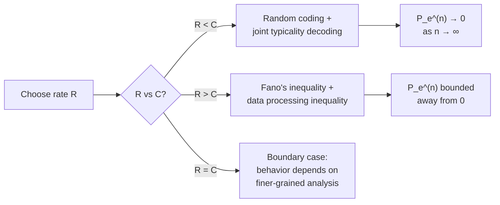

## Channel Coding Theorem (Shannon's Second Theorem)

### Statement of the Theorem

Shannon's second theorem, also known as the noisy channel coding theorem, establishes that reliable communication is possible over a noisy channel at any rate below the channel capacity $C$, and impossible at any rate above it. Formally, for a discrete memoryless channel (DMC) with capacity $C$:

- **Achievability:** For any rate $R < C$, there exists a sequence of codes with rate approaching $R$ such that the probability of decoding error can be made arbitrarily small as the block length $n \to \infty$.
- **Converse:** For any rate $R > C$, the probability of decoding error is bounded away from zero and approaches $1$ as $n \to \infty$, regardless of the code chosen.

This is a fundamentally two-sided result: capacity is not merely an upper bound achievable only asymptotically in some weak sense, but a sharp threshold — arbitrarily reliable communication is possible below it and provably impossible above it.

### Formal Setup

A channel code of block length $n$ and rate $R$ consists of:

- An encoding function $f: \{1, \dots, 2^{nR}\} \to \mathcal{X}^n$ mapping each of $2^{nR}$ messages to a codeword of length $n$.
- A decoding function $g: \mathcal{Y}^n \to \{1, \dots, 2^{nR}\}$ mapping each received sequence back to a message estimate.

The average probability of error is:

$$P_e^{(n)} = \frac{1}{2^{nR}} \sum_{i=1}^{2^{nR}} P(g(Y^n) \ne i \mid X^n = f(i))$$

The theorem states $C = \sup R$ such that a sequence of $(2^{nR}, n)$ codes exists with $P_e^{(n)} \to 0$.

### Achievability: Random Coding Argument

**[Confirmed]** Shannon's original achievability proof uses random coding combined with joint typicality decoding, rather than constructing an explicit code:

1. Fix an input distribution $p(x)$ achieving capacity, i.e., $I(X;Y) = C$.
2. Generate $2^{nR}$ codewords independently, each drawn i.i.d. according to $p(x)^n$. This is the "random codebook."
3. Reveal the codebook to both encoder and decoder.
4. To send message $i$, transmit codeword $x^n(i)$.
5. At the receiver, decode by finding the unique index $\hat{i}$ such that $(x^n(\hat{i}), y^n)$ are jointly typical — meaning their empirical joint distribution is close to $p(x,y)$. If no such unique index exists, declare an error.

**Key insight:** The probability that a *wrong* codeword happens to be jointly typical with the received sequence decays as $2^{-nI(X;Y)}$ by properties of typical sets, while there are roughly $2^{nR}$ competing codewords. By the union bound, the total probability of a false match vanishes as $n \to \infty$ whenever $R < I(X;Y) = C$.

### Typicality and the Union Bound

The proof hinges on two facts about jointly typical sequences from the asymptotic equipartition property (AEP):

- The true transmitted-received pair $(x^n(i), y^n)$ is jointly typical with high probability as $n \to \infty$, by the law of large numbers applied to the channel statistics.
- For an independently generated codeword $x^n(j)$, $j \ne i$, the probability it is jointly typical with $y^n$ is approximately $2^{-n I(X;Y)}$, since $x^n(j)$ is essentially an independent random draw unrelated to the actual channel output.

Applying the union bound over all $2^{nR} - 1$ incorrect codewords:

$$P(\text{error}) \lesssim (2^{nR} - 1) \cdot 2^{-nI(X;Y)} \le 2^{n(R - C)}$$

This bound vanishes as $n \to \infty$ precisely when $R < C$, which is the crux of the achievability argument.

### Converse: Fano's Inequality

The converse direction shows that no code can achieve $R > C$ with vanishing error, using Fano's inequality, which relates the probability of error to conditional entropy:

$$H(W \mid \hat{W}) \le 1 + P_e^{(n)} \cdot n R$$

where $W$ is the transmitted message and $\hat{W}$ the decoded estimate. Combined with the data processing inequality (since $W \to X^n \to Y^n \to \hat{W}$ forms a Markov chain) and the fact that $I(X^n; Y^n) \le nC$ for a memoryless channel used without feedback, algebraic manipulation shows:

$$R \le C + \frac{1}{n} + P_e^{(n)} R$$

As $n \to \infty$, if $P_e^{(n)} \to 0$, this forces $R \le C$. Equivalently, if $R > C$ is fixed, $P_e^{(n)}$ must be bounded away from $0$.

### Diagram: Achievability vs Converse Regions

<svg xmlns="http://www.w3.org/2000/svg" viewBox="0 0 550 300">
  <text x="275" y="25" text-anchor="middle" font-size="16" font-weight="bold" fill="#1a1a1a">Rate vs Capacity: Reliable Communication (svg_diagram)</text>

  <line x1="60" y1="250" x2="500" y2="250" stroke="#1a1a1a" stroke-width="2" />
  <text x="500" y="270" font-size="12" fill="#374151">Rate R</text>

  <line x1="280" y1="60" x2="280" y2="250" stroke="#dc2626" stroke-width="2" stroke-dasharray="6,4" />
  <text x="280" y="50" text-anchor="middle" font-size="13" fill="#dc2626" font-weight="bold">C</text>

  <rect x="60" y="70" width="220" height="160" fill="#dcfce7" opacity="0.6" />
  <text x="170" y="100" text-anchor="middle" font-size="13" fill="#166534" font-weight="bold">R &lt; C</text>
  <text x="170" y="120" text-anchor="middle" font-size="11" fill="#166534">Achievable:</text>
  <text x="170" y="136" text-anchor="middle" font-size="11" fill="#166534">P_e → 0 as n → ∞</text>

  <rect x="280" y="70" width="220" height="160" fill="#fee2e2" opacity="0.6" />
  <text x="390" y="100" text-anchor="middle" font-size="13" fill="#991b1b" font-weight="bold">R &gt; C</text>
  <text x="390" y="120" text-anchor="middle" font-size="11" fill="#991b1b">Converse:</text>
  <text x="390" y="136" text-anchor="middle" font-size="11" fill="#991b1b">P_e bounded away</text>
  <text x="390" y="152" text-anchor="middle" font-size="11" fill="#991b1b">from 0 as n → ∞</text>
</svg>

### The Threshold Behavior

### Key Points

**Key Points**
- The theorem is non-constructive in its original form: it proves capacity-achieving codes *exist* via a probabilistic argument (random codebook + typicality decoding) but does not exhibit them explicitly.
- Capacity $C$ is a sharp threshold, not merely an achievable rate — this two-sided achievability/converse structure is what distinguishes it as a true "capacity," analogous to how the source coding theorem establishes entropy as a sharp threshold for compression.
- The decoding rule described (joint typicality decoding) is not the only capacity-achieving decoder; maximum-likelihood decoding also achieves capacity but is generally harder to analyze and more computationally expensive.
- **[Inference]** The random-coding proof technique, despite yielding codes that are computationally impractical (a randomly generated codebook has no exploitable structure, requiring exponential-time table-lookup decoding), was historically important because it established that capacity was achievable in principle, motivating decades of subsequent work on explicit, efficiently-decodable codes (e.g., LDPC, turbo, polar codes) that approach this same limit.

### Explicit Capacity-Approaching Codes

The theorem's non-constructive proof left open the practical question of finding efficient codes achieving rates near $C$. Later developments closing this gap include:

- **Turbo codes** (1993): iterative decoding using two convolutional encoders with an interleaver, empirically approaching capacity on the AWGN channel.
- **LDPC codes** (rediscovered in the 1990s after Gallager's 1960s work): sparse parity-check matrices decoded via belief propagation, provably capacity-approaching under certain conditions.
- **Polar codes** (Arıkan, 2009): the first explicit construction proven to achieve capacity for binary-input symmetric memoryless channels with low-complexity encoding and decoding.

**[Unverified]** Practical achieved rates and error-floor behavior for these code families vary by implementation, block length, and decoding algorithm parameters, and specific performance figures should be checked against current literature or standards documents rather than treated as fixed constants.

### Worked Example: BSC Capacity Threshold

For a BSC with crossover probability $p = 0.1$, capacity is $C = 1 - H_b(0.1) \approx 1 - 0.469 = 0.531$ bits/use.

- At rate $R = 0.4 < C$: the channel coding theorem guarantees codes exist with $P_e^{(n)} \to 0$ as block length grows — for instance, well-designed LDPC codes at this rate achieve error rates low enough for practical use at moderate block lengths.
- At rate $R = 0.6 > C$: no code, however cleverly designed, can drive $P_e^{(n)}$ to zero; increasing block length at this rate only worsens or plateaus the error probability rather than improving it.

### Relationship to Source Coding Theorem

**[Inference]** The channel coding theorem is often viewed as the operational dual of the source coding theorem (Shannon's first theorem): the source coding theorem establishes entropy $H(X)$ as the minimum rate needed to *compress* a source losslessly, while the channel coding theorem establishes capacity $C$ as the maximum rate at which information can be *transmitted* reliably. The source-channel separation theorem later shows that, for point-to-point communication, compressing to the entropy rate and then channel-coding at capacity is asymptotically optimal — a two-stage approach that incurs no loss compared to any joint source-channel coding scheme.

### Related Topics

- Fano's inequality and its role in converse proofs
- Asymptotic equipartition property (AEP) and typical sets
- Random coding and joint typicality decoding in detail
- Source-channel separation theorem
- Explicit capacity-achieving codes: LDPC, turbo, polar codes
- Error exponents and the reliability function (rate of decay of $P_e$ below capacity)
- Channel coding theorem for continuous channels (AWGN capacity)
- Strong converse vs. weak converse formulations