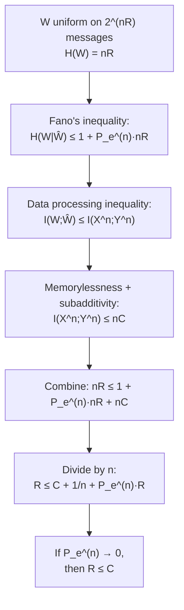

## Converse to the Channel Coding Theorem

### Statement

The converse to the channel coding theorem establishes that for any sequence of $(2^{nR}, n)$ codes used on a discrete memoryless channel (DMC) with capacity $C$, if $R > C$, then the average probability of error $P_e^{(n)}$ is bounded away from zero and in fact approaches $1$ as $n \to \infty$. This is the direction of Shannon's second theorem that proves capacity cannot be exceeded, complementing the achievability direction (random coding) covered previously.

There are two forms of this result with different strength:

- **Weak converse:** If $R > C$, then $P_e^{(n)}$ does not converge to $0$; it is bounded below by some positive constant depending on $R$ and $C$, but not necessarily approaching $1$.
- **Strong converse:** If $R > C$, then $P_e^{(n)} \to 1$ as $n \to \infty$ — not merely bounded away from zero, but approaching certain failure.

The weak converse is the more commonly proved version in introductory treatments and is sufficient to establish $C$ as an upper bound on achievable rates. The strong converse is a sharper statement requiring more refined techniques.

### Setup

Consider a message $W$ uniformly distributed over $\{1, \dots, 2^{nR}\}$, encoded into a codeword $X^n = f(W)$, transmitted through the channel to produce $Y^n$, and decoded as $\hat{W} = g(Y^n)$. This forms a Markov chain:

$$W \to X^n \to Y^n \to \hat{W}$$

The average probability of error is $P_e^{(n)} = P(\hat{W} \ne W)$.

### Fano's Inequality

The central tool in the weak converse proof is Fano's inequality, which bounds the uncertainty about $W$ given the decoder's estimate $\hat{W}$:

$$H(W \mid \hat{W}) \le H_b(P_e^{(n)}) + P_e^{(n)} \log_2(2^{nR} - 1) \le 1 + P_e^{(n)} \cdot nR$$

The intuition: if $\hat{W}$ is a good estimate of $W$ (small $P_e^{(n)}$), then $H(W \mid \hat{W})$ should be small, since knowing $\hat{W}$ nearly pins down $W$. Fano's inequality makes this precise, bounding the remaining uncertainty in terms of the error probability and the message set size.

### Deriving the Rate Bound

Starting from the fact that $W$ is uniform over $2^{nR}$ messages, $H(W) = nR$. Using the chain rule and the Markov structure:

$$nR = H(W) = H(W \mid \hat{W}) + I(W; \hat{W})$$

By the data processing inequality, since $W \to X^n \to Y^n \to \hat{W}$ is a Markov chain, mutual information cannot increase along the chain:

$$I(W; \hat{W}) \le I(X^n; Y^n)$$

For a memoryless channel used without feedback, the mutual information between the full input and output blocks is bounded by $n$ times the single-letter capacity:

$$I(X^n; Y^n) \le nC$$

Combining these three facts:

$$nR = H(W \mid \hat{W}) + I(W;\hat{W}) \le \left(1 + P_e^{(n)} \cdot nR\right) + nC$$

Dividing through by $n$:

$$R \le C + \frac{1}{n} + P_e^{(n)} R$$

### Interpreting the Bound

Rearranging for $P_e^{(n)}$:

$$P_e^{(n)} \ge \frac{R - C - \frac{1}{n}}{R} = 1 - \frac{C}{R} - \frac{1}{nR}$$

As $n \to \infty$, the $\frac{1}{nR}$ term vanishes, leaving:

$$P_e^{(n)} \gtrsim 1 - \frac{C}{R}$$

For any fixed $R > C$, the right-hand side is a strictly positive constant. This proves the weak converse: $P_e^{(n)}$ cannot go to zero when $R > C$, since it is bounded below by a positive quantity depending only on $R$ and $C$, not on $n$.

### Why I(X^n; Y^n) ≤ nC for Memoryless Channels

This step deserves justification since it is where the "memoryless" assumption is used. For a DMC used without feedback, $X^n \to Y^n$ satisfies $P(y^n \mid x^n) = \prod_{i=1}^n P(y_i \mid x_i)$. Using the chain rule for mutual information and the fact that conditioning reduces entropy:

$$I(X^n; Y^n) = H(Y^n) - H(Y^n \mid X^n) = H(Y^n) - \sum_{i=1}^n H(Y_i \mid X_i)$$

Since entropy of a sequence is subadditive, $H(Y^n) \le \sum_i H(Y_i)$, so:

$$I(X^n;Y^n) \le \sum_{i=1}^n \left[H(Y_i) - H(Y_i \mid X_i)\right] = \sum_{i=1}^n I(X_i;Y_i) \le \sum_{i=1}^n C = nC$$

The final inequality uses $I(X_i;Y_i) \le C$ for each $i$, since $C$ is by definition the maximum of $I(X;Y)$ over all input distributions at a single channel use. **[Confirmed]** This subadditivity argument is exactly where the memoryless and non-feedback assumptions are essential — with memory or feedback, $I(X^n;Y^n) \le nC$ can fail, requiring more general capacity formulas (e.g., feedback capacity, or capacity with memory expressed via limiting normalized mutual information).

### Diagram: Converse Proof Chain

### Contrapositive Framing

The result is often stated in its contrapositive form for clarity: if a rate $R$ is such that reliable communication is possible (meaning a code sequence exists with $P_e^{(n)} \to 0$), then necessarily $R \le C$. Equivalently, **no rate exceeding capacity admits reliable communication**, regardless of how cleverly the encoder and decoder are designed, how long the block length is, or how much computational effort is spent on decoding.

### Diagram: Region of Impossibility

<svg xmlns="http://www.w3.org/2000/svg" viewBox="0 0 550 260">
  <text x="275" y="25" text-anchor="middle" font-size="16" font-weight="bold" fill="#1a1a1a">Converse: No Code Beats Capacity (svg_diagram)</text>

  <line x1="60" y1="220" x2="500" y2="220" stroke="#1a1a1a" stroke-width="2" />
  <text x="500" y="240" font-size="12" fill="#374151">Rate R</text>

  <line x1="280" y1="50" x2="280" y2="220" stroke="#374151" stroke-width="2" stroke-dasharray="5,3" />
  <text x="280" y="42" text-anchor="middle" font-size="13" fill="#374151" font-weight="bold">C</text>

  <rect x="280" y="60" width="220" height="140" fill="#fee2e2" opacity="0.65" />
  <text x="390" y="90" text-anchor="middle" font-size="12" fill="#991b1b" font-weight="bold">Impossible region</text>
  <text x="390" y="108" text-anchor="middle" font-size="11" fill="#991b1b">Fano + DPI + memorylessness</text>
  <text x="390" y="124" text-anchor="middle" font-size="11" fill="#991b1b">force P_e^(n) ≥ 1 - C/R</text>
  <text x="390" y="140" text-anchor="middle" font-size="11" fill="#991b1b">for all codes, all n</text>
</svg>

### Key Points

**Key Points**
- The converse proof uses only three ingredients: Fano's inequality, the data processing inequality, and the single-letter capacity bound $I(X_i;Y_i)\le C$ summed via subadditivity of entropy — no probabilistic code construction is needed, unlike the achievability direction.
- The weak converse gives a positive lower bound on $P_e^{(n)}$ for $R>C$, but this bound can be much less than $1$; it does not by itself rule out, say, $P_e^{(n)} = 0.3$ persisting for all $n$.
- The strong converse (not derived in full here) sharpens this to $P_e^{(n)} \to 1$, typically proved via different techniques such as the method of types or Arimoto's approach using Rényi information measures.
- The converse depends critically on the DMC's memorylessness and lack of feedback; capacity with feedback can equal the memoryless capacity (Shannon showed feedback does not increase capacity for DMCs), but the converse proof technique itself needs modification since $I(X^n;Y^n)\le nC$ is not immediate under feedback.

### Common Point of Confusion

**[Inference]** A frequent misunderstanding is treating the converse as saying capacity-achieving codes are impossible to approach — the converse only forbids exceeding $C$, not approaching it from below. Rates arbitrarily close to $C$ (but strictly less) remain achievable per the direct/achievability part of the theorem; the converse and achievability results together pin capacity down as an exact, tight threshold rather than a loose bound in either direction.

### Related Topics

- Fano's inequality: full derivation and generalizations
- Data processing inequality and Markov chains in information theory
- Strong converse and the method of types
- Channel capacity with feedback (Shannon's feedback capacity result)
- Error exponents: rate of convergence of P_e for R < C
- Channel coding theorem (achievability direction, random coding)
- Capacity of channels with memory and normalized mutual information limits