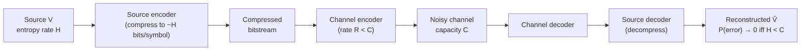

## Joint Source-Channel Coding Theorem

### Statement

The joint source-channel coding theorem addresses the general problem of transmitting a source over a noisy channel: given a source with entropy rate $H$ and a channel with capacity $C$, when can the source be reproduced at the receiver with vanishing error probability? The theorem states that reliable transmission is possible if and only if:

$$H < C$$

(with appropriate normalization when source symbols and channel uses occur at different rates). Crucially, this threshold is achievable using a two-stage **separated** architecture — compress the source to its entropy rate using a source code, then channel-encode the compressed bits at a rate approaching capacity — with no loss of optimality compared to any scheme that jointly designs the source and channel coding as a single unit.

This result is often called the **source-channel separation theorem**, since its main content is that separation is asymptotically optimal, removing the need to design joint source-channel codes in most point-to-point settings.

### Formal Setup

Let $\{V_i\}$ be a source sequence with entropy rate $H$ (e.g., a stationary ergodic source), to be transmitted over $n$ uses of a DMC with capacity $C$, producing $k$ source symbols per $n$ channel uses. Define the transmission rate ratio $k/n$. The source can be reconstructed with vanishing probability of error as $k, n \to \infty$ if and only if:

$$\frac{k}{n} H < C$$

Equivalently, viewing $H$ and $C$ in consistent units (bits per source symbol vs. bits per channel use), the condition becomes source entropy rate less than the "effective capacity per source symbol," $\frac{n}{k}C$.

### Achievability: The Separation Architecture

**[Confirmed]** The achievability direction combines two theorems already established independently:

1. **Source coding (Shannon's first theorem):** Any source with entropy rate $H$ can be losslessly compressed to a rate arbitrarily close to $H$ bits per symbol, with vanishing block error probability, via a source code (e.g., a scheme based on typical sets or an explicit code like Huffman or arithmetic coding operating near the entropy bound).
2. **Channel coding (Shannon's second theorem):** Any rate $R < C$ is achievable on the channel with vanishing error probability, via a capacity-achieving channel code (e.g., random coding with typicality decoding).

Concatenating these: compress the source to approximately $H$ bits per symbol, then channel-encode this compressed bitstream at a rate just below $C$. As long as $H < C$ (with the rate normalization above), both stages can simultaneously drive their respective error probabilities to zero, and by the union bound the combined end-to-end error probability also vanishes.

### Converse: Why H ≥ C Fails

The converse direction shows that if $H \ge C$ (again with matching normalization), no scheme — joint or separated — can reconstruct the source reliably. The argument combines:

- The source coding converse: no code can compress a source below its entropy rate without incurring error (or requiring unboundedly growing rate for vanishing error).
- The channel coding converse: no channel code can communicate at a rate above capacity with vanishing error, via Fano's inequality and the data processing inequality as established previously.

**[Confirmed]** The key technical step is applying Fano's inequality directly to the source-reconstruction problem (rather than to a message index), combined with the data processing inequality along the chain $V^k \to X^n \to Y^n \to \hat{V}^k$, to show that the mutual information $I(V^k; \hat{V}^k)$ is simultaneously bounded above by $I(X^n;Y^n) \le nC$ (from the channel) and must be close to $H(V^k) \approx kH$ (from near-perfect reconstruction), forcing $kH \lesssim nC$, i.e., $H \lesssim \frac{n}{k}C$.

### Why Separation Is Optimal (For Point-to-Point Channels)

**[Inference]** The separation theorem's significance is that it removes an entire design dimension: engineers do not need to jointly optimize source and channel codes together for point-to-point, single-user communication — compressing optimally and then channel-coding optimally, independently, loses nothing asymptotically. This is a nontrivial fact, since in principle a joint scheme could exploit redundancy in the source (e.g., unequal symbol probabilities) directly as a form of implicit error protection, potentially performing better at finite block lengths. The theorem shows this potential finite-length advantage vanishes in the asymptotic limit for memoryless, point-to-point settings.

### Diagram: Separated Architecture

### Diagram: Threshold Condition

<svg xmlns="http://www.w3.org/2000/svg" viewBox="0 0 550 260">
  <text x="275" y="25" text-anchor="middle" font-size="16" font-weight="bold" fill="#1a1a1a">Source-Channel Separation Threshold (svg_diagram)</text>

  <line x1="60" y1="220" x2="500" y2="220" stroke="#1a1a1a" stroke-width="2" />
  <text x="500" y="240" font-size="12" fill="#374151">Source entropy rate H</text>

  <line x1="280" y1="50" x2="280" y2="220" stroke="#374151" stroke-width="2" stroke-dasharray="5,3" />
  <text x="280" y="42" text-anchor="middle" font-size="13" fill="#374151" font-weight="bold">C</text>

  <rect x="60" y="60" width="220" height="140" fill="#dcfce7" opacity="0.6" />
  <text x="170" y="100" text-anchor="middle" font-size="13" fill="#166534" font-weight="bold">H &lt; C</text>
  <text x="170" y="120" text-anchor="middle" font-size="11" fill="#166534">Reliable reconstruction</text>
  <text x="170" y="136" text-anchor="middle" font-size="11" fill="#166534">achievable via separation</text>

  <rect x="280" y="60" width="220" height="140" fill="#fee2e2" opacity="0.6" />
  <text x="390" y="100" text-anchor="middle" font-size="13" fill="#991b1b" font-weight="bold">H &gt; C</text>
  <text x="390" y="120" text-anchor="middle" font-size="11" fill="#991b1b">Reliable reconstruction</text>
  <text x="390" y="136" text-anchor="middle" font-size="11" fill="#991b1b">impossible, any scheme</text>
</svg>

### Worked Example

**Example**

Suppose a source produces i.i.d. symbols from a distribution with entropy $H = 1.5$ bits/symbol, and the channel is a BSC with crossover probability $p = 0.05$, giving capacity $C = 1 - H_b(0.05) \approx 1 - 0.286 = 0.714$ bits/channel use.

To reliably transmit $k$ source symbols using $n$ channel uses, the separation theorem requires $\frac{k}{n} \cdot 1.5 < 0.714$, i.e., $\frac{k}{n} < 0.476$. This means roughly $2.1$ channel uses are required per source symbol ($n/k > 1/0.476 \approx 2.1$). A practical design would: (1) compress the source with an entropy coder approaching $1.5$ bits/symbol, then (2) channel-encode the result with a code operating at a rate just under $0.714$ bits/channel use, such as an LDPC or turbo code tuned to this BSC.

### When Separation Fails: Multi-User and Network Settings

**[Confirmed]** The separation theorem, as stated, applies to point-to-point, single-source, single-destination communication over a memoryless channel without feedback. It does **not** generalize to arbitrary multi-user or network scenarios. Known counterexamples include:

- **Broadcasting a correlated source over a broadcast channel:** Separate source and channel coding can be strictly suboptimal compared to joint schemes exploiting source correlation structure directly (related to the Slepian-Wolf and Wyner-Ziv frameworks for correlated sources).
- **Sending correlated sources over a multiple-access channel (MAC):** Joint source-channel coding can outperform separation when multiple correlated sources share a channel, since the channel's multi-user structure can be matched to source correlation in ways separation cannot exploit.

**[Inference]** These exceptions are why "separation is optimal" is stated as a general engineering heuristic only for point-to-point links, while network information theory continues to study when and how joint design provides gains in more general multi-terminal settings.

### Key Points

**Key Points**
- The theorem justifies the layered design of most real communication systems: a compression layer (e.g., MP3, JPEG, video codecs) operating independently of a channel-coding/modulation layer (e.g., LDPC, turbo codes, QAM) — with occasional deliberate exceptions for practical reasons (e.g., unequal error protection schemes) rather than to beat the separation bound.
- Separation optimality is an asymptotic, infinite-block-length result; at finite block lengths, jointly designed schemes can sometimes offer practical advantages such as reduced delay or complexity, even though they gain nothing in the asymptotic error-exponent sense.
- The condition $H < C$ elegantly unifies the source coding and channel coding theorems into a single threshold statement, and its proof simply concatenates the achievability and converse arguments of each theorem.
- Failure of separation in network settings is a major motivation for network information theory as a distinct research area from point-to-point Shannon theory.

### Related Topics

- Source coding theorem (Shannon's first theorem) and entropy rate
- Channel coding theorem and its converse (established previously)
- Slepian-Wolf coding for correlated distributed sources
- Wyner-Ziv coding (source coding with side information)
- Broadcast channels and when separation fails
- Multiple-access channel (MAC) capacity region
- Rate-distortion theory (lossy joint source-channel coding, when H > C forces distortion)
- Network information theory as a generalization beyond point-to-point separation