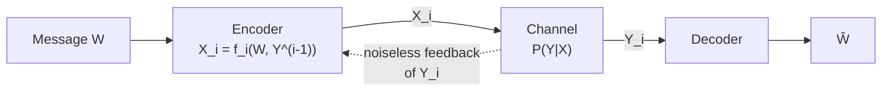

## Feedback Capacity

### Definition

Feedback capacity concerns channels where the encoder has access to previous channel outputs when generating each new input symbol — a noiseless, delay-free feedback link from receiver to transmitter. Formally, at time $i$, the channel input $X_i$ may depend on the message $W$ and the past outputs $Y^{i-1} = (Y_1, \dots, Y_{i-1})$:

$$X_i = f_i(W, Y_1, \dots, Y_{i-1})$$

The feedback capacity $C_{FB}$ is defined analogously to ordinary capacity, as the supremum of rates $R$ for which a sequence of feedback codes exists with vanishing probability of error as block length $n \to \infty$.

### Shannon's Feedback Capacity Theorem

**[Confirmed]** For a discrete memoryless channel (DMC), feedback does not increase capacity:

$$C_{FB} = C$$

This is a celebrated and somewhat counterintuitive result: even though the encoder gains full knowledge of everything the decoder has received so far, and could in principle use this to adapt its strategy symbol-by-symbol, the maximum reliably achievable rate is unchanged from the no-feedback capacity $C = \max_{p(x)} I(X;Y)$.

### Why the Result Is Surprising

Intuitively, feedback seems like it should help. The encoder learns exactly what has arrived at the decoder and could adapt future transmissions to correct for errors already observed, rather than committing to a rigid codebook chosen in advance. This intuition is not wrong in every respect — feedback does provide real benefits — but none of these benefits translate into a higher **capacity** in the memoryless, point-to-point setting.

### What Feedback Does NOT Improve

- **Capacity itself:** As stated, $C_{FB} = C$ for DMCs.
- **Achievability of rates near capacity:** Rates arbitrarily close to $C$ are already achievable without feedback (via the ordinary channel coding theorem), so feedback is not needed to reach this limit.

### What Feedback DOES Improve

**[Confirmed]** Despite not increasing capacity, feedback provides genuine practical and theoretical benefits:

- **Encoding/decoding simplicity:** Feedback enables much simpler, often variable-length, coding schemes that achieve capacity — e.g., Schalkwijk-Kailath-style schemes for Gaussian channels achieve capacity with very simple linear encoding and decoding, compared to the complex random-coding constructions needed without feedback.
- **Error exponent improvement:** For some channels, feedback improves the **error exponent** — the exponential rate at which $P_e^{(n)} \to 0$ as $n$ grows, for a fixed rate $R < C$. Communication can become reliable "faster" (in the sense of needing shorter block length for the same error probability) even though the ultimate rate ceiling is unchanged.
- **Variable-length coding advantages:** With feedback, variable-length codes can achieve zero-error or very low fixed error probability with much smaller expected block length than fixed-length codes would require without feedback.
- **Practical robustness:** In real systems, feedback (e.g., ARQ — automatic repeat request protocols) is used extensively because it simplifies system design and improves finite-block-length performance, even though it is not necessary for reaching the Shannon limit asymptotically.

### Proof Sketch: Why C_FB = C

**[Confirmed]** The proof that $C_{FB} \le C$ (the nontrivial direction, since $C_{FB} \ge C$ is immediate — a feedback-free scheme is just a special case of a feedback scheme) proceeds via a modified converse argument using Fano's inequality:

1. As in the ordinary converse, start from $H(W) = nR$ for a uniformly distributed message over $2^{nR}$ values.
2. Apply Fano's inequality to bound $H(W \mid \hat{W})$ in terms of $P_e^{(n)}$.
3. The key modification: bound $I(W; Y^n)$ using the chain rule for mutual information, expanding across time steps, and show that even with feedback, the following inequality still holds:

$$I(W;Y^n) \le \sum_{i=1}^n I(X_i; Y_i \mid Y^{i-1}) \le \sum_{i=1}^n \max_{p(x_i)} I(X_i;Y_i) \le nC$$

4. The crucial step is that even though $X_i$ can depend on $Y^{i-1}$ through the feedback link, the memorylessness of the channel means that $Y_i$ depends on the past only through $X_i$ (given $X_i$, $Y_i$ is conditionally independent of everything else), so the per-symbol mutual information term is still bounded by the single-letter capacity $C$, regardless of how cleverly $X_i$ was chosen using feedback.
5. This gives the same bound $nR \lesssim nC$ as the no-feedback converse, so $R \le C$ in the limit, proving $C_{FB} \le C$.

**[Inference]** The proof's essential insight is that feedback allows the encoder to change *what* it sends based on the past, but the memoryless channel's statistical behavior at each individual time step is unaffected by feedback — the bottleneck is the single-letter mutual information $I(X_i;Y_i)$ at each use, which feedback cannot inflate beyond $C$ no matter how the input is chosen.

### Diagram: Feedback Channel Structure

### Diagram: Capacity Equivalence

<svg xmlns="http://www.w3.org/2000/svg" viewBox="0 0 550 220">
  <text x="275" y="25" text-anchor="middle" font-size="16" font-weight="bold" fill="#1a1a1a">Feedback Does Not Increase DMC Capacity (svg_diagram)</text>

  <rect x="50" y="60" width="200" height="120" rx="8" fill="#eff6ff" stroke="#1d4ed8" stroke-width="2" />
  <text x="150" y="95" text-anchor="middle" font-size="13" font-weight="bold" fill="#1d4ed8">No Feedback</text>
  <text x="150" y="120" text-anchor="middle" font-size="12" fill="#1d4ed8">C = max I(X;Y)</text>
  <text x="150" y="145" text-anchor="middle" font-size="11" fill="#374151">Random coding +</text>
  <text x="150" y="161" text-anchor="middle" font-size="11" fill="#374151">typicality decoding</text>

  <rect x="300" y="60" width="200" height="120" rx="8" fill="#f0fdf4" stroke="#15803d" stroke-width="2" />
  <text x="400" y="95" text-anchor="middle" font-size="13" font-weight="bold" fill="#15803d">With Feedback</text>
  <text x="400" y="120" text-anchor="middle" font-size="12" fill="#15803d">C_FB = C (same!)</text>
  <text x="400" y="145" text-anchor="middle" font-size="11" fill="#374151">Simpler codes,</text>
  <text x="400" y="161" text-anchor="middle" font-size="11" fill="#374151">better error exponent</text>

  <line x1="250" y1="120" x2="300" y2="120" stroke="#6b7280" stroke-width="2" marker-end="url(#arrow2)" />
  <text x="275" y="110" text-anchor="middle" font-size="10" fill="#6b7280">=</text>
</svg>

### Key Points

**Key Points**
- $C_{FB} = C$ holds specifically for **discrete memoryless channels**. This is not a universal law of information theory — it depends on the memoryless assumption.
- **Channels with memory** are the important exception: for channels with memory (e.g., channels with inter-symbol interference, or more general non-i.i.d. channel statistics), feedback **can** strictly increase capacity. The classical DMC result does not extend automatically.
- The proof technique mirrors the ordinary converse (Fano's inequality + data processing–style bounding) but requires the extra step of showing that conditioning on feedback history does not break the single-letter capacity bound, which relies specifically on the channel's memorylessness.
- Feedback capacity results are a clean illustration of a recurring theme in information theory: a resource (feedback) can dramatically simplify achieving a fundamental limit without changing the limit itself.

### Worked Example: BSC with Feedback

For a BSC with crossover probability $p$, capacity is $C = 1 - H_b(p)$ regardless of feedback. **[Inference]** However, well-known feedback-based schemes for the BSC and related channels (analogous in spirit to the Schalkwijk-Kailath scheme originally developed for the Gaussian channel) can achieve rates approaching $C$ using much simpler encoding than the random-coding argument requires, and in some formulations offer improved (doubly exponential, in continuous-alphabet analogues) decay of error probability with block length. Exact performance figures depend on the specific scheme and channel parameters and should be checked against the relevant literature rather than assumed universally.

### Channels with Memory: Where Feedback Helps

**[Confirmed]** The DMC feedback-capacity result does not extend to channels with memory in general. A frequently cited example is channels with intersymbol interference or Markovian state that the encoder cannot directly observe: feedback allows the encoder to effectively track the channel's hidden state via past outputs, information which is unavailable in a no-feedback setting. This can strictly enlarge the achievable rate region compared to the no-feedback capacity for such channels.

**[Unverified]** The precise class of channels-with-memory for which feedback strictly increases capacity, and the magnitude of the increase, is model-dependent; specific examples (e.g., certain Gaussian channels with memory, or particular finite-state channel models) should be verified against the relevant literature rather than treated as a general closed-form rule.

### Related Topics

- Schalkwijk-Kailath scheme for the Gaussian channel with feedback
- Error exponents and reliability functions with and without feedback
- Capacity of channels with memory (finite-state channels)
- Automatic repeat request (ARQ) protocols as practical feedback schemes
- Zero-error capacity and its relationship to feedback
- Variable-length coding with feedback
- Directed information and its role in channels with feedback and memory