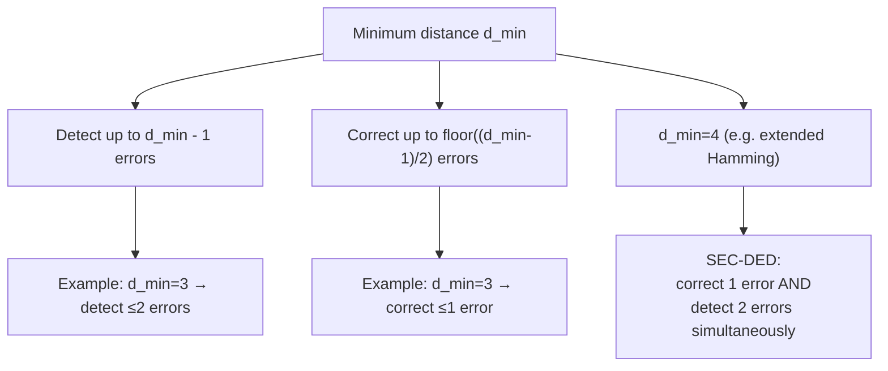

## Hamming Distance and Error Detection/Correction Basics

### Definition of Hamming Distance

The Hamming distance between two strings of equal length $x, y \in \{0,1\}^n$ (or more generally over any alphabet), denoted $d_H(x,y)$, is the number of positions at which the corresponding symbols differ:

$$d_H(x,y) = \left|\{i : x_i \ne y_i\}\right|$$

For binary strings, this equals the number of bit flips needed to transform $x$ into $y$, and is equivalently the Hamming weight (number of nonzero entries) of the bitwise XOR $x \oplus y$:

$$d_H(x,y) = w_H(x \oplus y)$$

### Hamming Distance as a Metric

Hamming distance satisfies the properties of a metric on the space $\{0,1\}^n$:

- **Non-negativity:** $d_H(x,y) \ge 0$, with equality if and only if $x = y$.
- **Symmetry:** $d_H(x,y) = d_H(y,x)$.
- **Triangle inequality:** $d_H(x,z) \le d_H(x,y) + d_H(y,z)$ for any $x,y,z$.

**[Confirmed]** The triangle inequality is the property most heavily exploited in coding theory, since it underlies the geometric picture of codewords as points in a metric space where decoding corresponds to finding the nearest codeword to a received (possibly corrupted) sequence.

### Minimum Distance of a Code

For a code $\mathcal{C} \subseteq \{0,1\}^n$ (a set of codewords), the **minimum distance** $d_{\min}$ is:

$$d_{\min}(\mathcal{C}) = \min_{\substack{c_1, c_2 \in \mathcal{C} \\ c_1 \ne c_2}} d_H(c_1, c_2)$$

This single parameter, together with the code's length $n$ and size $|\mathcal{C}|$ (often expressed as $k = \log_2|\mathcal{C}|$ information bits), largely determines a code's error detection and correction capability. Codes are frequently described by the triple $(n, k, d_{\min})$.

### Detection and Correction Capability

**[Confirmed]** The fundamental relationships connecting minimum distance to error-handling capability are:

- A code with minimum distance $d_{\min}$ can **detect** up to $d_{\min} - 1$ errors: if fewer than $d_{\min}$ bit errors occur, the corrupted received word cannot coincide with a different valid codeword, so the receiver can recognize that an error occurred (even without correcting it).
- A code with minimum distance $d_{\min}$ can **correct** up to $\left\lfloor \frac{d_{\min}-1}{2} \right\rfloor$ errors: if the number of errors is at most this value, the received word remains strictly closer to the originally transmitted codeword than to any other codeword, so nearest-neighbor (minimum-distance) decoding recovers the correct codeword.

The correction bound arises geometrically: place a "decoding ball" of radius $t = \lfloor (d_{\min}-1)/2 \rfloor$ around each codeword. If $d_{\min} \ge 2t+1$, these balls do not overlap, so any received word falling within a ball unambiguously identifies its center (the transmitted codeword) as the nearest codeword.

### Geometric Picture

<svg xmlns="http://www.w3.org/2000/svg" viewBox="0 0 550 300">
  <text x="275" y="25" text-anchor="middle" font-size="16" font-weight="bold" fill="#1a1a1a">Codewords as Non-Overlapping Balls (svg_diagram)</text>

  <circle cx="150" cy="160" r="70" fill="#dbeafe" stroke="#1d4ed8" stroke-width="2" opacity="0.7" />
  <circle cx="150" cy="160" r="4" fill="#1d4ed8" />
  <text x="150" y="150" text-anchor="middle" font-size="12" fill="#1d4ed8" font-weight="bold">c₁</text>
  <text x="150" y="245" text-anchor="middle" font-size="11" fill="#374151">radius t</text>

  <circle cx="400" cy="160" r="70" fill="#fce7f3" stroke="#be185d" stroke-width="2" opacity="0.7" />
  <circle cx="400" cy="160" r="4" fill="#be185d" />
  <text x="400" y="150" text-anchor="middle" font-size="12" fill="#be185d" font-weight="bold">c₂</text>
  <text x="400" y="245" text-anchor="middle" font-size="11" fill="#374151">radius t</text>

  <line x1="150" y1="160" x2="400" y2="160" stroke="#6b7280" stroke-width="1" stroke-dasharray="4,3" />
  <text x="275" y="150" text-anchor="middle" font-size="11" fill="#6b7280">d_min ≥ 2t+1</text>

  <circle cx="180" cy="130" r="5" fill="#059669" />
  <text x="180" y="115" text-anchor="middle" font-size="10" fill="#059669">received word</text>
  <text x="180" y="105" text-anchor="middle" font-size="9" fill="#059669">(t errors, decodes to c₁)</text>
</svg>

### The Singleton Bound and Related Trade-offs

**[Confirmed]** There is an inherent trade-off between minimum distance, code length, and code rate. The Singleton bound states that for an $(n,k,d_{\min})$ code:

$$d_{\min} \le n - k + 1$$

Codes meeting this bound with equality are called **maximum distance separable (MDS)** codes — Reed-Solomon codes are the canonical example. **[Inference]** This trade-off reflects a general principle in coding theory: increasing redundancy (lowering the rate $k/n$) generally allows for larger minimum distance and thus stronger error correction, but at the cost of transmitting fewer information bits per channel use — a concrete manifestation of the rate-reliability trade-off that channel capacity governs asymptotically.

### Worked Example: Repetition Code

Consider the length-3 repetition code over $\{0,1\}$: encode $0 \to 000$ and $1 \to 111$. Here $n=3$, $k=1$ (one information bit), and:

$$d_{\min} = d_H(000, 111) = 3$$

- **Detection:** Up to $d_{\min}-1 = 2$ errors can be detected (any received word with 1 or 2 flipped bits differs from both codewords, so an error is flagged).
- **Correction:** Up to $\lfloor (3-1)/2 \rfloor = 1$ error can be corrected. If exactly one bit flips (e.g., $000 \to 001$), the received word has Hamming distance 1 from $000$ and distance 2 from $111$, so majority-vote decoding correctly recovers $000$.
- If 2 bits flip (e.g., $000 \to 011$), the received word is now distance 2 from $000$ and distance 1 from $111$ — it decodes *incorrectly* to $111$, illustrating that exceeding the correction bound causes silent decoding failure even though the code could still, in principle, detect that *something* changed relative to $000$ (detection and correction operate against different guarantees).

### Worked Example: Hamming(7,4) Code

The classical Hamming(7,4) code has $n=7$, $k=4$, and $d_{\min} = 3$.

- **Correction capability:** $\lfloor (3-1)/2 \rfloor = 1$ — corrects any single-bit error.
- **Detection capability:** $d_{\min}-1 = 2$ — detects (without necessarily correcting) any double-bit error, though a double error, if uncorrected, will be miscorrected to a wrong codeword under standard single-error-correcting decoding rather than merely flagged, unless the decoder is specifically designed only to detect rather than correct.

**[Confirmed]** This is the origin of the common descriptor "SEC-DED" (single-error-correcting, double-error-detecting) used for codes with $d_{\min}=4$ specifically (e.g., extended Hamming codes), where the extra parity bit raises $d_{\min}$ from 3 to 4, enabling reliable double-error detection *simultaneously* with single-error correction, rather than the two capabilities being mutually exclusive as in the plain Hamming(7,4) case.

### Diagram: Detection vs Correction Trade-off

### Relationship to Channel Capacity

**[Inference]** Hamming distance and minimum-distance decoding provide a combinatorial, worst-case framework for error correction, distinct from Shannon's probabilistic, average-case framework underlying channel capacity. A code with large $d_{\min}$ guarantees correction of *any* error pattern up to a fixed weight, regardless of the channel's error statistics, whereas capacity-approaching codes (e.g., random codes achieving $R \to C$) are typically analyzed in terms of *average* or *typical* error behavior over a specific channel model and may not guarantee correction of every possible error pattern of a given weight. Both perspectives are used in practice, often for codes designed against worst-case adversarial channels (Hamming/combinatorial view) versus codes designed for known stochastic channels (Shannon/capacity view).

### Key Points

**Key Points**
- Hamming distance is purely combinatorial (defined without reference to channel statistics), making it foundational for classical, algebraic coding theory (Hamming codes, BCH codes, Reed-Solomon codes) as distinct from Shannon's probabilistic capacity framework.
- The floor function in the correction bound reflects that correction requires **unambiguous** nearest-neighbor decisions — an odd minimum distance "wastes" one unit of distance relative to what a purely detection-oriented use of the same $d_{\min}$ would provide.
- Detection and correction bounds ($d_{\min}-1$ and $\lfloor(d_{\min}-1)/2\rfloor$ respectively) describe different operating modes of the same code; a decoder must be designed to do one or the other for a given error pattern, not necessarily both automatically for every possible error count.
- The Singleton bound and its MDS-achieving codes (Reed-Solomon) connect the combinatorial Hamming-distance framework back to constructive, capacity-approaching code design — as previously noted for the erasure channel, where MDS codes achieve capacity for the BEC.

### Related Topics

- Hamming(7,4) code construction and syndrome decoding
- BCH codes and Reed-Solomon codes as generalizations
- Singleton bound, Hamming bound, and Gilbert-Varshamov bound
- Minimum distance decoding vs. maximum likelihood decoding
- Linear codes, generator matrices, and parity-check matrices
- Weight distribution and the MacWilliams identity
- Perfect codes and the Hamming bound with equality
- Soft-decision vs. hard-decision decoding