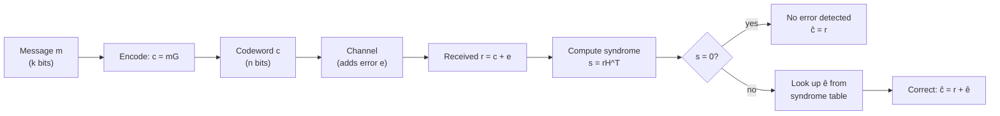

## Linear Block Codes

### Definition

A linear block code $\mathcal{C}$ of length $n$ and dimension $k$ over the binary field $\mathbb{F}_2$ is a $k$-dimensional linear subspace of the vector space $\mathbb{F}_2^n$. Equivalently, $\mathcal{C}$ consists of $2^k$ codewords such that the sum (XOR) of any two codewords is also a codeword, and the all-zero vector is always a codeword. This is denoted an $(n,k)$ linear code, or $(n,k,d_{\min})$ when the minimum distance is specified.

The **linearity** property is what distinguishes linear block codes from general (nonlinear) block codes: closure under addition means the code's structure can be captured compactly by a basis, rather than requiring an explicit list of all $2^k$ codewords.

### Generator Matrix

A linear code is fully specified by a **generator matrix** $G$, a $k \times n$ matrix whose rows form a basis for the code's $k$-dimensional subspace. Encoding a message $m \in \mathbb{F}_2^k$ (a row vector of $k$ information bits) into a codeword $c \in \mathbb{F}_2^n$ is a simple matrix multiplication:

$$c = mG$$

Every codeword is some linear combination (over $\mathbb{F}_2$) of the rows of $G$, and conversely every such combination is a valid codeword. This makes encoding computationally trivial — a single matrix-vector product — regardless of how large $2^k$ is.

### Systematic Form

A generator matrix is in **systematic form** if it can be written as:

$$G = \begin{pmatrix} I_k & P \end{pmatrix}$$

where $I_k$ is the $k \times k$ identity matrix and $P$ is a $k \times (n-k)$ matrix of parity-generating coefficients. In this form, encoding directly copies the message bits into the first $k$ positions of the codeword, appending $n-k$ parity bits computed from $P$:

$$c = m \begin{pmatrix} I_k & P \end{pmatrix} = \begin{pmatrix} m & mP \end{pmatrix}$$

**[Confirmed]** Systematic encoding is preferred in practice because the information bits appear unmodified in the codeword, simplifying implementations that need quick access to the raw message (e.g., allowing a receiver to read out likely message bits directly, with parity used only for verification/correction) and simplifying the encoder/decoder relationship, since any generator matrix can be transformed into an equivalent systematic form via row reduction and column permutation without changing the code's essential parameters ($n$, $k$, $d_{\min}$).

### Parity-Check Matrix

Associated with every linear code is a **parity-check matrix** $H$, an $(n-k) \times n$ matrix satisfying:

$$c H^T = 0 \quad \text{for every codeword } c \in \mathcal{C}$$

$H$ characterizes the code as the null space (kernel) of the linear map it defines: $\mathcal{C} = \{c \in \mathbb{F}_2^n : cH^T = 0\}$. When $G$ is in systematic form $(I_k \mid P)$, the corresponding parity-check matrix is:

$$H = \begin{pmatrix} P^T & I_{n-k} \end{pmatrix}$$

This relationship follows from requiring $GH^T = 0$ (every row of $G$, being a codeword, must satisfy the parity-check condition), which can be verified directly: $(I_k \mid P)\begin{pmatrix}P \\ I_{n-k}\end{pmatrix} = P + P = 0$ over $\mathbb{F}_2$.

### Syndrome Decoding

For a received word $r = c + e$ (where $c$ is the transmitted codeword and $e$ is an error pattern), the **syndrome** is defined as:

$$s = rH^T = (c+e)H^T = cH^T + eH^T = eH^T$$

since $cH^T = 0$ by definition of the code. **[Confirmed]** The syndrome depends only on the error pattern $e$, not on which codeword was transmitted — this is the key property that makes syndrome decoding computationally efficient. The decoder computes $s$, looks up the most likely error pattern $\hat{e}$ associated with that syndrome (typically the minimum-weight error pattern producing that syndrome, precomputed in a lookup table), and corrects by computing $\hat{c} = r + \hat{e}$.

### Diagram: Encoding and Syndrome Decoding Pipeline

### Worked Example: (7,4) Hamming Code

The Hamming(7,4) code has generator matrix in systematic form:

$$G = \begin{pmatrix} 1&0&0&0&1&1&0 \\ 0&1&0&0&1&0&1 \\ 0&0&1&0&0&1&1 \\ 0&0&0&1&1&1&1 \end{pmatrix}$$

with corresponding parity-check matrix:

$$H = \begin{pmatrix} 1&1&0&1&1&0&0 \\ 1&0&1&1&0&1&0 \\ 0&1&1&1&0&0&1 \end{pmatrix}$$

**[Unverified]** Specific bit orderings and column arrangements for Hamming(7,4) vary across textbook conventions (some place parity bits at positions 1, 2, 4 rather than appending them at the end); the matrices above represent one standard systematic convention, and any concrete implementation should be checked against its own specification rather than assumed to match this exact layout.

To encode $m = (1,0,1,1)$: $c = mG = (1,0,1,1,0,0,1)$ (computing each output bit as the XOR of the relevant input bits per the columns of $G$). If a single-bit error occurs, say the received word is $r = (1,0,1,1,0,0,0)$ (error in the last bit), the syndrome $s = rH^T$ evaluates to a nonzero column of $H$ corresponding to the error position, allowing the decoder to identify and flip that exact bit.

### Diagram: Codeword Space as a Subspace

<svg xmlns="http://www.w3.org/2000/svg" viewBox="0 0 550 280">
  <text x="275" y="25" text-anchor="middle" font-size="16" font-weight="bold" fill="#1a1a1a">Linear Code as a Subspace (svg_diagram)</text>

  <rect x="60" y="50" width="430" height="200" rx="8" fill="#f9fafb" stroke="#6b7280" stroke-width="2" />
  <text x="275" y="72" text-anchor="middle" font-size="12" fill="#374151">Ambient space F₂ⁿ (2ⁿ vectors)</text>

  <ellipse cx="275" cy="165" rx="150" ry="65" fill="#dbeafe" stroke="#1d4ed8" stroke-width="2" />
  <text x="275" y="150" text-anchor="middle" font-size="12" font-weight="bold" fill="#1d4ed8">Code C (subspace)</text>
  <text x="275" y="170" text-anchor="middle" font-size="11" fill="#1d4ed8">2^k codewords</text>
  <text x="275" y="188" text-anchor="middle" font-size="10" fill="#1d4ed8">closed under XOR</text>

  <circle cx="220" cy="160" r="3" fill="#1d4ed8" />
  <circle cx="260" cy="175" r="3" fill="#1d4ed8" />
  <circle cx="300" cy="155" r="3" fill="#1d4ed8" />
  <circle cx="330" cy="180" r="3" fill="#1d4ed8" />

  <circle cx="120" cy="100" r="3" fill="#dc2626" />
  <text x="120" y="90" text-anchor="middle" font-size="9" fill="#dc2626">non-codeword</text>
  <text x="120" y="220" text-anchor="middle" font-size="9" fill="#374151">(2ⁿ - 2ᵏ vectors</text>
  <text x="120" y="234" text-anchor="middle" font-size="9" fill="#374151">outside C)</text>
</svg>

### Minimum Distance for Linear Codes

**[Confirmed]** For linear codes specifically, minimum distance has a simplification not available for general nonlinear codes: because $\mathcal{C}$ is closed under subtraction (equivalent to addition over $\mathbb{F}_2$), $d_H(c_1,c_2) = w_H(c_1 - c_2) = w_H(c_1+c_2)$, and $c_1+c_2$ is itself a codeword. Therefore:

$$d_{\min}(\mathcal{C}) = \min_{c \in \mathcal{C}, c \ne 0} w_H(c)$$

The minimum distance equals the minimum **Hamming weight** among all nonzero codewords — reducing an $O(2^{2k})$ pairwise comparison problem to an $O(2^k)$ single-pass search over the code's weight distribution.

### Rate and the (n,k,d_min) Notation

The **rate** of a linear $(n,k)$ code is $R = k/n$, the fraction of transmitted bits carrying actual information. This connects directly to the channel coding framework: a good linear code family should allow $R$ to approach the channel capacity $C$ while its minimum distance (or, more generally in the probabilistic setting, its error-correcting performance under a specific channel model) grows appropriately with $n$.

### Key Points

**Key Points**
- Linearity reduces the encoding problem from "store $2^k$ arbitrary $n$-bit codewords" to "store a $k \times n$ generator matrix," an exponential reduction in representational complexity.
- The generator matrix $G$ and parity-check matrix $H$ are dual descriptions of the same code: $G$ describes the code as a span (row space), while $H$ describes it as a kernel (null space); both fully determine $\mathcal{C}$.
- Syndrome decoding decouples the error-correction problem from the specific transmitted codeword — the syndrome depends only on the error pattern, enabling a fixed lookup table approach for bounded-weight errors.
- For linear codes, minimum distance reduces to minimum nonzero codeword weight, a major computational and conceptual simplification exploited throughout algebraic coding theory (e.g., in weight-enumerator polynomials and the MacWilliams identity).

### Common Families of Linear Block Codes

- **Hamming codes:** $(2^r - 1, 2^r - r - 1, 3)$ single-error-correcting codes for any $r \ge 2$; the (7,4) code above is the $r=3$ case.
- **Reed-Muller codes:** A family parameterized by order and variable count, including some very simple and some very powerful codes, historically used in early deep-space communication (e.g., Mariner missions).
- **BCH codes:** A generalization of Hamming codes to correct multiple errors, built using finite field (Galois field) polynomial roots.
- **Reed-Solomon codes:** Non-binary (symbol-alphabet) linear block codes that are maximum distance separable (MDS), widely used for burst-error and erasure correction (as previously discussed for the binary/q-ary erasure channel).
- **LDPC codes:** Linear block codes defined by a *sparse* parity-check matrix $H$, enabling efficient iterative (belief propagation) decoding and near-capacity performance at large block lengths.

### Related Topics

- Hamming distance and error detection/correction basics (prerequisite, previously covered)
- Cyclic codes and their algebraic structure (BCH, Reed-Solomon as cyclic code special cases)
- LDPC codes and belief propagation decoding
- Weight enumerator polynomials and the MacWilliams identity
- Dual codes and self-dual codes
- Convolutional codes as a contrast to block codes
- Finite field (Galois field) arithmetic underlying non-binary linear codes
- Maximum likelihood decoding vs. syndrome decoding trade-offs