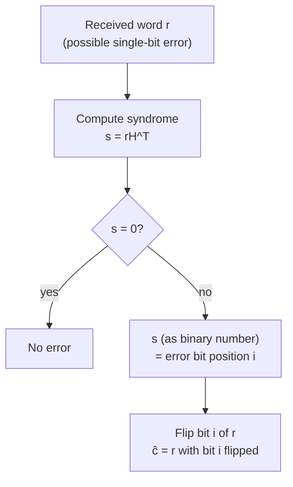

## Hamming Codes

### Definition

Hamming codes are a family of linear block codes, parameterized by an integer $r \ge 2$, with parameters:

$$n = 2^r - 1, \quad k = 2^r - r - 1, \quad d_{\min} = 3$$

Each Hamming code is a single-error-correcting code (per the $\lfloor(d_{\min}-1)/2\rfloor = 1$ correction bound established previously), and the family is notable for achieving the **Hamming bound** with equality, making these **perfect codes** — a property explained in detail below.

### Construction via the Parity-Check Matrix

**[Confirmed]** The defining construction of a Hamming code is unusually direct compared to most linear codes: the parity-check matrix $H$ is built by taking as its columns **all nonzero binary vectors of length $r$**, in any fixed order (a common convention orders them as the binary representations of $1, 2, \dots, 2^r-1$). This gives $H$ dimensions $r \times (2^r - 1)$, i.e., $r \times n$, matching the required $(n-k) \times n$ shape since $n - k = r$.

For $r = 3$ (giving the familiar Hamming(7,4) code), using columns ordered as binary $1$ through $7$:

$$H = \begin{pmatrix} 0&0&0&1&1&1&1 \\ 0&1&1&0&0&1&1 \\ 1&0&1&0&1&0&1 \end{pmatrix}$$

**[Unverified]** As with the previous discussion of Hamming(7,4), the exact column ordering (and whether parity or message bits are interleaved or appended) varies by textbook convention; the key defining property — that the columns of $H$ range over all nonzero length-$r$ vectors — is what matters structurally, not the specific ordering chosen.

### Why This Construction Gives d_min = 3

**[Confirmed]** The minimum distance of a linear code equals the smallest number of columns of $H$ that are linearly dependent (sum to zero), a general fact connecting the parity-check matrix structure to minimum distance. For the Hamming code construction:

- No single column of $H$ is the zero vector (by construction, all columns are nonzero), so no single column alone is linearly dependent — ruling out $d_{\min}=1$.
- No two columns are equal (by construction, all $2^r-1$ nonzero vectors appear exactly once), so no two columns sum to zero — ruling out $d_{\min}=2$.
- Three columns summing to zero is possible and in fact guaranteed to occur somewhere among the columns, since the columns exhaust *all* nonzero vectors in $\mathbb{F}_2^r$, and this space necessarily contains triples of nonzero vectors satisfying $a + b + c = 0$ (equivalently $c = a+b$, which is guaranteed to be some other nonzero column already present, as long as $a \ne b$).

This gives exactly $d_{\min} = 3$: the minimum number of linearly dependent columns is 3, not fewer.

### The Syndrome-as-Address Property

**[Confirmed]** A defining computational elegance of Hamming codes is that the syndrome directly encodes the error location as a binary number. Since the columns of $H$ are (by construction) the binary representations of $1$ through $2^r-1$, a single-bit error $e$ in position $i$ produces a syndrome:

$$s = eH^T = H_i \text{ (the } i\text{-th column of } H\text{)}$$

which is exactly the binary representation of $i$. Decoding a single-bit error therefore requires no lookup table at all — the syndrome, read as a binary number, directly gives the error position to flip. This is a significant practical simplification compared to generic syndrome decoding (previously discussed), which in general requires a precomputed table mapping syndromes to error patterns.

### Diagram: Syndrome as Direct Address

### Worked Example: Hamming(7,4)

Using the construction above with $r=3$, suppose codeword $c = (1,0,1,1,0,0,1)$ is transmitted (positions numbered 1 through 7) and a single-bit error occurs at position 5, giving received word $r = (1,0,1,1,1,0,1)$.

Computing $s = rH^T$ using the $H$ matrix above yields the binary vector $(1,0,1)$, which as a binary number equals $5$ — directly identifying position 5 as the error location, with no table lookup needed. Flipping bit 5 recovers $c$.

### Perfect Codes and the Hamming Bound

**[Confirmed]** The **Hamming bound** (also called the sphere-packing bound) is a general upper limit on how many codewords a code with a given error-correction capability $t$ can contain:

$$|\mathcal{C}| \le \frac{2^n}{\sum_{i=0}^{t} \binom{n}{i}}$$

The right-hand side counts how many length-$n$ vectors fit into the ambient space $\{0,1\}^n$ divided by the size of a single decoding ball of radius $t$ (the number of vectors within Hamming distance $t$ of a given codeword, summed via the binomial coefficients for each possible number of flipped bits from $0$ to $t$). A code is called **perfect** if it meets this bound with equality — meaning the decoding balls of radius $t$ around each codeword exactly tile the entire space $\{0,1\}^n$ with no gaps and no overlaps.

**[Confirmed]** Hamming codes are perfect codes for $t=1$. Verifying this for the general Hamming code: $|\mathcal{C}| = 2^k = 2^{2^r-r-1}$, and the right-hand side of the Hamming bound with $t=1$ is:

$$\frac{2^n}{\binom{n}{0}+\binom{n}{1}} = \frac{2^{2^r-1}}{1 + (2^r-1)} = \frac{2^{2^r-1}}{2^r} = 2^{2^r-1-r}$$

This matches $2^k = 2^{2^r-r-1}$ exactly, confirming equality — the balls of radius 1 around each Hamming codeword perfectly partition the entire space with no wasted vectors and no overlaps.

### Diagram: Perfect Sphere-Packing

<svg xmlns="http://www.w3.org/2000/svg" viewBox="0 0 550 300">
  <text x="275" y="25" text-anchor="middle" font-size="16" font-weight="bold" fill="#1a1a1a">Hamming Codes as Perfect Sphere Packings (svg_diagram)</text>

  <rect x="40" y="50" width="470" height="220" fill="#f9fafb" stroke="#6b7280" stroke-width="2" />
  <text x="275" y="72" text-anchor="middle" font-size="12" fill="#374151">Entire space {0,1}ⁿ — fully tiled, no gaps, no overlaps</text>

  <circle cx="120" cy="140" r="55" fill="#dbeafe" stroke="#1d4ed8" stroke-width="1.5" />
  <circle cx="120" cy="140" r="3" fill="#1d4ed8" />

  <circle cx="235" cy="140" r="55" fill="#fce7f3" stroke="#be185d" stroke-width="1.5" />
  <circle cx="235" cy="140" r="3" fill="#be185d" />

  <circle cx="120" cy="230" r="55" fill="#dcfce7" stroke="#15803d" stroke-width="1.5" />
  <circle cx="120" cy="230" r="3" fill="#15803d" />

  <circle cx="235" cy="230" r="55" fill="#fef3c7" stroke="#c2410c" stroke-width="1.5" />
  <circle cx="235" cy="230" r="3" fill="#c2410c" />

  <circle cx="350" cy="140" r="55" fill="#ede9fe" stroke="#6d28d9" stroke-width="1.5" />
  <circle cx="350" cy="140" r="3" fill="#6d28d9" />

  <circle cx="465" cy="140" r="55" fill="#fee2e2" stroke="#991b1b" stroke-width="1.5" />
  <circle cx="465" cy="140" r="3" fill="#991b1b" />

  <text x="275" y="290" text-anchor="middle" font-size="10" fill="#374151">Every vector falls in exactly one radius-1 ball around a codeword</text>
</svg>

### Extended Hamming Codes

**[Confirmed]** Adding a single overall parity bit to a Hamming code produces the **extended Hamming code**, with parameters $(2^r, 2^r-r-1, 4)$ — length increased by 1, dimension unchanged, and minimum distance raised from 3 to 4. As previously noted in the discussion of detection/correction trade-offs, this $d_{\min}=4$ code achieves the SEC-DED property (single-error-correcting, double-error-detecting) simultaneously, rather than the plain Hamming code's either/or trade-off between correcting 1 error or detecting 2.

**[Inference]** Extended Hamming codes are widely used in computer memory systems (ECC RAM) specifically because SEC-DED behavior — silently correcting the far more common single-bit upset while at least flagging (without necessarily correcting) rarer double-bit upsets — offers a practical reliability/complexity trade-off suited to typical memory error statistics, though exact deployment choices and error models vary by hardware generation and application.

### Key Points

**Key Points**
- Hamming codes are defined by an unusually simple and elegant parity-check matrix construction: columns are literally all nonzero binary vectors of length $r$, making both the code's minimum distance and its decoding procedure derivable almost by inspection.
- The syndrome-as-error-address property is a special convenience specific to the Hamming code's particular column ordering — this direct address decoding does not generalize automatically to other linear codes, which typically require genuine table lookup.
- Hamming codes are the simplest nontrivial example of a **perfect code** — a class that is otherwise extremely rare; besides Hamming codes and the trivial repetition-code/single-parity-check-code cases, essentially the only other well-known perfect binary code is the Golay code $(23,12,7)$.
- The extension to SEC-DED via extended Hamming codes shows how a small, cheap modification (one extra parity bit) can qualitatively change a code's error-handling guarantees, illustrating the sensitivity of code performance to $d_{\min}$ near small values.

### Related Topics

- Linear block codes: generator and parity-check matrices (prerequisite, previously covered)
- Hamming distance and error detection/correction basics (prerequisite, previously covered)
- Hamming bound (sphere-packing bound) and other coding bounds (Singleton, Gilbert-Varshamov)
- Golay codes as the other classical perfect code family
- Extended Hamming codes and SEC-DED in ECC memory systems
- BCH codes as a multi-error-correcting generalization of Hamming codes
- Cyclic code structure and Hamming codes as a cyclic code special case
- Syndrome decoding for general (non-perfect) linear codes