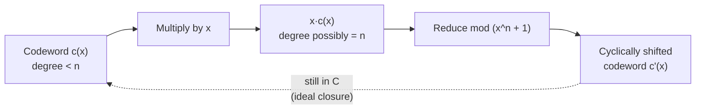

## Cyclic Codes and Generator Polynomials

### Definition

A **cyclic code** is a linear block code $\mathcal{C}$ of length $n$ with the additional closure property that every cyclic shift of a codeword is also a codeword. Formally, if $c = (c_0, c_1, \dots, c_{n-1}) \in \mathcal{C}$, then the cyclic shift:

$$c' = (c_{n-1}, c_0, c_1, \dots, c_{n-2}) \in \mathcal{C}$$

is also a codeword. This extra structure beyond ordinary linearity is what enables cyclic codes to be described and manipulated via polynomial arithmetic rather than raw matrix operations, unlocking substantially more efficient encoding/decoding circuits and richer algebraic tools for constructing codes with prescribed minimum distance.

### Polynomial Representation

Each codeword $c = (c_0, c_1, \dots, c_{n-1})$ is identified with a polynomial of degree less than $n$ over $\mathbb{F}_2$:

$$c(x) = c_0 + c_1 x + c_2 x^2 + \dots + c_{n-1}x^{n-1}$$

Under this correspondence, a cyclic shift corresponds to multiplication by $x$ modulo $x^n - 1$ (equivalently $x^n+1$ over $\mathbb{F}_2$, since $-1=1$):

$$x \cdot c(x) \bmod (x^n+1)$$

**[Confirmed]** This is the key structural fact that makes cyclic codes tractable: the code, viewed as a set of polynomials, becomes an **ideal** in the quotient ring $\mathbb{F}_2[x]/(x^n+1)$ — closed not just under addition (from linearity) but under multiplication by $x$ (from the cyclic-shift property), and by extension under multiplication by any polynomial in the ring.

### Generator Polynomial

**[Confirmed]** A foundational theorem of cyclic code theory states that every cyclic code of length $n$ is generated by a single polynomial $g(x)$, called the **generator polynomial**, which is the unique monic polynomial of minimum degree in the code (viewed as an ideal). Every codeword $c(x)$ is a multiple of $g(x)$:

$$c(x) = m(x) \cdot g(x)$$

for some message polynomial $m(x)$ of degree less than $k$, where $k = n - \deg(g(x))$. Additionally, $g(x)$ must divide $x^n+1$ exactly — this divisibility requirement is what restricts which polynomials can serve as generator polynomials for a given length $n$.

### Encoding via Generator Polynomial

Given a generator polynomial $g(x)$ of degree $n-k$, encoding a message $m(x)$ (degree $< k$) into a codeword can be done in (at least) two ways:

- **Non-systematic encoding:** $c(x) = m(x) \cdot g(x)$ directly.
- **Systematic encoding:** shift the message to the high-degree end and append parity: $c(x) = x^{n-k}m(x) - \left[x^{n-k}m(x) \bmod g(x)\right]$, so that the message bits appear unmodified in the top $k$ coefficients and the remainder supplies the parity bits (subtraction is addition over $\mathbb{F}_2$).

**[Confirmed]** Systematic encoding is generally preferred for the same reasons noted for linear block codes generally — direct visibility of the message bits in the codeword — and it is implementable efficiently in hardware using a linear feedback shift register (LFSR) that computes the polynomial remainder as the message bits are shifted in.

### Diagram: Cyclic Shift as Polynomial Multiplication

### Worked Example: (7,4) Cyclic Hamming Code

The Hamming(7,4) code (previously constructed via its parity-check matrix) can equivalently be realized as a cyclic code. For $n=7$, the polynomial $x^7+1$ factors over $\mathbb{F}_2$ as:

$$x^7+1 = (x+1)(x^3+x+1)(x^3+x^2+1)$$

Choosing $g(x) = x^3+x+1$ (degree 3, so $n-k=3$, $k=4$, matching the (7,4) parameters) gives a cyclic realization of the Hamming(7,4) code. To encode a message such as $m(x) = 1+x^2+x^3$ (corresponding to message bits $1,0,1,1$), compute:

$$c(x) = m(x)\cdot g(x) = (1+x^2+x^3)(x^3+x+1)$$

Expanding this product over $\mathbb{F}_2$ (coefficients reduced mod 2) yields the corresponding 7-bit codeword. **[Unverified]** The exact resulting bit string depends on the chosen coefficient-to-bit-position convention (ascending vs. descending degree order), so specific numeric results should be checked against whatever convention a given implementation uses rather than assumed universally.

### The Role of Roots: BCH-Style Construction

**[Confirmed]** A powerful way to construct cyclic codes with a guaranteed minimum distance is to specify $g(x)$ via its **roots** in an extension field. If $\alpha$ is a primitive element of $\mathbb{F}_{2^m}$ (for appropriate $m$ dividing into $n=2^m-1$), choosing $g(x)$ to be the minimal polynomial (over $\mathbb{F}_2$) having $\alpha, \alpha^2, \dots, \alpha^{2t}$ as roots guarantees, via the BCH bound, that the resulting cyclic code has minimum distance at least $2t+1$ — i.e., the code corrects at least $t$ errors. This is the foundational idea behind **BCH codes**, and Hamming codes are recoverable as the special case $t=1$.

### Diagram: Generator Polynomial as Ideal Generator

<svg xmlns="http://www.w3.org/2000/svg" viewBox="0 0 550 260">
<text x="275" y="25" text-anchor="middle" font-size="16" font-weight="bold" fill="#1a1a1a">Cyclic Code as an Ideal (svg_diagram)</text>
<rect x="50" y="55" width="450" height="180" rx="8" fill="#f9fafb" stroke="#6b7280" stroke-width="2" />
<text x="275" y="78" text-anchor="middle" font-size="12" fill="#374151">Ring F₂[x] / (xⁿ + 1)</text>
<ellipse cx="275" cy="155" rx="180" ry="60" fill="#dbeafe" stroke="#1d4ed8" stroke-width="2" />
<text x="275" y="140" text-anchor="middle" font-size="12" font-weight="bold" fill="#1d4ed8">Ideal generated by g(x)</text>
<text x="275" y="160" text-anchor="middle" font-size="11" fill="#1d4ed8">= {m(x)·g(x) : deg m &lt; k}</text>
<text x="275" y="178" text-anchor="middle" font-size="10" fill="#1d4ed8">g(x) divides xⁿ+1</text>
<circle cx="275" cy="155" r="3" fill="#1d4ed8" />
<text x="275" y="205" text-anchor="middle" font-size="9" fill="#1d4ed8">g(x) itself (m(x)=1)</text>
</svg>

### Relation to the Generator and Parity-Check Matrices

**[Confirmed]** The polynomial description connects back to the matrix formalism of general linear block codes: the coefficients of $g(x), x\cdot g(x), \dots, x^{k-1}g(x)$ form the rows of a (generally non-systematic) generator matrix $G$ for the code. There is a corresponding **parity-check polynomial** $h(x) = (x^n+1)/g(x)$, whose coefficients (in reversed/appropriate order) similarly generate the parity-check matrix $H$. This means everything previously established for linear block codes — syndrome decoding, minimum distance as minimum codeword weight, the Singleton and Hamming bounds — applies directly to cyclic codes, with the polynomial structure providing additional tools on top.

### Key Points

**Key Points**

- Cyclic codes are a strict refinement of linear block codes: every cyclic code is linear, but not every linear code is cyclic (cyclic shift closure is a strictly stronger requirement than addition closure alone).
- The generator polynomial $g(x)$ must divide $x^n+1$ over $\mathbb{F}_2$ — this factorization determines exactly which cyclic codes of length $n$ exist, since each valid generator polynomial corresponds to a distinct cyclic code (or a distinct minimum-degree ideal generator).
- Encoding and syndrome computation for cyclic codes can be implemented very efficiently in hardware using linear feedback shift registers (LFSRs), a major practical advantage over general linear block code implementations that may require full matrix multiplication circuits.
- The BCH-style root-based construction is the primary mechanism for building cyclic codes with a *guaranteed* minimum distance target, connecting cyclic code theory to finite field (Galois field) structure.

### Why the Algebraic Structure Matters

**[Inference]** The shift from viewing codes as arbitrary linear subspaces to viewing them as ideals of a specific polynomial quotient ring is what unlocks systematic, constructive design of codes with prescribed error-correction guarantees (as opposed to the Hamming code's somewhat ad hoc "all nonzero columns" construction). This algebraic machinery is the direct ancestor of BCH codes and Reed-Solomon codes, both of which are constructed by choosing roots in an extension field to guarantee a target minimum distance via the BCH bound — a substantially more general and powerful design principle than the specific perfect-code structure of Hamming codes.

### Related Topics

- Linear block codes: generator and parity-check matrices (prerequisite, previously covered)
- Hamming codes as a special case of cyclic codes (prerequisite, previously covered)
- BCH codes: general construction and the BCH bound
- Reed-Solomon codes as non-binary cyclic (or shortened cyclic) codes
- Linear feedback shift registers (LFSRs) for hardware encoding/decoding
- Finite field (Galois field) arithmetic and primitive elements
- CRC (cyclic redundancy check) codes as a widely deployed application of cyclic code theory
- Cyclic code decoding algorithms (e.g., Peterson-Gorenstein-Zierler for BCH codes)