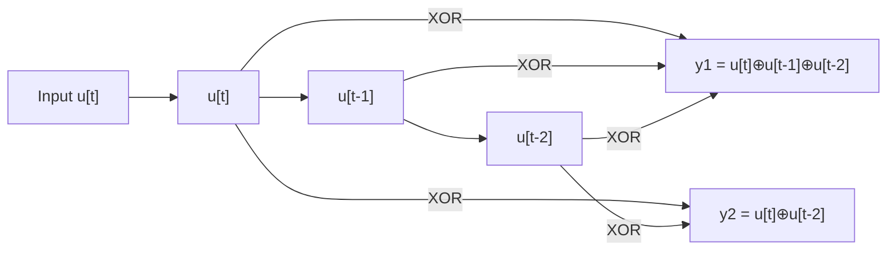
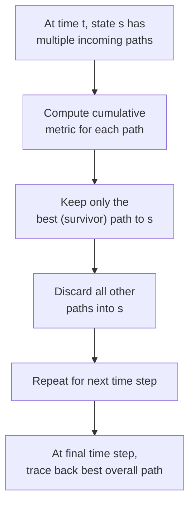

## Convolutional Codes and Trellis Representation

### Definition

Convolutional codes are a class of error-correcting codes fundamentally different in structure from the block codes previously covered (Hamming, BCH, Reed-Solomon). Rather than encoding fixed-size message blocks independently, a convolutional encoder processes an incoming bit **stream** continuously, producing output bits that depend on the current input bits together with a fixed window of recent past inputs, retained in shift-register memory. This gives convolutional codes a temporal, sliding-window structure rather than the block structure of the codes previously discussed.

A convolutional code is characterized by the parameters $(n, k, K)$: $k$ input bits per encoder step, $n$ output bits per step (giving nominal rate $R = k/n$), and **constraint length** $K$, the number of shift-register stages (equivalently, the number of input bits, including the current one, that influence the current output).

### Encoder Structure

**[Confirmed]** A standard convolutional encoder consists of a shift register of length $K-1$ (holding past inputs) combined with modulo-2 adders that compute each output bit as a fixed linear combination (XOR) of the current input bit and the register contents. The specific combination for each output is defined by **generator polynomials**, typically written in octal notation.

For example, the well-known rate-1/2, constraint-length-3 convolutional code (often used as a canonical teaching example) has generator polynomials $g_1 = (111)_2 = 7_8$ and $g_2 = (101)_2 = 5_8$, meaning:

$$y_1[t] = u[t] \oplus u[t-1] \oplus u[t-2], \qquad y_2[t] = u[t] \oplus u[t-2]$$

where $u[t]$ is the input bit at time $t$ and $y_1[t], y_2[t]$ are the two output bits produced at that time step.

### Diagram: Encoder Shift Register

### The State Concept

**[Confirmed]** At any time $t$, the encoder's **state** is defined by the contents of its shift register — for the $K=3$ example above, the state consists of the two most recent input bits $(u[t-1], u[t-2])$, giving $2^{K-1} = 4$ possible states. The next state and the output at each step are fully determined by the current state and the current input bit, making the convolutional encoder a **finite state machine**.

### Trellis Representation

**[Confirmed]** The trellis diagram is the standard graphical representation of a convolutional code's behavior over time: it depicts the encoder's possible states as nodes arranged in columns (one column per time step), with edges connecting a state at time $t$ to the state(s) reachable at time $t+1$, labeled with the input bit that causes the transition and the output bits produced. The trellis unrolls the finite state machine's state-transition diagram across the time dimension, making the sequence of encoder states and outputs explicit and directly supporting sequence-based decoding algorithms.

### Diagram: Trellis for the (2,1,3) Example

<svg xmlns="http://www.w3.org/2000/svg" viewBox="0 0 600 320">
  <text x="300" y="25" text-anchor="middle" font-size="16" font-weight="bold" fill="#1a1a1a">Trellis Diagram, K=3 Rate-1/2 Code (svg_diagram)</text>

  <text x="60" y="55" font-size="11" fill="#374151">State</text>
  <text x="60" y="90" font-size="11" fill="#374151">00</text>
  <text x="60" y="150" font-size="11" fill="#374151">01</text>
  <text x="60" y="210" font-size="11" fill="#374151">10</text>
  <text x="60" y="270" font-size="11" fill="#374151">11</text>

  <circle cx="120" cy="85" r="6" fill="#1d4ed8" />
  <circle cx="120" cy="145" r="6" fill="#1d4ed8" />
  <circle cx="120" cy="205" r="6" fill="#1d4ed8" />
  <circle cx="120" cy="265" r="6" fill="#1d4ed8" />

  <circle cx="280" cy="85" r="6" fill="#1d4ed8" />
  <circle cx="280" cy="145" r="6" fill="#1d4ed8" />
  <circle cx="280" cy="205" r="6" fill="#1d4ed8" />
  <circle cx="280" cy="265" r="6" fill="#1d4ed8" />

  <circle cx="440" cy="85" r="6" fill="#1d4ed8" />
  <circle cx="440" cy="145" r="6" fill="#1d4ed8" />
  <circle cx="440" cy="205" r="6" fill="#1d4ed8" />
  <circle cx="440" cy="265" r="6" fill="#1d4ed8" />

  <line x1="120" y1="85" x2="280" y2="85" stroke="#059669" stroke-width="2" />
  <text x="200" y="78" text-anchor="middle" font-size="9" fill="#059669">0/00</text>
  <line x1="120" y1="85" x2="280" y2="205" stroke="#dc2626" stroke-width="2" />
  <text x="200" y="150" text-anchor="middle" font-size="9" fill="#dc2626">1/11</text>

  <line x1="120" y1="145" x2="280" y2="85" stroke="#dc2626" stroke-width="1.5" stroke-dasharray="3,2" />
  <line x1="120" y1="145" x2="280" y2="205" stroke="#059669" stroke-width="1.5" stroke-dasharray="3,2" />

  <line x1="280" y1="85" x2="440" y2="85" stroke="#059669" stroke-width="2" />
  <line x1="280" y1="85" x2="440" y2="205" stroke="#dc2626" stroke-width="2" />

  <text x="120" y="300" text-anchor="middle" font-size="10" fill="#374151">t=0</text>
  <text x="280" y="300" text-anchor="middle" font-size="10" fill="#374151">t=1</text>
  <text x="440" y="300" text-anchor="middle" font-size="10" fill="#374151">t=2</text>

  <text x="550" y="85" font-size="9" fill="#059669">solid = input 0</text>
  <text x="550" y="100" font-size="9" fill="#dc2626">dashed-region = input 1</text>
</svg>

### State Diagram vs. Trellis

**[Confirmed]** The **state diagram** shows the same state-transition structure as the trellis but without unrolling over time — states are drawn once, with directed edges (possibly forming cycles) representing all possible transitions. The trellis is obtained by "unrolling" the state diagram across the time axis, creating a distinct copy of each state for every time step. The trellis representation is what enables efficient sequence decoding, since it turns decoding into a shortest-path (or maximum-likelihood-path) problem through a layered graph.

### Viterbi Decoding on the Trellis

**[Confirmed]** The trellis structure directly enables the **Viterbi algorithm**, a dynamic programming method for finding the maximum-likelihood path through the trellis given a (possibly noisy) received sequence. At each time step, for every state, the algorithm retains only the single best (lowest-cost, i.e., highest-likelihood) path arriving at that state, discarding all other paths reaching the same state — since any surviving continuation from a suboptimal path can never become part of the overall best path once a better path to the same state exists (this is the key optimality argument underlying dynamic programming approaches generally).

**[Inference]** This path-survivor pruning is what makes Viterbi decoding computationally efficient — polynomial in sequence length (specifically, linear in the number of time steps, with a per-step cost proportional to the number of trellis states) rather than growing exponentially with sequence length, as a brute-force search over all possible input sequences would require.

### Diagram: Viterbi Path Survival

### Free Distance

**[Confirmed]** The convolutional-code analogue of a block code's minimum distance is the **free distance** $d_{\text{free}}$, defined as the minimum Hamming distance between any two distinct (infinite-length, or sufficiently long) output sequences corresponding to different input sequences. Equivalently, it is the minimum-weight nonzero output sequence over all paths through the trellis that diverge from and later remerge with the all-zero state path. Free distance plays the same role for convolutional codes that $d_{\min}$ plays for block codes: it governs error-correction capability, with a convolutional code able to correct error patterns up to roughly $\lfloor(d_{\text{free}}-1)/2\rfloor$ errors within a suitably bounded error burst, under standard hard-decision Viterbi decoding.

### Comparison to Block Codes

**[Inference]** The fundamental structural distinction from previously discussed block codes (Hamming, BCH, Reed-Solomon) is that convolutional codes have **memory across the entire stream** rather than treating each block independently — a convolutional decoder's decision at any point can, in principle, be influenced by symbols arbitrarily far in the past and future (within practical truncation limits), whereas block code decoding operates on each fixed-size block in isolation. This makes convolutional codes naturally suited to streaming applications and particularly effective when combined with soft-decision decoding (using channel-reliability information rather than hard 0/1 decisions), which integrates naturally into the Viterbi metric computation.

### Worked Example: Encoding a Short Sequence

Using the $(2,1,3)$ encoder above with generator polynomials $7_8, 5_8$, and initial state $(0,0)$, encode input sequence $u = (1,0,1)$:

- $t=0$: input $1$, state $(0,0) \to (1,0)$; outputs $y_1 = 1\oplus0\oplus0=1$, $y_2=1\oplus0=1$ → output $(1,1)$
- $t=1$: input $0$, state $(1,0)\to(0,1)$; outputs $y_1=0\oplus1\oplus0=1$, $y_2=0\oplus0=0$ → output $(1,0)$
- $t=2$: input $1$, state $(0,1)\to(1,0)$; outputs $y_1=1\oplus0\oplus1=0$, $y_2=1\oplus1=0$ → output $(0,0)$

The transmitted sequence is $(1,1),(1,0),(0,0)$ — six coded bits for three information bits, consistent with the nominal rate-1/2 structure (before accounting for any trellis-termination tail bits typically appended to return the encoder to the zero state).

### Key Points

**Key Points**
- Convolutional codes are stream-oriented with memory, structurally distinct from the block-oriented codes (Hamming, BCH, Reed-Solomon) covered previously, even though both families are ultimately used for the same channel-coding purpose.
- The trellis is the essential representational tool: it converts the encoder's finite-state-machine behavior into a layered graph, transforming decoding into a well-studied shortest/best-path graph problem.
- The Viterbi algorithm's efficiency comes from dynamic programming path-survivor pruning — discarding all but the single best path into each state at each time step — giving linear-time decoding rather than exponential brute-force search.
- Free distance $d_{\text{free}}$ is the convolutional-code counterpart to block-code minimum distance, governing error-correction capability in an analogous way.

### Related Topics

- Viterbi algorithm: detailed metric computation and traceback procedure
- Soft-decision decoding and its integration with Viterbi metrics
- Turbo codes as parallel-concatenated convolutional codes with iterative decoding
- Punctured convolutional codes for flexible rate adaptation
- Trellis-coded modulation (combining coding and modulation design)
- Sequential decoding (Fano algorithm) as an alternative to Viterbi
- Catastrophic encoders and the importance of encoder design choices
- Concatenated coding schemes (Reed-Solomon outer code + convolutional inner code)